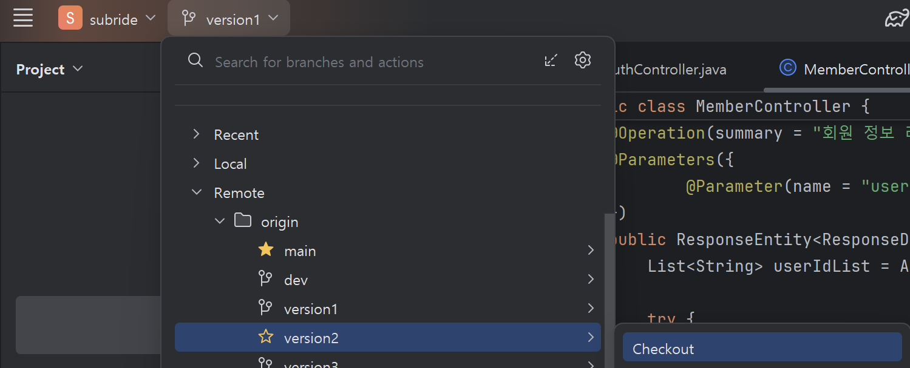
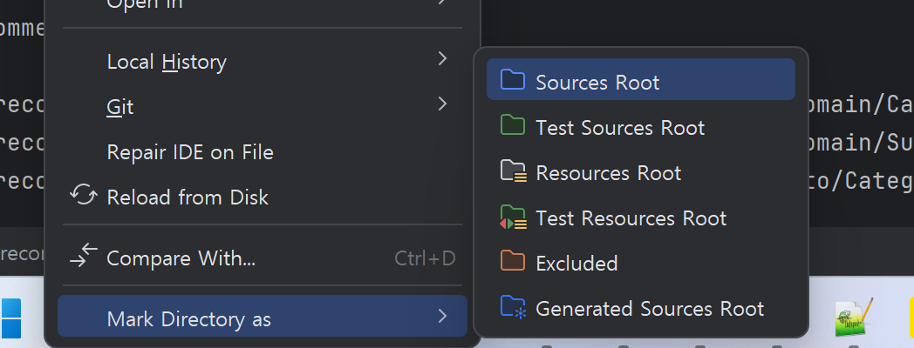
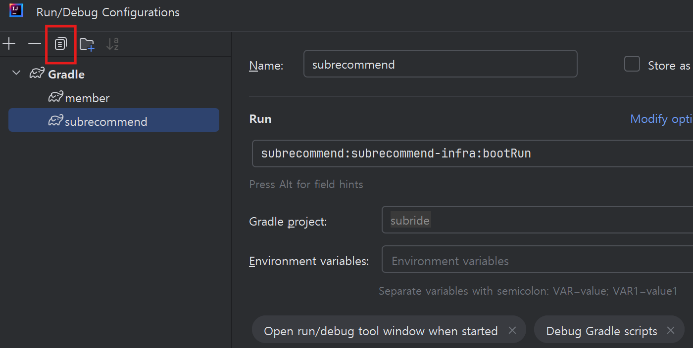

# 구독추천 서비스 개발 

## 아키텍처 설계 결과 

- **Class 설계**    
     

- **Sequence 설계**
      

## Clauding 프롬프트  
**Clauding**이라는 말은 제가 만든 말로 구글링처럼 **Claude를 활용하여 원하는 것을 얻는다**는 의미입니다.   
설계 결과를 클로딩하여 개발하는 프롬프트는 아래와 같습니다. 

```
제공한 기존 소스와 클래스 설계에 기반하여 아래 요구사항대로 개발 해줘.

- 대상 서비스: 구독추천(subrecommend)
- 개발언어 : Spring Boot
- infra와 biz는 별도의 프로젝트로 나누고, 각 프로젝트의 이름은 subrecommend-biz와 subrecommend-infra로 함
- 제공한 최상위 프로젝트의 build.gradle과 settings.gradle를 보고 각 프로젝트의 build.gradle 제공
- 제공한 infra프로젝트의 application.yml을 보고 환경변수 사용하여 개발   
- API 응답은 common프로젝트의 CommonUtils 클래스의 메소드를 사용    

답변 순서는 아래와 같아
- 전체 패키지 구조도 
- biz 프로젝트 소스 
- infra 프로젝트 소스

먼저 전체 패키지 구조도부터 보여줘
```
클로드가 제시한 패키지 구조를 보고 수정사항을 요청하여 패키지 구조부터 완성합니다.  
그리고 완성된 패키지 구조에 따라 개발을 요청합니다.

> **클로딩 개발 Tip**   
> 실제 개발시에는 아래 코드를 소스통합 유틸리티(mergesrc.py)를 이용하여 한 파일로 만들어 클로드에게 주십시오.   
> - 최상위 프로젝트의 build.gradle, settings.gradle   
> - common 프로젝트 전체   
> - infra 프로젝트의 infra.common, infra.exception 패키지 하위 클래스  
> ※ 제공하는 infra 프로젝트의 클래스들은 인증, 웹 보안, Swagger, 로깅 관련 클래스입니다.   

## 패키지 구조  
구독추천 서비스를 개발해 봅시다.  
먼저 구독추천 서비스의 패키지 구조도입니다.  
클린 아키텍처에 맞춰서 subrecommend-biz와 subrecommend-infra 프로젝트로 나눠서   
잘 구조화되어 있습니다.  

```
subrecommend/
├── subrecommend-biz/
│   ├── src/
│   │   └── main/
│   │       └── java/
│   │           └── com/
│   │               └── subride/
│   │                   └── subrecommend/
│   │                       └── biz/
│   │                           ├── domain/
│   │                           │   ├── Category.java
│   │                           │   └── Sub.java
│   │                           ├── dto/
│   │                           │   ├── CategoryInfoDTO.java
│   │                           │   └── SubInfoDTO.java
│   │                           ├── exception/
│   │                           │   └── BizException.java
│   │                           └── usecase/
│   │                               ├── inport/
│   │                               │   └── ISubRecommendService.java
│   │                               ├── outport/
│   │                               │   └── ISubRecommendProvider.java
│   │                               └── service/
│   │                                   └── SubRecommendServiceImpl.java
│   └── build.gradle
│
└── subrecommend-infra/
    ├── src/
    │   ├── main/
    │   │   ├── java/
    │   │   │   └── com/
    │   │   │       └── subride/
    │   │   │           └── subrecommend/
    │   │   │               ├── SubRecommendApplication.java
    │   │   │               ├── infra/
    │   │   │               │   ├── common/
    │   │   │               │   │   ├── config/
    │   │   │               │   │   │   ├── DataInitializer.java
    │   │   │               │   │   │   ├── LoggingAspect.java
    │   │   │               │   │   │   ├── SecurityConfig.java
    │   │   │               │   │   │   └── SpringDocConfig.java
    │   │   │               │   │   ├── jwt/
    │   │   │               │   │   │   ├── JwtAuthenticationFilter.java
    │   │   │               │   │   │   └── JwtTokenProvider.java
    │   │   │               │   ├── dto/
    │   │   │               │   │   ├── CategoryDTO.java
    │   │   │               │   │   ├── CategorySpendingDTO.java
    │   │   │               │   │   └── SubDTO.java
    │   │   │               │   ├── exception/
    │   │   │               │   │   └── InfraException.java
    │   │   │               │   ├── in/
    │   │   │               │   │   └── web/
    │   │   │               │   │       ├── SubRecommendController.java
    │   │   │               │   │       └── SubRecommendControllerHelper.java
    │   │   │               │   └── out/
    │   │   │               │       ├── adapter/
    │   │   │               │       │   └── SubRecommendProviderImpl.java
    │   │   │               │       ├── entity/
    │   │   │               │       │   ├── CategoryEntity.java
    │   │   │               │       │   ├── SpendingEntity.java
    │   │   │               │       │   └── SubEntity.java
    │   │   │               │       └── repo/
    │   │   │               │           ├── ICategoryRepository.java
    │   │   │               │           ├── ISpendingRepository.java
    │   │   │               │           └── ISubRepository.java
    │   │   └── resources/
    │   │       └── application.yml
    └── build.gradle
```

회원관리 서비스를 개발하면서 패키지 구조에 익숙해졌으리라 생각합니다.  
이번 부터는 중요한 부분만 설명하면서 빨리 개발하도록 하겠습니다.   
설명 안한 소스에 궁금한게 있다면 저에게 묻거나 클로딩하삽시오.  

## 개발 순서 
| Group | Task              | Description               | Link   |
| :-----| :-----------------| :------------------------ | :------|
| 생성 | 프로젝트 생성 | 구독추천 서비스 프로젝트 생성 | [Link](#생성--프로젝트-생성)  |
|      | 빌드 스크립트 작성 | build.gradle 작성 | [Link](#생성--빌드-스크립트-작성)  |
| Biz 프로젝트 개발 | Usecase, Service, Domain 클래스 개발 | Biz 프로젝트의 클래스 복사 | [Link](#biz-프로젝트-개발--usecase-service-domain-클래스-개발)  |
| Infra 프로젝트 개발  | Main 클래스 개발 |  | [Link](#infra-프로젝트-개발--main-클래스-개발)  |
|                     | 애플리케이션 설정 파일 작성 | application.yml 작성 | [Link](#infra-프로젝트-개발--애플리케이션-설정-파일-작성)  |
|                     | Config, Jwt, utilility 클래스 개발 | infra.common 패키지 복사 | [Link](#infra-프로젝트-개발--config-jwt-utility-클래스-개발)  |
|                     | DTO 클래스 개발 | infra.dto 패키지 복사 | [Link](#infra-프로젝트-개발--dto-클래스-개발)  |
|                     | Entity 클래스 개발 | infra.out.entity 패키지 복사 | [Link](#infra-프로젝트-개발--entity-클래스-개발)  |
|                     | Repository 클래스 개발 | infra.out.repo 패키지 복사 | [Link](#infra-프로젝트-개발--repository-클래스-개발)  |
|                     | Exception 처리 클래스 개발 | infra.exception 패키지 복사 | [Link](#infra-프로젝트-개발--exception-처리-클래스-개발)  |
|                     | Controller, Gateway 클래스 개발 | infra.in.web, infra.out.adapter 패키지 복사 | [Link](#infra-프로젝트-개발--controller-gateway-클래스-개발)  |
| 테스트 | Swagger 이용 테스트 | Swagger에서 API 테스트 | [Link](#테스트--swagger-이용-테스트)  |
| 소스 저장 | Git 푸시 | Gig에 소스 저장 | [Link](#소스-저장--git-푸시)  |


## 생성 > 프로젝트 생성  

먼저 클론 프로젝트의 브랜치를 아래 그림처럼 version2로 변경하십시오.   
   

- 개발 프로젝트의 브랜치를 'subrecommend'로 변경합니다.  
    ```
    git checkout -B subrecommend
    ```

- 개발 프로젝트의 최상위에서 하위 모듈로 'subrecommend'를 추가합니다.  
- subrecommend 하위 모듈로 'subrecommend-biz'와, 'subrecommend-infa' 프로젝트를 추가합니다.
       

- subrecommend-biz 프로젝트의 src 디렉토리 하위에서 아래 작업 수행  
  - main/java디렉토리 생성   
  - main/java 디렉토리를 선택하고, 우측 마우스 메뉴에서  
    Mark Directory as > Source Root 선택  
    

- subrecommend-infra 프로젝트의 src디렉토리 하위에서 아래 작업 수행  
  - main/java디렉토리 생성   
  - main/resources 디렉토리 생성   
  - main/java 디렉토리를 선택하고, 우측 마우스 메뉴에서  
    Mark Directory as > Source Root 선택   
  - main/resources 디렉토리 선택하고, 우측 마우스 메뉴에서  
    Mark Directory as > Resource Root 선택    
  - main/java 하위에 com.subride.subrecommend 패키지 생성   

- settings.gradle에 생성한 프로젝트를 추가합니다.  
    ```
    rootProject.name = 'subride'
    include 'common'
    include 'member:member-biz'
    include 'member:member-infra'
    include 'subrecommend:subrecommend-biz'
    include 'subrecommend:subrecommend-infra'
    ```

## 생성 > 빌드 스크립트 작성
- subrecommend-biz 디렉토리 하위에 build.gradle 작성(클론 프로젝트에서 복사해도 됨)  
    ```
    dependencies {
        implementation project(':common')
    }
    ```

- subrecommend-infra 디렉토리 하위에 build.gradle 작성(클론 프로젝트에서 복사해도 됨)  
    ```
    dependencies {
        implementation project(':common')
        implementation project(':subrecommend:subrecommend-biz')
    }
    ```

## Biz 프로젝트 개발 > Usecase, Service, Domain 클래스 개발     
개발 프로젝트의 subrecommend-biz/src/main/java 하위에 패키지 'com.subride.subrecommend.biz'를 생성합니다.   
클론 프로젝트의 subrecommend-biz/src/main/java 디렉토리 밑에 있는 com.subride.subrecommend.biz를 선택하고 CTRL-c를 눌러 복사합니다.   
개발 프로젝트의 패키지 com.subride.subrecommend.biz를 선택하고 붙여넣습니다.   

> Git에 추가 여부를 묻는 창에서, 하단에 'Don't Ask ..' 눌러서 이후에 안 묻고 자동 추가되게 함    

- SubRecommendServiceImpl.java 
  
  **모든 구독 카테고리 목록을 리턴**합니다.  
  결과값을 다른 레이어(여기서는 infra프로젝트의 Controller)에 제공해야 하므로 DTO객체로 변환합니다.   
  이렇게 레이어간 통신할 때는 DTO객체를 사용합니다.   
  ```
    @Override
    public List<CategoryInfoDTO> getAllCategories() {
        List<Category> categories = subRecommendProvider.getAllCategories();
        return categories.stream()
                .map(this::toCategoryInfoDTO)
                .collect(Collectors.toList());
    }
  ```

  Controller레이어에 리턴할 DTO객체 생성  
  ```
    private CategoryInfoDTO toCategoryInfoDTO(Category category) {
        CategoryInfoDTO categoryInfoDTO = new CategoryInfoDTO();
        categoryInfoDTO.setCategoryId(category.getCategoryId());
        categoryInfoDTO.setCategoryName(category.getCategoryName());
        categoryInfoDTO.setSpendingCategory(category.getSpendingCategory());
        return categoryInfoDTO;
    }

  ```

  **소비 카테고리에 맞는 구독 카테고리 리턴**   
  사용자의 소비 데이터를 읽어 가장 소비가 많은 소비 카테고리를 구합니다.  
  그리고 그 소비 카테고리와 매핑된 구독 카테고리 객체를 리턴합니다.   
  ```
    @Override
    public CategoryInfoDTO getRecommendCategoryBySpending(String userId) {
        //-- 사용자의 소비 데이터를 읽어 가장 소비가 많은 카테고리를 구함  
        Map<String, Long> spendingByCategory = subRecommendProvider.getSpendingByCategory(userId);
        String maxSpendingCategory = spendingByCategory.entrySet().stream()
                .max(Comparator.comparingLong(Map.Entry::getValue))
                .map(Map.Entry::getKey)
                .orElse(null);

        //-- 소비 카테고리와 매핑된 구독 카테고리를 구함  
        Category category = subRecommendProvider.getCategoryBySpendingCategory(maxSpendingCategory);

        CategoryInfoDTO categoryInfoDTO = new CategoryInfoDTO();
        categoryInfoDTO.setCategoryId(category.getCategoryId());
        categoryInfoDTO.setCategoryName(category.getCategoryName());
        categoryInfoDTO.setSpendingCategory(maxSpendingCategory);
        categoryInfoDTO.setTotalSpending(spendingByCategory.get(maxSpendingCategory));

        return categoryInfoDTO;
    }

  ```

  **구독 카테고리별 구독 서비스 목록 리턴**   
  구독 카테고리에 해당하는 구독 서비스 목록을 구합니다.  
  Controller 레이어로 리턴할 구독정보 DTO객체를 만들어 반환합니다.   
  ```
    @Override
    public List<SubInfoDTO> getRecommendSubListByCategory(String categoryId) {
        List<Sub> subList = subRecommendProvider.getSubListByCategoryId(categoryId);

        return subList.stream()
                .map(this::toSubInfoDTO)
                .collect(Collectors.toList());
    }

  ```

## Infra 프로젝트 개발 > Main 클래스 개발  
infra프로젝트의 src/main/java디렉토리 밑에 패키지 'com.subride.subrecommend'를 만듭니다.   
그 하위에 새로운 클래스 SubRecommendApplication을 생성합니다.   
```
@SpringBootApplication
public class SubRecommendApplication {
    public static void main(String[] args) {
        SpringApplication.run(SubRecommendApplication.class, args);
    }
}
```

## Infra 프로젝트 개발 > 애플리케이션 설정 파일 작성  
클론 infra 프로젝트의 src/main/resources 디렉토리 밑에 있는 application.yml 파일을  
개발 프로젝트의 동일 위치로 복사합니다.  

포트번호가 충돌되지 않도록 기본 포트를 18081로 지정했습니다.  
그 외 다른 설정은 Member서비스와 유사합니다.  
단, 인증토큰과 리프레시토큰의 유효시간은 불필요 하므로 지정하지 않았습니다.  
```
server:
  port: ${SERVER_PORT:18081}
spring:
  application:
    name: ${SPRING_APPLICATION_NAME:subrecommend-service}
  datasource:
    driver-class-name: ${DB_DRIVER:com.mysql.cj.jdbc.Driver}
    url: ${DB_URL:jdbc:mysql://localhost:3306/subrecommend?createDatabaseIfNotExist=true&serverTimezone=Asia/Seoul}
    username: ${DB_USERNAME:root}
    password: ${DB_PASSWORD:P@ssw0rd$}
  jpa:
    database: mysql
    database-platform: org.hibernate.dialect.MySQLDialect
    show-sql: ${JPA_SHOW_SQL:false}
    hibernate:
      ddl-auto: ${JPA_HIBERNATE_DDL_AUTO:update}
    properties:
      hibernate:
        format_sql: ${JPA_HIBERNATE_FORMAT_SQL:true}
springdoc:
  swagger-ui:
    path: /swagger-ui.html
jwt:
  secret: ${JWT_SECRET:8O2HQ13etL2BWZvYOiWsJ5uWFoLi6NBUG8divYVoCgtHVvlk3dqRksMl16toztDUeBTSIuOOPvHIrYq11G2BwQ==}

# Logging
logging:
  level:
    root: INFO
    org.springframework.security: DEBUG
    com.subride.subrecommend.infra.in: DEBUG
    com.subride.subrecommend.infra.out: DEBUG
```

## Infra 프로젝트 개발 > Config, Jwt, utility 클래스 개발     
com.subride.subrecommend 패키지 하위에 infra패키지를 추가합니다.  
infra.common 패키지 하위 클래스를 클론 프로젝트에서 복사-붙여넣기 합니다.   

infra.common.config.DataInitialize 클래스는 구독 카테고리와 구독 정보, 그리고   
user01~user05의 지출 데이터를 애플리케이션 로딩 시에 생성합니다.   

infra.common.util 하위의 TestDataGenerator는 나중에 테스트 코드 작성할 때,   
테스트 초기 데이터를 만드는 클래스입니다.  지금은 쓰지 않지만 그냥 놔두십시오.    


## Infra 프로젝트 개발 > DTO 클래스 개발 
- 패키지 추가  
  개발 프로젝트의 infra 밑에 'dto' 패키지를 만듭니다.  
  com.subride.subrecommend를 선택하고 우측 마우스 메뉴에서 새로운 패키지를 클릭한 후,     
  패키지명 입력창에 'infra.dto'를 붙여서 생성합니다.   
- DTO 클래스 복사   
  클론 프로젝트의 infra.dto 패키지 밑에 있는 클래스들을 CTRL-c로 복사한 후,      
  개발 프로젝트의 com.subride.subrecommend.infra.dto 패키지를 선택하고 붙여넣기 합니다.  
 

## Infra 프로젝트 개발 > Entity 클래스 개발 
- 패키지 추가   
  개발 프로젝트의 infra 밑에 'out.entity' 패키지를 만듭니다.  
  com.subride.subrecommend.infra를 선택하고 우측 마우스 메뉴에서 새로운 패키지를 클릭한 후,     
  패키지명 입력창에 'out.entity'를 붙여서 생성합니다.
  
- Entity 클래스 복사   
  클론 프로젝트에 있는 infra.out.entity 패키지 밑의 클래스들을 복사합니다.  
  CategoryEntity와 SubEntity에는 Domain객체로 변환하는 메소드가 있습니다.   
  Table과 연결된 Entity를 Domain객체로 변환하는 메소드입니다.  
  biz프로젝트로 Entity를 넘길 때는 이렇게 변환하여 넘겨야 합니다.  
  이를 레이어간 **모델 매핑**이라고 합니다.   
  **왜냐하면, biz 프로젝트는 infra 프로젝트의 객체들을 참조하면 안되기 때문입니다.**  
  즉, 아키텍처 원칙 **DIP**(Dependency Inversion Principle)와 **SDP**(Stable Dependencies Principal)를 지키기 위해서입니다.  

  > CategoryEntity: 구독 카테고리 Entity   
  > SpendingEntity: 소비 데이터 Entity  
  > SubEntity: 구독서비스 Entity   


## Infra 프로젝트 개발 > Repository 클래스 개발  
- 패키지 추가   
  개발 프로젝트의 infra 밑에 'out.repo' 패키지를 만듭니다.  
  com.subride.subrecommend.infra를 선택하고 우측 마우스 메뉴에서 새로운 패키지를 클릭한 후,     
  패키지명 입력창에 'out.repo'를 붙여서 생성합니다.
  
- Entity 클래스 복사   
  클론 프로젝트에 있는 infra.out.repo 패키지 밑의 클래스들을 복사합니다.  

  **구독 카테고리 저장소 인터페이스**
  카테고리ID로 CategoryEntity를 구하는 메소드와   
  소비 카테고리와 매핑된 CategoryEntity를 리턴하는 메소드가 정의되어 있습니다.  
  ```
    public interface ICategoryRepository extends JpaRepository<CategoryEntity, Long> {
        Optional<CategoryEntity> findByCategoryId(String categoryId);
        Optional<CategoryEntity> findBySpendingCategory(String spendingCategory);
    }
  ```

  Optional로 감싼 이유는 아래 예와 같이 데이터가 없을 때 안전하게 처리하기 위함입니다.  
    ```
      @Override
    public Category getCategoryBySpendingCategory(String spendingCategory) {
        CategoryEntity categoryEntity = categoryRepository.findBySpendingCategory(spendingCategory)
                .orElseThrow(() -> new InfraException("Category not found"));
        return categoryEntity.toDomain();
    }
    ```

  **소비 데이터 저장소**  
    복잡한 데이터 Query(조회)는 JPQL을 사용할 수 있습니다.   
    SQL과 유사하지만 물리적 테이블을 직접 지정하지 않고 Entity객체를 이용합니다.  
    아래는 특정 사용자의 소비 카테고리별 총액을 구하는 메소드입니다.  
    리턴 값은 CategorySpendingDTO 객체로 생성합니다.  
    ```
    public interface ISpendingRepository extends JpaRepository<SpendingEntity, Long> {
        /*
        JPQL(Java Persistence Query Language) 사용

        쿼리 결과를 CategorySpendingDTO 객체로 매핑 하기 위해
        CategorySpendingDTO에 @AllArgsConstructor로 생성자를 만들고,
        JPQL에 'new' 키워드로 CategorySpendingDTO 객체가 생성되게 함
        */
        @Query("SELECT new com.subride.subrecommend.infra.dto.CategorySpendingDTO(s.category, SUM(s.amount)) FROM SpendingEntity s WHERE s.userId = :userId GROUP BY s.category")
        List<CategorySpendingDTO> getSpendingByCategory(String userId);
    }
    ```

  **구독서비스 저장소**   
    첫번째 메소드 findByCategory_CategoryIdOrderByName과 같이 리턴될 값의 정렬 순서를 지정할 수 있습니다.  
    구독 카테고리명 순으로 값을 리턴하게 됩니다.  
    ```
    public interface ISubRepository extends JpaRepository<SubEntity, Long> {
        List<SubEntity> findByCategory_CategoryIdOrderByName(String categoryId);
        Optional<SubEntity> findByName(String name);
    }
    ```


## Infra 프로젝트 개발 > Exception 처리 클래스 개발  
- 패키지 추가   
  개발 프로젝트의 infra 밑에 'exception' 패키지를 만듭니다.  
  com.subride.subrecommend.infra를 선택하고 우측 마우스 메뉴에서 새로운 패키지를 클릭한 후,     
  패키지명 입력창에 'exception'를 붙여서 생성합니다.
  
- Exception 클래스 복사   
  클론 프로젝트에 있는 infra.exception 패키지 밑의 클래스를 복사합니다.  
  
  예외가 발생했을때 에러코드와 에러메시지를 리턴하기 위해 RuntimeException을 상속받아  
  예외 처리 클래스를 만들었습니다.  
  Java의 핵심 개념중 하나인 다형성(동일한 메소드에 파라미터에 따라 다른 처리를 하게 함)을 사용합니다.  
    ```
    @Getter
    @SuppressWarnings("unused")
    public class InfraException extends RuntimeException {
        private int code;

        public InfraException(String message) {
            super(message);
        }

        public InfraException(String message, Throwable cause) {
            super(message, cause);
        }

        public InfraException(int code, String message) {
            super(message);
            this.code = code;
        }
        public InfraException(int code, String message, Throwable cause) {
            super(message, cause);
            this.code = code;
        }
    }
    ```

## Infra 프로젝트 개발 > Controller, Gateway 클래스 개발
외부의 요청을 처리하기 위한 API인 Controller 클래스와   
DB와의 인터페이스를 처리하는 Gateway 클래스를 개발합니다.  

- 패키지 추가   
  개발 프로젝트의 infra 밑에 'in.web' 패키지를 만듭니다.  
  com.subride.subrecommend.infra를 선택하고 우측 마우스 메뉴에서 새로운 패키지를 클릭한 후,     
  패키지명 입력창에 'in.web'을 붙여서 생성합니다.
  동일한 방법으로 infra 밑에 'out.adapter' 패키지를 만듭니다.  
  
- Controller, Gateway 클래스 복사   
  클론 프로젝트에 있는 infra.in.web 패키지 밑의 클래스들을 복사합니다.  
  그리고 infra.out.adapter 패키지 밑의 클래스도 복사합니다.   

- 코드 이해하기 
  **Controller -> inport usecase -> service -> outport usecase -> gateway**로 흐름을 따라가면서 코드를 이해합니다.  
  코드 영역을 확대하면 더 넓게 볼 수 있습니다.   
  인터페이스는 굳이 볼 필요 없으므로 **Controller -> service -> gateway**로만 따라가면서 파악해도 됩니다.   
  예를 들어 Controller의 getAllCategories() 메소드의 흐름을 아래와 같이 따라가면서 파악할 수 있습니다.  
  - 'subRecommendService.getAllCategories();'의 getAllCategories()위에 커서를 옮기고 CTRL-ALT-b를 누릅니다.   
  - 'subRecommendProvider.getAllCategories();'의getAllCategories()위에 커서를 옮기고 CTRL-ALT-b를 누릅니다.   
  - 'categoryRepository.findAll();'의 findAll()에 커서를 옮기고 CTRL키를 누른 후 클릭합니다.  
  - '.map(CategoryEntity::toDomain)'의 toDomain에 커서를 옮기고 CTRL키를 누른 후 클릭합니다.  

## 테스트 > Swagger 이용 테스트 

- 서비스 실행
  Run > Edit Configuration을 클릭하고, 기존의 member 실행 프로파일을 복사하여   
  새로운 실행 프로파일을 만듭니다.   
  

  서비스 탭에 추가된 subrecommend를 실행합니다.    
  한번에 잘 실행되었나요?  에러가 있다면 에러 메시지를 보고 해결 합니다.  
  지금까지 과정을 잘 따라했다면 한번에 실행될겁니다.   

  member 서비스도 실행 해 주십시오.  

- API 테스트   
  http://localhost:18081/swagger-ui/index.html을 엽니다.   

  API를 테스트 하려면 인증토큰을 얻어야 합니다.  
  회원서비스 Swagger 페이지의 '로그인' API를 이용하여 인증 토큰을 구합니다.   
  우측 상단의 Authorize 버튼을 눌러 인증 토큰을 붙여 넣습니다.   

  > API 테스트 순서    
  > 등록된 데이터를 모르므로 아래 순서로 하는게 편합니다.  
  > - 모든 구독 카테고리 리스트 조회   
  > - 사용자 소비에 맞는 구독 카테고리 구하기   
  > - 구독 서비스 리스트 리턴   
  > - 구독상세 정보 리턴   

## 소스 저장 > Git 푸시   

- Git Push 하기  
    IntelliJ에서 GitBash 터미널을 엽니다.   
        

    > **Tip: IntelliJ 터미널에서 복사-붙여넣기**는 CTRL-c와 CTRL-v를 사용하십시오.     


    원격 Git repository에 푸시합니다.  
    ```
    git add . && git commit -m "subrecommend" && git push -u origin subrecommend
    ```

    v2.0.0으로 태깅하고 푸시합니다.  
    ```
    git tag -a v2.0.0 -m "구독추천 서비스" 
    git push origin v2.0.0
    ```

- 확인  
    github.com에서 잘 푸시되었는지 소스와 태그를 확인 합니다.  

