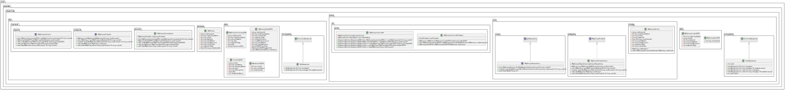
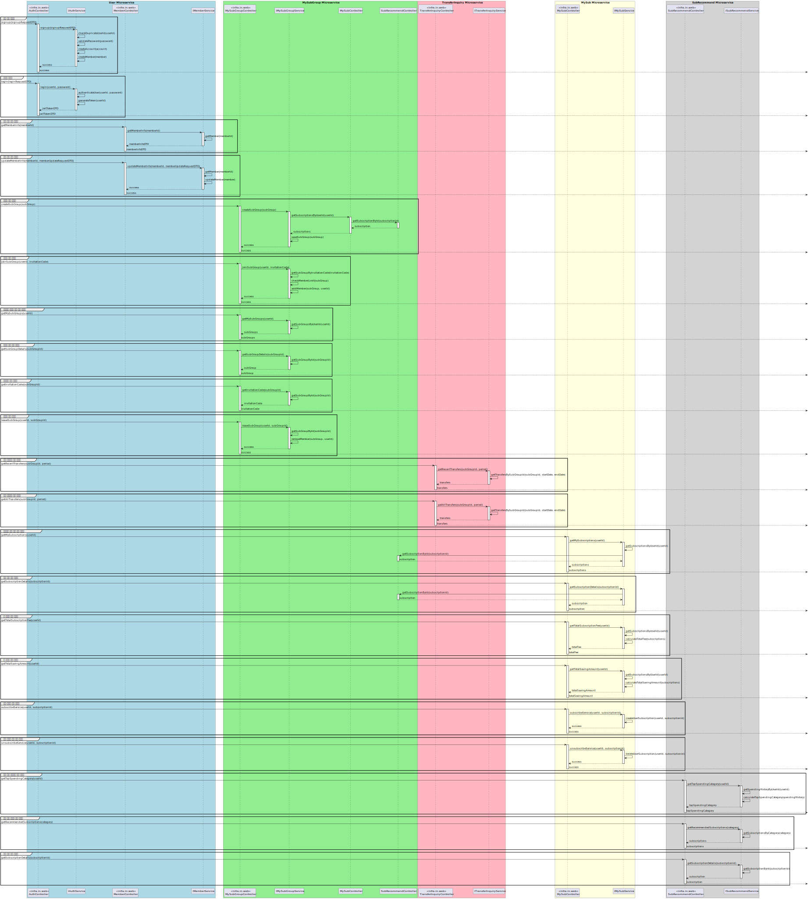
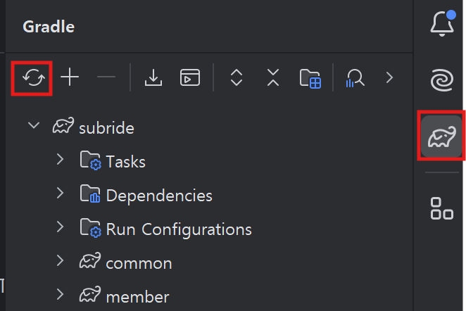

# 마이그룹 서비스 개발 

## 아키텍처 설계 결과 

- **Class 설계**    
     

- **Sequence 설계**
      

## Clauding 프롬프트  
**Clauding**이라는 말은 제가 만든 말로 구글링처럼 **Claude를 활용하여 원하는 것을 얻는다**는 의미입니다.   
설계 결과를 클로딩하여 개발하는 프롬프트는 아래와 같습니다. 

```
제공한 기존 소스와 클래스 설계에 기반하여 아래 요구사항대로 개발 해줘.

- 대상 서비스: 마이그룹(mygrp)
- 개발언어 : Spring Boot
- infra와 biz는 별도의 프로젝트로 나누고, 각 프로젝트의 이름은 mygrp-biz와 mygrp-infra로 함
- 제공한 최상위 프로젝트의 build.gradle과 settings.gradle를 보고 각 프로젝트의 build.gradle 제공
- 제공한 infra프로젝트의 application.yml을 보고 환경변수 사용하여 개발   
- API 응답은 common프로젝트의 CommonUtils 클래스의 메소드를 사용    
- infra.common.config와 infra.common.jwt 소스는 보여주지 마
- feign클라인트를 이용해 구독추천서비스에서 구독서비스 정보를 갖고 오는 것 개발
- feign클라인트를 이용해 회원서비스에게 회원 정보를 갖고 오는 것 개발
- feign클라인트를 이용해 그룹 참여 시 사용자가 그 그룹의 구독서비스에 가입되어 있지 않으면 자동으로 구독서비스 가입 처리  
- 총구독료와 최대 절감액 가져오는 부분도 유저스토리의 수용기준을 보고 최대한 개발

답변 순서는 아래와 같아
- 전체 패키지 구조도 
- biz 프로젝트 소스 
- infra 프로젝트 소스

먼저 전체 패키지 구조도부터 보여줘
```
클로드가 제시한 패키지 구조를 보고 수정사항을 요청하여 패키지 구조부터 완성합니다.  
그리고 완성된 패키지 구조에 따라 개발을 요청합니다.

> **클로딩 개발 Tip**   
> 실제 개발시에는 아래 코드를 소스통합 유틸리티(mergesrc.py)를 이용하여 한 파일로 만들어 클로드에게 주십시오.   
> - 최상위 프로젝트의 build.gradle, settings.gradle   
> - common 프로젝트 전체   
> - 회원 프로젝트 전체  
> - 구독추천 프로젝트 전체  
> - 마이구독 프로젝트 전체  
> - infra 프로젝트의 infra.common, infra.exception 패키지 하위 클래스  
> ※ 제공하는 infra 프로젝트의 클래스들은 인증, 웹 보안, Swagger, 로깅 관련 클래스입니다.   

## 패키지 구조  
마이그룹 서비스의 패키지 구조도입니다.  

```
mygrp/
├── mygrp-biz/
│   ├── src/
│   │   └── main/
│   │       └── java/
│   │           └── com/
│   │               └── subride/
│   │                   └── mygrp/
│   │                       └── biz/
│   │                           ├── domain/
│   │                           │   └── Group.java
│   │                           ├── dto/
│   │                           │   ├── GroupCreateDTO.java
│   │                           │   ├── GroupDetailDTO.java
│   │                           │   └── GroupJoinDTO.java
│   │                           ├── exception/
│   │                           │   └── BizException.java
│   │                           └── usecase/
│   │                               ├── inport/
│   │                               │   └── IMyGroupService.java
│   │                               ├── outport/
│   │                               │   └── IMyGroupProvider.java
│   │                               └── service/
│   │                                   ├── MyGroupServiceImpl.java
│   │                                   └── RandomValueGenerator.java
│   └── build.gradle
│
└── mygrp-infra/
    ├── src/
    │   ├── main/
    │   │   ├── java/
    │   │   │   └── com/
    │   │   │       └── subride/
    │   │   │           └── mygrp/
    │   │   │               ├── MygrpApplication.java
    │   │   │               └── infra/
    │   │   │                   ├── common/
    │   │   │                   │   ├── config/
    │   │   │                   │   │   ├── LoggingAspect.java
    │   │   │                   │   │   ├── SecurityConfig.java
    │   │   │                   │   │   └── SpringDocConfig.java
    │   │   │                   │   └── jwt/
    │   │   │                   │       ├── JwtAuthenticationFilter.java
    │   │   │                   │       ├── JwtAuthenticationInterceptor.java
    │   │   │                   │       └── JwtTokenProvider.java
    │   │   │                   ├── exception/
    │   │   │                   │   └── InfraException.java
    │   │   │                   ├── in/
    │   │   │                   │   └── web/
    │   │   │                   │       ├── MyGroupController.java
    │   │   │                   │       └── MyGroupControllerHelper.java
    │   │   │                   └── out/
    │   │   │                       ├── adapter/
    │   │   │                       │   └── MyGroupProviderImpl.java
    │   │   │                       ├── entity/
    │   │   │                       │   └── GroupEntity.java
    │   │   │                       ├── feign/
    │   │   │                       │   ├── MemberFeignClient.java
    │   │   │                       │   ├── MySubFeignClient.java
    │   │   │                       │   └── SubRecommendFeignClient.java
    │   │   │                       └── repo/
    │   │   │                           └── IMyGroupRepository.java
    │   │   └── resources/
    │   │       └── application.yml
    │
    └── build.gradle
```

※ 설명 안한 소스에 궁금한 부분이 있다면 저에게 묻거나 클로딩 하십시오.  

## 개발 순서 
| Group | Task              | Description               | Link   |
| :-----| :-----------------| :------------------------ | :------|
| 생성 | 프로젝트 생성 | 마이그룹 서비스 프로젝트 생성 | [Link](#생성--프로젝트-생성)  |
|      | 빌드 스크립트 작성 | build.gradle 작성 | [Link](#생성--빌드-스크립트-작성)  |
| Biz 프로젝트 개발 | Usecase, Service, Domain 클래스 개발 | Biz 프로젝트의 클래스 복사 | [Link](#biz-프로젝트-개발--usecase-service-domain-클래스-개발)  |
| Infra 프로젝트 개발  | Main 클래스 개발 |  | [Link](#infra-프로젝트-개발--main-클래스-개발)  |
|                     | 애플리케이션 설정 파일 작성 | application.yml 작성 | [Link](#infra-프로젝트-개발--애플리케이션-설정-파일-작성)  |
|                     | Config, Jwt, utilility 클래스 개발 | infra.common 패키지 복사 | [Link](#infra-프로젝트-개발--config-jwt-utility-클래스-개발)  |
|                     | DTO 클래스 개발 | infra.dto 패키지 복사 | [Link](#infra-프로젝트-개발--dto-클래스-개발)  |
|                     | Entity 클래스 개발 | infra.out.entity 패키지 복사 | [Link](#infra-프로젝트-개발--entity-클래스-개발)  |
|                     | Repository 클래스 개발 | infra.out.repo 패키지 복사 | [Link](#infra-프로젝트-개발--repository-클래스-개발)  |
|                     | FeignClient 클래스 개발 | infra.out.feign 패키지 복사 | [Link](#infra-프로젝트-개발--feignclient-클래스-개발)  |
|                     | Exception 처리 클래스 개발 | infra.exception 패키지 복사 | [Link](#infra-프로젝트-개발--exception-처리-클래스-개발)  |
|                     | 구독추천 서비스 API 추가 |  | [Link](#구독추천-서비스-api-추가) |
|                     | Controller, Gateway 클래스 개발 | infra.in.web, infra.out.adapter 패키지 복사 | [Link](#infra-프로젝트-개발--controller-gateway-클래스-개발)  |
| 마이구독 | 마이구독 서비스 API 업그레이드 | | [Link](#마이구독-서비스-api-업그레이드) | 
| 테스트 | Swagger 이용 테스트 | Swagger에서 API 테스트 | [Link](#테스트--swagger-이용-테스트)  |
| 소스 저장 | Git 푸시 | Gig에 소스 저장 | [Link](#소스-저장--git-푸시)  |


## 생성 > 프로젝트 생성  

먼저 클론 프로젝트의 브랜치를 version4로 변경하십시오.   
상단 왼쪽 쯤에 있는 브랜치 이름을 클릭해서 바꾸시면 됩니다.   

- 개발 프로젝트의 브랜치를 'mygrp'로 변경합니다.  
    ```
    git checkout -B mygrp
    ```

- 개발 프로젝트의 최상위에서 하위 모듈로 'mygrp'을 추가합니다.  
- mygrp 하위 모듈로 'mygrp-biz'와, 'mygrp-infa' 프로젝트를 추가합니다.


- mygrp-biz 프로젝트의 src 디렉토리 하위에서 아래 작업 수행  
  - main/java디렉토리 생성
    > **Directory메뉴가 안 보일 때**  
    > src디렉토리가 자동으로 Source Root로 지정되면 Directory메뉴가 안 보입니다.   
    > src디렉토리를 선택하고 우측 마우스 메뉴에서 Mark Directory as > Unmark as Source Root를 선택하십시오.  

  - main/java 디렉토리를 선택하고, 우측 마우스 메뉴에서  
    Mark Directory as > Source Root 선택   

- mygrp-infra 프로젝트의 src디렉토리 하위에서 아래 작업 수행  
  - main/java디렉토리 생성   
  - main/resources 디렉토리 생성   
  - main/java 디렉토리를 선택하고, 우측 마우스 메뉴에서  
    Mark Directory as > Source Root 선택   
  - main/resources 디렉토리 선택하고, 우측 마우스 메뉴에서  
    Mark Directory as > Resource Root 선택    
  - main/java 하위에 com.subride.mygrp 패키지 생성   

- settings.gradle에 생성한 프로젝트를 추가합니다.  
  ```
  rootProject.name = 'subride'
  include 'common'
  include 'member:member-biz'
  include 'member:member-infra'
  include 'subrecommend:subrecommend-biz'
  include 'subrecommend:subrecommend-infra'
  include 'mysub:mysub-biz'
  include 'mysub:mysub-infra'
  include 'mygrp:mygrp-biz'
  include 'mygrp:mygrp-infra'
  ```  

| [Top](#개발-순서) |

---

## 생성 > 빌드 스크립트 작성
- mygrp-biz 디렉토리 하위에 build.gradle 작성(클론 프로젝트에서 복사해도 됨)  
    ```
    dependencies {
        implementation project(':common')
    }
    ```

- mygrp-infra 디렉토리 하위에 build.gradle 작성(클론 프로젝트에서 복사해도 됨)  
  간편한 HttpClient인 OpenFeign client를 사용할 것이므로 라이브러리를 추가해 줍니다.    
  또한, Spring Cloud 종속성 관리자도 지정해 줘야 합니다.   
  ```
  dependencies {
      implementation project(':common')
      implementation project(':mygrp:mygrp-biz')

      //-- OpenFeign Client: Blocking방식의 Http Client
      implementation 'org.springframework.cloud:spring-cloud-starter-openfeign'
  }

  /*
  OpenFeign Client는 SpringCloud의 컴포넌트이기 때문에 Spring Cloud 종속성 관리 지정 필요
  Spring Boot 버전에 맞는 Spring Cloud 버전을 지정해야 함
  https://github.com/spring-cloud/spring-cloud-release/wiki/Supported-Versions#supported-releases
  */
  dependencyManagement {
      imports {
          mavenBom "org.springframework.cloud:spring-cloud-dependencies:2023.0.1"
      }
  }
  ```  

| [Top](#개발-순서) |

---

## Biz 프로젝트 개발 > Usecase, Service, Domain 클래스 개발     
개발 프로젝트의 mygrp-biz/src/main/java 하위에 패키지 'com.subride.mygrp.biz'를 생성합니다.   
클론 프로젝트의 com.subride.mygrp.biz 패키지 하위에 있는 패키지들을 선택하고 CTRL-c를 눌러 복사합니다.   
개발 프로젝트의 패키지 com.subride.mygrp.biz를 선택하고 붙여넣습니다.   

> **프로젝트 리프레시**  
> 한꺼번에 소스를 복사해서 intelliJ가 프로젝트를 인식 못할 수 있습니다.   
> build.gradle 파일을 열어보면 조그만 코끼리 아이콘이 보일겁니다.  그걸 누르시면 됩니다.  

**common프로젝트의 DTO 복사**   
추가해야할 공통 DTO가 있습니다.    
클론 프로젝트의 common프로젝트의 dto패키지 밑에 있는 클래스들을 복사합니다.   
ResponseDTO는 이미 있으므로 복사하지 않아도 됩니다.   

**Service 'MyGroupServiceImpl'**의 메소드는 아래와 같습니다.    

- **getMyGroupDetail**: 구독그룹의 상세정보 리턴   
  
  ```
    @Override
    public Group getMyGroupDetail(Long myGroupId) {
        return myGroupProvider.getMyGroupByGroupId(myGroupId);
    }
  ```

- **createMyGroup**: 새로운 구독그룹 생성   
  클라이언트에서 요청된 데이터를 이용하여 구독그룹을 생성합니다.   
  'setMemberIds'는 멤버의 user id를 추가하는 메소드입니다.   
  Domain 'Group'클래스를 보면 'private Set<String> memberIds;'으로 정의되어 있습니다.   
  배열값을 저장할 때는 Collections객체를 이용합니다.  

  초청코드는 'randomValueGenerator'객체를 이용하여 랜덤값을 생성하여 셋팅합니다.  
  ```
    @Override
    public String createMyGroup(GroupCreateDTO groupCreateDTO) {
        Group myGroup = new Group();
        myGroup.setGroupName(groupCreateDTO.getGroupName());
        myGroup.setSubId(groupCreateDTO.getSubId());
        myGroup.setLeaderId(groupCreateDTO.getLeaderId());
        myGroup.setMemberIds(Collections.singleton(groupCreateDTO.getLeaderId()));
        myGroup.setBankName(groupCreateDTO.getBankName());
        myGroup.setBankAccount(groupCreateDTO.getBankAccount());
        myGroup.setPaymentDay(groupCreateDTO.getPaymentDay());
        myGroup.setInviteCode(randomValueGenerator.generateUniqueRandomValue());

        return myGroupProvider.createMyGroup(myGroup);
    }
  ```

- **joinMyGroup**: 구독그룹 참여   
  초청코드를 이용하여 구독그룹에 참여하는 처리를 합니다.   
  ```
    @Override
    public void joinMyGroup(GroupJoinDTO groupJoinDTO) {
        myGroupProvider.joinMyGroup(groupJoinDTO);
    }
  ```  

- **leaveMyGroup**: 구독그룹 참여 취소    
  구독그룹 참여를 취소하는 처리를 합니다.   
  ```
    @Override
    public void leaveMyGroup(Long myGroupId, String userId) {
        myGroupProvider.leaveMyGroup(myGroupId, userId);
    }
  ``` 


| [Top](#개발-순서) |

---

## Infra 프로젝트 개발 > Main 클래스 개발  
infra프로젝트의 src/main/java디렉토리 밑에 패키지 'com.subride.mygrp'를 만듭니다.   
그 하위에 새로운 클래스 MygrpApplication을 생성합니다.   
**@EnableFeignClients** 어노테이션을 꼭 추가해 주십시오.   
OpenFeign Client 사용을 위해 반드시 추가해 줘야 합니다.  
```
@SpringBootApplication
@EnableFeignClients
public class MygrpApplication {
    public static void main(String[] args) {
        SpringApplication.run(MygrpApplication.class, args);
    }
}
```


> **컴파일 에러가 날때**   
> 아직 transfer프로젝트가 제대로 인식이 안되면 컴파일 에러가 납니다.  
> 오른쪽에 있는 코끼리 모양을 누르고 refresh 해주십시오.   
>   


| [Top](#개발-순서) |

---

## Infra 프로젝트 개발 > 애플리케이션 설정 파일 작성  
클론 infra 프로젝트의 src/main/resources 디렉토리 밑에 있는 application.yml 파일을  
개발 프로젝트의 동일 위치로 복사합니다.  

Feign client 설정이 추가되었습니다.  

```
{중략}
feign:
  member:
    url: ${MEMBER_URI:http://localhost:18080}
  subrecommend:
    url: ${SUBRECOMMEND_URI:http://localhost:18081}
  mysub:
    url: ${MYSUB_URI:http://localhost:18082}
```

| [Top](#개발-순서) |

---

## Infra 프로젝트 개발 > Config, Jwt, utility 클래스 개발     
com.subride.mygrp 패키지 하위에 infra.common 패키지를 추가합니다.  
infra.common 패키지 하위 클래스를 클론 프로젝트에서 복사-붙여넣기 합니다.   

| [Top](#개발-순서) |

---

## Infra 프로젝트 개발 > DTO 클래스 개발 
  필요한 DTO 클래스는 common프로젝트에 생성했습니다.   
  
  > GroupSummaryDTO: 마이그룹 정보  
  > MemberInfoDTO: 회원정보    
  > MySubInfoDTO: 마이구독 정보   
  > SubInfoDTO: 구독서비스 정보   

  SubInfoDTO 클래스는 구독추천 서비스 API를 Feign client로 갖고 올때 사용합니다.  
  Feign Client로 통신할 때 제공자의 DTO객체와 수신자의 DTO객체는 필드 타입과 이름이 동일해야 합니다.   
  만약 다른 필드가 있다면 아래 예와 같이 매핑을 해줘야 합니다.   
  ```
  public class SubInfoDTO {
      /*
      구독추천서비스의 SubInfoDTO와 필드명이 달라 @JsonProperty로 필드 매핑을 함
      */
      @JsonProperty("id")
      private Long subId;
      @JsonProperty("name")
      private String subName;

      //-- 필드명이 동일하면 같은 이름으로 자동 매핑되므로 매핑 불필요
      private String categoryName;
      private String logo;
      private String description;
      private Long fee;
      private int maxShareNum;
  }
  ```


| [Top](#개발-순서) |

---

## Infra 프로젝트 개발 > Entity 클래스 개발 
- 패키지 추가   
  개발 프로젝트의 infra 밑에 'out.entity' 패키지를 만듭니다.  
  com.subride.mygrp.infra를 선택하고 우측 마우스 메뉴에서 새로운 패키지를 클릭한 후,     
  패키지명 입력창에 'out.entity'를 붙여서 생성합니다.
  
- Entity 클래스 복사   
  클론 프로젝트에 있는 infra.out.entity 패키지 밑의 클래스들을 복사합니다.  

  **Domain객체로 변환하는 메소드**가 있습니다.   
  Table과 연결된 Entity를 Domain객체로 변환하는 메소드입니다.  
  biz프로젝트로 Entity를 넘길 때는 이렇게 변환하여 넘겨야 합니다.  
  이를 레이어간 **모델 매핑**이라고 합니다.   
  **왜냐하면, biz 프로젝트는 infra 프로젝트의 객체들을 참조하면 안되기 때문입니다.**  
  즉, 아키텍처 원칙 **DIP**(Dependency Inversion Principle)와 **SDP**(Stable Dependencies Principal)를 지키기 위해서입니다.  

  또한, **Domain 객체를 Entity 객체로 변환**하는 모델 매핑 메소드도 구현되어 있습니다.    

  '@GeneratedValue(strategy = GenerationType.IDENTITY)'는 자동으로 일련번호를 증가시키는 어노테이션입니다.  

  **@ElementCollection**과 **@CollectionTable**을 이용하여 Aggregation 관계인 subgroup_member 테이블과 join하고 있습니다.   

  ```
  @Entity
  @Table(name = "subgroup")
  @Getter
  @Setter
  @Builder
  @NoArgsConstructor
  @AllArgsConstructor
  public class GroupEntity {
      @Id
      @GeneratedValue(strategy = GenerationType.IDENTITY)
      private Long groupId;
      private String groupName;
      private Long subId;
      private String leaderId;

      @ElementCollection
      @CollectionTable(name = "subgroup_member", joinColumns = @JoinColumn(name = "group_id"))
      @Column(name = "member_id")
      private Set<String> memberIds;

      private String bankName;
      private String bankAccount;
      private int paymentDay;
      private String inviteCode;

      public Group toDomain() {
          Group group = new Group();
          group.setGroupId(groupId);
          group.setGroupName(groupName);
          group.setSubId(subId);
          group.setLeaderId(leaderId);
          group.setMemberIds(memberIds);
          group.setBankName(bankName);
          group.setBankAccount(bankAccount);
          group.setPaymentDay(paymentDay);
          group.setInviteCode(inviteCode);
          return group;
      }

      public static GroupEntity fromDomain(Group group) {
          return GroupEntity.builder()
                  .groupId(group.getGroupId())
                  .groupName(group.getGroupName())
                  .subId(group.getSubId())
                  .leaderId(group.getLeaderId())
                  .memberIds(group.getMemberIds())
                  .bankName(group.getBankName())
                  .bankAccount(group.getBankAccount())
                  .paymentDay(group.getPaymentDay())
                  .inviteCode(group.getInviteCode())
                  .build();
      }
  }
  ```

| [Top](#개발-순서) |

---

## Infra 프로젝트 개발 > Repository 클래스 개발  
- 패키지 추가   
  개발 프로젝트의 infra 밑에 'out.repo' 패키지를 만듭니다.  
  com.subride.mygrp.infra를 선택하고 우측 마우스 메뉴에서 새로운 패키지를 클릭한 후,     
  패키지명 입력창에 'out.repo'를 붙여서 생성합니다.
  
- 클래스 복사   
  클론 프로젝트에 있는 infra.out.repo 패키지 밑의 클래스들을 복사합니다.  

  **마이그룹 저장소 인터페이스**
  > **findByMemberIdsContaining**: 사용자가 가입한 구독그룹 목록을 리턴   
  > **existsByGroupIdAndMemberIdsContaining**: 사용자가 특정 구독그룹에 참여하고 있는지 여부 리턴   
  > **existsByGroupNameAndSubId**: 구독그룹이름과 구독서비스ID를 가지는 구독그룹이 이미 있는지 리턴   

  ```
  public interface IMyGroupRepository extends JpaRepository<GroupEntity, Long> {
    List<GroupEntity> findByMemberIdsContaining(String userId);   
    boolean existsByGroupIdAndMemberIdsContaining(Long myGroupId, String userId);
    void deleteByGroupId(Long groupId);
    Optional<GroupEntity> findByInviteCode(String inviteCode);
    Optional<GroupEntity> findByGroupName(String groupName);
    boolean existsByGroupNameAndSubId(String groupName, Long subId);
  }
  ```

| [Top](#개발-순서) |

---

## Infra 프로젝트 개발 > FeignClient 클래스 개발
- 패키지 추가   
  개발 프로젝트의 infra.out 밑에 'feign' 패키지를 만듭니다.  
  
- 클래스 복사   
  클론 프로젝트에 있는 infra.out.feign 패키지 밑의 클래스를 복사합니다.  

  Feign Client는 아래와 같이 인터페이스로 호출할 API만 지정해 주면 사용할 수 있기 때문에 매우 편합니다.  

  @FeigntClient 괄호 안의 name은 프로그램에서 사용되는 이름은 아니므로 적절히 지정하십시오.   
  url은 application.yml에서 읽어 오도록 설정 합니다.    

  API주소는 제공 서비스의 API와 동일해야 합니다.   
  호출하는 메소드와 파라미터도 제공 서비스 API와 동일하게 하십시오.   
  사실 달라도 되는데 일치시키는게 관리하기 좋습니다.  

  **회원 서비스**  
  ```
  @FeignClient(name = "memberFeignClient", url = "${feign.member.url}")
  public interface MemberFeignClient {
      @GetMapping("/api/members/{userId}")  //회원정보 리턴
      ResponseDTO<MemberInfoDTO> getMemberInfo(@PathVariable String userId);

      @GetMapping("/api/members")   //콤마로 구분된 userid들을 넘기면 회원정보 목록 리턴  
      ResponseDTO<List<MemberInfoDTO>> getMemberInfoList(@RequestParam String userIds);
  }
  ```

  **마이구독 서비스**   
  ```
  @FeignClient(name = "mySubFeignClient", url = "${feign.mysub.url}")
  public interface MySubFeignClient {
      @GetMapping("/api/my-subs") //사용자가 가입한 구독서비스 목록 리턴
      ResponseDTO<List<MySubInfoDTO>> getMySubList(@RequestParam String userId);

      @GetMapping("/api/my-subs/checking-subscribe")  //사용자가 특정 구독서비스에 가입되어 있는지 여부 리턴  
      ResponseDTO<Boolean> checkSubscription(@RequestParam String userId, @RequestParam Long subId);

      @PostMapping("/api/my-subs/{subId}")  //구독서비스 가입 처리  
      ResponseDTO<Void> subscribeSub(@PathVariable Long subId, @RequestParam String userId);
  }
  ```

  **구독추천 서비스**    
  두번째 API는 아직 구독추천 서비스에 구현되지 않았습니다.  
  조금 이따 구현할 것입니다.  
  ```
  @FeignClient(name = "subRecommendFeignClient", url = "${feign.subrecommend.url}")
  public interface SubRecommendFeignClient {
      @GetMapping("/api/subrecommend/detail/{subId}") //구독서비스 정보 리턴
      ResponseDTO<SubInfoDTO> getSubDetail(@PathVariable("subId") Long subId);

      @GetMapping("/api/subrecommend/list-by-ids")  //구독서비스ID 목록에 대한 구독서비스 정보 목록 리턴  
      ResponseDTO<List<SubInfoDTO>> getSubInfoListByIds(@RequestParam List<Long> subIds);
  }
  ```

| [Top](#개발-순서) |

---

## Infra 프로젝트 개발 > Exception 처리 클래스 개발  
- 패키지 추가   
  개발 프로젝트의 infra 밑에 'exception' 패키지를 만듭니다.  
  com.subride.mygrp.infra를 선택하고 우측 마우스 메뉴에서 새로운 패키지를 클릭한 후,     
  패키지명 입력창에 'exception'를 붙여서 생성합니다.
  
- Exception 클래스 복사   
  클론 프로젝트에 있는 infra.exception 패키지 밑의 클래스를 복사합니다.  
  
| [Top](#개발-순서) |

---

## 구독추천 서비스 API 추가  

구독추천 서비스에 API 2개를 추가 합니다.   

- **getNonSubList**: 카테고리별 미구독 서비스 리스트만 리턴   
  클론 프로젝트 subrecommend-infra 프로젝트의 in.web/SubRecommendController.java에서 getNonSubList 메소드를 복사합니다.   
  이전 버전 테스트할 때 눈치 채신 분도 있겠지만 구독 서비스 목록에 이미 가입한 서비스도 계속 나오고 있습니다.   
  가입한 서비스는 나오지 않도록 하기 위해 이 API를 추가 합니다.   

  ```
    @Operation(summary = "카테고리별 미구독 서비스 리스트만 리턴", description = "카테고리ID에 해당하는 미구독서비스 리스트 정보 리턴")
    @Parameters({
            @Parameter(name = "categoryId", in = ParameterIn.QUERY, description = "카테고리ID", required = true),
            @Parameter(name = "userId", in = ParameterIn.QUERY, description = "사용자ID", required = true)
    })
    @GetMapping("/non-subscribe-list")
    public ResponseEntity<ResponseDTO<List<SubInfoDTO>>> getNonSubList(@RequestParam String categoryId,
                                                                       @RequestParam String userId) {
        try {
            List<SubInfoDTO> subInfoDTOList = subRecommendService.getRecommendSubListByCategory(categoryId);
            List<SubInfoDTO> nonSubInfoDTOList = subRecommendControllerHelper.getNonSubList(subInfoDTOList, userId);

            return ResponseEntity.ok(CommonUtils.createSuccessResponse(200, "미구독서비스 리턴", nonSubInfoDTOList));
        } catch (InfraException e) {
            return ResponseEntity.status(HttpStatus.BAD_REQUEST).body(CommonUtils.createFailureResponse(e.getCode(), e.getMessage()));
        } catch (Exception e) {
            return ResponseEntity.status(HttpStatus.INTERNAL_SERVER_ERROR).body(CommonUtils.createFailureResponse(0, "서버 오류가 발생했습니다."));
        }
    }

  ```
  
  클론 프로젝트의 SubRecommendControllerHelper의 getNonSubList 메소드를 복사합니다.   
  ```
    public List<SubInfoDTO> getNonSubList(List<SubInfoDTO> subList, String userId) {
        ResponseDTO<List<Long>> response = mySubFeignClient.getMySubIds(userId);
        if(response.getCode()==0) {
            throw new InfraException(0, "구독ID 리스트 구하기 실패");
        }
        List<Long> mySubIds = response.getResponse();

        return subList.stream()
                .filter(subInfoDTO -> !mySubIds.contains(subInfoDTO.getId()))
                .collect(Collectors.toList());
    }
  ```  
  
  SubRecommendControllerHelper의 프라퍼티에 아래를 추가합니다.  
  ```
  private final MySubFeignClient mySubFeignClient;
  ```


  'mySubFeignClient.getMySubIds'에서 에러가 날 겁니다.   
  클론 프로젝트 subrecommend-infra의 out.feign 패키지를 복사합니다.   

  ```
  @FeignClient(name = "mySubFeignClient", url = "${feign.mysub.url}")
  public interface MySubFeignClient {
      @GetMapping("/api/my-subs/sub-id-list")
      ResponseDTO<List<Long>> getMySubIds(@RequestParam String userId);
  }
  ```
  
  클론 프로젝트 subrecommend-infra의 application.yml 끝에 있는 feign설정도 추가해 줍니다.  
  ```
  {중략}

  feign:
    mysub:
      url: ${MYSUB_URI:http://localhost:18082}

  ```

  아직도 에러가 계속 날 겁니다.   왜냐하면 feign 클라이언트 라이브러리가 없기 때문입니다.   
  클론 프로젝트 subrecommend-infra의 build.gradle 내용을 복사하여 바꾸십시오.
  개발 프로젝트 subrecommend-infra의 build.gradle에 붙여넣기 한 후   
  오른쪽에 있는 조그만 **코끼리 아이콘을 클릭하여 리프레시** 하십시오.   

  이제 에러가 안 날겁니다.   
  
  중요하게 하나 더 할게 있습니다. 바로 메인 프로그램에 Feign Client를 활성화 하는 것입니다.   
  아래와 같이 **@EnableFeignClients** 을 추가합니다.  
  ```
  @SpringBootApplication
  @EnableFeignClients
  public class SubRecommendApplication {
      public static void main(String[] args) {
          SpringApplication.run(SubRecommendApplication.class, args);
      }
  }
  ```

- **getSubInfoListByIds**: 구독 ID 리스트로 구독 정보 목록 조회   
  클론 프로젝트 subrecommend-infra 프로젝트의 in.web/SubRecommendController.java에서 getSubInfoListByIds 메소드를 복사합니다.   
  ```
    @Operation(summary = "구독 ID 리스트로 구독 정보 조회", description = "구독 ID 리스트를 받아 구독 정보를 조회합니다.")
    @Parameters({
            @Parameter(name = "subIds", in = ParameterIn.QUERY, description = "구독 ID 리스트 (쉼표로 구분)", required = true)
    })
    @GetMapping("/list-by-ids")
    public ResponseEntity<ResponseDTO<List<SubInfoDTO>>> getSubInfoListByIds(@RequestParam List<Long> subIds) {
        List<SubInfoDTO> subInfoDTOList = subRecommendService.getSubInfoListByIds(subIds);
        return ResponseEntity.ok(CommonUtils.createSuccessResponse(200, "구독 정보 조회 성공", subInfoDTOList));
    }
  ```

  biz 프로젝트의 inport usecase인 ISubRecommendService.java에 메소드 정의를 추가 합니다.   
  ```
    List<SubInfoDTO> getSubInfoListByIds(List<Long> subIds);
  ```

  biz 프로젝트의 service인 SubRecommendServiceImpl.java에 메소드를 추가합니다.  
  ```
    @Override
    public List<SubInfoDTO> getSubInfoListByIds(List<Long> subIds) {
        List<Sub> subList = subRecommendProvider.getSubListByIds(subIds);
        return subList.stream()
                .map(this::toSubInfoDTO)
                .collect(Collectors.toList());
    }
  ```

  biz 프로젝트의 outport usecase인 ISubRecommendProvider.java에 아래 메소드 정의를 추가합니다.  
  ```
  List<Sub> getSubListByIds(List<Long> subIds);
  ```

  infra 프로젝트의 SubRecommendProviderImpl.java에 아래 메소드를 추가합니다.   
  subRepository 인터페이스에 findAllById를 추가할 필요는 없습니다.   
  이 메소드는 JPA에서 기본으로 제공하기 때문입니다.   
  ```
    @Override
    public List<Sub> getSubListByIds(List<Long> subIds) {
        List<SubEntity> subEntities = subRepository.findAllById(subIds);
        return subEntities.stream()
                .map(SubEntity::toDomain)
                .collect(Collectors.toList());
    }
  ```

| [Top](#개발-순서) |

---

## Infra 프로젝트 개발 > Controller, Gateway 클래스 개발
외부의 요청을 처리하기 위한 API인 Controller 클래스와   
DB와의 인터페이스를 처리하는 Gateway 클래스를 개발합니다.  

- 패키지 추가   
  개발 프로젝트의 infra 밑에 'in.web' 패키지를 만듭니다.  
  com.subride.mygrp.infra를 선택하고 우측 마우스 메뉴에서 새로운 패키지를 클릭한 후,     
  패키지명 입력창에 'in.web'을 붙여서 생성합니다.  
  동일한 방법으로 infra 밑에 'out.adapter' 패키지를 만듭니다.  
  
- Controller, Gateway 클래스 복사   
  클론 프로젝트에 있는 infra.in.web 패키지 밑의 클래스들을 복사합니다.  
  그리고 infra.out.adapter 패키지 밑의 클래스도 복사합니다.   

- common프로젝트의 CommonUtils 클래스에 메소드 추가   
  MyGroupProviderImpl 클래스에서 사용되며 객체 값이 널인지 체크하는 메소드입니다.   
  ```
    // 객체의 필드값 중 null 값이 있는지 체크하는 메서드
    public static <T> List<String> getNullFields(T object) {
        List<String> nullFields = new ArrayList<>();
        for (Field field : object.getClass().getDeclaredFields()) {
            field.setAccessible(true);
            try {
                if (field.get(object) == null) {
                    nullFields.add(field.getName());
                }
            } catch (IllegalAccessException e) {
                e.printStackTrace(); // 접근 불가한 경우 예외 처리
            }
        }
        return nullFields;
    }
  ```  

**코드 이해하기**   
**Controller -> inport usecase -> service -> outport usecase -> gateway**로    
흐름을 따라가면서 코드를 이해합니다.  
코드 영역을 확대하면 더 넓게 볼 수 있습니다.   
인터페이스는 굳이 볼 필요 없으므로 **Controller -> service -> gateway**로만 따라가면서 파악해도 됩니다.   
    
- **getMyGroupList: 사용자 구독그룹 정보 목록 리턴**   
  사용자가 참여중인 구독그룹의 정보를 리턴합니다.   
  구독그룹의 서비스 상세정보도 포함해야 하기 때문에 Feign client로 구독추천 서비스와 통신해야 합니다.  
  흐름을 따라가면 MyGroupProviderImpl.getMyGroupListByUserId에서 주요 처리를 하고 있습니다.  
  
  > **처리 로직**   
  > - 사용자가 참여중인 구독그룹 목록 조회   
  > - 구독 그룹 정보에서 구독서비스ID만 추출함   
  > - 추출한 구독서비스ID리스트를 이용하여 구독서비스 정보 목록을 조회함   
  > - 구독 그룹 정보에 구독서비스 정보를 붙여서 결과를 리턴  
  
  ```
  @Override
  public List<Group> getMyGroupListByUserId(String userId) {
      List<GroupEntity> groupEntityList = myGroupRepository.findByMemberIdsContaining(userId);

      // 그룹 엔티티에서 구독 ID 리스트 추출
      List<Long> subIds = groupEntityList.stream()
              .map(GroupEntity::getSubId)
              .collect(Collectors.toList());

      // SubRecommendFeignClient를 사용하여 구독 정보 리스트 조회
      ResponseDTO<List<SubInfoDTO>> responseDTO = subRecommendFeignClient.getSubInfoListByIds(subIds);
      List<SubInfoDTO> subInfoDTOList = responseDTO.getResponse();

      // 그룹 엔티티와 구독 정보를 매핑하여 Group 도메인 객체 생성
      return groupEntityList.stream()
              .map(groupEntity -> {
                  SubInfoDTO subInfoDTO = subInfoDTOList.stream()
                          .filter(dto -> dto.getSubId().equals(groupEntity.getSubId()))
                          .findFirst()
                          .orElse(null);

                  return toGroup(groupEntity, subInfoDTO);
              })
              .collect(Collectors.toList());
  }
  ``` 

- **getMyGroupDetail: 구독그룹 상세정보 리턴**      
  구독그룹의 상세정보를 구독서비스와 회원정보를 추가하여 리턴합니다.  
  주요처리는 MyGroupProvider의 getMyGroupByGroupId에서 합니다.
  
  > **처리로직**    
  > 구독그룹ID로 구독그룹 정보를 조회   
  > 구독서비스 정보 조회  
  > 참여 사용자 정보 조회  
  > 구독그룹 정보 리턴  


  ```
    @Override
    public Group getMyGroupByGroupId(Long groupId) {
        GroupEntity groupEntity = myGroupRepository.findById(groupId)
                .orElseThrow(() -> new InfraException(0, "My group not found", new Exception("Can't find group with "+groupId)));

        // SubRecommendFeignClient를 사용하여 구독 정보 조회
        ResponseDTO<SubInfoDTO> responseSub = subRecommendFeignClient.getSubDetail(groupEntity.getSubId());
        SubInfoDTO subInfoDTO = responseSub.getResponse();

        // 그룹 엔티티와 구독 정보를 매핑하여 Group 도메인 객체 생성
        Group group = toGroup(groupEntity, subInfoDTO);

        // MemberFeignClient를 사용하여 사용자 정보 조회
        String userIds = String.join(",", groupEntity.getMemberIds());
        ResponseDTO<List<MemberInfoDTO>> responseMember = memberFeignClient.getMemberInfoList(userIds);
        List<MemberInfoDTO> memberInfoDTOList = responseMember.getResponse();
        group.setMembers(memberInfoDTOList);

        return group;
    }
  ```

- **createGroup: 구독그룹 생성**   
  새로운 구독그룹 데이터를 생성합니다. 이미 등록된 그룹인지 체크를 먼저 한 후 등록합니다.  
  주요처리는 MyGroupProvider의 createMyGroup에서 합니다.
  ```
    @Override
    public String createMyGroup(Group myGroup) {
        if(myGroupRepository.existsByGroupNameAndSubId(myGroup.getGroupName(), myGroup.getSubId())) {
            throw new InfraException(0, "이미 등록된 그룹입니다.");
        }
        GroupEntity groupEntity = GroupEntity.fromDomain(myGroup);
        myGroupRepository.save(groupEntity);
        return groupEntity.getInviteCode();
    }
  ```

- **joinMyGroup: 구독그룹 참여**   
  참여하려는 구독그룹이 있는지, 이미 참여 했는지 여부를 검사하고 구독그룹 참여 처리를 합니다.  
  그리고 사용자가 참여하는 구독그룹의 서비스에 가입되어 있지 않으면 자동 가입 처리까지 합니다.    
  주요처리는 MyGroupProvider의 joinMyGroup에서 합니다.   

  ```
    @Override
    @Transactional
    public void joinMyGroup(GroupJoinDTO groupJoinDTO) {
        GroupEntity groupEntity = myGroupRepository.findByInviteCode(groupJoinDTO.getInviteCode())
                .orElseThrow(() -> new InfraException(0, "초대코드에 해당하는 썹그룹이 없습니다."));

        if (groupEntity.getMemberIds().contains(groupJoinDTO.getUserId())) {
            throw new InfraException(0, "이미 썹그룹에 참석하였습니다.");
        }

        groupEntity.getMemberIds().add(groupJoinDTO.getUserId());
        myGroupRepository.save(groupEntity);

        // 사용자가 그룹의 구독서비스에 가입되어 있지 않으면 구독서비스 가입 처리
        if (!isSubscribed(groupJoinDTO.getUserId(), groupEntity.getSubId())) {
            if(!subscribeSub(groupEntity.getSubId(), groupJoinDTO.getUserId())) {
                throw new InfraException(0, "구독서비스 가입 처리중 오류가 발생하였습니다.");
            }
        }
    }
    public boolean isSubscribed(String userId, Long subId) {
        ResponseDTO<Boolean> response = mySubFeignClient.checkSubscription(userId, subId);
        return response.getResponse();
    }
    public boolean subscribeSub(Long subId, String userId) {
        ResponseDTO<Void> response = mySubFeignClient.subscribeSub(subId, userId);
        return response.getCode() == 200;
    }
  ```

  > **@Transactional 어노테이션의 의미와 문제**   
  > @Transactional 어노테이션이 지정된 메소드는 그 안의 수행을 한 트랜잭션으로 묶는다는 의미 입니다.   
  > 만약 여러 테이블을 Write한다면 수행 중 에러 발생 시 모두 Rollback처리를 합니다.   
  > 그러나 마이그룹과 마이구독 서비스는 분리되어 있으므로 마이구독 서비스에 데이터 Write가   
  > 실패한다고 해서 마이그룹의 데이터가 rollback되지는 않습니다.   
  > 따라서 여기에 @Transactional 어노테이션을 쓰는 건 의미가 없습니다.   
  > 이 문제를 해결하려면 구독 서비스 가입이 처리된 후에 구독그룹 데이터를 저장하거나,   
  > 비동기 통신을 하고 마이구독 서비스에서 처리가 실패하면 보상처리를 해야 합니다.  


- **leaveGroup: 구독그룹 참여 취소**    
  구독 그룹 참여를 취소합니다. 구독그룹 저장소에서 데이터를 삭제하여 처리합니다.   
  주요처리는 MyGroupProvider의 leaveMyGroup에서 합니다. 
  ```
    @Override
    public void leaveMyGroup(Long groupId, String userId) {
        GroupEntity groupEntity = myGroupRepository.findById(groupId)
                .orElseThrow(() -> new InfraException(0, "썹 그룹을 찾을 수 없습니다."));

        groupEntity.getMemberIds().remove(userId);
        myGroupRepository.save(groupEntity);
    }
  ```

- **getJoinSubIds: 참여중인 구독그룹의 구독서비스ID 목록을 구함**    
  참여중인 구독그룹 목록에서 구독서비스ID를 찾아 리턴합니다.  
  ```
    public List<Long> getJoinSubIds(String userId) {
        List<GroupEntity> groupEntityList = myGroupRepository.findByMemberIdsContaining(userId);

        // 그룹 엔티티에서 그룹 참여 인원 정보 리스트 추출
        return groupEntityList.stream()
                .map(GroupEntity::getSubId)
                .collect(Collectors.toList());

    }
  ```

| [Top](#개발-순서) |

---

## 마이구독 서비스 API 업그레이드 
마이그룹 서비스가 완성되었기 때문에 마이구독 서비스 API에 기능을 추가할 수 있게 되었습니다.   
아래 기능을 추가합니다.  
첫째, 구독서비스 가입 취소 시 이미 그 서비스로 구독그룹에 참여하고 있으면 취소를 못하게 합니다.   
둘째, 가입한 구독서비스 정보를 리턴할 때 구독서비스의 정보와 그 서비스로 참여중인 구독그룹의  
정보도 추가하여 리턴하도록 합니다.    
셋째, 가입한 구독서비스 중 구독그룹에 참여하지 않은 구독서비스 목록을 리턴하는 API를 추가합니다.  
구독그룹을 만들때 대상 구독 서비스 목록을 보여주는데 필요합니다.  
넷째, 사용자의 가입 서비스 ID 목록을 리턴하는 API를 추가합니다.  
위에서 추가한 SubRecommendControllerHelper의 getNonSubList 메소드가 호출하는 API입니다.  

특히 두번째 기능은 구독서비스 지불 비용과 구독그룹 참여로 절약할 수 있는 비용을 계산하기 위하여 꼭 필요합니다.    

- **cancelSub: 구독취소 API 수정**    
  MySubProviderImpl 클래스의 cancelSub 메소드를 아래와 같이 수정합니다.   
  Feign client로 구독그룹 서비스에 사용자가 참여중인 구독그룹 정보를 리턴 받아,  
  이미 그 서비스로 참여중인 구독그룹이 있으면 구독 취소를 못하도록 합니다.   
  아래와 같이 **프라퍼티 'myGroupFeignClient'를 추가하고 cancelSub 메소드를 수정**합니다.   
  ```
    {중략}
    private final MyGroupFeignClient myGroupFeignClient;

    {중략}

    @Override
    public void cancelSub(Long subId, String userId) {
        MySubEntity mySubEntity = mySubRepository.findByUserIdAndSubId(userId, subId)
                .orElseThrow(() -> new InfraException("구독 정보가 없습니다."));

        ResponseDTO<List<Long>> response = myGroupFeignClient.getJoinSubIds(userId);
        List<Long> joinSubIds = response.getResponse();

        // joinGroupMemberCountList에서 해당 subId를 가진 그룹이 있는지 확인
        boolean isJoinedGroup = joinSubIds.contains(subId);

        if (isJoinedGroup) {
            throw new InfraException(0, "썹 그룹에 참여중인 서비스는 가입취소 할 수 없습니다.");
        }

        mySubRepository.delete(mySubEntity);
    }
  ```

  클론 프로젝트 mysub-infra의 feign패키지 밑에 있는 **MyGroupFeignClient 클래스를 복사**합니다.  
  ```
  @FeignClient(name = "myGroupFeignClient", url = "${feign.mygroup.url}")
  public interface MyGroupFeignClient {
      @GetMapping("/api/my-groups")
      ResponseDTO<List<GroupSummaryDTO>> getMyGroupList(@RequestParam String userId);
      @GetMapping("/api/my-groups/sub-id-list")
      ResponseDTO<List<Long>> getJoinSubIds(@RequestParam String userId);
  }
  ``` 

  **application.yml에 feign client 설정을 추가** 합니다.   
  ```
  {중략}

  feign:
    subrecommend:
      url: ${SUBRECOMMEND_URI:http://localhost:18081}
    mygroup:
      url: ${MYGRP_URI:http://localhost:18083}

  ```

- **getMySubList: 가입 구독 서비스 목록 리턴 API 수정**    
  
  **infra.dto 패키지를 삭제** 합니다.   
  common 패키지로 옮겼기 때문에 지워야 합니다.   

  **MySubController 클래스의 getMySubList 메소드**를 아래와 같이 수정합니다.    
  'import com.subride.mysub.infra.dto.MySubInfoDTO;'는 삭제 합니다.  
  ```
    @Operation(summary = "사용자 가입 구독서비스 목록 리턴", description = "구독추천 서비스에 요청하여 구독서비스 정보를 모두 담아 리턴함")
    @Parameters({
            @Parameter(name = "userId", in = ParameterIn.QUERY, description = "사용자ID", required = true)
    })
    @GetMapping
    public ResponseEntity<ResponseDTO<List<MySubInfoDTO>>> getMySubList(@RequestParam String userId) {
        try {
            List<MySubInfoDTO> mySubInfoDTOList = mySubService.getMySubList(userId);
            return ResponseEntity.ok(CommonUtils.createSuccessResponse(200, "구독 목록 조회 성공", mySubInfoDTOList));
        } catch (InfraException e) {
            return ResponseEntity.status(HttpStatus.BAD_REQUEST).body(CommonUtils.createFailureResponse(e.getCode(), e.getMessage()));
        } catch (Exception e) {
            return ResponseEntity.status(HttpStatus.INTERNAL_SERVER_ERROR).body(CommonUtils.createFailureResponse(0, "서버 오류가 발생했습니다."));
        }
    }
  ```

  **MySubControllerHelper클래스의 import문** 수정  
  common 프로젝트로 옮긴 DTO의 경로를 수정합니다.    
  ```
  import com.subride.common.dto.MySubInfoDTO;
  import com.subride.common.dto.SubInfoDTO;
  ```

  **IMySubService 클래스의 getMySubList**를 수정 합니다.  
  ```
  List<MySubInfoDTO> getMySubList(String userId);
  ```

  **MySubServiceImpl 클래스의 getMySubList 메소드**를 수정 합니다.  
  ```
    @Override
    public List<MySubInfoDTO> getMySubList(String userId) {
        return mySubProvider.getMySubList(userId);
    }
  ```

  **IMySubProvider 클래스의 getMySubList 메소드** 정의를 수정합니다.   
  ```
  List<MySubInfoDTO> getMySubList(String userId);
  ```

  **MySubProviderImpl 클래스의 getMySubList 메소드를 수정**합니다.   
  아래와 같이 **프라퍼티 'subRecommendFeignClient'를 추가하고 메소드 내용을 수정**합니다.  
  'import com.subride.mysub.biz.domain.MySub;'은 불필요하니 삭제합니다.  

  > **처리 로직**   
  > - 가입한 구독서비스 목록을 구함   
  > - 참여한 구독그룹 목록을 구함   
  > - 구독서비스 상세 정보 목록을 구함  
  > - 구독서비스 목록의 각 Item에 구독 정보를 추가하고, 구독 그룹 정보도 추가함  
  >   추가하는 구독 그룹 정보는 구독그룹 참가여부, 지불비용, 최대절감액임   
  >   - 지불비용: 구독그룹 참여시 (구독료 / 구독그룹 참여인원), 미참여시는 (구독료)   
  >   - 최대절감액: 구독그룹 참여시 0원, 미참여시 (구독료 - (구독료 / 최대참석 가능 인원))     

  ```
  {중략}

  private final SubRecommendFeignClient subRecommendFeignClient;

  {중략}

  @Override
  public List<MySubInfoDTO> getMySubList(String userId) {
      List<MySubEntity> mySubEntityList = mySubRepository.findByUserId(userId);
      if (mySubEntityList.isEmpty()) {
          // userId에 해당하는 MySubEntity가 없는 경우 처리
          throw new InfraException(0, "해당 사용자의 구독 정보가 없습니다.");
      }

      List<Long> mySubIds = mySubEntityList.stream()
              .map(MySubEntity::getSubId)
              .collect(Collectors.toList());

      ResponseDTO<List<GroupSummaryDTO>> myGroupListResponse = myGroupFeignClient.getMyGroupList(userId);
      List<GroupSummaryDTO> myGroupList = myGroupListResponse.getResponse();

      ResponseDTO<List<SubInfoDTO>> response = subRecommendFeignClient.getSubInfoListByIds(mySubIds);
      List<SubInfoDTO> subInfoList = response.getResponse();

      return mySubEntityList.stream()
              .map(mySubEntity -> {
                  MySubInfoDTO mySubInfoDTO = new MySubInfoDTO();
                  mySubInfoDTO.setUserId(mySubEntity.getUserId());
                  mySubInfoDTO.setSubId(mySubEntity.getSubId());

                  //구독정보 찾기
                  SubInfoDTO subInfo = subInfoList.stream()
                          .filter(dto -> dto.getSubId().equals(mySubEntity.getSubId()))
                          .findFirst()
                          .orElse(null);

                  if(subInfo != null) {
                      mySubInfoDTO.setSubName(subInfo.getSubName());
                      mySubInfoDTO.setCategoryName(subInfo.getCategoryName());
                      mySubInfoDTO.setLogo(subInfo.getLogo());
                      mySubInfoDTO.setDescription(subInfo.getDescription());
                      mySubInfoDTO.setFee(subInfo.getFee());
                      mySubInfoDTO.setMaxShareNum(subInfo.getMaxShareNum());

                      // joinGroupMemberCountList에서 동일한 subId를 가진 객체 찾기
                      GroupSummaryDTO groupSummaryDTO = myGroupList.stream()
                              .filter(dto -> dto.getSubId().equals(mySubEntity.getSubId()))
                              .findFirst()
                              .orElse(null);

                      if (groupSummaryDTO != null) {
                          mySubInfoDTO.setJoinGroup(true);
                          mySubInfoDTO.setPayedFee(subInfo.getFee() / groupSummaryDTO.getMemberCount());
                          mySubInfoDTO.setDiscountedFee(0L);
                      } else {
                          mySubInfoDTO.setJoinGroup(false);
                          mySubInfoDTO.setPayedFee(subInfo.getFee());
                          mySubInfoDTO.setDiscountedFee(subInfo.getFee() - subInfo.getFee() / subInfo.getMaxShareNum());
                      }
                  }
                  return mySubInfoDTO;
              })
              .collect(Collectors.toList());
  }

  ```


  **SubRecommendFeighClient 클래스에 메소드 정의 추가**   
  getSubInfoListByIds 메소드 정의를 추가 합니다.  
  그리고 SubInfoDTO의 import문을 수정 합니다.  
  ```
  {중략}
  import com.subride.common.dto.SubInfoDTO;

  {중략}
  @FeignClient(name = "subRecommendFeignClient", url = "${feign.subrecommend.url}")
  public interface SubRecommendFeignClient {
      @GetMapping("/api/subrecommend/detail/{subId}")
      ResponseDTO<SubInfoDTO> getSubDetail(@PathVariable("subId") Long subId);

      @GetMapping("/api/subrecommend/list-by-ids")
      ResponseDTO<List<com.subride.common.dto.SubInfoDTO>> getSubInfoListByIds(@RequestParam List<Long> subIds);
  }
  ```

- **getNotJoinGroupSubList: 가입 구독서비스 중 구독그룹에 참여하지 않은 서비스 목록 리턴**    
  MySubController 클래스에 API를 추가합니다.   
  사용자가 가입한 구독서비스 목록에서 이미 구독그룹에 참여한 서비스는 제외하고 목록을 만듭니다.  
  ```
    @Operation(summary = "가입 구독서비스 중 썹그룹에 참여하지 않은 목록 리턴")
    @Parameters({
            @Parameter(name = "userId", in = ParameterIn.QUERY, description = "사용자ID", required = true)
    })
    @GetMapping("/not-join-group")
    public ResponseEntity<ResponseDTO<List<MySubInfoDTO>>> getNotJoinGroupSubList(@RequestParam String userId) {
        try {
            List<MySubInfoDTO> mySubInfoDTOList = mySubService.getMySubList(userId);
            List<MySubInfoDTO> notJoinGroupSubList = mySubInfoDTOList.stream()
                    .filter(mySubInfoDTO -> !mySubInfoDTO.isJoinGroup())
                    .collect(Collectors.toList());

            return ResponseEntity.ok(CommonUtils.createSuccessResponse(200, "구독 목록 조회 성공", notJoinGroupSubList));
        } catch (InfraException e) {
            return ResponseEntity.status(HttpStatus.BAD_REQUEST).body(CommonUtils.createFailureResponse(e.getCode(), e.getMessage()));
        } catch (Exception e) {
            return ResponseEntity.status(HttpStatus.INTERNAL_SERVER_ERROR).body(CommonUtils.createFailureResponse(0, "서버 오류가 발생했습니다."));
        }
    }
  ```

- **getMySubIds : 사용자의 가입 서비스 ID 목록을 리턴**  
  MySubController에 아래 API를 추가합니다.  
  ```
    @Operation(summary = "사용자의 가입 서비스ID 목록 리턴")
    @Parameters({
            @Parameter(name = "userId", in = ParameterIn.QUERY, description = "사용자ID", required = true)
    })
    @GetMapping("/sub-id-list")
    public ResponseEntity<ResponseDTO<List<Long>>> getMySubIds(@RequestParam String userId) {
        try {
            List<Long> mySubIds = mySubControllerHelper.getMySubIds(userId);
            return ResponseEntity.ok(CommonUtils.createSuccessResponse(200, "사용자 가입 서비스 ID 리턴", mySubIds));
        } catch (InfraException e) {
            return ResponseEntity.status(HttpStatus.BAD_REQUEST).body(CommonUtils.createFailureResponse(e.getCode(), e.getMessage()));
        } catch (Exception e) {
            return ResponseEntity.status(HttpStatus.INTERNAL_SERVER_ERROR).body(CommonUtils.createFailureResponse(0, "서버 오류가 발생했습니다."));
        }
    }
  ```

  MySubControllerHelper 클래스의 내용을 바꿉니다.  

  기존에 있었던 코드는 'getMySubList'메소드를 바꾸면서 필요없게 되어 삭제하고,  
  추가된 API에서 호출하는 getMySubIds 메소드를 추가합니다.  
  ```
  public class MySubControllerHelper {
      private final IMySubRepository mySubRepository;

      public List<Long> getMySubIds(String userId) {
          List<MySubEntity> mySubEntityList = mySubRepository.findByUserId(userId);
          return mySubEntityList.stream()
                  .map(MySubEntity::getSubId)
                  .collect(Collectors.toList());
      }
  }
  ```

- **중요) subrecommend-infra 프로젝트에 JwtAuthenticationInterceptor 추가**   
  SubRecommendControllerHelper의 getNonSubList 메소드에 지금 추가한 API를 부를때,   
  **요청헤더에 인증토큰이 추가**되어야 합니다.   
  기존 subrecommend 서비스에서는 다른 서비스를 호출하지 않아 필요 없었는데 이제는 반드시 필요합니다.  
  클론 프로젝트의 subrecommend-infra의 infra.common.jwt밑에 있는 JwtAuthenticationInterceptor 클래스를 복사합니다.   
  'template.header(AUTHORIZATION_HEADER, token)' 부분이 인증토큰을 요청 헤더에 추가하는 부분입니다.  
  ```
  /*
  Feign 클라이언트에서 요청 시 Authorization 헤더에 인증토큰 추가하기
  */
  @Component
  public class JwtAuthenticationInterceptor implements RequestInterceptor {
      private static final String AUTHORIZATION_HEADER = "Authorization";

      @Override
      public void apply(RequestTemplate template) {
          ServletRequestAttributes attributes = (ServletRequestAttributes) RequestContextHolder.getRequestAttributes();
          if (attributes != null) {
              String token = attributes.getRequest().getHeader(AUTHORIZATION_HEADER);
              if (token != null) {
                  template.header(AUTHORIZATION_HEADER, token);
              }
          }
      }
  }
  ``` 
  
---

## 테스트 > Swagger 이용 테스트 

- 서비스 실행
  Run > Edit Configuration을 클릭하고, 기존의 member 실행 프로파일을 복사하여   
  새로운 실행 프로파일을 만듭니다. 

  서비스 탭에 추가된 mygrp를 실행합니다.    
  한번에 잘 실행되었나요?  에러가 있다면 에러 메시지를 보고 해결 합니다.  
  지금까지 과정을 잘 따라했다면 한번에 실행될겁니다.   

  다른 서비스들도 재시작해 주십시오.    

- API 테스트   
  [마이그룹 서비스 Swagger](http://localhost:18083/swagger-ui/index.html)을 엽니다.   

  API를 테스트 하려면 인증토큰을 얻어야 합니다.  
  [회원서비스 Swagger 페이지](http://localhost:18080/swagger-ui/index.html)의 '로그인' API를 이용하여 인증 토큰을 구합니다.   
  우측 상단의 Authorize 버튼을 눌러 인증 토큰을 붙여 넣습니다.   

  > API 테스트 순서    
  > 구독추천 서비스의 '구독 서비스 리스트 리턴' API에 카테고리ID를 life로 지정하여 구독서비스 정보를 구합니다.   
  > API 실행 전에 인증 토큰으로 로그인 먼저 하셔야 합니다.   
  > - 썹그룹 생성: subId는 구독추천 서비스 API를 이용하여 구해야 함     
  > 결과에서 response에 있는 초대코드는 복사해 놓아야 함  
  > ```
  > {
  > "groupName": "테스트",
  > "subId": 37,
  > "leaderId": "user01",
  > "bankName": "KB",
  > "bankAccount": "12345",
  > "paymentDay": 1
  > }
  > ```
  > - 사용자의 썹그룹 목록 리턴: 구독그룹 ID 복사해 놓음    
  > - 썹그룹 상세정보 리턴: 구독그룹ID로 조회     
  > - 참여중인 썹 그룹의 구독서비스 ID 목록 리턴    
  > - 썹 그룹 참여: 복사 해 놓은 초대코드로 테스트. 이미 참여 중이라고 나와야 함   
  > - 썹 그룹 탈퇴: 구독그룹ID와 참여한 사용자ID로 테스트   

테스트 완료하면 **모든 서비스를 중지**하세요.   

| [Top](#개발-순서) |

---

## 소스 저장 > Git 푸시   

- Git Push 하기  
    IntelliJ에서 GitBash 터미널을 엽니다.   

    원격 Git repository에 푸시합니다.  
    ```
    git add . && git commit -m "mygrp" && git push -u origin mygrp
    ```

    v4.0.0으로 태깅하고 푸시합니다.  
    ```
    git tag -a v4.0.0 -m "마이그룹 서비스" 
    git push origin v4.0.0
    ```

- 확인  
    github.com에서 잘 푸시되었는지 소스와 태그를 확인 합니다.  

| [Top](#개발-순서) |

---

마이그룹 서비스가 완성되었습니다.  
수고하셨습니다.   


