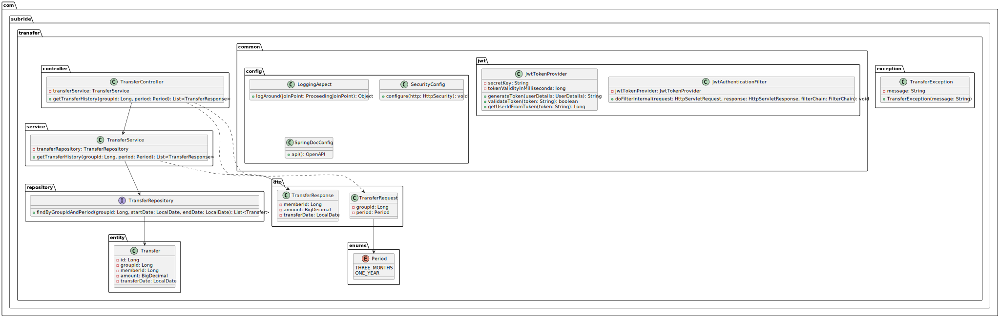
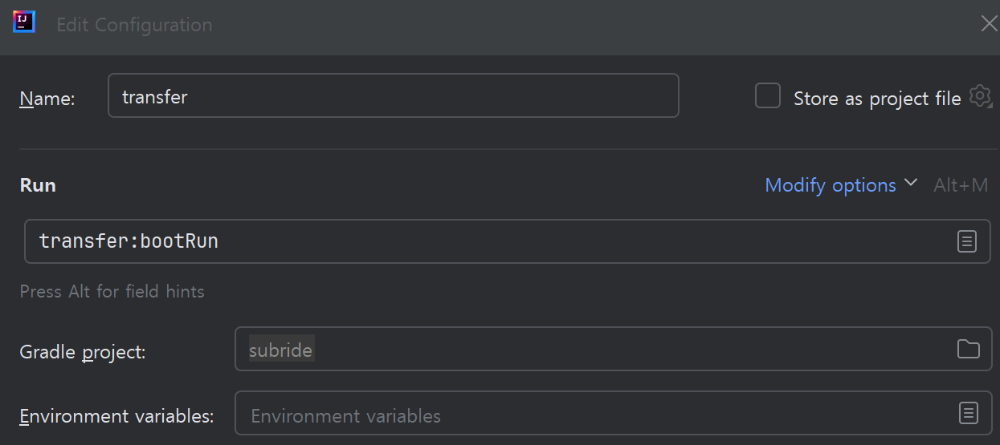

# 이체조회 서비스 개발 

## 아키텍처 설계 결과 
이체조회 서비스는 매우 단순하여 **레이어드 아키텍처를 적용**합니다.    
Data Access는 MyBatis를 학습하기 위해 JPA가 아니라 **MyBatis를 이용**합니다.  
MyBatis도 interface만 만들어 repository를 접근하는 ORM의 한 방법입니다.  
단, **SQL을 xml형식으로 정의**한다는 것이 다릅니다.   

> **MyBatis 역사**   
> 처음 Apache Software 재단에서 iBATIS를 만듬: internet Better Access To Information System    
> 2010년 Apache재단에서 Google Code로 이전 되면서 MyBatis로 변경  
> 좀더 사용자 중심의 데이터 접근 방법을 제공하겠다는 의미로 해석됨  


- **Class 설계**    
     

- **Sequence 설계**
      

## Clauding 프롬프트  
**Clauding**이라는 말은 제가 만든 말로 구글링처럼 **Claude를 활용하여 원하는 것을 얻는다**는 의미입니다.   
설계 결과를 클로딩하여 개발하는 프롬프트는 아래와 같습니다. 

```
제공한 기존 소스와 클래스 설계에 기반하여 아래 요구사항대로 개발 해줘.

- 대상 서비스: 이체조회(transfer)
- 개발언어 : Spring Boot
- 레이어드 아키텍처로 만들고 프로젝트명은 transfer로 함
- 제공한 최상위 프로젝트의 build.gradle과 settings.gradle를 보고 프로젝트의 build.gradle 제공
- 제공한 application.yml을 보고 환경변수 사용하여 개발   
- API 응답은 common프로젝트의 CommonUtils 클래스의 메소드를 사용    
- common.config와 common.jwt 소스는 보여주지 마

답변 순서는 아래와 같아
- 전체 패키지 구조도 
- 프로젝트 소스 

먼저 전체 패키지 구조도부터 보여줘
```
클로드가 제시한 패키지 구조를 보고 수정사항을 요청하여 패키지 구조부터 완성합니다.  
그리고 완성된 패키지 구조에 따라 개발을 요청합니다.

> **클로딩 개발 Tip**   
> 실제 개발시에는 아래 코드를 소스통합 유틸리티(mergesrc.py)를 이용하여 한 파일로 만들어 클로드에게 주십시오.   
> - 최상위 프로젝트의 build.gradle, settings.gradle   
> - common 프로젝트 전체    
> - common, exception 패키지 하위 클래스  
> ※ 이체조회는 다른 서비스 호출하는 곳이 없어 최소한 필요한 소스만 제공하면 됩니다.    

## 패키지 구조  
이체조회 서비스의 패키지 구조도입니다.  

```
transfer
├── src
│   ├── main
│   │   ├── java
│   │   │   └── com
│   │   │       └── subride
│   │   │           └── transfer
│   │   │               ├── TransferApplication.java
│   │   │               ├── common
│   │   │               │   ├── config
│   │   │               │   │   ├── LoggingAspect.java
│   │   │               │   │   ├── SecurityConfig.java
│   │   │               │   │   └── SpringDocConfig.java
│   │   │               │   ├── dto
│   │   │               │   │   ├── TransferRequest.java
│   │   │               │   │   └── TransferResponse.java
│   │   │               │   ├── enums
│   │   │               │   │   └── Period.java
│   │   │               │   ├── exception
│   │   │               │   │   └── TransferException.java
│   │   │               │   ├── feign
│   │   │               │   │   └── MyGroupFeignClient.java
│   │   │               │   └── jwt
│   │   │               │       ├── JwtAuthenticationFilter.java
│   │   │               │       ├── JwtAuthenticationInterceptor.java
│   │   │               │       └── JwtTokenProvider.java
│   │   │               ├── controller
│   │   │               │   └── TransferController.java
│   │   │               ├── persistent
│   │   │               │   ├── entity
│   │   │               │   │   └── Transfer.java
│   │   │               │   ├── dao
│   │   │               │   │   └── ITransferRepository.java
│   │   │               │   └── typehandler
│   │   │               │       └── LocalDateTypeHandler.java
│   │   │               └── service
│   │   │                   └── ITransferService.java
│   │   │                   └── TransferServiceImpl.java
│   │   └── resources
│   │       └── mybatis.mapper
│   │           └── TransferMapper.xml
│   │       └── application.yml
│   │       └── schema.sql
└── build.gradle
```

※ 설명 안한 소스에 궁금한 부분이 있다면 저에게 묻거나 클로딩 하십시오.  

## 개발 순서 

| Group | Task              | Description               | Link   |
| :-----| :-----------------| :------------------------ | :------|
| 생성 | 프로젝트 생성 | 이체조회 서비스 프로젝트 생성 | [Link](#프로젝트-생성)  |
|      | 빌드 스크립트 작성 | build.gradle 작성 | [Link](#빌드-스크립트-작성)  |
| 이체조회 개발 | Main 클래스 개발 |  | [Link](#main-클래스-개발)  |
|  | 애플리케이션 설정 파일 작성 | application.yml 파일 작성 | [Link](#애플리케이션-설정-파일-작성)  |
|  | Common 클래스 개발 | config, exception, jwt, feign, dto, enums 클래스 개발 | [Link](#common-클래스-개발)  |
|  | Entity 클래스 개발 |  | [Link](#entity-클래스-개발)  |
|  | Type Handler 클래스 개발 | LocalDate처리를 위한 타입 변환 클래스 | [Link](#type-handler-클래스-개발)  |
|  | Repository 인터페이스 개발 | DAO(Data Access Object) 인터페이스 개발 | [Link](#repository-인터페이스-개발)  |
|  | Mapper XML 파일 작성 | SQL XML 파일 작성 | [Link](#mapper-xml-파일-작성)  |
|  | Controller 클래스 개발 | API 개발 | [Link](#controller-클래스-개발)  |
|  | Service 클래스 개발 | 애플리케이션 로직 처리 | [Link](#service-클래스-개발)  |
|  | 구독그룹 서비스에 API 추가 | 이체 테스트 데이터 생성 목적 | [Link](#구독그룹-서비스에-api-추가)  |
| 테스트 | Swagger 이용 테스트 | Swagger에서 API 테스트 | [Link](#swagger-이용-테스트)  |
| 소스 저장 | Git 푸시 | Gig에 소스 저장 | [Link](#소스-저장--git-푸시)  |


## 프로젝트 생성  

먼저 클론 프로젝트의 브랜치를 version5-mybatis로 변경하십시오.   
상단 왼쪽 쯤에 있는 브랜치 이름을 클릭해서 바꾸시면 됩니다.   

- 개발 프로젝트의 브랜치를 'transfer'로 변경합니다.  
    ```
    git checkout -B transfer
    ```

- 개발 프로젝트의 최상위에서 하위 모듈로 'transfer'를 추가합니다.

- transfer 프로젝트의 src 디렉토리 하위에서 아래 작업 수행  
  - main/java디렉토리 생성
    > **Directory메뉴가 안 보일 때**  
    > src디렉토리가 자동으로 Source Root로 지정되면 Directory메뉴가 안 보입니다.   
    > src디렉토리를 선택하고 우측 마우스 메뉴에서 Mark Directory as > Unmark as Source Root를 선택하십시오.  

  - main/java 디렉토리를 선택하고, 우측 마우스 메뉴에서 Mark Directory as > Source Root 선택   
  - main/resources 디렉토리 생성   
  - main/resources 디렉토리 선택하고, 우측 마우스 메뉴에서 Mark Directory as > Resource Root 선택    
  - main/java 하위에 com.subride.transfer 패키지 생성   

- settings.gradle에 생성한 프로젝트를 추가합니다.  
  ```
  rootProject.name = 'subride'
  include 'common'
  include 'member:member-biz'
  include 'member:member-infra'
  include 'subrecommend:subrecommend-biz'
  include 'subrecommend:subrecommend-infra'
  include 'mysub:mysub-biz'
  include 'mysub:mysub-infra'
  include 'transfer'
  ```  

| [Top](#개발-순서) |

---

## 빌드 스크립트 작성
- 최상위 빌드 스크립트 수정    
  transfer 프로젝트는 biz와 infra로 나눠지지 않기 때문에 infra프로젝트에 적용되던 설정을 적용 받기 위해   
  최상위에 있는 build.gradle을 조금 수정해야 합니다.   

  아래와 같이 ' || it.name == 'transfer'}'을 추가 하십시오.  
  ```
  configure(subprojects.findAll { it.name.endsWith('-infra') || it.name == 'transfer'}) {
    dependencies {
      implementation 'org.springframework.boot:spring-boot-starter-web'
      implementation 'org.springframework.boot:spring-boot-starter-security'
      implementation 'org.springframework.boot:spring-boot-starter-data-jpa'
      implementation 'org.springdoc:springdoc-openapi-starter-webmvc-ui:2.1.0'	//For swagger
      implementation 'com.auth0:java-jwt:4.4.0'			//JWT unitlity
      runtimeOnly 'com.mysql:mysql-connector-j'
    }
  }
  ```

  변경한 후 오른쪽 사이드바에 있는 코키리 아이콘을 눌러 리프레시 하십시오.   
    

- transfer 디렉토리 하위에 build.gradle 작성(클론 프로젝트에서 복사해도 됨)  
  common 프로젝트를 참조하도록 합니다.      
  Feign client, mybatis 라이브러리를 추가 합니다.  
  또한, Spring Cloud 종속성 관리자도 지정해 줘야 합니다.   
  ```
  dependencies {
      implementation project(':common')

      //-- OpenFeign Client: Blocking방식의 Http Client
      implementation 'org.springframework.cloud:spring-cloud-starter-openfeign'

      //--mybatis
      implementation 'org.mybatis.spring.boot:mybatis-spring-boot-starter:3.0.3'
      testImplementation 'org.mybatis.spring.boot:mybatis-spring-boot-starter-test:3.0.3'
  }

  /*
  OpenFeign Client는 SpringCloud의 컴포넌트이기 때문에 Spring Cloud 종속성 관리 지정 필요
  Spring Boot 버전에 맞는 Spring Cloud 버전을 지정해야 함
  https://github.com/spring-cloud/spring-cloud-release/wiki/Supported-Versions#supported-releases
  */
  dependencyManagement {
      imports {
          mavenBom "org.springframework.cloud:spring-cloud-dependencies:2023.0.1"
      }
  }
  ```  

| [Top](#개발-순서) |

---

## Main 클래스 개발  
main/java디렉토리 밑에 'com.subride.transfer'패키지를 생성합니다.   
그 하위에 새로운 클래스 TransferApplication을 생성합니다.   
**@EnableFeignClients** 어노테이션을 꼭 추가해 주십시오.   
OpenFeign Client 사용을 위해 반드시 추가해 줘야 합니다.  
```
@SpringBootApplication
@EnableFeignClients
public class TransferApplication {
    public static void main(String[] args) {
        SpringApplication.run(TransferApplication.class, args);
    }
}
```

> **컴파일 에러가 날때**   
> 아직 transfer프로젝트가 제대로 인식이 안되면 컴파일 에러가 납니다.  
> 오른쪽에 있는 코끼리 모양을 누르고 refresh 해주십시오.   
>   


| [Top](#개발-순서) |

---

## 애플리케이션 설정 파일 작성  
클론 프로젝트의 src/main/resources 디렉토리 밑에 있는 application.yml 파일을  
개발 프로젝트의 동일 위치로 복사합니다.  

```
server:
  port: ${SERVER_PORT:18084}
spring:
  application:
    name: ${SPRING_APPLICATION_NAME:transfer-service}
  datasource:
    driver-class-name: ${DB_DRIVER:com.mysql.cj.jdbc.Driver}
    url: ${DB_URL:jdbc:mysql://localhost:3306/transfer?createDatabaseIfNotExist=true&serverTimezone=Asia/Seoul}
    username: ${DB_USERNAME:root}
    password: ${DB_PASSWORD:P@ssw0rd$}
  sql:
    init:
      mode: always   #시작시 테이블 존재 체크하고 없으면 생성
      schema-locations: classpath:schema.sql  #Table 생성 SLQ

mybatis:
  type-aliases-package: com.subride.transfer.persistent.entity
  mapper-locations: classpath:mybatis/mapper/*.xml
  type-handlers-package: com.subride.transfer.persistent.typehandler

springdoc:
  swagger-ui:
    path: /swagger-ui.html
jwt:
  secret: ${JWT_SECRET:8O2HQ13etL2BWZvYOiWsJ5uWFoLi6NBUG8divYVoCgtHVvlk3dqRksMl16toztDUeBTSIuOOPvHIrYq11G2BwQ==}

# Logging
logging:
  level:
    root: INFO
    org.springframework.security: DEBUG
    com.subride.transfer: DEBUG
feign:
  mygroup:
    url: ${MYGRP_URI:http://localhost:18083}
```

**테이블을 자동으로 생성시키 주는 설정**입니다.   
실제 운영에서는 사용하지 않는 것이 좋습니다.   
```
  sql:
    init:
      mode: always   #시작시 테이블 존재 체크하고 없으면 생성
      schema-locations: classpath:schema.sql  #Table 생성 SLQ
```
테이블을 생성하는 SQL파일을 만들어 줘야 합니다.     
resources 디렉토리 하위에 schema.sql이라는 파일을 만들고 아래 내용으로 저장합니다.  
transfer_date필드가 'DATE' type인 것을 기억해 주십시오.    
이후에 Entity 클래스를 정의할 때 LocalDate타입을 사용하기 때문에 타입을 맞추기 위해 할일들이 있습니다.   
```
CREATE TABLE IF NOT EXISTS `transfer` (
  `id` bigint NOT NULL AUTO_INCREMENT,
  `group_id` bigint DEFAULT NULL,
  `member_id` varchar(255) DEFAULT NULL,
  `amount` decimal(38,0) DEFAULT NULL,
  `transfer_date` date DEFAULT NULL,
  PRIMARY KEY (`id`)
) ENGINE=InnoDB AUTO_INCREMENT=13 DEFAULT CHARSET=utf8mb4 COLLATE=utf8mb4_0900_ai_ci;
```

**Mybatis 관련 설정**입니다.   
Entity class가 정의되어 있는 package, SQL XML이 있는 경로를 정의합니다.   
또한, LocalDate 타입에 대한 형변환 클래스가 있는 패키지도 정의합니다.    
Mybatis는 LocalDate를 지원하지 않기 때문에 이렇게 따로 Type handler를 만들어줘야 합니다.   
```
mybatis:
  type-aliases-package: com.subride.transfer.persistent.entity
  mapper-locations: classpath:mybatis/mapper/*.xml
  type-handlers-package: com.subride.transfer.persistent.typehandler
```

필요한 파일들은 이후 진행하면서 만들겠습니다.   


| [Top](#개발-순서) |

---

## Common 클래스 개발     
공통으로 사용할 클래스들을 common패키지 밑에 개발합니다.  
com.subride.transfer 패키지 하위에 common 패키지를 추가합니다.  
common 패키지 하위 클래스를 클론 프로젝트에서 복사-붙여넣기 합니다.   

> common.config    : 지금까지 계속 사용했던 Config클래스들임-로깅, Security, Swagger  
> common.exception : 에러처리 클래스   
> common.jwt       : Jwt 관련 클래스   
> common.feign     : 마이그룹 API 사용을 위한 클래스 - 테스트 데이터를 만들 때 사용함   
> common.dto       : 이체조회 요청과 응답을 위한 클래스   
> common.enums     : Enumeration(목록, 열거)형 클래스 - 코드성 객체를 다루기 위해 사용  

Period Enum(이넘이라고 발음함) 클래스    
```
public enum Period {
    THREE_MONTHS,
    ONE_YEAR
}
```

common.feign.MyGroupFeignClient에서 사용하는 **GroupMemberDTO클래스**를   
클론프로젝트의 common프로젝트 밑의 com.subride.common.dto에서 복사하십시오.  


| [Top](#개발-순서) |

---

## Entity 클래스 개발 
- 패키지 추가   
  개발 프로젝트 com.subride.transfer 밑에 'persistent.out.entity' 패키지를 만듭니다.  
  
- Entity 클래스 복사   
  클론 프로젝트에 있는 persistent.out.entity 패키지 밑의 클래스를 복사합니다.  
  MyBatis를 사용할 때는 Entity 클래스를 만드는 방법이 JPA를 사용할 때와 조금 다릅니다.  
  **테이블과 필드 관련한 어노테이션을 사용하지 않습니다**.      
  클래스 위에 지정하던 @Entity, @Table(name = "테이블명")과 같은 어노테이션이 없어야 합니다.   
  각 필드에 사용하던 @Id, @GeneratedValue(strategy = GenerationType.IDENTITY), @ElementCollection, @CollectionTable,  @Column(name = "필드명")와 같은 어노테이션도 사용하면 안됩니다.    

  ```
  @Getter
  @Setter
  @Builder
  @NoArgsConstructor
  @AllArgsConstructor
  public class Transfer {
      private Long id;
      private Long groupId;
      private String memberId;
      private BigDecimal amount;
      private LocalDate transferDate;
  }
  ```

  또한, 레이어간 객체 형변환을 위한 **모델 매핑 메소드도 없습니다.**    
  왜냐하면 **레이어드 아키텍처를 적용하기 때문**입니다.  
  

| [Top](#개발-순서) |

---

## Type Handler 클래스 개발
transferDate가 LocalDate 타입입니다.  transfer테이블에는 Date타입입니다.   
조금 전에 말했듯이 MyBatis는 LocalDate를 지원하지 않기 때문에 형 변환을 위해 추가적인 작업이 있습니다.   
persistent밑에 typehandler라는 패키지를 만들고, 클론 프로젝트에서 LocalDateTypeHandler클래스를 복사합니다.  

SQL을 Query하기 위한 파라미터로 LocalDate형이 오면 Date형으로 변환하는 메소드와,   
결과를 LocalDate형으로 바꾸는 메소드가 정의되어 있습니다.    
```
@MappedTypes(LocalDate.class)
public class LocalDateTypeHandler extends BaseTypeHandler<LocalDate> {
    @Override
    public void setNonNullParameter(PreparedStatement ps, int i, LocalDate parameter, JdbcType jdbcType) throws SQLException {
        ps.setDate(i, java.sql.Date.valueOf(parameter));
    }

    @Override
    public LocalDate getNullableResult(ResultSet rs, String columnName) throws SQLException {
        java.sql.Date date = rs.getDate(columnName);
        return date != null ? date.toLocalDate() : null;
    }

    {중략}
}
```

이 클래스는 아래와 같이 **application.yml에 위치를 정의해 줬기 때문에 적용**이 됩니다.   
```
mybatis:
  {중략}
  type-handlers-package: com.subride.transfer.persistent.typehandler
```

| [Top](#개발-순서) |

---

## Repository 인터페이스 개발  
JPA 사용시에 interface로 만들었던 DB 처리 클래스입니다.   

- 패키지 추가   
  개발 프로젝트 persistent 패키지 밑에 'dao' 패키지를 만듭니다.   
  MyBatis에서는 Data Access Object라는 뜻으로 dao라는 패키지명을 사용합니다.  
  
- 클래스 복사   
  클론 프로젝트에 있는 persistent.dao 패키지 밑의 클래스를 복사합니다.  

  @Mapper라는 어노테이션을 지정했으므로 application.yml에 지정한  
  SQL XML파일(이후 Mapper XML로 부르겠음)과 연결이 됩니다.   
  
  ```
  @Mapper
  @Repository
  @SuppressWarnings("unused")
  public interface ITransferRepository {
      List<Transfer> findByGroupIdAndTransferDateBetween(@Param("groupId") Long groupId, @Param("startDate") LocalDate startDate, @Param("endDate") LocalDate endDate);
      void save(Transfer transfer);
      void deleteAll();
      void insertList(List<Transfer> transfers);
  }
  ```

  정의한 **메소드명은 Mapper XML에 있는 'id'와 일치해야 합니다. 파라미터의 타입과 리턴 객체 타입도 일치**해야 합니다.     
  예를 들어 위 save 메소드명은 Mapper XML에 아래와 같이 정의되어 있습니다.  
  MyBatis 사용 시 가장 많이 실수하고 또 원인을 찾기도 어려운게 이 부분입니다.   
  ```
  <insert id="save" parameterType="Transfer">
      INSERT INTO transfer (group_id, member_id, amount, transfer_date)
      VALUES (#{groupId}, #{memberId}, #{amount}, #{transferDate,jdbcType=DATE})
  </insert>
  ```

| [Top](#개발-순서) |

---

## Mapper XML 파일 작성
application.yml에 아래와 같이 Mapper XML의 경로를 정의했었습니다.    

```
mybatis:
  mapper-locations: classpath:mybatis/mapper/*.xml
```

먼저 resources디렉토리 밑에 mabatis/mapper라는 디렉토리를 만듭니다.   
그리고 아무 이름으로나 확장자가 xml인 Mapper XML파일을 만들면 됩니다.  
클론 프로젝트에 있는 TransferMapper.xml파일을 복사해 옵니다.    

어떤 repository 클래스를 위한 Mapper인지를 정확히 정의합니다.  
```
<mapper namespace="com.subride.transfer.persistent.repository.ITransferMapper">
```

**'findByGroupIdAndTransferDateBetween'메소드의 SQL**을 정의합니다.   
> 파라미터 지정: 파라미터는 #{파라미터명} 형식으로 지정함   
> resultMap: 리턴객체의 구조를 정의합니다. 문자나 숫자만 있는 경우는 없어도 되나 Date형식 때문에 꼭 있어야 함   
> select: ITransferRepository클래스의 메소드명과 동일한 ID, 리턴객체 이름, 리턴형식 구조를 정의함      


```
<resultMap id="transferResultMap" type="com.subride.transfer.persistent.entity.Transfer">
    <id property="id" column="id"/>
    <result property="groupId" column="group_id"/>
    <result property="memberId" column="member_id"/>
    <result property="amount" column="amount"/>
    <result property="transferDate" column="transfer_date" javaType="java.time.LocalDate"/>
</resultMap>

<select id="findByGroupIdAndTransferDateBetween" resultType="Transfer" resultMap="transferResultMap">
    SELECT * FROM transfer
    WHERE group_id = #{groupId}
    AND transfer_date BETWEEN #{startDate} AND #{endDate}
</select>
```

**'save' 메소드 SQL**   
입력 파라미터는 Transfer클래스 객체로 지정했습니다.   
그래서 이 클래스의 필드를 VALUES의 파라미터로 지정할 수 있습니다.    
```
<insert id="save" parameterType="Transfer">
    INSERT INTO transfer (group_id, member_id, amount, transfer_date)
    VALUES (#{groupId}, #{memberId}, #{amount}, #{transferDate,jdbcType=DATE})
</insert>
```

**insertList 메소드 SQL**    
요청되는 배열의 타입에 따라 파라미터 타입을 적절히 지정합니다.   
여기서는 List객체로 요청되기 때문에 'list'로 했습니다. Map타입을 사용하는 경우도 많습니다.  
VALUE에 'foreach'문을 써서 반복하면서 각 레코드를 등록 합니다.      
```
<insert id="insertList" parameterType="list">
    INSERT INTO transfer (group_id, member_id, amount, transfer_date)
    VALUES
    <foreach collection="list" item="transfer" separator=",">
        (#{transfer.groupId}, #{transfer.memberId}, #{transfer.amount}, #{transfer.transferDate,jdbcType=DATE})
    </foreach>
</insert>
```

**deleteAll 메소드 SQL**  
전체 데이터를 삭제하는 SQL문입니다.   
파라미터를 받아 특정 조건에 해당하는 데이터만 삭제할 수도 있습니다.   
```
<delete id="deleteAll">
    DELETE FROM transfer
</delete>
```

## Controller 클래스 개발
외부의 요청을 처리하기 위한 API인 Controller 클래스를 개발합니다.  

- 패키지 추가   
  개발 프로젝트의 com.subride.infra 밑에 'controller' 패키지를 만듭니다.  
  
- Controller 클래스 복사   
  클론 프로젝트에 있는 controller 패키지 밑의 클래스를 복사합니다.  

  API는 아래와 같습니다.     
  - getTransferHistory: 구독그룹ID와 조회기간을 입력받아 조회 이력을 리턴   
  - createTestData    : 이체 이력 테스트 데이터 생성     
  - deleteAllData     : 모든 테스트 이체 데이터를 삭제   

| [Top](#개발-순서) |

---

## Service 클래스 개발   
Controller 클래스의 요청을 처리하는 Service 클래스를 개발합니다.   

- 패키지 추가   
  개발 프로젝트의 com.subride.infra 밑에 'service' 패키지를 만듭니다.  
  
- 클래스 복사   
  클론 프로젝트에 있는 service 패키지 밑의 인터페이스와 클래스를 복사합니다.  
  ITransferService는 단순히 메소드만을 정의하고, 실제 구현은 TransferServiceImpl 클래스에서 합니다.     
  ```
  public interface ITransferService {
    List<TransferResponse> getTransferHistory(Long groupId, Period period);
    void createTestData();
    void deleteAllData();
  }
  ```

- **getTransferHistory: 이체내역 리턴**   
  groupId와 Enum객체인 period를 파라미터로 받아 이체내역을 Query하여 리턴 합니다.   
  
  ```
  public List<TransferResponse> getTransferHistory(Long groupId, Period period) {
      LocalDate endDate = LocalDate.now();
      LocalDate startDate;

      if (period == Period.THREE_MONTHS) {
          startDate = endDate.minusMonths(3);
      } else if (period == Period.ONE_YEAR) {
          startDate = endDate.minusYears(1);
      } else {
          throw new TransferException("잘못된 조회 기간입니다.");
      }

      List<Transfer> transferList = transferRepository.findByGroupIdAndTransferDateBetween(groupId, startDate, endDate);
      log.debug("Transfer list: {}", transferList);

      return transferList.stream()
              .map(this::toTransferResponse)
              .collect(Collectors.toList());
  }

  private TransferResponse toTransferResponse(Transfer transfer) {
      log.info("date -> {}", transfer.getTransferDate());
      return TransferResponse.builder()
              .id(transfer.getId())
              .memberId(transfer.getMemberId())
              .amount(transfer.getAmount())
              .transferDate(transfer.getTransferDate())
              .build();
  }  
  ```

- **createTestData: 테스트 데이터 생성**  
  현재 등록된 모든 구독그룹에 대해 1년간의 이체 내역 데이터를 생성합니다.     
  ```
  public void createTestData() {
      // 등록된 그룹의 참여자들 userId 가져오기
      ResponseDTO<List<GroupMemberDTO>> response = myGroupFeignClient.getAllGroupMembers();
      List<GroupMemberDTO> groupMembers = response.getResponse();

      List<Transfer> transfers = new ArrayList<>();
      Random random = new Random();

      for (GroupMemberDTO groupMember : groupMembers) {
          Long groupId = groupMember.getGroupId();
          Set<String> memberIds = groupMember.getMemberIds();
          int paymentDay = groupMember.getPaymentDay();

          for (String memberId : memberIds) {
              LocalDate transferDate;
              if (LocalDate.now().getDayOfMonth() >= paymentDay) {
                  transferDate = LocalDate.now().withDayOfMonth(paymentDay);
              } else {
                  transferDate = LocalDate.now().minusMonths(1).withDayOfMonth(paymentDay);
              }

              for (int i = 0; i < 12; i++) {
                  BigDecimal amount = BigDecimal.valueOf(random.nextInt(40001) + 10000);

                  Transfer transfer = new Transfer();
                  transfer.setGroupId(groupId);
                  transfer.setMemberId(memberId);
                  transfer.setAmount(amount);
                  transfer.setTransferDate(transferDate);

                  transfers.add(transfer);

                  transferDate = transferDate.minusMonths(1);
              }
          }
      }

      log.info("Generated transfer data: {}", gson.toJson(transfers));

      transferRepository.insertList(transfers);
  }
  ```

  입력되는 값을 디버깅하기 위해 gson이라는 JSON 유틸리티를 사용하고 있습니다.   
  그런데 gson도 LocalDate에 대한 처리를 기본적으로 못하기 때문에 아래와 같이 LocalDateAdapter를 만들어  
  추가해 줬습니다.  이렇게 Date처리는 골치 아플때가 많습니다.   
  ```
  private final Gson gson = new GsonBuilder()
        .registerTypeAdapter(LocalDate.class, new TransferProvider.LocalDateAdapter())
        .create();

  {중략}
  public void createTestData() {
    {중략}
    log.info("Generated transfer data: {}", gson.toJson(transfers));
  }

  private static class LocalDateAdapter implements JsonSerializer<LocalDate> {
    private static final DateTimeFormatter formatter = DateTimeFormatter.ISO_LOCAL_DATE;

    @Override
    public JsonElement serialize(LocalDate localDate, Type srcType, JsonSerializationContext context) {
        return new JsonPrimitive(formatter.format(localDate));
    }
  }
  ```

- **deleteAllData: 모든 테스트 데이터 삭제**     
  ```
  public void deleteAllData() {
      transferRepository.deleteAll();
  }
  ```

| [Top](#개발-순서) |

---

## 구독그룹 서비스에 API 추가   
테스트 데이터 생성시 구독그룹에 요청하는 'getAllGroupMembers' API를 추가합니다.   

MyGroupController에 아래 API를 추가합니다.    
```
@Operation(summary = "모든 썹그룹 멤버 목록 리턴")
@GetMapping("/all-members")
public ResponseEntity<ResponseDTO<List<GroupMemberDTO>>> getAllGroupMembers() {
    List<GroupMemberDTO> allGroupMemberss = myGroupControllerHelper.getAllGroupMembers();
    return ResponseEntity.ok(CommonUtils.createSuccessResponse(200, "모든 썹그룹 멤버 목록", allGroupMemberss));

}
```

MyGroupControllerHelper에 아래 메소드를 추가합니다.   
```
public List<GroupMemberDTO> getAllGroupMembers() {
    List<GroupEntity> groupEntityList = myGroupRepository.findAll();

    if (groupEntityList == null || groupEntityList.isEmpty()) {
        return Collections.emptyList();
    }

    return groupEntityList.stream()
            .map(groupEntity -> {
                GroupMemberDTO groupMemberDTO = new GroupMemberDTO();
                groupMemberDTO.setGroupId(groupEntity.getGroupId());
                groupMemberDTO.setMemberIds(groupEntity.getMemberIds());
                groupMemberDTO.setPaymentDay(groupEntity.getPaymentDay());
                return groupMemberDTO;
            })
            .collect(Collectors.toList());
}
```

| [Top](#개발-순서) |

---

## Swagger 이용 테스트 

- 서비스 실행
  Run > Edit Configuration을 클릭하고, 기존의 실행 프로파일을 복사하여   
  새로운 실행 프로파일을 만듭니다. 
  

  서비스 탭에 추가된 transfer를 실행합니다.    
  한번에 잘 실행되었나요?  에러가 있다면 에러 메시지를 보고 해결 합니다.  
  지금까지 과정을 잘 따라했다면 한번에 실행될겁니다.   

  다른 서비스들도 재시작해 주십시오.    

- API 테스트   
  [이체조회 서비스 Swagger](http://localhost:18084/swagger-ui/index.html)을 엽니다.   

  API를 테스트 하려면 인증토큰을 얻어야 합니다.  
  [회원서비스 Swagger 페이지](http://localhost:18080/swagger-ui/index.html)의 '로그인' API를 이용하여 인증 토큰을 구합니다.   
  우측 상단의 Authorize 버튼을 눌러 인증 토큰을 붙여 넣습니다.   

  > API 테스트 순서    
  > - 테스트 데이터 생성을 실행하여 이체내역 데이터를 생성합니다.   
  > - 마이그룹 서비스의 '사용자의 썹그룹 목록 리턴' API에 사용자ID를 넣고 구독그룹 정보를 구합니다.   
  >   결과에서 response에 있는 groupId를 기억합니다.   
  > - 이체내역 조회 API에 그룹ID를 넣고 조회기간을 선택하여 테스트 합니다.   
  > - 전체 데이터 삭제 API를 테스트 합니다.   
  > - 테스트를 위해 테스트 데이터 생성을 다시 합니다.    
     
  테스트 완료하면 **모든 서비스를 중지**하세요.   

| [Top](#개발-순서) |

---

## 소스 저장 > Git 푸시   

- Git Push 하기  
    IntelliJ에서 GitBash 터미널을 엽니다.   

    원격 Git repository에 푸시합니다.  
    ```
    git add . && git commit -m "transfer" && git push -u origin transfer
    ```

    v5.0.0으로 태깅하고 푸시합니다.  
    ```
    git tag -a v5.0.0 -m "이체조회 서비스" 
    git push origin v5.0.0
    ```

- 확인  
    github.com에서 잘 푸시되었는지 소스와 태그를 확인 합니다.  

| [Top](#개발-순서) |

---

이체조회 서비스가 완성되었습니다.  
수고하셨습니다.   


