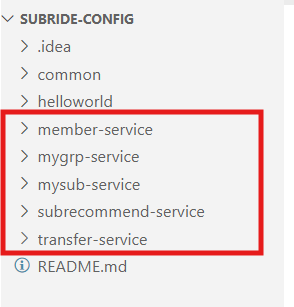
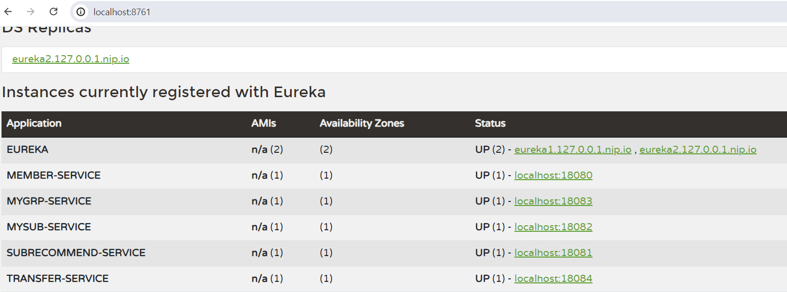

# Spring Cloud 서버 연동

- [Spring Cloud 서버 연동](#spring-cloud-서버-연동)
  - [Config 서버 연동](#config-서버-연동)
    - [**application.yml 내용을 Config 저장소에 작성**](#applicationyml-내용을-config-저장소에-작성)
    - [백엔드 서비스 application.yml 수정](#백엔드-서비스-applicationyml-수정)
    - [Config 서버 라이브러리 추가](#config-서버-라이브러리-추가)
    - [테스트](#테스트)
  - [Eureka 서버 연동](#eureka-서버-연동)
  - [SCG 서버 연동](#scg-서버-연동)
    - [Eureka 설정](#eureka-설정)
    - [Actuator 설정](#actuator-설정)
    - [CORS, Timeout 설정](#cors-timeout-설정)
    - [Routing 설정 추가](#routing-설정-추가)
    - [프론트엔드 수정](#프론트엔드-수정)
    - [라우팅 테스트](#라우팅-테스트)
  - [Git 푸시](#git-푸시)

---

## Config 서버 연동  
모든 백엔드 서비스의 application.yml 내용을 Config 저장소에 작성한 후,  
application.yml에는 Config Server를 연결하는 설정만 남기겠습니다.   

### **application.yml 내용을 Config 저장소에 작성**  
vscode에서 Config 저장소를 오픈 합니다.   
'홈디렉토리/workspace/subride-config' 디렉토리를 오픈하면 됩니다.  

- **디렉토리 작성**  
  **각 서비스를 위한 디렉토리**부터 만듭니다.   
  아래와 같이 spring.application.name과 동일한 이름의 디렉토리를 만들어 주십시오.   
     

  그리고 각 디렉토리 밑에 application.yml과 application.properties 파일을 작성해 주십시오.   


- **공통 설정 작성**    
공통적인 설정은 common/application.yml과 application.properties파일에 작성합니다.   
application.yml에 아래 내용을 붙여 넣습니다.  
```
server:
  port: ${SERVER_PORT}
spring:
  application:
    name: ${SPRING_APPLICATION_NAME}
  datasource:
    driver-class-name: ${DB_DRIVER}
    url: ${DB_URL}
    username: ${DB_USERNAME}
    #password: ${DB_PASSWORD:{cipher}a68de9b0597cdb81a077bc626aa714f834e6798e9c0aa53c26d5cefb2c525d06}
    #암호화한 값을 사용할 때는 위와 같은 형식은 사용 못함
    # curl -X POST http://localhost:9001/encrypt -d "P@ssw0rd$"
    password: '{cipher}dbf7229281926da83068aee04aca0fdbc170fa0bdc476e8e9241f1f4e827ba3c'
  jpa:
    database: mysql
    database-platform: org.hibernate.dialect.MySQLDialect
    show-sql: false
    hibernate:
      ddl-auto: update
    properties:
      hibernate:
        format_sql: true
springdoc:
  swagger-ui:
    path: /swagger-ui.html
jwt:
  #JWT secret키는 암호화하면 동작 안함
  #secret: '{cipher}0c77292c64cf9ac384d29b89d92a69f9ca8c2ce96da81d36946515f6e85cd1dcd31b86547b56ec86cbba773af5f77da1657411cb6d7d133417228abbde727a197c14f17fda2059a9bc7c7fb671b2600614caf65b55618bb4b512854df55ca844e5f1d89dd392051e1cc0a1cd0ddf16d8'
  secret: 8O2HQ13etL2BWZvYOiWsJ5uWFoLi6NBUG8divYVoCgtHVvlk3dqRksMl16toztDUeBTSIuOOPvHIrYq11G2BwQ==

AllowedOrigins: ${FRONT_HOST}

# Logging
logging:
  level:
    root: INFO

# Eureka client 설정
# hostname은 서버를 구별하는 유일한 값이면 됨. instanceId는 Eureka에 등록된느 ID임 (라우팅할 때 주소 아님)
# 라우팅 주소는 아래와 같이 결정됨
# - preferIpAddress: false -> http://hostname:nonSecurePort, https://hostname:securePort
# - preferIpAddress: true  -> http://ip:nonSecurePort, https://ip:securePort
# 연결되는 주소는 https://{eureka ingress host}/eureka/apps/{service id}의 결과에서 homepageUrl값임
# 생존신고를 하는 주기(lease-renewal-interval-in-seconds. 기본 30초)와
# 만료 간주 시간(Eureka서버가 몇 초 동안 생존 신고를 못 받으면 만료로 간주할 지 판단하는 시간. 기본 90초)을 적절히 정의
# preferIpAddress를 false로 하고 hostname에 k8s DNS주소를 설정하는 방식은 StatefulSet으로 배포하는 경우에만 동작함
# (Deployment로 배포한 Pod는 고유 주소가 생기지 않기 때문임)
eureka:
  instance:
    #hostname: ${HOSTNAME}.${APPLICATION_NAME}-headless.${NAMESPACE}.svc.cluster.local
    hostname: ${HOSTNAME}
    instanceId: ${HOSTNAME}:${SERVER_PORT}
    preferIpAddress: true
    nonSecurePort: ${SERVER_PORT}
    securePort: 443
    nonSecurePortEnabled: true
    securePortEnabled: false
    lease-renewal-interval-in-seconds: 5
    lease-expiration-duration-in-seconds: 10
  client:
    serviceUrl:
      defaultZone: ${EUREKA_SERVERS}

# Actuator는 서버의 여러 정보를 제공해 주는 라이브러리
# {ingress host}/actuator/health와 같이 결과값을 구할 수 있음
management:
  endpoints:
    web:
      exposure:
        include: health, info, env, mappings, routes
```
   
application.properties 파일은 아래와 같이 작성합니다.   
```
#DB
DB_USERNAME=root
DB_DRIVER=com.mysql.cj.jdbc.Driver
#Feign clinet
MEMBER_URI=http://localhost:18080
SUBRECOMMEND_URI=http://localhost:18081
MYSUB_URI=http://localhost:18082
MYGRP_URI=http://localhost:18083
#Frontend service
FRONT_HOST=http://localhost:3000
#Eureka
HOSTNAME=localhost
EUREKA_SERVERS=http://eureka1.127.0.0.1.nip.io:8761/eureka/,http://eureka2.127.0.0.1.nip.io:8762/eureka/
```

- **회원서비스(member-service)**  
공통적인 속성을 제외한 member 서비스만의 설정만 작성합니다.   
application.yml파일  
```
jwt:
  expiration-time: ${JWT_EXPIRATION_TIME}
  refresh-token-expiration-time: ${REFRESH_TOKEN_EXPIRATION_TIME}
# Logging
logging:
  level:
    com.subride.member.infra.in: INFO
    com.subride.member.infra.out: INFO
```

application.properties 파일
```
SERVER_PORT=18080
SPRING_APPLICATION_NAME=member-service
DB_URL=jdbc:mysql://localhost:3306/member?createDatabaseIfNotExist=true&serverTimezone=Asia/Seoul
JWT_EXPIRATION_TIME=36000
REFRESH_TOKEN_EXPIRATION_TIME=360000
```

- **마이그룹 서비스(mygrp-service)**   
application.yml  
```
# Logging
logging:
    org.springframework.security: DEBUG
    com.subride.mygrp.infra.in: DEBUG
    com.subride.mygrp.infra.out: DEBUG
    feign:
      codec:
        logger:
          level: DEBUG
feign:
  subrecommend:
    url: ${SUBRECOMMEND_URI}
  mysub:
    url: ${MYSUB_URI}
  member:
    url: ${MEMBER_URI}
```

application.properties
```
SERVER_PORT=18083
SPRING_APPLICATION_NAME=mygrp-service
DB_URL=jdbc:mysql://localhost:3306/mygrp?createDatabaseIfNotExist=true&serverTimezone=Asia/Seoul
```  

- **마이구독(mysub-service)**    
application.yml  
```
# Logging
logging:
  level:
    org.springframework.security: DEBUG
    com.subride.mysub.infra.in: DEBUG
    com.subride.mysub.infra.out: DEBUG
    feign:
      codec:
        logger:
          level: DEBUG
feign:
  subrecommend:
    url: ${SUBRECOMMEND_URI}
  mygroup:
    url: ${MYGRP_URI}
```

application.properties   
```
SERVER_PORT=18082
SPRING_APPLICATION_NAME=mysub-service
DB_URL=jdbc:mysql://localhost:3306/mysub?createDatabaseIfNotExist=true&serverTimezone=Asia/Seoul
```

- **구독추천(subrecommend-service)**   
application.yml  
```
# Logging
logging:
  level:
    org.springframework.security: DEBUG
    com.subride.subrecommend.infra.in: DEBUG
    com.subride.subrecommend.infra.out: DEBUG
feign:
  mysub:
    url: ${MYSUB_URI}
```

application.properties
```
SERVER_PORT=18081
SPRING_APPLICATION_NAME=subrecommend-service
DB_URL=jdbc:mysql://localhost:3306/subrecommend?createDatabaseIfNotExist=true&serverTimezone=Asia/Seoul
```

- **이체조회(transfer-service)**   
application.yml  
```
spring:
  sql:
    init:
      mode: always   #시작시 테이블 존재 체크하고 없으면 생성
      schema-locations: classpath:schema.sql  #Table 생성 SLQ

mybatis:
  type-aliases-package: com.subride.transfer.persistent.entity
  mapper-locations: classpath:mybatis/mapper/*.xml
  type-handlers-package: com.subride.transfer.persistent.typehandler

# Logging
logging:
  level:
    org.springframework.security: DEBUG
    com.subride.transfer: DEBUG
feign:
  mygroup:
    url: ${MYGRP_URI}
```

application.properties  
```
SERVER_PORT=18084
SPRING_APPLICATION_NAME=transfer-service
DB_URL=jdbc:mysql://localhost:3306/transfer?createDatabaseIfNotExist=true&serverTimezone=Asia/Seoul
```

| [Top](#spring-cloud-서버-연동) |

---

### 백엔드 서비스 application.yml 수정  
먼저 새로운 브랜치 'sc'를 만듭니다.   
```
git checkout -B sc 
```

각 서비스의 application.yml파일을 수정합니다.  
- 회원(member-infra)  
```
spring:
  cloud:
    config:
      uri: ${CONFIG_SERVER_FQDN:http://localhost:9001}
      name: member-service
      profile: default
      label: main
  config:
    import: "optional:configserver:"

```

- 마이그룹(mygrp-infra)   
```
spring:
  cloud:
    config:
      uri: ${CONFIG_SERVER_FQDN:http://localhost:9001}
      name: mygrp-service
      profile: default
      label: main
  config:
    import: "optional:configserver:"
```

- 마이구독(mysub-infra)   
```
spring:
  cloud:
    config:
      uri: ${CONFIG_SERVER_FQDN:http://localhost:9001}
      name: mysub-service
      profile: default
      label: main
  config:
    import: "optional:configserver:"

```

- 구독추천(subrecommend-infra)   
```
spring:
  cloud:
    config:
      uri: ${CONFIG_SERVER_FQDN:http://localhost:9001}
      name: subrecommend-service
      profile: default
      label: main
  config:
    import: "optional:configserver:"

```

- 이체조회(transfer)   
```
spring:
  cloud:
    config:
      uri: ${CONFIG_SERVER_FQDN:http://localhost:9001}
      name: transfer-service
      profile: default
      label: main
  config:
    import: "optional:configserver:"

```

| [Top](#spring-cloud-서버-연동) |

---

### Config 서버 라이브러리 추가   
subride프로젝트의 최상위 빌드스크립트인 build.gradle에 아래와 같이 Config서버 라이브러리를 추가합니다.   
또한, **Spring Cloud 종속성 관리자도 꼭 추가**해야 합니다.   

```
configure(subprojects.findAll { it.name.endsWith('-infra') || it.name == 'transfer'}) {
	dependencies {
		implementation 'org.springframework.boot:spring-boot-starter-web'
		implementation 'org.springframework.boot:spring-boot-starter-security'
		implementation 'org.springframework.boot:spring-boot-starter-data-jpa'
		implementation 'org.springdoc:springdoc-openapi-starter-webmvc-ui:2.1.0'	//For swagger
		implementation 'org.springframework.cloud:spring-cloud-starter-config'		//Config server

		implementation 'com.auth0:java-jwt:4.4.0'			//JWT unitlity
		runtimeOnly 'com.mysql:mysql-connector-j'
	}

	dependencyManagement {
		imports {
			mavenBom "org.springframework.cloud:spring-cloud-dependencies:2023.0.1"
		}
	}
}
```

transfer, subrecommend, mysub의 build.gralde에 있는 Spring Cloud 종속성 관리자는 없애십시오.   

| [Top](#spring-cloud-서버-연동) |

---

### 테스트   
Spring Cloud Config 서버를 실행 합니다.   
이번에는 터미널에서 명령어로 실행해 보겠습니다.   
새로운 터미널을 열고 아래 명령으로 실행하십시오.   
```
./gradlew config:bootRun
```

백엔드 마이크로서비스를 모두 실행 하십시오.   

모두 잘 실행이 되면 성공입니다.  
프론트엔드 애플리케이션을 실행하여 테스트까지 해 보십시오.  

| [Top](#spring-cloud-서버-연동) |

---

## Eureka 서버 연동   

Eureka Library를 subride프로젝트의 최상위 build.gradle에 추가합니다.   

```
configure(subprojects.findAll { it.name.endsWith('-infra') || it.name == 'transfer'}) {
	dependencies {
		implementation 'org.springframework.boot:spring-boot-starter-web'
		implementation 'org.springframework.boot:spring-boot-starter-security'
		implementation 'org.springframework.boot:spring-boot-starter-data-jpa'
		implementation 'org.springdoc:springdoc-openapi-starter-webmvc-ui:2.1.0'	//For swagger
		implementation 'org.springframework.cloud:spring-cloud-starter-config'		//Config server
		implementation 'org.springframework.cloud:spring-cloud-starter-netflix-eureka-client' //Eureka client

		implementation 'com.auth0:java-jwt:4.4.0'			//JWT unitlity
		runtimeOnly 'com.mysql:mysql-connector-j'
	}

	dependencyManagement {
		imports {
			mavenBom "org.springframework.cloud:spring-cloud-dependencies:2023.0.1"
		}
	}
}
```

각 마이크로서비스의 **Main class에 @EnableDiscoveryClient를 추가**합니다.   
추가 후에 꼭 저장 하십시오.   

**Eureka 설정**은 이미 Config 저장소의 common/application.yml에 했으므로 더 이상 작업할 것은 없습니다.   

Eureka서버를 새 터미널 2개를 열고 각 터미널에서 아래 명령으로 실행 합니다.  
eureka1 서버
```
./gradlew eureka:bootRun --args='--spring.profiles.active=eureka1'
```

eureka2 서버
```
./gradlew eureka:bootRun --args='--spring.profiles.active=eureka2'
```

각 구독관리 서비스들을 재시작하십시오.   

[Eureka 페이지](http://localhost:8761)에 접속하여 아래와 같이 각 서비스들이 모두 등록되는지 확인하십시오.  
   

| [Top](#spring-cloud-서버-연동) |

---

## SCG 서버 연동  
SCG 서버의 application.yml에 각 서비스의 라우팅 설정을 추가합니다.  

### Eureka 설정 

```
eureka:
  instance:
    hostname: ${HOSTNAME:localhost}
    instanceId: ${HOSTNAME:localhost}:${SERVER_PORT:19080}
    preferIpAddress: true
    nonSecurePort: ${SERVER_PORT:19080}
    securePort: 443
    nonSecurePortEnabled: true
    securePortEnabled: false
    lease-renewal-interval-in-seconds: 5
    lease-expiration-duration-in-seconds: 10

  client:
    service-url:
      defaultZone: ${EUREKA_SERVERS:http://eureka1.127.0.0.1.nip.io:8761/eureka/,http://eureka2.127.0.0.1.nip.io:8762/eureka/}
    registryFetchIntervalSeconds: 5
    instanceInfoReplicationIntervalSeconds: 5

logging:
  level:
    root: INFO
    com.subride.sc.scg: TRACE
    org.springframework.cloud.gateway: INFO
```

### Actuator 설정

```
# -- Actuator
management:
  endpoints:
    web:
      exposure:
        include: health, info, env, mappings, routes

```

### CORS, Timeout 설정 

아래와 같이 CORS(Cross Origin Resource Sharing)설정과 Timeout설정을 합니다.  
CORS는 다른 도메인 사이의 통신을 허용하는 설정입니다.   
프론트엔드의 주소는 localhost:3000이고, SCG서버는 localhost:19080이므로 CORS설정을 해줘야   
프론트엔드에서 SCG서버로 접근할 수 있습니다.  

```
#========= 라우팅
spring.cloud.gateway:
  # CORS
  globalcors:
    cors-configurations:
      '[/**]':
        allowedOrigins: "https://aaa.bbb.com"
        allowedMethods:
          - GET
      '[/api/**]':
        allowedOrigins:
          - http://localhost:3000
          - ${ALLOWED_ORIGINS:"http://localhost:3000"}
        allowedMethods:
          - GET
          - PUT
          - POST
          - DELETE
          - OPTIONS
        allowedHeaders: "*"
  # Timeout
  httpclient:
    connect-timeout: 1000
    response-timeout: 3000

| [Top](#spring-cloud-서버-연동) |

```

---

### Routing 설정 추가    
각 서비스를 위한 라우팅 설정을 추가합니다.  
Transfer서비스는 Retry 설정까지 했습니다.  다른 서비스도 필요 시 추가하면 됩니다.   
> 주의: routes는 spring.cloud.gateway 하위에 있어야 하고 2칸 안쪽으로 밀어야 합니다.  
  
```
#========= 라우팅
spring.cloud.gateway:
  {중략}
  routes:
    - id: helloworld
      uri: lb://helloworld
      predicates:
        - Path=/hey/**
      filters:
        - RewritePath=/hey/(?<uri>.*), /${uri}
          
    - id: auth
      uri: lb://member-service
      predicates:
        - Path=/api/auth/**

    - id: member
      uri: lb://member-service
      predicates:
        - Path=/api/members/**

    - id: subrecommend
      uri: lb://subrecommend-service
      predicates:
        - Path=/api/subrecommend/**

    - id: mysub
      uri: lb://mysub-service
      predicates:
        - Path=/api/my-subs/**

    - id: mygrp
      uri: lb://mygrp-service
      predicates:
        - Path=/api/my-groups/**

    - id: transfer
      uri: lb://transfer-service
      predicates:
        - Path=/api/transfer/**
      filters:
        - name: Retry
          args:
            retries: 5              # 재시도 횟수
            statuses: BAD_GATEWAY, INTERNAL_SERVER_ERROR, SERVICE_UNAVAILABLE #재시도 할 응답상태
            methods: GET, POST  # 재시도 메소드
            backoff:
              firstBackoff: 500ms   #첫번째 재시도는 실패 후 0.5초 후 수행
              maxBackoff: 2000ms    #재시도 간격
              factor: 10            #firstBackoff * (factor^retries)가 재시도 간격임. maxBackoff보다 클 수는 없음.
              #exceptions:             # Connect가 안되는 경우에만 retry(POST일때는 불필요한 재시도 방지를 위해 설정하는게 좋음)
              #- java.net.ConnectException
      metadata: #현재 요청에 대해서만 Timeout 정의 시
        connect-timeout: 1000
        response-timeout: 3000

```

| [Top](#spring-cloud-서버-연동) |

---

### 프론트엔드 수정    
프론트엔드 애플리케이션을 vscode에서 오픈합니다.  
'홈/workspace/subride-front'폴더를 오픈하면 됩니다.  

먼저 브랜치를 변경합니다.  
```
git branch -B sc
```

utils/apiInstance.js의 내용을 아래와 같이 수정하십시오.   
```
const getBaseUrl = (serviceName) => {
  //SCG 통해 백엔드 접근  
  return "http://localhost:19080";
  /*
  switch (serviceName) {
    case "member":
      return "http://localhost:18080";
    case "subrecommend":
      return "http://localhost:18081";
    case "mysub":
      return "http://localhost:18082";
    case "mygrp":
      return "http://localhost:18083";
    case "transfer":
      return "http://localhost:18084";

    default:
      throw new Error(`Invalid service name: ${serviceName}`);
  }
  */
};
```

Git 푸시합니다.  
```
git add . && git commit -m "add transfer" && git push -u origin sc
```

애플리케이션을 실행 합니다.  
```
npm start
```

| [Top](#spring-cloud-서버-연동) |

---

### 라우팅 테스트   
새 터미널을 열고 SCG 서버를 실행 합니다.  
```
./gradlew scg:bootRun 
```
  
프론트엔드에서 정상적으로 서비스가 되는지 확인합니다.  

| [Top](#spring-cloud-서버-연동) |

---


## Git 푸시   

- Git Push 하기  
    IntelliJ에서 GitBash 터미널을 엽니다.   

    원격 Git repository에 푸시합니다.  
    ```
    git add . && git commit -m "sc" && git push -u origin sc
    ```

    v6.0.0으로 태깅하고 푸시합니다.  
    ```
    git tag -a v6.0.0 -m "Spring Cloud 연동" 
    git push origin v6.0.0
    ```

- 확인  
    github.com에서 잘 푸시되었는지 소스와 태그를 확인 합니다.  

| [Top](#spring-cloud-서버-연동) |

---

Spring Cloud Config, Eureka, SCG 서버와의 연동을 완료하였습니다.  
수고하셨습니다.   


