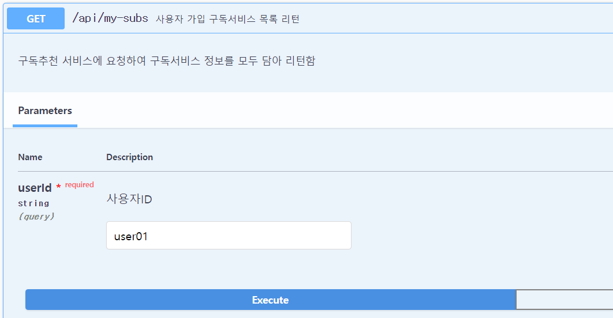
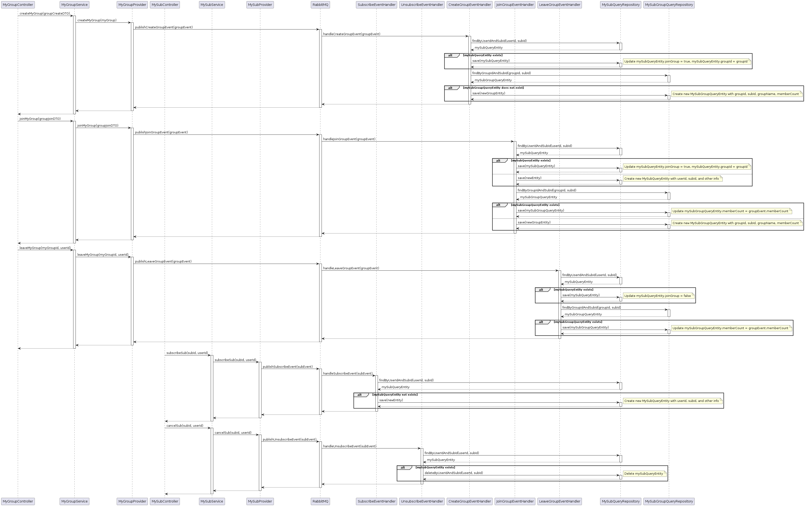
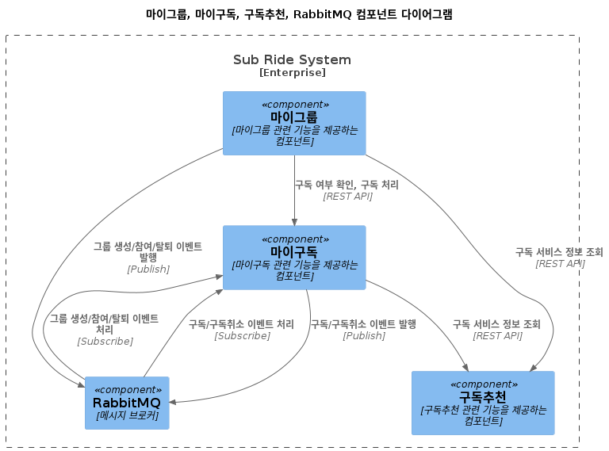
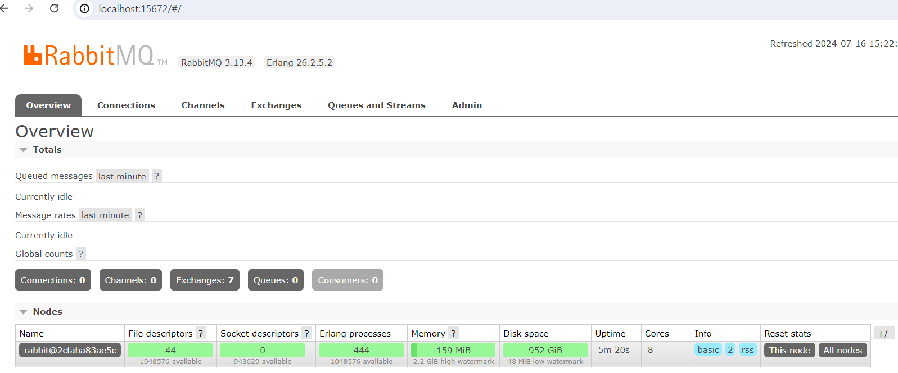
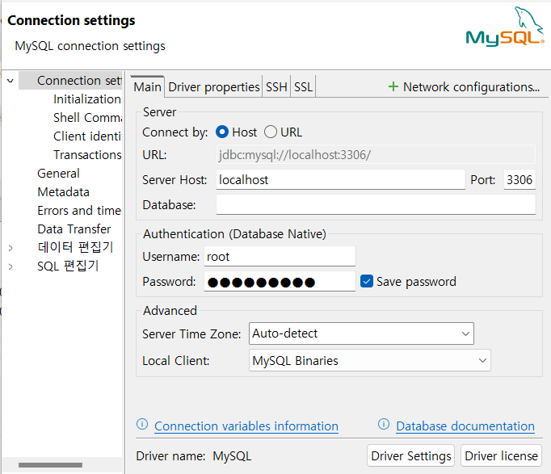
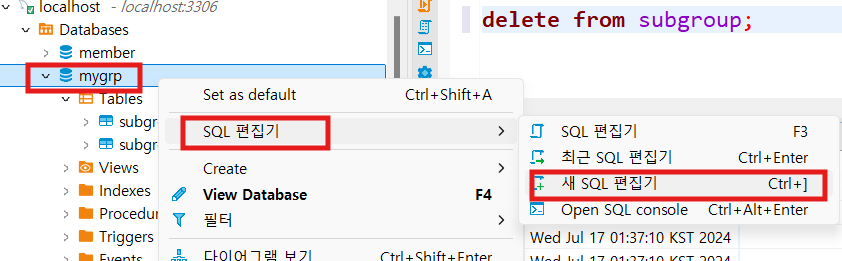
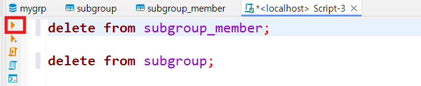

# Event Driven Architecture 실습  
지금까지는 서비스간 동기 통신만 했습니다.  
이번에는 RabbitMQ을 메시지 브로커를 사용하여 비동기 통신을 구현해 보겠습니다.  

비동기 통신으로 바꿀 대상은 '사용자가 가입한 구독서비스 목록을 리턴'하는 API입니다. 


아래 리턴값 예제와 같이 서비스에 대한 정보와 구독그룹 참여여부(joinGroup), 구독비용(payedFee),   
최대절감 가능액(discountedFee)을 리턴합니다.    
```
{
  "code": 200,
  "message": "구독 목록 조회 성공",
  "response": [
    {
      "userId": "user01",
      "subId": 37,
      "subName": "꾸까",
      "categoryName": null,
      "logo": "kukka.png",
      "description": "2주마다 꽃 배달 서비스",
      "fee": 30000,
      "maxShareNum": 3,
      "joinGroup": false,
      "payedFee": 30000,
      "discountedFee": 20000
    },
    {
      "userId": "user01",
      "subId": 20,
      "subName": "런드리고",
      "categoryName": null,
      "logo": "laundrygo.png",
      "description": "빨래구독 서비스",
      "fee": 35000,
      "maxShareNum": 2,
      "joinGroup": true,
      "payedFee": 35000,
      "discountedFee": 0
    },
    {
      "userId": "user01",
      "subId": 35,
      "subName": "미하이 삭스",
      "categoryName": null,
      "logo": "mehi.jpeg",
      "description": "매달 패션 양말 3종 배송",
      "fee": 990,
      "maxShareNum": 3,
      "joinGroup": false,
      "payedFee": 990,
      "discountedFee": 660
    }
  ]
}
```

이를 처리하기 위한 주요 메소드는 MySubProviderImpl의 getMySubList입니다.   
아래 코드에서 보다시피 Feign클라이언트를 이용하여 구독추천과 마이그룹서비스의 API를 호출하고,   
그 결과를 이용하여 조금 복잡한 연산을 하고 있습니다.  
```
@Override
public List<MySubInfoDTO> getMySubList(String userId) {
    List<MySubEntity> mySubEntityList = mySubRepository.findByUserId(userId);
    if (mySubEntityList.isEmpty()) {
        // userId에 해당하는 MySubEntity가 없는 경우 처리
        throw new InfraException(0, "해당 사용자의 구독 정보가 없습니다.");
    }

    List<Long> mySubIds = mySubEntityList.stream()
            .map(MySubEntity::getSubId)
            .collect(Collectors.toList());

    ResponseDTO<List<GroupSummaryDTO>> myGroupListResponse = myGroupFeignClient.getMyGroupList(userId);
    List<GroupSummaryDTO> myGroupList = myGroupListResponse.getResponse();

    ResponseDTO<List<SubInfoDTO>> response = subRecommendFeignClient.getSubInfoListByIds(mySubIds);
    List<SubInfoDTO> subInfoList = response.getResponse();

    return mySubEntityList.stream()
            .map(mySubEntity -> {
                MySubInfoDTO mySubInfoDTO = new MySubInfoDTO();
                mySubInfoDTO.setUserId(mySubEntity.getUserId());
                mySubInfoDTO.setSubId(mySubEntity.getSubId());

                //구독정보 찾기
                SubInfoDTO subInfo = subInfoList.stream()
                        .filter(dto -> dto.getSubId().equals(mySubEntity.getSubId()))
                        .findFirst()
                        .orElse(null);

                if(subInfo != null) {
                    mySubInfoDTO.setSubName(subInfo.getSubName());
                    mySubInfoDTO.setCategoryName(subInfo.getCategoryName());
                    mySubInfoDTO.setLogo(subInfo.getLogo());
                    mySubInfoDTO.setDescription(subInfo.getDescription());
                    mySubInfoDTO.setFee(subInfo.getFee());
                    mySubInfoDTO.setMaxShareNum(subInfo.getMaxShareNum());

                    // joinGroupMemberCountList에서 동일한 subId를 가진 객체 찾기
                    GroupSummaryDTO groupSummaryDTO = myGroupList.stream()
                            .filter(dto -> dto.getSubId().equals(mySubEntity.getSubId()))
                            .findFirst()
                            .orElse(null);

                    if (groupSummaryDTO != null) {
                        mySubInfoDTO.setJoinGroup(true);
                        mySubInfoDTO.setPayedFee(subInfo.getFee() / groupSummaryDTO.getMemberCount());
                        mySubInfoDTO.setDiscountedFee(0L);
                    } else {
                        mySubInfoDTO.setJoinGroup(false);
                        mySubInfoDTO.setPayedFee(subInfo.getFee());
                        mySubInfoDTO.setDiscountedFee(subInfo.getFee() - subInfo.getFee() / subInfo.getMaxShareNum());
                    }
                }
                return mySubInfoDTO;
            })
            .collect(Collectors.toList());
}
```

미리 필요한 정보를 마이구독 서비스가 갖고 있다면 이러한 통신과 복잡한 로직 처리가 필요 없을 겁니다.   
그래서 아래와 같이 비동기 통신을 통해 미리 필요한 정보를 마이구독 서비스가 갖고 있게 하겠습니다.  
   

위 Sequence diagram을 좀 더 단순화하면 아래와 같습니다.   
마이그룹 서비스는 그룹 생성, 참여, 탈퇴시 이벤트를 발행합니다.   
마이구독 서비스는 구독서비스 구독과 취소 시 이벤트를 발행합니다.  
이 이벤트들은 모두 마이구독 서비스가 구독하고 있고 RabbitMQ에서 이벤트 메시지를 받아 처리 합니다.   
   

이렇게 Data Write를 위한 저장소와 Data Read를 위한 저장소를 분리하는 방법을  
CQRS(Command Query Responsibility Segregations) 패턴이라고 합니다.  
마이크로서비스에서는 여러 서비스에 분산되어 있는 데이터중 필요한 데이터만 모아 놓은 조회 테이블을 구성하고   
비동기 통신을 이용하여 조회 테이블을 업데이트하는 CQRS패턴을 많이 사용합니다.  

## 개발 순서  
| Group | Task              | Description               | Link   |
| :-----| :-----------------| :------------------------ | :------|
| 준비 | RabbitMQ 설치 | Docker로 RabbitMQ를 설치 | [Link](#준비--rabbitmq-설치)  |
|      | 애플리케이션 설정에 RabbitMQ 연결 설정 | Config저장소에 추가 | [Link](#준비--애플리케이션-설정에-rabbitmq-연결-설정)  |
| 개발 | Event 메시지 객체 개발 | Event 메시지를 설계하고 Event객체를 개발 | [Link](#개발--event-메시지-객체-개발)  |
|  | RabbitMQ 환경 설정 | 마이구독 서비스에 RabbitMQ 환경설정 클래스 추가하여 Queue생성 | [Link](#개발--rabbitmq-환경-설정)  |
|  | View 모델 개발 | 구독정보 View Model 설계 및 개발 | [Link](#개발--view-모델-개발)  |
|  | 이벤트 발행 클래스 개발 | 마이그룹과 마이구독 서비스에 이벤트 발행 클래스 개발 | [Link](#개발--이벤트-발행-클래스-개발)  |
|  | 이벤트 발행 처리 | 마이그룹과 마이구독 서비스에 이벤트 발행 처리를 추가 | [Link](#개발--이벤트-발행-처리)  |
|  | 이벤트 처리 클래스 개발 | 마이구독 서비스에 이벤트 처리 클래스를 개발 | [Link](#개발--이벤트-처리-클래스-개발)  |
|  | 구독추천 SecurityConfig 수정 | 구독서비스 정보 API를 무인증으로 접근하도록 수정 | [Link](#개발--구독추천-securityconfig-수정)  |
|  | 조회테이블 이용 API 추가 | 조회 테이블을 이용하여 구독정보를 리턴하는 API 추가 | [Link](#개발--조회테이블-이용-api-추가)  |
|  | 프론트엔드 수정 | 새 API를 호출하도록 수정 | [Link](#개발--프론트엔드-수정)  |
| 테스트 | CQRS 테스트 | CQRS 패턴 동작 테스트 | [Link](#테스트--cqrs-테스트)  |
| 저장 | Git Push | 원격 Git 저장소에 푸시 | [Link](#저장--git-푸시)  |

---

## 준비 > RabbitMQ 설치  
아래 명령으로 RabbitMQ를 설치 합니다.   
```
docker run -d --name rabbitmq -p 5672:5672 -p 15672:15672 -e RABBITMQ_DEFAULT_USER=guest -e RABBITMQ_DEFAULT_PASS=guest rabbitmq:management-alpine 
```

실행이 된 후 웹브라우저에서 http://localhost:15672로 접근합니다.  
로그인은 ID와 암호 모두 guest를 입력하면 됩니다.  로그인 후 아래 화면이 나오면 잘 설치된겁니다.   
  

| [Top](#개발-순서) |

---

## 준비 > 애플리케이션 설정에 RabbitMQ 연결 설정 
RabbitMQ와 인터페이스하는 서비스는 마이그룹과 마이구독 서비스입니다.   
두 서비스의 애플리케이션 설정에 RabbitMQ 연결 설정을 추가합니다.   
Git Config 저장소 수정을 위해 vscode에서 '홈/workspace/subride-config'디렉토리를 여십시오.   

mygrp-service/application.yml에 아래와 같이 rabbitmq 설정을 추가 합니다.  
```
spring:
  rabbitmq:
    host: ${RABBITMQ_HOST}
    port: ${RABBITMQ_PORT}
    username: ${RABBITMQ_USERNAME}
    password: ${RABBITMQ_PASSWORD}

```

mysub-service/application.yml에 아래와 같이 rabbitmq 설정을 추가 합니다.  
마이구독 서비스는 이벤트 메시지를 역직렬화(JSON문자열을 논리적 객체로 변환)해서 Event 객체를 만들어야 합니다.  
이를 위해 역직렬화를 허용할 객체를 지정해야 합니다.   
우리는 common프로젝트의 com.subride.common.event 패키지 하위에 이벤트 메시지를 위한 Event 객체를 만들겁니다.  
따라서 아래와 같이 지정하면 됩니다.   
```
spring:
  rabbitmq:
    host: ${RABBITMQ_HOST}
    port: ${RABBITMQ_PORT}
    username: ${RABBITMQ_USERNAME}
    password: ${RABBITMQ_PASSWORD}
    permitted-list-patterns:    #수신된 Event의 역직렬화를 허용할 객체 지정
      - com.subride.common.event.*
```

사용된 환경변수들의 값을 common/application.properties파일에 추가합니다.   
```
#RabbitMQ
RABBITMQ_HOST=localhost
RABBITMQ_PORT=5672
RABBITMQ_USERNAME=guest
RABBITMQ_PASSWORD=guest
```

| [Top](#개발-순서) |

---

## 개발 > Event 메시지 객체 개발
Event 메시지를 설계하고 Event 클래스를 추가합니다.   
이 Event 클래스는 이벤트 발행 서비스와 소비 서비스 모두 사용하므로 common 프로젝트에 만듭니다.  

먼저 마이그룹 서비스에서 발행하는 이벤트는 그룹생성, 그룹참여, 그룹탈퇴입니다.   
common프로젝트에 com.subride.common 밑에 event라는 패키지를 만듭니다.  
그 하위에 GroupEvent 클래스를 아래와 같이 작성합니다.  
> 주의: Event 클래스는 반드시 'implements Serializable'을 붙여야 함   

```
package com.subride.common.event;

import lombok.Getter;
import lombok.Setter;

import java.io.Serializable;

/*
Event객체는 Serializable 인터페이스 반드시 필요
 */
@Getter
@Setter
public class GroupEvent implements Serializable {
    private String type;
    private String messageId;
    private String timestamp;
    private GroupEventPayload payload;

    @Getter
    @Setter
    public static class GroupEventPayload implements Serializable {
        private String userId;
        private Long groupId;
        private String groupName;
        private int memberCount;
        private Long subId;
    }
}
```

다음으로 마이구독 서비스는 서비스 구독과 구독 취소 이벤트를 발행합니다.   
com.subride.common.event 패키지 밑에 아래 내용으로 SubEvent 클래스를 만듭니다.  
```
package com.subride.common.event;

import lombok.Getter;
import lombok.Setter;

import java.io.Serializable;

/*
Event객체는 Serializable 인터페이스 반드시 필요
 */
@Getter
@Setter
public class SubEvent implements Serializable {
    private String type;
    private String messageId;
    private String timestamp;
    private SubEventPayload payload;

    @Getter
    @Setter
    public static class SubEventPayload implements  Serializable {
        private String userId;
        private Long subId;
    }
}
```

| [Top](#개발-순서) |

---

## 개발 > RabbitMQ 환경 설정 
마이구독 서비스에 RabbitMQ 환경 설정 클래스를 작성합니다.   
이 클래스에서는 RabbitMQ 서버 연결, 이벤트 발행 객체, Queue를 생성합니다.   

그전에 RabbitMQ 라이브러리부터 마이구독서비스의 build.gradle에 추가 합니다.  
```
dependencies {
    implementation project(':common')
    implementation project(':mysub:mysub-biz')

    //-- OpenFeign Client: Blocking방식의 Http Client
    implementation 'org.springframework.cloud:spring-cloud-starter-openfeign'

    //-- RabbitMQ
    implementation 'org.springframework.boot:spring-boot-starter-amqp'
}
```

com.subride.mysub.infra.common.config 패키지 밑에 RabbitMQConfig 클래스를 추가합니다.  
```
package com.subride.mysub.infra.common.config;

import org.springframework.amqp.core.*;
import org.springframework.amqp.rabbit.connection.CachingConnectionFactory;
import org.springframework.amqp.rabbit.connection.ConnectionFactory;
import org.springframework.amqp.rabbit.core.RabbitTemplate;
import org.springframework.amqp.support.converter.Jackson2JsonMessageConverter;
import org.springframework.amqp.support.converter.MessageConverter;
import org.springframework.beans.factory.annotation.Value;
import org.springframework.context.annotation.Bean;
import org.springframework.context.annotation.Configuration;

/*
RabbitMQ 컨테이너 배포
docker run -d --name rabbitmq -p 5672:5672 -p 15672:15672 -e RABBITMQ_DEFAULT_USER=guest -e RABBITMQ_DEFAULT_PASS=guest rabbitmq:3.11-management
관리자 콘솔 접근: localhost:15672
*/
@Configuration
@SuppressWarnings("unused")
public class RabbitMQConfig {
    @Value("${spring.rabbitmq.host}")
    private String host;

    @Value("${spring.rabbitmq.username}")
    private String username;

    @Value("${spring.rabbitmq.password}")
    private String password;

    @Value("${spring.rabbitmq.port}")
    private int port;


    @Bean
    ConnectionFactory connectionFactory() {
        CachingConnectionFactory connectionFactory = new CachingConnectionFactory();
        connectionFactory.setHost(host);
        connectionFactory.setPort(port);
        connectionFactory.setUsername(username);
        connectionFactory.setPassword(password);
        return connectionFactory;
    }

    @Bean
    MessageConverter messageConverter() {
        return new Jackson2JsonMessageConverter();
    }

    @Bean
    RabbitTemplate rabbitTemplate(ConnectionFactory connectionFactory, MessageConverter messageConverter) {
        RabbitTemplate rabbitTemplate = new RabbitTemplate(connectionFactory);
        rabbitTemplate.setMessageConverter(messageConverter);
        return rabbitTemplate;
    }

    //------------- 메시지 Exchange -----------
    @Bean
    public Exchange eventExchange() {
        return new TopicExchange("sub-event-exchange");
    }
    @Bean
    public DirectExchange subDlxExchange() {
        return new DirectExchange("sub-dlx-exchange");
    }
    //---------------------------------------

    //------------ 구독가입 이벤트 Queue --------------
    @Bean
    public Queue subscribeQueue() {
        return QueueBuilder.durable("subscribe-queue")
                .withArgument("x-dead-letter-exchange", "sub-dlx-exchange")
                .withArgument("x-dead-letter-routing-key", "subscribe-queue.dlx")
                .build();
    }

    @Bean
    public Queue subscribeDlxQueue() {
        return QueueBuilder.durable("subscribe-dlx-queue").build();
    }

    @Bean
    public Binding subscribeBinding(Queue subscribeQueue, TopicExchange eventExchange) {
        return BindingBuilder.bind(subscribeQueue).to(eventExchange).with("subscribe.#");
    }

    @Bean
    public Binding subscribeDlxBinding() {
        return BindingBuilder.bind(subscribeDlxQueue()).to(subDlxExchange()).with("subscribe-queue.dlx");
    }
    //----------------------------------------------

    //------------ 구독취소 이벤트 Queue -------------
    @Bean
    public Queue unsubscribeQueue() {
        return QueueBuilder.durable("unsubscribe-queue")
                .withArgument("x-dead-letter-exchange", "sub-dlx-exchange")
                .withArgument("x-dead-letter-routing-key", "unsubscribe-queue.dlx")
                .build();
    }

    @Bean
    public Queue unsubscribeDlxQueue() {
        return QueueBuilder.durable("unsubscribe-dlx-queue").build();
    }

    @Bean
    public Binding unsubscribeBinding(Queue unsubscribeQueue, TopicExchange eventExchange) {
        return BindingBuilder.bind(unsubscribeQueue).to(eventExchange).with("unsubscribe.#");
    }

    @Bean
    public Binding unsubscribeDlxBinding() {
        return BindingBuilder.bind(unsubscribeDlxQueue()).to(subDlxExchange()).with("unsubscribe-queue.dlx");
    }
    //----------------------------------------------

    //------------ 그룹 생성 이벤트 Queue ------------
    @Bean
    public Queue createGroupQueue() {
        return QueueBuilder.durable("create-group-queue")
                .withArgument("x-dead-letter-exchange", "sub-dlx-exchange")
                .withArgument("x-dead-letter-routing-key", "create-group-queue.dlx")
                .build();
    }

    @Bean
    public Queue createGroupDlxQueue() {
        return QueueBuilder.durable("create-group-dlx-queue").build();
    }

    @Bean
    public Binding createGroupBinding(Queue createGroupQueue, TopicExchange eventExchange) {
        return BindingBuilder.bind(createGroupQueue).to(eventExchange).with("create.group.#");
    }

    @Bean
    public Binding createGroupDlxBinding() {
        return BindingBuilder.bind(createGroupDlxQueue()).to(subDlxExchange()).with("create-group-queue.dlx");
    }
    //--------------------------------------------

    //------------- 그룹 참여 이벤트 Quee -----------0
    @Bean
    public Queue joinGroupQueue() {
        return QueueBuilder.durable("join-group-queue")
                .withArgument("x-dead-letter-exchange", "sub-dlx-exchange")
                .withArgument("x-dead-letter-routing-key", "join-group-queue.dlx")
                .build();
    }

    @Bean
    public Queue joinGroupDlxQueue() {
        return QueueBuilder.durable("join-group-dlx-queue").build();
    }

    @Bean
    public Binding joinGroupBinding(Queue joinGroupQueue, TopicExchange eventExchange) {
        return BindingBuilder.bind(joinGroupQueue).to(eventExchange).with("join.group.#");
    }

    @Bean
    public Binding joinGroupDlxBinding() {
        return BindingBuilder.bind(joinGroupDlxQueue()).to(subDlxExchange()).with("join-group-queue.dlx");
    }
    //-------------------------------------------

    //------------- 그룹 탈퇴 이벤트 Queue ----------
    @Bean
    public Queue leaveGroupQueue() {
        return QueueBuilder.durable("leave-group-queue")
                .withArgument("x-dead-letter-exchange", "sub-dlx-exchange")
                .withArgument("x-dead-letter-routing-key", "leave-group-queue.dlx")
                .build();
    }

    @Bean
    public Queue leaveGroupDlxQueue() {
        return QueueBuilder.durable("leave-group-dlx-queue").build();
    }

    @Bean
    public Binding leaveGroupBinding(Queue leaveGroupQueue, TopicExchange eventExchange) {
        return BindingBuilder.bind(leaveGroupQueue).to(eventExchange).with("leave.group.#");
    }

    @Bean
    public Binding leaveGroupDlxBinding() {
        return BindingBuilder.bind(leaveGroupDlxQueue()).to(subDlxExchange()).with("leave-group-queue.dlx");
    }
    //---------------------------------------------------

}
```

아래 부분이 RabbitMQ에 연결하고 RabbitMQ에 메시지를 발송하는 rabbitTemplate객체를 만드는 부분입니다.   
메시지 발송을 위해 직렬화(이벤트 객체를 JSON으로 변환)해야 하기 때문에 이를 위한 변환 메소드로 정의해야 합니다.   
> **참고: @Bean 어노테이션**   
> @Bean어노테이션을 붙인 메소드는 Spring IoC(Inversion Of Control) 컨테이너에 등록이 되어  
> 애플리케이션 실행 시 자동으로 객체가 생성됩니다.  
> 예를 들어 바로 아래 connectionFactory메소드가 Bean 메소드이기 때문에   
> 메소드명인 connectionFactory라는 객체가 애플리케이션 실행 시에 생성됩니다.  

```
@Bean
ConnectionFactory connectionFactory() {
    CachingConnectionFactory connectionFactory = new CachingConnectionFactory();
    connectionFactory.setHost(host);
    connectionFactory.setPort(port);
    connectionFactory.setUsername(username);
    connectionFactory.setPassword(password);
    return connectionFactory;
}

@Bean
MessageConverter messageConverter() {
    return new Jackson2JsonMessageConverter();
}

@Bean
RabbitTemplate rabbitTemplate(ConnectionFactory connectionFactory, MessageConverter messageConverter) {
    RabbitTemplate rabbitTemplate = new RabbitTemplate(connectionFactory);
    rabbitTemplate.setMessageConverter(messageConverter);
    return rabbitTemplate;
}
```

RabbitMQ는 중계기(Exchanger)가 Queue를 할당하는 방식입니다.   
sub-event-exchange는 Event 메시지 안에 있는 Routing key의 prefix에 따라 Queue를 할당하는  
Topic Exchange 방식으로 분배 하도록 했습니다.   
저는 Routing key prefix에 이벤트 타입이 오도록 했습니다. 
예를 들어 'create.group.{메시지ID}'나 'join.group.{메시지ID}'와 같은 식입니다.   
이렇게 이벤트 타입에 따라 같은 타입의 이벤트는 같은 Queue에 할당함으로써 처리 순서 보장을 하였습니다. 
각 이벤트 타입별로 Queue가 하나이기 때문에 이렇게 하면 처리 순서 보장이 됩니다.  
만약 이벤트 타입별로 Queue를 여러개 만든다면 메시지ID를 Hashing하여 Queue를 할당해야 처리순서 보장이 됩니다.   

'sub-dlx-exchange' 중계기는 DLX(Dead Letter Exchange)는 문제가 발생한 이벤트 메시지를 별도의 DLX Queue로 보냅니다.   
이는 중복 처리 방지를 위해 사용합니다.   
RabbitMQ는 이벤트 처리 중 문제가 발생하면 Queue로 메시지를 반환 하고 주기적으로 다시 처리하도록 합니다.  
이때문에 중복 처리가 생길 수 있고, 계속 처리 실패 메시지가 콘솔을 가득 채우는 현상도 벌어집니다.   
그래서 DLX를 만들고 DLX Queue를 만들어 문제가 발생한 이벤트는 DLX Queue로 보내는 것이 필요합니다.   
DLX Queue의 메시지는 수동으로 처리하거나 다른 클래스에서 처리하는 로직을 만들어야 합니다.  
```

//------------- 메시지 Exchange -----------
@Bean
public Exchange eventExchange() {
    return new TopicExchange("sub-event-exchange");
}
@Bean
public DirectExchange subDlxExchange() {
    return new DirectExchange("sub-dlx-exchange");
}
//---------------------------------------

```

각 이벤트 타입별로 Queue와 DLX Queue만들고 중계기(Exchange)와 연결하는 부분입니다.   
Queue 'subscribeQueue'는 Topic Exchange 'eventExchange'에 'subscribe.#'형식의 라우팅 key로 연결이 됩니다.  
DLX(Dead Letter Exchange) Queue 'subscribeDlxQueue'는 Direct Exchange 'subDlxExchange'에   
'subscribe-queue.dlx' 라우팅 Key로 연결이 됩니다.   

```
//------------ 구독가입 이벤트 Queue --------------
@Bean
public Queue subscribeQueue() {
    return QueueBuilder.durable("subscribe-queue")
            .withArgument("x-dead-letter-exchange", "sub-dlx-exchange")
            .withArgument("x-dead-letter-routing-key", "subscribe-queue.dlx")
            .build();
}
@Bean
public Binding subscribeBinding(Queue subscribeQueue, TopicExchange eventExchange) {
    return BindingBuilder.bind(subscribeQueue).to(eventExchange).with("subscribe.#");
}

@Bean
public Queue subscribeDlxQueue() {
    return QueueBuilder.durable("subscribe-dlx-queue").build();
}
@Bean
public Binding subscribeDlxBinding() {
    return BindingBuilder.bind(subscribeDlxQueue()).to(subDlxExchange()).with("subscribe-queue.dlx");
}
//----------------------------------------------

```

| [Top](#개발-순서) |

---

## 개발 > View 모델 개발
이벤트 메시지를 처리하여 데이터를 저장할 View 테이블의 구조를 설계하고 개발합니다.   
API의 리턴 객체인 MySubDTO의 필드의 값을 이 View 모델에서 조회하여 리턴되도록 설계 합니다.  
저는 구독그룹 View Model과 구독정보 View Model로 나누어서 설계 했습니다. 

먼저 com.subride.mysub.infra.out.entity 패키지 밑에 구독그룹 View model인 MySubGroupQueryEntity를 만드십시오.  
```
package com.subride.mysub.infra.out.entity;

import jakarta.persistence.*;
import lombok.*;

@Entity
@Table(name = "my_sub_group_query", uniqueConstraints = {
        @UniqueConstraint(columnNames = {"groupId", "subId"})
})
@Getter
@Setter
@Builder
@NoArgsConstructor
@AllArgsConstructor
public class MySubGroupQueryEntity {
    @Id
    @GeneratedValue(strategy = GenerationType.IDENTITY)
    private Long id;
    private Long groupId;
    private Long subId;
    private String groupName;
    private int memberCount;
}
```

같은 패키지에 구독정보 view model인 MySubQueryEntity를 만드십시오.  
```
package com.subride.mysub.infra.out.entity;

import jakarta.persistence.*;
import lombok.*;

@Entity
@Table(name = "my_sub_query", uniqueConstraints = {
        @UniqueConstraint(columnNames = {"userId", "subId"})
})
@Getter
@Setter
@Builder
@NoArgsConstructor
@AllArgsConstructor
public class MySubQueryEntity {
    @Id
    @GeneratedValue(strategy = GenerationType.IDENTITY)
    private Long id;

    private String userId;
    private Long subId;
    private String subName;
    private String categoryName;
    private String logo;
    private String description;
    private Long fee;
    private int maxShareNum;
    private boolean joinGroup;
    private Long groupId;
}
```

위 Entity를 위한 repository 클래스를 만듭니다.   

package 'com.subride.mysub.infra.out.repo' 밑에 IMySubGroupQueryRepository을 만듭니다.  
```
package com.subride.mysub.infra.out.repo;

import com.subride.mysub.infra.out.entity.MySubGroupQueryEntity;
import org.springframework.data.jpa.repository.JpaRepository;

import java.util.Optional;

public interface IMySubGroupQueryRepository extends JpaRepository<MySubGroupQueryEntity, Long> {
    Optional<MySubGroupQueryEntity> findByGroupIdAndSubId(Long groupId, Long subId);

}
```

구독정보 repository interface 'IMySubQueryRepository'도 만듭니다.  
메소드 'getMySubInfoList'는 JPQL(Java Persistent Query Language)로 구독그룹 view와 구독정보 view를 join하여  
'SubQueryInfoDTO' 객체를 리턴합니다.  

```
package com.subride.mysub.infra.out.repo;

import com.subride.mysub.infra.dto.SubQueryInfoDTO;
import com.subride.mysub.infra.out.entity.MySubQueryEntity;
import org.springframework.data.jpa.repository.JpaRepository;
import org.springframework.data.jpa.repository.Query;
import org.springframework.data.repository.query.Param;

import java.util.List;
import java.util.Optional;

public interface IMySubQueryRepository extends JpaRepository<MySubQueryEntity, Long> {
    Optional<MySubQueryEntity> findByUserIdAndSubId(String userId, Long subId);
    void deleteByUserIdAndSubId(String userId, Long subId);

    /*
    JPQL 이용한 나의 구독서비스 리스트 리턴
    주의)
    - SubQueryInfoDTO에 모든 인자를 갖는 생성자가 있어야 함(@AllArgsConstructor 이용)
    - 필드의 이름과 순서는 SubQueryInfoDTO과 동일해야 함
    - MySubGroupQueryEntity에 join할 데이터가 없으면 null값이 됨.
      memberCount는 integer이기 때문에 이 경우 에러가 발생함. COALESCE함수로 null이면 0을 리턴하도록 함
    */
    @Query("SELECT new com.subride.mysub.infra.dto.SubQueryInfoDTO(" +
            "s.userId, s.subId, s.subName, s.categoryName, s.logo, " +
            "s.description, s.fee, s.maxShareNum, s.joinGroup, COALESCE(g.memberCount, 0)) " +
            "FROM MySubQueryEntity s " +
            "LEFT JOIN com.subride.mysub.infra.out.entity.MySubGroupQueryEntity g " +
            "ON s.groupId = g.groupId AND s.subId = g.subId " +
            "WHERE s.userId = :userId")
    List<SubQueryInfoDTO> getMySubInfoList(@Param("userId") String userId);

}
```

위 JPQL에서 생성되는 SubQueryInfoDTO 클래스를 만듭니다.   
package com.subride.mysub.infra 밑에 'dto' 패키지를 만들고 아래 내용으로 만듭니다.  
```
package com.subride.mysub.infra.dto;

import lombok.AllArgsConstructor;
import lombok.Getter;
import lombok.Setter;

@Getter
@Setter
@AllArgsConstructor
public class SubQueryInfoDTO {
    private String userId;
    private Long subId;
    private String subName;
    private String categoryName;
    private String logo;
    private String description;
    private Long fee;
    private int maxShareNum;
    private boolean joinGroup;
    private int memberCount;
}
```

| [Top](#개발-순서) |

---

## 개발 > 이벤트 발행 클래스 개발
마이그룹과 마이구독 서비스에 이벤트 발행 클래스를 추가합니다.   

먼저 마이그룹에 이벤트 발행 클래스를 추가합니다.  
그 전에 마이그룹의 build.gradle에도 RabbitMQ 라이브러리를 추가합니다.  
```
dependencies {
    implementation project(':common')
    implementation project(':mygrp:mygrp-biz')

    //-- OpenFeign Client: Blocking방식의 Http Client
    implementation 'org.springframework.cloud:spring-cloud-starter-openfeign'

    //-- RabbitMQ
    implementation 'org.springframework.boot:spring-boot-starter-amqp'

}
```

com.subride.mygrp.infra밑에 event 패키지를 추가하고, 아래 내용으로 EventPublisher 클래스를 만듭니다.  
구독그룹 생성, 참여, 탈퇴 시 이벤트를 발행하는 메소드를 구현 했습니다.  
```
// File: mysub/mysub-infra/src/main/java/com/subride/mysub/infra/event/EventPublisher.java
package com.subride.mygrp.infra.event;

import com.subride.common.event.GroupEvent;
import jakarta.annotation.PostConstruct;
import lombok.RequiredArgsConstructor;
import org.springframework.amqp.rabbit.core.RabbitTemplate;
import org.springframework.amqp.support.converter.Jackson2JsonMessageConverter;
import org.springframework.stereotype.Component;

@Component
@RequiredArgsConstructor
public class EventPublisher {
    private final RabbitTemplate rabbitTemplate;

    @PostConstruct
    public void init() {
        //-- 메시지를 Json 형식으로 변환하기 위함
        rabbitTemplate.setMessageConverter(new Jackson2JsonMessageConverter());
    }

    public void publishCreateGroupEvent(GroupEvent groupEvent) {
        rabbitTemplate.convertAndSend("sub-event-exchange", "create.group." + groupEvent.getMessageId(), groupEvent);
    }

    public void publishJoinGroupEvent(GroupEvent groupEvent) {
        rabbitTemplate.convertAndSend("sub-event-exchange", "join.group." + groupEvent.getMessageId(), groupEvent);
    }

    public void publishLeaveGroupEvent(GroupEvent groupEvent) {
        rabbitTemplate.convertAndSend("sub-event-exchange", "leave.group." + groupEvent.getMessageId(), groupEvent);
    }

}
```

다음으로 마이구독 서비스에도 이벤트 발행 메소드를 추가합니다.  
'com.subride.mysub.infra' 밑에 'event' 패키지를 추가하고 EventPublisher 클래스를 작성합니다.  

```
// File: mysub/mysub-infra/src/main/java/com/subride/mysub/infra/event/EventPublisher.java
package com.subride.mysub.infra.event;

import com.subride.common.event.SubEvent;
import lombok.RequiredArgsConstructor;
import org.springframework.amqp.rabbit.core.RabbitTemplate;
import org.springframework.stereotype.Component;

@Component
@RequiredArgsConstructor
public class EventPublisher {

    private final RabbitTemplate rabbitTemplate;

    public void publishSubscribeEvent(SubEvent subEvent) {
        rabbitTemplate.convertAndSend("sub-event-exchange", "subscribe." + subEvent.getMessageId(), subEvent);
    }

    public void publishUnsubscribeEvent(SubEvent subEvent) {
        rabbitTemplate.convertAndSend("sub-event-exchange", "unsubscribe." + subEvent.getMessageId(), subEvent);
    }

    // ... 다른 이벤트 Publishing 메서드 ...
}
```

| [Top](#개발-순서) |

---

## 개발 > 이벤트 발행 처리
마이그룹과 마이구독 서비스에 이벤트 발행 처리를 추가 합니다.   

- **마이그룹 서비스에 이벤트 발행 추가**    
  패키지 'com.subride.mygrp.infra.out.adapter'의 MyGroupProviderImpl 클래스에 추가합니다.  

  위쪽 프라퍼티에 eventPublisher를 추가 합니다.  
  ```
  private final EventPublisher eventPublisher;
  ```

  createMyGroup 메소드에 @Transactional 어노테이션을 붙이고 이벤트 발행 처리를 추가합니다.  
  ```
  @Override
  @Transactional
  public String createMyGroup(Group myGroup) {
      if(myGroupRepository.existsByGroupNameAndSubId(myGroup.getGroupName(), myGroup.getSubId())) {
          throw new InfraException(0, "이미 등록된 그룹입니다.");
      }
      GroupEntity groupEntity = GroupEntity.fromDomain(myGroup);
      myGroupRepository.save(groupEntity);


      // Publish create group event
      GroupEvent groupEvent = new GroupEvent();
      groupEvent.setType("CreateGroup");
      groupEvent.setMessageId(UUID.randomUUID().toString());
      groupEvent.setTimestamp(LocalDateTime.now().toString());
      GroupEvent.GroupEventPayload payload = new GroupEvent.GroupEventPayload();
      payload.setUserId(myGroup.getLeaderId());
      payload.setGroupId(groupEntity.getGroupId());
      payload.setGroupName(myGroup.getGroupName());
      payload.setSubId(groupEntity.getSubId());
      payload.setMemberCount(1);
      groupEvent.setPayload(payload);
      eventPublisher.publishCreateGroupEvent(groupEvent);


      return groupEntity.getInviteCode();
  }
  ```

  joinGroup 메소드에도 이벤트 발행 처리를 추가합니다.  
  ```
  @Override
  @Transactional
  public void joinMyGroup(GroupJoinDTO groupJoinDTO) {
      GroupEntity groupEntity = myGroupRepository.findByInviteCode(groupJoinDTO.getInviteCode())
              .orElseThrow(() -> new InfraException(0, "초대코드에 해당하는 썹그룹이 없습니다."));

      if (groupEntity.getMemberIds().contains(groupJoinDTO.getUserId())) {
          throw new InfraException(0, "이미 썹그룹에 참석하였습니다.");
      }

      groupEntity.getMemberIds().add(groupJoinDTO.getUserId());
      myGroupRepository.save(groupEntity);

      // Publish join group event
      GroupEvent groupEvent = new GroupEvent();
      groupEvent.setType("JoinGroup");
      groupEvent.setMessageId(UUID.randomUUID().toString());
      groupEvent.setTimestamp(LocalDateTime.now().toString());
      GroupEvent.GroupEventPayload payload = new GroupEvent.GroupEventPayload();
      payload.setUserId(groupJoinDTO.getUserId());
      payload.setGroupId(groupEntity.getGroupId());
      payload.setSubId(groupEntity.getSubId());
      payload.setMemberCount(groupEntity.getMemberIds().size());
      groupEvent.setPayload(payload);

      eventPublisher.publishJoinGroupEvent(groupEvent);

      // 사용자가 그룹의 구독서비스에 가입되어 있지 않으면 구독서비스 가입 처리
      if (!isSubscribed(groupJoinDTO.getUserId(), groupEntity.getSubId())) {
          if(!subscribeSub(groupEntity.getSubId(), groupJoinDTO.getUserId())) {
              throw new InfraException(0, "구독서비스 가입 처리중 오류가 발생하였습니다.");
          }
      }
  }
  ```

  leaveGroup에도 이벤트 발행 처리를 추가합니다.  
  ```
    @Override
    @Transactional
    public void leaveMyGroup(Long groupId, String userId) {
        GroupEntity groupEntity = myGroupRepository.findById(groupId)
                .orElseThrow(() -> new InfraException(0, "썹 그룹을 찾을 수 없습니다."));

        groupEntity.getMemberIds().remove(userId);
        myGroupRepository.save(groupEntity);

        // Publish leave group event
        GroupEvent groupEvent = new GroupEvent();
        groupEvent.setType("LeaveGroup");
        groupEvent.setMessageId(UUID.randomUUID().toString());
        groupEvent.setTimestamp(LocalDateTime.now().toString());
        GroupEvent.GroupEventPayload payload = new GroupEvent.GroupEventPayload();
        payload.setUserId(userId);
        payload.setGroupId(groupId);
        payload.setSubId(groupEntity.getSubId());
        payload.setMemberCount(groupEntity.getMemberIds().size());
        groupEvent.setPayload(payload);

        eventPublisher.publishLeaveGroupEvent(groupEvent);
    }
  ```

  - **마이구독 서비스에 이벤트 발행 추가**   
    패키지 'com.subride.mysub.infra.out.adapter'의 'MySubProviderImpl'클래스에 추가 합니다.  

    위쪽 프라퍼티에 eventPublisher를 추가합니다.  
    ```
    private final EventPublisher eventPublisher;
    ```    

    subscribeSub 메소드를 수정합니다.  
    ```
    @Override
    @Transactional
    public void subscribeSub(Long subId, String userId) {

        MySubEntity mySubEntity = MySubEntity.builder()
                .userId(userId)
                .subId(subId)
                .build();
        mySubRepository.save(mySubEntity);

        // Publish subscribe event
        SubEvent subEvent = new SubEvent();
        subEvent.setType("Subscribe");
        subEvent.setMessageId(UUID.randomUUID().toString());
        subEvent.setTimestamp(LocalDateTime.now().toString());
        SubEvent.SubEventPayload payload = new SubEvent.SubEventPayload();
        payload.setUserId(userId);
        payload.setSubId(subId);
        subEvent.setPayload(payload);

        eventPublisher.publishSubscribeEvent(subEvent);
    }
    ```

    cancelSub 메소드를 수정합니다.   
    ```
    @Override
    @Transactional
    public void cancelSub(Long subId, String userId) {
        MySubEntity mySubEntity = mySubRepository.findByUserIdAndSubId(userId, subId)
                .orElseThrow(() -> new InfraException("구독 정보가 없습니다."));

        ResponseDTO<List<Long>> response = myGroupFeignClient.getJoinSubIds(userId);
        List<Long> joinSubIds = response.getResponse();

        // joinGroupMemberCountList에서 해당 subId를 가진 그룹이 있는지 확인
        boolean isJoinedGroup = joinSubIds.contains(subId);

        if (isJoinedGroup) {
            throw new InfraException(0, "썹 그룹에 참여중인 서비스는 가입취소 할 수 없습니다.");
        }

        mySubRepository.delete(mySubEntity);

        // Publish unsubscribe event
        SubEvent subEvent = new SubEvent();
        subEvent.setType("Unsubscribe");
        subEvent.setMessageId(UUID.randomUUID().toString());
        subEvent.setTimestamp(LocalDateTime.now().toString());
        SubEvent.SubEventPayload payload = new SubEvent.SubEventPayload();
        payload.setUserId(userId);
        payload.setSubId(subId);
        subEvent.setPayload(payload);

        eventPublisher.publishUnsubscribeEvent(subEvent);
    }
    ```

| [Top](#개발-순서) |

---

## 개발 > 이벤트 처리 클래스 개발
마이그룹의 구독그룹 생성, 참여, 탈퇴에 대한 이벤트와 마이구독의 구독과 구독취소 이벤트에 대한 처리 클래스를 작성합니다.  

- **구독그룹 서비스 이벤트 처리 클래스 개발**   
  - **구독그룹 생성 이벤트 처리**   
    패키지 'com.subride.mysub.infra.event'밑에 'CreateGroupEventHandler'클래스를 작성합니다.  
    ```
    // File: mysub/mysub-infra/src/main/java/com/subride/mysub/infra/event/CreateGroupEventHandler.java
    package com.subride.mysub.infra.event;

    import com.subride.common.event.GroupEvent;
    import com.subride.mysub.infra.out.entity.MySubGroupQueryEntity;
    import com.subride.mysub.infra.out.entity.MySubQueryEntity;
    import com.subride.mysub.infra.out.repo.IMySubGroupQueryRepository;
    import com.subride.mysub.infra.out.repo.IMySubQueryRepository;
    import lombok.RequiredArgsConstructor;
    import lombok.extern.slf4j.Slf4j;
    import org.springframework.amqp.AmqpRejectAndDontRequeueException;
    import org.springframework.amqp.rabbit.annotation.RabbitListener;
    import org.springframework.stereotype.Component;
    import org.springframework.transaction.annotation.Transactional;

    @Slf4j
    @Component
    @RequiredArgsConstructor
    public class CreateGroupEventHandler {
        private final IMySubQueryRepository mySubQueryRepository;
        private final IMySubGroupQueryRepository mySubGroupQueryRepository;

        @RabbitListener(queues = "create-group-queue")
        @Transactional
        public void handleCreateGroupEvent(GroupEvent groupEvent) {
            try {
                String userId = groupEvent.getPayload().getUserId();
                Long subId = groupEvent.getPayload().getSubId();
                Long groupId = groupEvent.getPayload().getGroupId();

                MySubQueryEntity entity = mySubQueryRepository.findByUserIdAndSubId(userId, subId).orElse(null);
                MySubGroupQueryEntity groupEntity = mySubGroupQueryRepository.findByGroupIdAndSubId(groupId, subId)
                        .orElseGet(() -> createGroupEntity(groupEvent));

                if(entity != null) {
                    entity.setJoinGroup(true);
                    entity.setGroupId(groupId);

                    mySubQueryRepository.save(entity);
                    mySubGroupQueryRepository.save(groupEntity);
                }

            } catch (Exception e) {
                log.error("Failed to handle create group event: {}", groupEvent, e);
                throw new AmqpRejectAndDontRequeueException(e);
            }

        }

        @RabbitListener(queues = "create-group-dlx-queue")
        public void handleCreateGroupDlxEvent(GroupEvent groupEvent) {
            try {
                log.warn("Handling create group event from DLX: {}", groupEvent);
                // DLX 메시지 처리 로직
            } catch (Exception e) {
                log.error("Failed to handle create group event from DLX: {}", groupEvent, e);
            }
        }

        private MySubGroupQueryEntity createGroupEntity(GroupEvent groupEvent) {
            GroupEvent.GroupEventPayload payload = groupEvent.getPayload();
            return MySubGroupQueryEntity.builder()
                    .groupId(payload.getGroupId())
                    .subId(payload.getSubId())
                    .groupName(payload.getGroupName())
                    .memberCount(payload.getMemberCount())
                    .build();
        }
    }
    ```

    Queue 구독은 @RabbitLisnter 어노테이션을 이용합니다.  
    아래와 같이 create-qroup-queue를 구독합니다. 

    ```
    @RabbitListener(queues = "create-group-queue")
    ```
    
    구독정보 view entry를 구합니다. 
    구독그룹 view enttry를 구하고 없는 경우 새로 이벤트 메시지의 정보를 이용하여 생성합니다.  
    이벤트 메시지를 이용하여 구독정보의 구독그룹 참여 여부와 구독그룹 id 정보를 업데이트 합니다.  
    ```
    MySubQueryEntity entity = mySubQueryRepository.findByUserIdAndSubId(userId, subId).orElse(null);
    MySubGroupQueryEntity groupEntity = mySubGroupQueryRepository.findByGroupIdAndSubId(groupId, subId)
            .orElseGet(() -> createGroupEntity(groupEvent));

    if(entity != null) {
        entity.setJoinGroup(true);
        entity.setGroupId(groupId);

        mySubQueryRepository.save(entity);
        mySubGroupQueryRepository.save(groupEntity);
    }
    ```
  
  - **구독그룹 참여 이벤트 처리**   
    동일 패키지 밑에 joinGroupEventHandler 클래스를 추가합니다.  
    ```
    // File: mysub/mysub-infra/src/main/java/com/subride/mysub/infra/event/JoinGroupEventHandler.java
    package com.subride.mysub.infra.event;

    import com.subride.common.dto.SubInfoDTO;
    import com.subride.common.event.GroupEvent;
    import com.subride.mysub.infra.out.entity.MySubGroupQueryEntity;
    import com.subride.mysub.infra.out.entity.MySubQueryEntity;
    import com.subride.mysub.infra.out.feign.SubRecommendFeignClient;
    import com.subride.mysub.infra.out.repo.IMySubGroupQueryRepository;
    import com.subride.mysub.infra.out.repo.IMySubQueryRepository;
    import lombok.RequiredArgsConstructor;
    import lombok.extern.slf4j.Slf4j;
    import org.springframework.amqp.AmqpRejectAndDontRequeueException;
    import org.springframework.amqp.rabbit.annotation.RabbitListener;
    import org.springframework.stereotype.Component;
    import org.springframework.transaction.annotation.Transactional;

    @Slf4j
    @Component
    @RequiredArgsConstructor
    public class JoinGroupEventHandler {

        private final IMySubQueryRepository mySubQueryRepository;
        private final IMySubGroupQueryRepository mySubGroupQueryRepository;

        private final SubRecommendFeignClient subRecommendFeignClient;

        @RabbitListener(queues = "join-group-queue")
        @Transactional
        public void handleJoinGroupEvent(GroupEvent groupEvent) {
            try {
                String userId = groupEvent.getPayload().getUserId();
                Long subId = groupEvent.getPayload().getSubId();
                Long groupId = groupEvent.getPayload().getGroupId();

                MySubQueryEntity entity = mySubQueryRepository.findByUserIdAndSubId(userId, subId)
                        .orElseGet(() -> createEntity(userId, subId));

                entity.setJoinGroup(true);
                entity.setGroupId(groupId);
                mySubQueryRepository.save(entity);

                MySubGroupQueryEntity groupEntity = mySubGroupQueryRepository.findByGroupIdAndSubId(groupId, subId)
                                .orElseGet(() -> createGroupEntity(groupEvent));

                groupEntity.setMemberCount(groupEvent.getPayload().getMemberCount());
                mySubGroupQueryRepository.save(groupEntity);

            } catch (Exception e) {
                log.error("Failed to handle join group event: {}", groupEvent, e);
                throw new AmqpRejectAndDontRequeueException(e);
            }
        }

        @RabbitListener(queues = "join-group-dlx-queue")
        public void handleJoinGroupDlxEvent(GroupEvent groupEvent) {
            try {
                log.warn("Handling join group event from DLX: {}", groupEvent);
                // DLX 메시지 처리 로직
            } catch (Exception e) {
                log.error("Failed to handle join group event from DLX: {}", groupEvent, e);
            }
        }

        private MySubQueryEntity createEntity(String userId, Long subId) {
            SubInfoDTO subInfo = subRecommendFeignClient.getSubDetail(subId).getResponse();

            return MySubQueryEntity.builder()
                    .userId(userId)
                    .subId(subId)
                    .subName(subInfo.getSubName())
                    .categoryName(subInfo.getCategoryName())
                    .logo(subInfo.getLogo())
                    .description(subInfo.getDescription())
                    .fee(subInfo.getFee())
                    .maxShareNum(subInfo.getMaxShareNum())
                    .groupId(0L)
                    .build();
        }

        private MySubGroupQueryEntity createGroupEntity(GroupEvent groupEvent) {
            GroupEvent.GroupEventPayload payload = groupEvent.getPayload();
            return MySubGroupQueryEntity.builder()
                    .groupId(payload.getGroupId())
                    .subId(payload.getSubId())
                    .groupName(payload.getGroupName())
                    .memberCount(payload.getMemberCount())
                    .build();
        }
    }

    ``` 

    구독정보 view entry가 없으면 새로 생성 합니다. 있으면 구독그룹 참여여부를 true로 하고 참여한 구독그룹id를 업데이트 합니다.  
    구독그룹 view entry를 찾아서 없으면 생성하고, 있으면 참여인원수를 업데이트 합니다.      
    ```
    MySubQueryEntity entity = mySubQueryRepository.findByUserIdAndSubId(userId, subId)
            .orElseGet(() -> createEntity(userId, subId));

    entity.setJoinGroup(true);
    entity.setGroupId(groupId);
    mySubQueryRepository.save(entity);

    MySubGroupQueryEntity groupEntity = mySubGroupQueryRepository.findByGroupIdAndSubId(groupId, subId)
                    .orElseGet(() -> createGroupEntity(groupEvent));

    groupEntity.setMemberCount(groupEvent.getPayload().getMemberCount());
    mySubGroupQueryRepository.save(groupEntity);
    ```

  - **구독그룹 탈퇴 이벤트 처리**   
    동일 패키지 밑에 LeaveGroupEventHandler 클래스를 추가합니다.   
    ```
    // File: mysub/mysub-infra/src/main/java/com/subride/mysub/infra/event/LeaveGroupEventHandler.java
    package com.subride.mysub.infra.event;

    import com.subride.common.event.GroupEvent;
    import com.subride.mysub.infra.out.entity.MySubGroupQueryEntity;
    import com.subride.mysub.infra.out.entity.MySubQueryEntity;
    import com.subride.mysub.infra.out.repo.IMySubGroupQueryRepository;
    import com.subride.mysub.infra.out.repo.IMySubQueryRepository;
    import lombok.RequiredArgsConstructor;
    import lombok.extern.slf4j.Slf4j;
    import org.springframework.amqp.AmqpRejectAndDontRequeueException;
    import org.springframework.amqp.rabbit.annotation.RabbitListener;
    import org.springframework.stereotype.Component;
    import org.springframework.transaction.annotation.Transactional;

    @Slf4j
    @Component
    @RequiredArgsConstructor
    public class LeaveGroupEventHandler {
        private final IMySubQueryRepository mySubQueryRepository;
        private final IMySubGroupQueryRepository mySubGroupQueryRepository;

        @RabbitListener(queues = "leave-group-queue")
        @Transactional
        public void handleLeaveGroupEvent(GroupEvent groupEvent) {
            try {
                String userId = groupEvent.getPayload().getUserId();
                Long subId = groupEvent.getPayload().getSubId();
                Long groupId = groupEvent.getPayload().getGroupId();

                MySubQueryEntity entity = mySubQueryRepository.findByUserIdAndSubId(userId, subId).orElse(null);
                if(entity != null) {
                    entity.setJoinGroup(false);

                    mySubQueryRepository.save(entity);
                }

                MySubGroupQueryEntity groupEntity = mySubGroupQueryRepository.findByGroupIdAndSubId(groupId, subId).orElse(null);
                if(groupEntity != null) {
                    groupEntity.setMemberCount(groupEvent.getPayload().getMemberCount());
                    mySubGroupQueryRepository.save(groupEntity);
                }

            } catch (Exception e) {
                log.error("Failed to handle leave group event: {}", groupEvent, e);
                throw new AmqpRejectAndDontRequeueException(e);
            }
        }

        @RabbitListener(queues = "leave-group-dlx-queue")
        public void handleLeaveGroupDlxEvent(GroupEvent groupEvent) {
            try {
                log.warn("Handling leave group event from DLX: {}", groupEvent);
                // DLX 메시지 처리 로직
            } catch (Exception e) {
                log.error("Failed to handle leave group event from DLX: {}", groupEvent, e);
            }
        }
    }
    ```
    
    구독정보 view entry를 찾아서 구독그룹 참여여부를 false로 변경합니다.   
    구독그룹 view entry를 찾아서 구독그룹 멤버수를 업데이트 합니다.  
    ```
    MySubQueryEntity entity = mySubQueryRepository.findByUserIdAndSubId(userId, subId).orElse(null);
    if(entity != null) {
        entity.setJoinGroup(false);

        mySubQueryRepository.save(entity);
    }

    MySubGroupQueryEntity groupEntity = mySubGroupQueryRepository.findByGroupIdAndSubId(groupId, subId).orElse(null);
    if(groupEntity != null) {
        groupEntity.setMemberCount(groupEvent.getPayload().getMemberCount());
        mySubGroupQueryRepository.save(groupEntity);
    }
    ```

- **마이구독 서비스 이벤트 처리 클래스 개발**    
  - **구독 가입 이벤트 처리**   
    동일 패키지 event밑에 SubscribeEventHandler를 작성합니다.  
    ```
    // File: mysub/mysub-infra/src/main/java/com/subride/mysub/infra/event/SubscribeEventHandler.java
    package com.subride.mysub.infra.event;

    import com.subride.common.dto.SubInfoDTO;
    import com.subride.common.event.SubEvent;
    import com.subride.mysub.infra.out.entity.MySubQueryEntity;
    import com.subride.mysub.infra.out.feign.SubRecommendFeignClient;
    import com.subride.mysub.infra.out.repo.IMySubQueryRepository;
    import lombok.RequiredArgsConstructor;
    import lombok.extern.slf4j.Slf4j;
    import org.springframework.amqp.AmqpRejectAndDontRequeueException;
    import org.springframework.amqp.rabbit.annotation.RabbitListener;
    import org.springframework.stereotype.Component;
    import org.springframework.transaction.annotation.Transactional;

    @Slf4j
    @Component
    @RequiredArgsConstructor
    public class SubscribeEventHandler {
        private final IMySubQueryRepository mySubQueryRepository;
        private final SubRecommendFeignClient subRecommendFeignClient;

        @RabbitListener(queues = "subscribe-queue")
        @Transactional      //이벤트 처리에는 반드시 Transactional 붙여야 함
        public void handleSubscribeEvent(SubEvent subEvent) {
            try {
                String userId = subEvent.getPayload().getUserId();
                Long subId = subEvent.getPayload().getSubId();

                MySubQueryEntity entity = mySubQueryRepository.findByUserIdAndSubId(userId, subId).orElse(null);

                if (entity == null) {
                    MySubQueryEntity newEntity = createEntity(userId, subId);
                    mySubQueryRepository.save(newEntity);
                }


            } catch (Exception e) {
                log.error("Failed to handle subscribe event: {}", subEvent, e);
                throw new AmqpRejectAndDontRequeueException(e);
            }
        }

        @RabbitListener(queues = "subscribe-dlx-queue")
        public void handleSubscribeDlxEvent(SubEvent subEvent) {
            try {
                log.warn("Handling subscribe event from DLX: {}", subEvent);

            } catch(Exception e) {
                log.error("Failed to handle subscribe event from DLX: {}", subEvent, e);
            }
        }

        private MySubQueryEntity createEntity(String userId, Long subId) {
            SubInfoDTO subInfo = subRecommendFeignClient.getSubDetail(subId).getResponse();

            return MySubQueryEntity.builder()
                    .userId(userId)
                    .subId(subId)
                    .subName(subInfo.getSubName())
                    .categoryName(subInfo.getCategoryName())
                    .logo(subInfo.getLogo())
                    .description(subInfo.getDescription())
                    .fee(subInfo.getFee())
                    .maxShareNum(subInfo.getMaxShareNum())
                    .joinGroup(false)
                    .groupId(0L)
                    .build();
        }
    }
    ```

    구독정보 view entry가 없는 경우 새로 생성합니다.  
    ```
    String userId = subEvent.getPayload().getUserId();
    Long subId = subEvent.getPayload().getSubId();

    MySubQueryEntity entity = mySubQueryRepository.findByUserIdAndSubId(userId, subId)
            .orElseGet(() -> createEntity(userId, subId));

    mySubQueryRepository.save(entity);
    ```

  - **구독취소 이벤트 처리**    
    동일 패키지에 'UnsubscribeEventHandler' 클래스를 만듭니다.  
    ```
    // File: mysub/mysub-infra/src/main/java/com/subride/mysub/infra/event/UnsubscribeEventHandler.java  
    package com.subride.mysub.infra.event;

    import com.subride.common.event.SubEvent;
    import com.subride.mysub.infra.out.entity.MySubQueryEntity;
    import com.subride.mysub.infra.out.repo.IMySubQueryRepository;
    import lombok.RequiredArgsConstructor;
    import lombok.extern.slf4j.Slf4j;
    import org.springframework.amqp.AmqpRejectAndDontRequeueException;
    import org.springframework.amqp.rabbit.annotation.RabbitListener;
    import org.springframework.stereotype.Component;
    import org.springframework.transaction.annotation.Transactional;

    @Slf4j
    @Component
    @RequiredArgsConstructor
    public class UnsubscribeEventHandler {

        private final IMySubQueryRepository mySubQueryRepository;

        @RabbitListener(queues = "unsubscribe-queue")
        @Transactional
        public void handleUnsubscribeEvent(SubEvent subEvent) {
            try {
                String userId = subEvent.getPayload().getUserId();
                Long subId = subEvent.getPayload().getSubId();

                MySubQueryEntity entity = mySubQueryRepository.findByUserIdAndSubId(userId, subId).orElse(null);

                if(entity != null) {
                    mySubQueryRepository.deleteByUserIdAndSubId(userId, subId);
                }
            } catch (Exception e) {
                log.error("Failed to handle unsubscribe event: {}", subEvent, e);
                throw new AmqpRejectAndDontRequeueException(e);
            }
        }

        @RabbitListener(queues = "unsubscribe-dlx-queue")
        public void handleUnsubscribeDlxEvent(SubEvent subEvent) {
            try {
                log.warn("Handling unsubscribe event from DLX: {}", subEvent);
                // DLX 메시지 처리 로직
            } catch (Exception e) {
                log.error("Failed to handle unsubscribe event from DLX: {}", subEvent, e);
            }
        }
    }
    ```

    구독정보 view entry를 찾아서 삭제합니다.  
    ```
    String userId = subEvent.getPayload().getUserId();
    Long subId = subEvent.getPayload().getSubId();

    MySubQueryEntity entity = mySubQueryRepository.findByUserIdAndSubId(userId, subId).orElse(null);

    if(entity != null) {
        mySubQueryRepository.deleteByUserIdAndSubId(userId, subId);
    }
    ```

| [Top](#개발-순서) |

---

## 개발 > 구독추천 SecurityConfig 수정
SubscribeEventHandler클래스에서 서비스 구독 이벤트를 처리할 때 구독추천 서비스의 서비스정보 리턴 API를 호출합니다.   
이벤트 처리 메소드는 인증 정보가 없기 때문에 서비스를 직접 호출할 때 인증 에러가 납니다.  
구독추천 서비스의 SecurityConfig 클래스에서 서비스정보 리턴 API를 인증없이 접근하도록 허용합니다.  
```
@Bean
public SecurityFilterChain securityFilterChain(HttpSecurity http) throws Exception {
    http
            {중략}
            .authorizeHttpRequests(auth -> auth
                    .requestMatchers("/swagger-ui.html", "/swagger-ui/**", "/v3/api-docs.yaml", "/v3/api-docs/**").permitAll()
                    .requestMatchers("/api/subrecommend/**").permitAll()
                    .anyRequest().authenticated()
            )

```

| [Top](#개발-순서) |

---
## 개발 > 조회테이블 이용 API 추가
조회테이블을 이용하여 구독정보를 리턴하는 API를 추가합니다.  
- **MySubController 수정**  
  com.subride.mysub.infra.in.web 밑에 있는 MySubController에 아래 API를 추가 합니다.  

  ```
  @Operation(summary = "사용자 가입 구독서비스 목록 리턴(조회테이블 이용)", description = "조회테이블을 이용하여 구독서비스 리스트를 리턴함")
  @Parameters({
          @Parameter(name = "userId", in = ParameterIn.QUERY, description = "사용자ID", required = true)
  })
  @GetMapping("/with-query")
  public ResponseEntity<ResponseDTO<List<MySubInfoDTO>>> getMySubListWithQuery(@RequestParam String userId) {
      List<MySubInfoDTO> mySubInfoDTOList = mySubService.getMySubListWithQuery(userId);
      return ResponseEntity.ok(CommonUtils.createSuccessResponse(200, "구독 목록 조회 성공", mySubInfoDTOList));
  }
  ```

- **IMySubService 수정**   
  com.subride.mysub.biz.usecase.inport밑에 있는 IMySubService에 아래 메소드를 추가합니다.  
  ```
  List<MySubInfoDTO> getMySubListWithQuery(String userId);
  ```

- **MySubServiceImpl 수정**  
  com.subride.mysub.biz.usecase.service밑에 있는 MySubServiceImpl 클래스에 아래 메소드를 추가합니다.  
  ```
  @Override
  public List<MySubInfoDTO> getMySubListWithQuery(String userId) {
      return mySubProvider.getMySubListWithQuery(userId);
  }
  ```

- **IMySubProvider 수정**  
  com.subride.mysub.biz.usecase.outport 밑에 있는 IMySubProvider 클래스에 아래 메소드 정의를 추가합니다.  
  ```
  List<MySubInfoDTO> getMySubListWithQuery(String userId);
  ```

- **MySubProviderImpl 수정**   
  com.subride.mysub.infra.out.adapter 밑의 MySubProviderImpl 클래스를 수정합니다.   
  
  프라퍼티에 IMySubQueryRepository 객체를 추가합니다.   
  ```
  private final IMySubQueryRepository mySubQueryRepository;
  ```

  getMySubListWithQuery 메소드를 추가합니다.   
  조회 테이블에서 데이터를 찾아 각 구독정보에 월 구독료와 최대 절감 가능액을 계산하여 업데이트 합니다.  
  ```
  //--- 조회전용 테이블 이용한 구독정보 리스트 반환
  @Override
  public List<MySubInfoDTO> getMySubListWithQuery(String userId) {
      List<SubQueryInfoDTO> subQueryInfos = mySubQueryRepository.getMySubInfoList(userId);
      if (subQueryInfos.isEmpty()) {
          throw new InfraException(0, "해당 사용자의 구독 정보가 없습니다.");
      }

      List<MySubInfoDTO> mySubInfoDTOList = new ArrayList<>();

      subQueryInfos.stream()
              .forEach(item -> {
                  // 월 구독료와 최대 절감 가능액 계산
                  FeeCalculator feeCalculator = new FeeCalculator();
                  feeCalculator.setFee(item.getFee());
                  feeCalculator.setMaxShareNum(item.getMaxShareNum());
                  feeCalculator.setJoinGroup(item.isJoinGroup());
                  feeCalculator.setMemberCount(item.getMemberCount());
                  feeCalculator.calculateFee();

                  MySubInfoDTO mySubInfoDTO = new MySubInfoDTO();
                  BeanUtils.copyProperties(item, mySubInfoDTO);

                  // 계산된 값을 MySubInfoDTO 객체에 설정
                  mySubInfoDTO.setPayedFee(feeCalculator.getPayedFee());
                  mySubInfoDTO.setDiscountedFee(feeCalculator.getDiscountedFee());

                  // mySubInfoDTOList에 MySubInfoDTO 객체 추가
                  mySubInfoDTOList.add(mySubInfoDTO);
              });

      return mySubInfoDTOList;
  }
  ```

  동일 패키지에 FeeCalculator 클래스를 추가합니다.   
  구독그룹 참여여부에 따라 월 구독료와 최대 절감 가능액을 계산합니다.  
  ```
  package com.subride.mysub.infra.out.adapter;

  import lombok.Getter;
  import lombok.Setter;

  @Getter @Setter
  public class FeeCalculator {
      private Long fee;
      private int maxShareNum;
      private boolean joinGroup;
      private int memberCount;
      private Long payedFee;
      private Long discountedFee;

      public void calculateFee() {
          if(joinGroup) {
              this.payedFee = this.fee / this.memberCount;
              this.discountedFee = 0L;
          } else {
              this.payedFee = this.fee / this.maxShareNum;
              this.discountedFee = this.fee - this.payedFee;
          }
      }
  }
  ```

  기존 getMySubList 메소드도 새로 추가된 FeeCalculator를 이용하도록 수정합니다.   
  ```
  @Override
  public List<MySubInfoDTO> getMySubList(String userId) {
      List<MySubEntity> mySubEntityList = mySubRepository.findByUserId(userId);
      if (mySubEntityList.isEmpty()) {
          // userId에 해당하는 MySubEntity가 없는 경우 처리
          throw new InfraException(0, "해당 사용자의 구독 정보가 없습니다.");
      }

      List<Long> mySubIds = mySubEntityList.stream()
              .map(MySubEntity::getSubId)
              .collect(Collectors.toList());

      ResponseDTO<List<GroupSummaryDTO>> myGroupListResponse = myGroupFeignClient.getMyGroupList(userId);
      List<GroupSummaryDTO> myGroupList = myGroupListResponse.getResponse();

      ResponseDTO<List<SubInfoDTO>> response = subRecommendFeignClient.getSubInfoListByIds(mySubIds);
      List<SubInfoDTO> subInfoList = response.getResponse();

      return mySubEntityList.stream()
              .map(mySubEntity -> {
                  MySubInfoDTO mySubInfoDTO = new MySubInfoDTO();
                  mySubInfoDTO.setUserId(mySubEntity.getUserId());
                  mySubInfoDTO.setSubId(mySubEntity.getSubId());

                  //구독정보 찾기
                  SubInfoDTO subInfo = subInfoList.stream()
                          .filter(dto -> dto.getSubId().equals(mySubEntity.getSubId()))
                          .findFirst()
                          .orElse(null);

                  if(subInfo != null) {
                      mySubInfoDTO.setSubName(subInfo.getSubName());
                      mySubInfoDTO.setCategoryName(subInfo.getCategoryName());
                      mySubInfoDTO.setLogo(subInfo.getLogo());
                      mySubInfoDTO.setDescription(subInfo.getDescription());
                      mySubInfoDTO.setFee(subInfo.getFee());
                      mySubInfoDTO.setMaxShareNum(subInfo.getMaxShareNum());

                      // joinGroupMemberCountList에서 동일한 subId를 가진 객체 찾기
                      GroupSummaryDTO groupSummaryDTO = myGroupList.stream()
                              .filter(dto -> dto.getSubId().equals(mySubEntity.getSubId()))
                              .findFirst()
                              .orElse(null);

                      // 월 구독료와 최대 절감 가능액 계산
                      FeeCalculator feeCalculator = new FeeCalculator();
                      feeCalculator.setFee(subInfo.getFee());
                      feeCalculator.setMaxShareNum(subInfo.getMaxShareNum());

                      if (groupSummaryDTO != null) {
                          mySubInfoDTO.setJoinGroup(true);
                          feeCalculator.setJoinGroup(true);
                          feeCalculator.setMemberCount(groupSummaryDTO.getMemberCount());
                          feeCalculator.calculateFee();
                      } else {
                          mySubInfoDTO.setJoinGroup(false);
                          feeCalculator.setJoinGroup(false);
                          feeCalculator.setMemberCount(0);
                          feeCalculator.calculateFee();
                      }
                      mySubInfoDTO.setPayedFee(feeCalculator.getPayedFee());
                      mySubInfoDTO.setDiscountedFee(feeCalculator.getDiscountedFee());
                  }
                  return mySubInfoDTO;
              })
              .collect(Collectors.toList());
  }
  ```

| [Top](#개발-순서) |

---

## 개발 > 프론트엔드 수정
vscode에서 프론트엔드 폴더인 '홈/workspace/subride-front'를 엽니다.  
'eda'브랜치를 만들고 이동합니다.  
```
git checkout -B eda
```

pages/Main/components/SubscriptionList.jsx를 열고 getSubscriptionList함수를 찾습니다.   
API경로를 아래와 같이 변경 합니다.  
```
const getSubscriptionList = async (userId) => {
  try {
    const { data } = await api("mysub").get("/my-subs/with-query", {
      params: { userId },
    });
    return data.response;
  } catch (err) {
    return err;
  }
};
```

pages/Subscription/MySubscription.jsx를 열고 getMySubscription함수를 찾습니다.   
아래와 같이 API 경로를 변경합니다.  
```
  const getMySubscription = useCallback(async (userId) => {
    try {
      const { data } = await api("mysub").get("/my-subs/with-query", {
        params: { userId },
      });
      return data.response;
    } catch (err) {
      console.log(err.response.data.message);
      return null;
    }
  }, []);
```

Git Push 합니다.  
```
git add . && git commit -m "integrate with EDA" && git push -u origin eda 
```

| [Top](#개발-순서) |

---

## 테스트 > CQRS 테스트 
먼저 DBeaver를 실행하여 기존 테이블의 데이터를 모두 삭제 합니다.  
MySQL Database 연결 설정을 하여 접속합니다.  암호는 실습에서는 'P@ssword$'로 되어 있습니다.  
  

Database 'mygrp'의 SQL편집기를 엽니다.   
  

SQL을 입력하고 실행할 SQL에 커서를 놓은 후 왼쪽에 있는 '실행'아이콘을 클릭합니다.   
먼저 subgroup_member 테이블의 데이터부터 지워야 합니다.  
  

동일한 방법으로 Database 'mysub'의 mysub 테이블의 모든 데이터를 삭제합니다.   


프론트엔드 애플리케이션, Spring Cloud 서버, 백엔드 애플리케이션을 실행하고 테스트 합니다.   
프론트엔드 애플리케이션을 실행합니다.   
```
npm start
```

Spring Cloud 서버들을 실행합니다.   
그리고, 마이크로서비스들을 실행합니다.   

프로트엔드에서 구독, 구독그룹 생성, 구독그룹 참여, 구독그룹 탈퇴, 구독취소를 테스트 합니다.  

| [Top](#개발-순서) |

---

## 저장 > Git 푸시   

- Git Push 하기  
    IntelliJ에서 GitBash 터미널을 엽니다.   

    원격 Git repository에 푸시합니다.  
    ```
    git add . && git commit -m "eda" && git push -u origin eda
    ```

    v7.0.0으로 태깅하고 푸시합니다.  
    ```
    git tag -a v7.0.0 -m "EDA 추가" 
    git push origin v7.0.0
    ```

- 확인  
    github.com에서 잘 푸시되었는지 소스와 태그를 확인 합니다.  

| [Top](#개발-순서) |

---

비동기 통신으로 CQRS 패턴 적용을 완료하였습니다.  
수고하셨습니다.   


