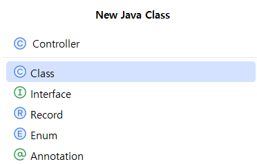
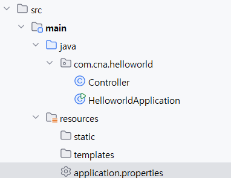
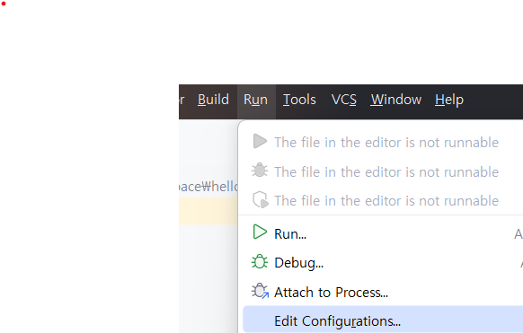
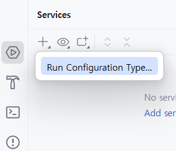
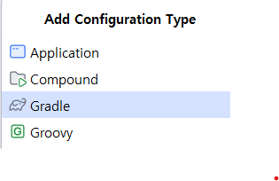
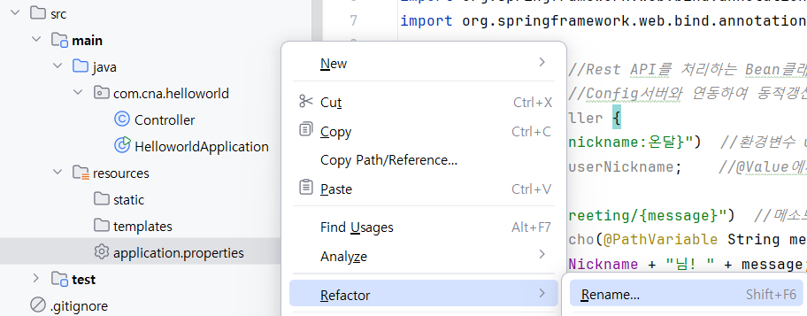
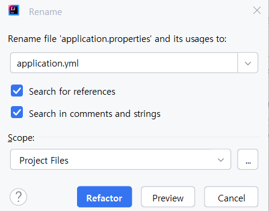
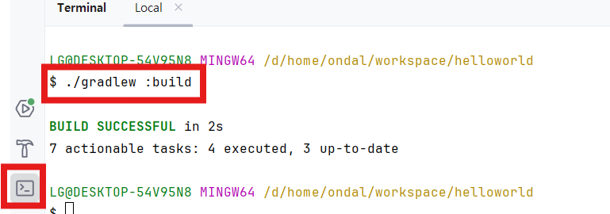

# Spring Boot Application 개발

# 새로운 프로젝트 생성
- http://start.spring.io를 열고 아래와 같이 새로운 프로젝트 셋업을 한 후   
[Generate]버튼을 눌러 압축파일을 다운로드 함   

   

- 다운로드한 압축파일을 작업영역 디렉토리에 압축해제 함    

   

- IntelliJ를 실행하고 [File]-[Open]을 클릭한 후 helloworld디렉토리를 선택함    

    

- Spring Boot 어플리케이션은 구조 입니다.    

| 디렉토리/파일                          | 설명                                                                                                  |
|---------------------------------------|-------------------------------------------------------------------------------------------------------|
| `src/main/java`                       | 애플리케이션의 자바 소스 코드가 위치하는 디렉토리                                                                |
| ├── `HellowworldApplication.java`                | 애플리케이션의 메인 클래스로, `@SpringBootApplication` 어노테이션이 붙어있음. 클래스명은 {어플리케이션명}Application.java임                                              |
| ├── `controller`                      | REST API 엔드포인트, 요청 처리 로직 등을 담당하는 컨트롤러 클래스들이 위치한 패키지                                                 |
| ├── `model`                           | 데이터 모델, 도메인 객체 등을 정의하는 클래스들이 위치한 패키지                                                                  |
| ├── `repository`                      | 데이터베이스 액세스를 담당하는 리포지토리 인터페이스 또는 클래스들이 위치한 패키지                                                      |
| └── `service`                         | 비즈니스 로직을 구현하는 서비스 클래스들이 위치한 패키지                                                                       |
| `src/main/resources`                  | 애플리케이션에 필요한 정적 리소스 파일들이 위치하는 디렉토리                                                               |
| ├── `application.properties` 또는 `.yml` | 애플리케이션의 설정 정보를 담고 있는 파일                                                                           |
| ├── `static`                          | 정적 파일(HTML, CSS, JavaScript 등)이 위치하는 디렉토리                                                         |
| └── `templates`                       | 동적으로 생성되는 HTML 템플릿 파일(Thymeleaf, FreeMarker 등)이 위치하는 디렉토리                                         |
| `src/test/java`                       | 애플리케이션의 단위 테스트, 통합 테스트 등을 위한 테스트 코드가 위치하는 디렉토리                                                 |
| `build.gradle` 또는 `pom.xml`           | 프로젝트의 빌드 설정 및 의존성 관리를 위한 파일. Gradle 또는 Maven을 사용하는지에 따라 파일명이 다름                                 |
| `gradlew` 또는 `mvnw`                  | Gradle 또는 Maven Wrapper 스크립트 파일로, 어플리케이션 컴파일과 실행 등에 사용하는 명령어임                               |


# 어플리케이션 개발
- build.gradle을 열고 아래와 같이 java 버전 부분을 수정함. 리마크 부분은 삭제하세요.   
```
/*
java {
	toolchain {
		languageVersion = JavaLanguageVersion.of(17)
	}
}
*/
java {
	sourceCompatibility = '17'
}
```

- 'controller' 패키지 생성 

   

   

- 웹으로 요청 받을 클래스를 controller패키지 밑에 생성 

   

    

- 클래스 개발    
'/greeting/'뒤에 인사말을 지정하면 화면에 환경변수 'user_nickname'과 인사말을 표시함    

```
@RestController    //Rest API를 처리하는 Bean클래스로 지정함
@RefreshScope      //Config서버와 연동하여 동적갱신이 가능한 Bean클래스로 만듦
public class Controller {
    @Value("${user_nickname:온달}")  //환경변수 user_nickname값을 읽고 없으면 '온달'로 값을 리턴
    private String userNickname;    //@Value에서 리턴한 값을 userNickname변수로 받음

    @GetMapping("/greeting/{message}")  //메소드가 Get이고 URI는 '/greeting/'뒤에 어떤 값이 있다고 지정함
    public String echo(@PathVariable String message) {  //echo라는 메소드는 파라미터로 URI경로에 있는 message값을 받음
        return userNickname + "님! " + message;  //Client에 값을 리턴함 
    }
}
```

- 컴파일 에러가 없어질 때까지 라이브러리를 import합니다. 최종 소스는 아래와 같습니다.    
```
package com.cna.controller.helloworld;

import org.springframework.beans.factory.annotation.Value;
import org.springframework.cloud.context.config.annotation.RefreshScope;
import org.springframework.web.bind.annotation.GetMapping;
import org.springframework.web.bind.annotation.PathVariable;
import org.springframework.web.bind.annotation.RestController;

@RestController    //Rest API를 처리하는 Bean클래스로 지정함
@RefreshScope      //Config서버와 연동하여 동적갱신이 가능한 Bean클래스로 만듦
public class Controller {
    @Value("${user_nickname:온달}")  //환경변수 user_nickname값을 읽고 없으면 '온달'로 값을 리턴
    private String userNickname;    //@Value에서 리턴한 값을 userNickname변수로 받음

    @GetMapping("/greeting/{message}")  //메소드가 Get이고 URI는 '/greeting/'뒤에 어떤 값이 있다고 지정함
    public String echo(@PathVariable String message) {  //echo라는 메소드는 파라미터로 URI경로에 있는 message값을 받음
        return userNickname + "님! " + message;  //Client에 값을 리턴함 
    }
}
```

- application.properties파일을 수정합니다.    
아직 Config서버와 연동 안하므로 spring.cloud.config.enabled=false를 추가합니다.    

    

```
spring.application.name=helloworld
spring.cloud.config.enabled=false
```


## 어플리케이션 실행 
- 아래 순서대로 어플리케이션 실행 설정을 합니다.   
    - 메인메뉴에서 실행환경 설정창 열기    
    
        
    
    - Gradle 선택    
    
       
    
    - 어플리케이션 실행 설정: ':bootRun'만 선택하면 됨  
    
       

    - 하단에 있는 창에서 'Service'버튼 클릭하고 '+'아이콘을 눌러 실행유형 선택   

       
    
    - 'Gradle'을 실행유형으로 선택   
    
       
    
    - 실행환경 프로파일이 나타남    
    
       

- 어플리케이션을 실행 합니다.   

    

- 실행결과 확인: Tomcat서버가 실행되었고 포트가 '8080'인것을 확인   

  

## 어플리케이션 테스트 
- 웹브라우저에서 'http://localhost:8080/greeting/반갑습니다.' 라고 입력합니다.    
맨 뒤의 인사말은 바꾸셔도 됩니다.    


## 환경변수 지정 및 재실행 
- Controller클래스에서 읽는 user_nickname 환경변수를 셋팅합니다.    

   

   

- 어플리케이션을 재시작 하고, 웹브라우저에서 테스트 해봅니다.    

   

   

## application.yml로 변경 
- application.properties파일은 중복된 텍스트가 많은 경우 불편하므로 보통 yaml파일로 바꿉니다.    
Java에서는 확장자로 'yaml'이 아닌 'yml'을 보통 사용함. 'yaml'로 해도 정상 동작함    

    

   

> **💡 Tip:**    
> YAML: Yaml Aren't Markup Language   
> 무언가의 설정을 정의할 때 많이 사용하는 파일형식    
> 키와 값 사이에 콜론으로 구분하며 값은 콜론 뒤에 스페이스 1개 필수   
> 인덴테이션은 스페이스바 또는 탭을 사용하고 섞어 쓸 수 없음    
> 대부분 스페이스로 인덴테이션을 함   

```
spring:
  application:
    name: helloworld
  cloud.config.enabled: false
```

## 참고
- 실행파일인 jar 파일을 만들려면 아래 명령 사용   
실행파일은 build/libs디렉토리 밑에 생성됨   

   
```
./gradlew :build
```

- jar 파일명을 바꾸려면 build.gradle파일에 아래와 같이 지정하면 됨   
```
bootJar {
	archiveFileName = "helloworld.jar"
}
```

