# 회원관리 서비스 개발  

회원관리 서비스의 패키지 구조는 아래와 같습니다.    
클린아키텍처를 더 잘 적용하기 위하여 biz와 infra프로젝트를 나누었습니다.   
biz프로젝트는 애플리케이션 본연의 수행이 있고,   
infra프로젝트는 외부와의 인터페이스가 구현되어 있습니다.    

```
com.subride
│
├── common
│   └── dto
│       ├── ResponseDTO    : API 응답시 사용하며 code, message, 응답객체로 구성   
│   └── util
│       └── CommonUtils    : API 응답 객체인 ResponseDTO 생성 처리 
│
└── member
    ├── MemberApplication
    │
    ├── biz
    │   ├── domain
    │   │   ├── Account  : 계정 도메인 객체로 비즈니스 로직 구현
    │   │   └── Member   : 회원 도메인 객체로 비즈니스 로직 구현 
    │   │
    │   ├── exception
    │   │   └── BizException  : 예외처리 
    │   │
    │   └── usecase
    │       ├── inport
    │       │   └── IAuthService        :입력 usecase
    │       │
    │       ├── outport
    │       │   └── IAuthProvider       :출력 usecase
    │       │
    │       └── service
    │           └── AuthServiceImpl     : 입력 usecase의 구현체로 애플리케이션 로직 구현
    │
    └── infra
        ├── common
        │   ├── config
        │   │   ├── LoggingAspect   : 메소드의 시작과 완료 로그를 자동으로 생성
        │   │   ├── SecurityConfig  : 보안설정-CORS(Cross Origin Resource Sharing:다른 도메인간 통신 허용)설정, 인증관련   
        │   │   └── SpringDocConfig : Swagger(API 문서화 툴) 설정      
        │   │
        │   ├── dto
        │   │   ├── JwtTokenDTO         : JWT Access 토큰 구조체
        │   │   ├── JwtTokenRefreshDTO  : JWT Refresh 토큰 구조체
        │   │   ├── JwtTokenVarifyDTO   : Access 토큰 검증 요청 구조체
        │   │   ├── LoginRequestDTO     : 로그인 요청 구조체
        │   │   └── SignupRequestDTO    : 회원가입 요청 구조체 
        │   │
        │   ├── jwt                           : JWT(JSON Web Token)인증 관련 설정
        │   │   ├── CustomUserDetailsService  : 인증 시 Account테이블에서 사용자 정보 검색하여 리턴  
        │   │   ├── JwtAuthenticationFilter   : API 요청 헤더의 Access Token 검증(JwtTokenProvider 호출) 
        │   │   └── JwtTokenProvider          : Access/Refresh Token 발행 및 검증
        │   │
        │   └── util
        │       └── MemberCommonUtils   : 공통유틸리티
        │
        ├── exception
        │   └── InfraException          : 예외 처리
        │
        ├── in
        │   └── web
        │       ├── AuthController          : 계정관련 Controller-로그인, 회원가입, 인증토큰 검증, 인증토큰 갱신
        │       ├── AuthControllerHelper    : 계정처리 객체
        │       ├── MemberController        : 회원관리 Controller-모든 회원정보 조회, 특정 회원정보조회 
        │       └── MemberControllerHelper  : 회원관리 처리 객체
        │
        └── out
            ├── adapter
            │   └── AuthProviderImpl        : 출력 usecase 구현체
            │
            ├── entity
            │   ├── AccountEntity           : 계정 테이블 객체
            │   └── MemberEntity            : 회원 테이블 객체
            │
            └── repo
                ├── IAccountRepository      : 계정 테이블 처리 인터페이스
                └── IMemberRepository       : 회원 테이블 처리 인터페이스
```

## 프로젝트 생성
백엔드 서비스를 개발하기 위한 프로젝트를 먼저 생성합니다.

> **Monorepo패턴**         
> 한 프로젝트에 각 마이크로서비스를 하위 모듈로 개발하는 패턴입니다.    
> Monorepo패턴 또는 Single repository패턴이라고 합니다.      
> Monorepo패턴 개발 장점 
> - 코드 관리 편리:   모든 코드가 단일 저장소(Git의 한 Repository)에 있으므로 관리가 편함  
> - 코드 공유 편리:   여러 프로젝트 간에 공통으로 사용하는 라이브러리와 클래스를 쉽게 공유   
> - 의존성 관리 편이: 버전 충돌이나 호환성 문제를 줄일 수 있음   
> - CI/CD 편리:      전체 프로젝트에 대해 통합된 CI/CD파이프라인 구축 가능   

Monorepo패턴을 적용한 프로젝트는 여러개의 프로젝트로 구성되어 있으므로 **멀티 프로젝트**라고도 합니다.   

- 새로운 프로젝트 작성   
  - 프로젝트 압축파일 생성 
  https://start.spring.io 로 접속하여 아래와 같이 빈 프로젝트를 작성합니다.    
  Dependency는 추가하지 마세요.   
  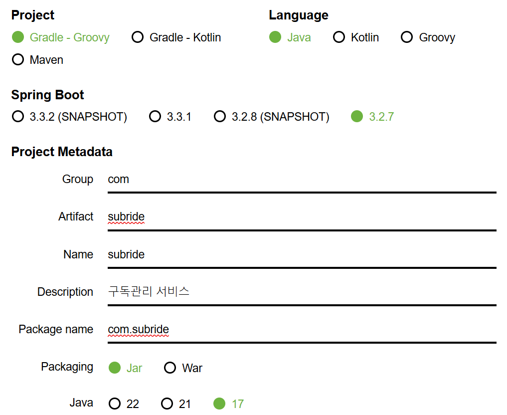

  하단의 GENERATE 버튼을 눌러 subride.zip파일을 다운로드 하세요.
  지금 만드는 프로젝트는 최상위 프로젝트이고 실제 모든 프로젝트는 하위에 만듭니다.   
  따라서 src디렉토리 밑으로 생성되는 패키지를 지정하는 Group, Package name은 의미가 없습니다.   
  Artifact와 Name만 서비스의 이름인 subride로 지정하면 됩니다.    

  - 압축파일을 아무 디렉토리에 임시로 해제 합니다.   
    해제 후 subride디렉토리를 {홈디렉토리}/home/workspace로 이동합니다.    
    Windows는 C:\home\workspace\subride, Mac은 ~/home/workspace/subride디렉토리가 만들어지면 됩니다.   

  - 프로젝트 열기 
  intelliJ를 실행합니다.  이미 실행되어 있다면 아마 클론프로젝트가 오픈되어 있을 겁니다.   
  이 상태에서 그냥 방금 만든 프로젝트를 열면 이전 클론 프로젝트가 닫혀 버립니다.   
  아래 설정을 먼저하고 새 프로젝트를 오픈 하십시오.    
  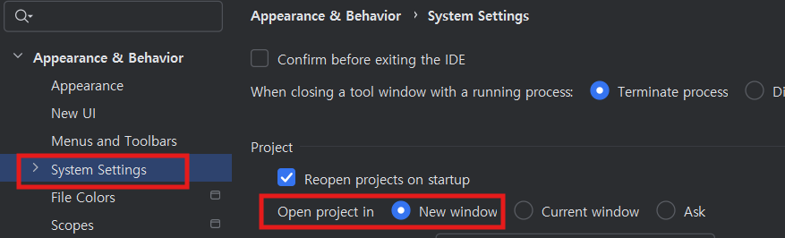

## Lombok설치 및 활성화
Lombok은 클래스의 생성자, Getter(프라퍼티값을 읽는 메소드), Setter(프라퍼티값을 변경하는 메소드)등을    
자동으로 작성해 주는 라이브러리입니다.    
Lombok을 사용하면 어노테이션만 지정하면 이러한 메소드들을    
자동으로 만들어 주기 때문에 편하고 코드도 깔끔해집니다.    

- Lombok plugin을 설치합니다. 
    
- Annotation Processor를 활성화 합니다.    
    IDE에서 Lombok을 사용하려면 반드시 아래 셋팅을 해야 합니다. 
    이 설정은 영구설정이 아니므로 새로운 프로젝트를 만들때마다 해줘야 합니다.   
    멀티프로젝트는 최상위 프로젝트 생성하고 한번 하면 됩니다.        
    

## 프로젝트 환경 설정
- 라이브러리 자동 import 옵션    
    첫번째 옵션은 코드 작성 중 필요한 라이브러리를 자동 import해 주는 것이고,   
    두번째 옵션은 불필요한 라이브러리 import를 자동으로 제거해 주는 옵션입니다.   
    
- 오타 검사 옵션 비활성화  
    코드나 주석에 오타를 체크해 주는 옵션입니다.   
    활성화 되어 있으면 컴파일 Warning갯수가 자꾸 보여서 눈에 거슬립니다.   
    


## common 프로젝트 복사 
- common 디렉토리 복사  
    공통 클래스를 만들 common프로젝트를 클론 프로젝트에서 복사하여 붙여넣기 합니다.   
    클론 프로젝트의 common디렉토리를 선택하고 CTRL-c를 누른 후,   
    개발 프로젝트에서 subride디렉토리를 선택한 후 CTRL-v를 누르면 됩니다.   
    아래와 같이 common디렉토리가 생성되면 됩니다.    
    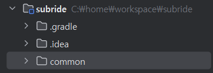

- settings.gradle에 common프로젝트 추가   
    settings.gradle은 멀티 프로젝트에서 하위 모듈(프로젝트)을 관리하는 파일입니다.   
    아래와 같이 common프로젝트를 추가하면 됩니다. 
    ```
    rootProject.name = 'subride'
    include 'common'
    ```   

- common 프로젝트 클래스 설명  

  - com.subride.common.dto.ResponseDTO    
    이 클래스는 API의 응답 데이터를 만들때 사용되는 DTO(Data Transfer Object)클래스입니다.   
    DTO는 여러 필드를 가지는 요청, 응답, 파라미터 객체를 만들때 사용합니다.  
    응답 객체에는 응답코드, 응답 메시지, 응답 값 객체로 구성되어 있습니다.  
    ```
    @Getter
    @Builder
    @AllArgsConstructor
    @NoArgsConstructor
    public class ResponseDTO<T> {
        private int code;
        private String message;
        private T response;
    }
    ```
  - com.subride.common.util.CommonUtils 
    모든 마이크로서비스에서 공통으로 사용할 메소드를 모아 놓은 클래스입니다.   
    현재는 성공일때와 실패일때의 ResponseDTO객체를 만드는 메소드가 정의되어 있습니다.   
    ```
    public class CommonUtils {

        //controller에서 성공 시 리턴 객체 반환
        public static <T> ResponseDTO<T> createSuccessResponse(int code, String message, T response) {
            return ResponseDTO.<T>builder()
                    .code(code)
                    .message(message)
                    .response(response)
                    .build();
        }

        //controller에서 실패 시 리턴 객체 반환
        public static <T> ResponseDTO<T> createFailureResponse(int code, String message) {
            return ResponseDTO.<T>builder()
                    .code(code)
                    .message(message)
                    .build();
        }
    }
    ```  
    > **static 메소드**   
    > 위 두 메소드는 static이라는 키워드를 사용하여 static메소드로 정의되어 있습니다.   
    > static메소드가 아니면 아래와 같이 CommonUtils클래스의 객체를 만든 후 메소드를 호출해야 합니다.    
    > ```
    > CommonUtils commonUtils = new CommonUtils();
    > commonUtils.createSuccessResponse(200, "Success", userInfo); 
    > ```  
    > CommonUtils는 공용 메소드를 모아 놓은 클래스이므로 굳이 객체를 만들 필요가 없습니다.   
    > 이런 경우에 메소드를 바로 호출할 수 있도록 하기 위해 static 메소드를 만듭니다.   
    > static 메소드는 아래와 같이 호출할 수 있습니다.    
    > ```
    > CommonUtils.createSuccessResponse(200, "Success", userInfo);
    > ```

    > **Generic type**    
    > '\<T\>'라는 키워드는 유동적으로 객체의 Type이 바뀌는 방법을 보여줍니다.   
    > 이렇게 미리 객체 Type을 지정하지 않고 실행 시에 결정하는 방법을 Generic type이라고 합니다.  
    > 아래 예와 같이 호출할 때 Generic type으로 지정된 객체에는 어떤 type의 객체이든 사용할 수가 있습니다.      
    > ```
    > CommonUtils.createSuccessResponse(200, "로그인 성공", jwtTokenDTO);
    > CommonUtils.createSuccessResponse(200, "회원정보", memberInfoDTO);
    > ```

## member 프로젝트 추가   
- member 프로젝트 추가  
    IntelliJ는 다른 IDE에 없는 하위 모듈 추가 기능이 있습니다.   
    아래와 같이 새로운 모듈을 추가 하십시오.  
    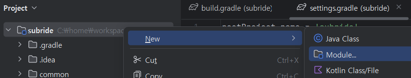

    먼저 member를 추가하고, member하위에 member-biz와 member-infra프로젝트를 추가합니다.   
    'Add Sample code'는 uncheck하세요.       
    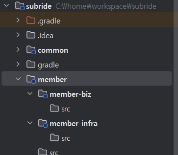

- settings.gradle에 member 프로젝트 추가
    ```
    rootProject.name = 'subride'
    include 'common'
    include 'member:member-biz'
    include 'member:member-infra'
    ```

##  최상위 프로젝트의 build.gradle 셋팅  
build.gradle은 애플리케이션의 기본정보와 라이브러리등을 정의한 파일입니다.   
Node.js계열의 언어(React, view.js등)에서의 package.json과 동일한 기능을 합니다.   
컴파일러로 maven을 사용할때는 pom.xml에 XML형식으로 정의해야 합니다.    
gradle을 점점 더 많이 쓰는 이유는 build.gradle에 정의하는 것이 훨씬 간단하고,   
컴파일 속도도 더 빠르기 때문입니다.   
클론 프로젝트의 build.gradle파일 내용을 복사-붙여넣기 하세요.   

- plugins
    java와 spring boot 플러그인을 지정합니다.   
    실습에서는 Spring Boot 3.2.7을 사용합니다.   
    Spring Boot 라이브러리 관리 플러그인은 정의 안합니다.  
    Spring Boot 버전에 맞는 라이브러리 관리 플러그인 버전을 지정해야 하는데 잘못 지정하면 문제 생기므로    
    Spring Boot가 알아서 맞는 버전을 로드하도록 하는게 편합니다.     
    ```
    plugins {
        id 'java'
        id 'org.springframework.boot' version '3.2.7'
        //id 'io.spring.dependency-management' version '1.1.5'
    }
    ```

- allprojects   
    최상위 프로젝트와 모든 하위 프로젝트에 적용될 설정을 합니다.   

    - 라이브러리 저장소 
        라이브러리를 다운로드할 저장소로 maven central을 지정했습니다.   
        https://mvnrepository.com/repos/central 에서 라이브러리를 다운로드 하게 됩니다.   
        ```
        repositories {
            mavenCentral()
        }
        ```

        실제로는 Nexus나 jFrog등의 툴을 이용하여 라이브러리 저장소를 운영하기도 합니다.   
        그런 경우는 아래 예제와 같이 라이브러리 저장소의 주소를 따로 지정해 줍니다.   

        ```
        repositories {
            maven {
                url "https://nexus.example.com/repository/maven-public/"
                credentials {
                    username "your-username"
                    password "your-password"
                }
            }
        }
        ```

    - 라이브러리 정의   
        dependencies 하위에 모든 프로젝트에서 사용할 라이브러리를 정의 합니다.   
        'implementation'으로 정의된 라이브러리는 애플리케이션 컴파일과 실행 시 모두 필요한 라이브러리입니다.   
        'compileOnly'로 정의된 라이브러리는 컴파일할 때만 필요합니다.  
        'testImplementation'으로 정의된 라이브러리는 테스트 코드 컴파일과 실행 시 필요합니다.   

        > **spring-boot-starter-validation**: 유효성 검사하는 어노테이션(@NotNull, @Valid등)으로 validation check를 지원    
        > **spring-boot-starter-aop**: AOP(Aspect-Oriented Programming)라는 방법으로 공통 모듈 작성을 지원(예제에서는 로깅시 사용)        
        > **gson**: JSON 파싱과 생성을 쉽게 해줌    

        ```
        implementation 'org.springframework.boot:spring-boot-starter-validation'
        implementation 'org.springframework.boot:spring-boot-starter-aop'
        implementation 'com.google.code.gson:gson'

        ```
        > **라이브러리 버전 명시**    
        > 원래는 아래와 같이 라이브러리 버전을 반드시 지정 해야 합니다.  
        > 문제는 이 라이브러리 버전이 Spring Boot버전과 맞아야 하는데 이거 맞추기가 골치 아픕니다.      
        > ```
        > implementation 'com.google.code.gson:gson:2.11.0'
        > ```
        > 다행스럽게 Spring Boot는 자주 사용하는 외부 라이브러리들에 대해 버전을 명시하지 않으면    
        > 자신과 맞는 버전의 라이브러리를 로딩해 줍니다.    
        > 지원하는 외부라이브리는 [Spring Boot 문서](https://spring.io/projects/spring-boot#learn)에서 확인할 수 있습니다.    
        > 문서를 열고 왼쪽 맨 하단에 있는 'Dependency Versions'에서 사용할 외부 라이브러리를 찾아서 있다면, 버전을 지정하지 않는게 좋습니다.   


    - Lombok 사용
        Lombok은 컴파일할때만 필요하므로 아래와 같이 지정합니다.   
        ```
        compileOnly 'org.projectlombok:lombok'
        annotationProcessor 'org.projectlombok:lombok'
 
- subprojects  
하위 프로젝트에만 적용될 설정을 정의 합니다.    
Spring Boot 플러그인을 적용합니다.  
```
subprojects {
    apply plugin: 'org.springframework.boot'
}
```

- common 프로젝트 설정  
common 프로젝트는 공통모듈용이므로 실행 Jar은 안 만들고 표준 Jar파일만 만듭니다.  
실행 Jar는 WAS(기본 Tomcat)와 의존 라이브러리까지 모두 포함하여 독립적으로 실행할 수 있는 빌드 파일이고,    
표준 Jar는 WAS와 의존하는 라이브러리 없이 개발된 소스만 컴파일한 빌드 파일입니다.       
```
project(':common') {
    bootJar.enabled = false
    jar.enabled = true
}
```
- 'infra'프로젝트 설정

외부 툴/기술과 인터페이스하는 infra프로젝트는 인터페이스를 위한 라이브러리를 정의합니다.  
> **외부 툴/기술 인터페이스 라이브러리**    
> spring-boot-starter-web: HTTP(s) 통신 라이브러리   
> spring-boot-starter-security: 인증/인가처리 라이브러리   
> spring-boot-starter-data-jpa: ORM(Object Relation Mapping) 라이브러리    
> springdoc-openapi-starter-webmvc-ui: API문서화를 위한 Swagger 라이브러리   
> java-jwt: JWT토큰 처리 라이브러리    
> mysql-connector-j: MYSQL 인터페이스 라이브러리   

```
dependencies {
    implementation 'org.springframework.boot:spring-boot-starter-web'
    implementation 'org.springframework.boot:spring-boot-starter-security'
    implementation 'org.springframework.boot:spring-boot-starter-data-jpa'
    implementation 'org.springdoc:springdoc-openapi-starter-webmvc-ui:2.1.0'
    implementation 'com.auth0:java-jwt:4.4.0'
    runtimeOnly 'com.mysql:mysql-connector-j'
    }
}
```
- 'biz'프로젝트 설정
애플리케이션과 비즈니스 로직을 구현하는 biz프로젝트는 common프로젝트와 동일하게   
실행Jar 파일은 만들 필요 없고 표준 jar파일만 만듭니다.   
```
configure(subprojects.findAll { it.name.endsWith('-biz') }) {
    bootJar.enabled = false
    jar.enabled = true
}
```

## 회원 프로젝트의 build.gradle 설정

- member-biz 프로젝트의 build.gralde 복사  
    common 프로젝트를 의존하도록 설정함. 
    ```
    dependencies {
        implementation project(':common')
    }
    ```

- member-infra 프로젝트의 build.gradle 복사  
    infra프로젝트는 biz프로젝트와 common프로젝트를 의존하도록 설정함   
    ```
    dependencies {
        implementation project(':common')
        implementation project(':member:member-biz')
    }
    ```    

---

## 회원 가입 Controller 개발
- 소스와 설정 디렉토리 생성     
infra프로젝트에 src/main/java디렉토리와 src/main/resources 디렉토리를 생성 합니다.    
java디렉토리는 패키지와 클래스가 위치할 디렉토리이고,  
resources 디렉토리는 애플리케이션 설정 파일을 생성할 디렉토리입니다.   
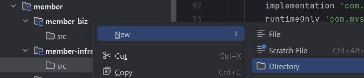    
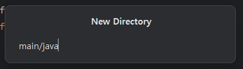    
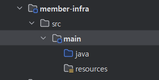    

- AuthController, AuthControllerHelper 클래스 복사    
java디렉토리에 패키지 'com.subride.member.infra'를 만듭니다.   
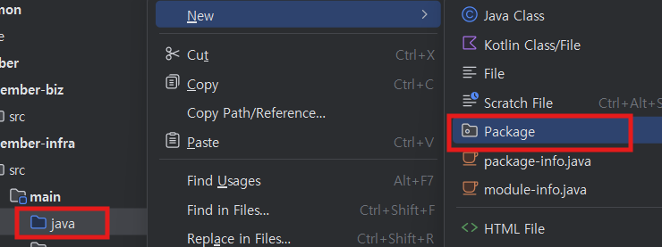    


infra 밑에 in.web 패키지를 만듭니다.  

클론프로젝트에서 AuthController, AuthControllerHelper 클래스를 복사-붙여넣기 합니다.   
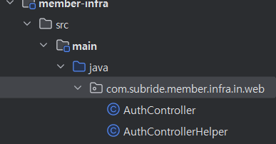    

- 회원생성 API 개발
    - AuthController 정리  
    AuthController에서 signup 메소드만 남기고 모두 지움  
    > **Tip**: 아래 소스를 복사-붙여넣기 해도 되는데,     
    > RequestBody는 org.springframework.web.bind.annotation.RequestBody을 선택하세요.      
    
    ```
    package com.subride.member.infra.in.web;

    @Slf4j      //Logger - log.info("{log}") 형식으로 로깅하는 log객체 생성됨  
    @Tag(name = "Auth API", description = "인증/인가 API")  //Swagger-API이름과 설명 
    @RestController                 //Controller 클래스임을 나타내고 Bin클래스(실행 시 객체 자동 생성)로 만듦    
    @RequiredArgsConstructor        //Lombok-프라퍼티를 인자로 갖는 생성자 자동 생성  
    @RequestMapping("/api/auth")    //RestController-API경로에 prefix를 붙임  
    public class AuthController {
        private final IAuthService authService;                     //inport usecase
        private final AuthControllerHelper authControllerHelper;    //controller helper 

        @Operation(operationId = "auth-signup", summary = "회원가입", description = "회원가입을 처리합니다.")   //Swagger-메소드 설명 
        @PostMapping("/signup") //RestController-API URI 지정
        public ResponseEntity<ResponseDTO<String>> signup(@RequestBody SignupRequestDTO signupRequestDTO) {
            try {
                //authService는 biz쪽 class이므로 biz의 Domain객체로 변환하여 전달하는 것이 클린 아키텍처에 맞음  
                authService.signup(authControllerHelper.getMemberFromRequest(signupRequestDTO),
                        authControllerHelper.getAccountFromRequest(signupRequestDTO));

                return ResponseEntity.ok(CommonUtils.createSuccessResponse(200, "회원가입 성공", "회원 가입 되었습니다."));
            } catch (InfraException e) {
                return ResponseEntity.status(HttpStatus.BAD_REQUEST).body(CommonUtils.createFailureResponse(e.getCode(), e.getMessage()));
            } catch (Exception e) {
                return ResponseEntity.status(HttpStatus.INTERNAL_SERVER_ERROR).body(CommonUtils.createFailureResponse(0, "서버 오류가 발생했습니다."));
            }
        }
    }
    ```

    - AuthControllerHelper 클래스 정리  
    아래와 같이 회원등록 시 필요한 것들만 남깁니다.    
    ```
    package com.subride.member.infra.in.web;

    import com.subride.member.biz.domain.Account;
    import com.subride.member.biz.domain.Member;
    import com.subride.member.infra.common.dto.SignupRequestDTO;
    import com.subride.member.infra.out.repo.IAccountRepository;
    import com.subride.member.infra.out.repo.IMemberRepository;
    import lombok.extern.slf4j.Slf4j;
    import org.springframework.beans.factory.annotation.Autowired;
    import org.springframework.stereotype.Controller;

    @Slf4j
    @Controller
    public class AuthControllerHelper {
        private IMemberRepository memberRepository;
        private IAccountRepository accountRepository;

        @Autowired
        public AuthControllerHelper(IMemberRepository memberRepository, IAccountRepository accountRepository) {
            this.memberRepository = memberRepository;
            this.accountRepository = accountRepository;
        }

        public AuthControllerHelper() {}

        public Member getMemberFromRequest(SignupRequestDTO signupRequestDTO) {
            Member member = new Member();
            member.setUserId(signupRequestDTO.getUserId());
            member.setUserName(signupRequestDTO.getUserName());
            member.setBankName(signupRequestDTO.getBankName());
            member.setBankAccount(signupRequestDTO.getBankAccount());
            return member;
        }

        public Account getAccountFromRequest(SignupRequestDTO signupRequestDTO) {
            //log.info("*** getAccountFromRequest");
            Account account = new Account();
            account.setUserId(signupRequestDTO.getUserId());
            account.setPassword(signupRequestDTO.getPassword());
            account.setRoles(signupRequestDTO.getRoles());
            return account;
        }
    }
    ```

    - DTO클래스 복사  
    개발 프로젝트에 com.subride.member.infra.common.dto패키지를 만들고,   
    클론 프로젝트에서 동일 패키지 하위에 있는 SignupRequestDTO클래스를 복사합니다.   

## biz 프로젝트 클래스 복사  
IAuthService를 포함 biz프로젝트들의 소스는 한꺼번에 복사합니다.  
- member-biz 프로젝트에 java 디렉토리에 생성   
    member-biz/src를 선택하고 우측 마우스 버튼으로 새 디렉토리 생성    
    main/java 라고 입력하여 생성    
    
- member-biz 프로젝트의 class 복사   
    클론 프로젝트의 member-biz/src/main/java밑에 있는 com.subride.member.biz에 커서를 놓고 CTRL-c로 복사합니다.  
    개발 프로젝트의 member-biz/src/main/java 디렉토리를 선택하고 붙여넣기 합니다.   
    아래와 같이 New name에 패키지명을 정확하게 지정합니다.    
    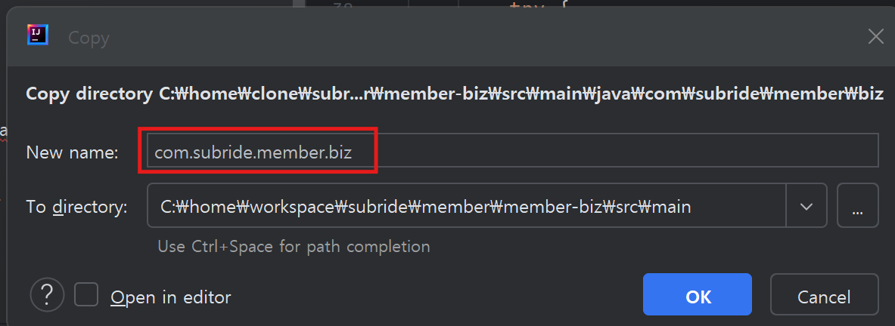    

    아래와 같이 패키지 구조와 클래스들이 복사되어야 합니다.   
    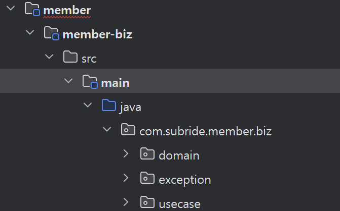
  
- domain 클래스: Account, Member   
    비즈니스 로직을 구현하는 핵심 클래스입니다.  
    예제에서는 특별한 비즈니스 로직은 Member클래스의 canbeAccessed()메소드 밖에 없습니다.    
    user99는 접근을 금지하는 로직을 예제로 구현해 놨습니다.   

    > **Lombok의 @Getter, @Setter 확인하기**   
    > Lombok은 @Getter, @Setter 어노테이션이 있으면 자동으로 Getter, Setter메소드를 만듭니다.   
    > 진짜 그런지 확인하려면 Account클래스를 선택하고 Alt-7(Mac은 Option-7)을 눌러   
    > Structure창을 열어 보십시오. 아래와 같이 메소드가 자동 생성된걸 확인할 수 있습니다.    
    > 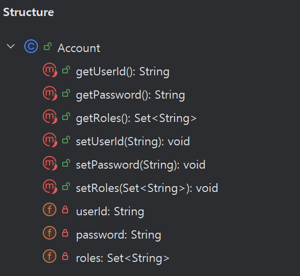

- inport usecase: IAuthServer    
    Member서비스의 애플리케이션 로직을 정의한 인터페이스 객체입니다.    
    실제 구현은 AuthServiceImpl클래스에서 합니다.   
    ```
    public interface IAuthService {
        void signup(Member member, Account account);
        Member login(String userId, String password);

        boolean validateMemberAccess(Member member);     //-- 접근 허용 정책 결정
    }
    ```

- service: AuthServiceImpl       
    inport usecase에서 정의한 메소드를 실제 구현한 클래스입니다.    

    ```
    @Service                    //Service레이어의 클래스임을 나타내고 Bin클래스로 실행시 객체가 자동 생성됨  
    @RequiredArgsConstructor    //Lombok: 프라퍼티를 인자로 갖는 생성자 메소드 자동 생성  
    public class AuthServiceImpl implements IAuthService {
        private final IAuthProvider authProvider;   //외부 기술/툴과의 인터페이스를 정의한 객체를 참조함  

        @Override   //인터페이스에 정의한 메소드를 덮어서 재정의하므로 @Override 어노테이션 사용   
        public Member login(String userId, String password) {
            return authProvider.validateAuth(userId, password);
        }

        @Override
        public void signup(Member member, Account account) {
            //-- profile image 번호를 생성
            member.setCharacterId((int) (Math.random() * 4) + 1);   //사용자의 캐릭터 번호를 생성

            authProvider.signup(member, account);
        }

        @Override
        public boolean validateMemberAccess(Member member) {
            return member.canbeAccessed();      //Member도메인 객체의 비즈니스 로직을 호출하여 접근 가능 여부 검사  
        }
    }

    ```    

- outport usecase: IAuthProvider     
    애플리케이션 서비스가 외부 기술/툴과 인터페이스 하기 위해 필요한 메소드를 정의한 인터페이스입니다.   
    실제 구현은 infra프로젝트의 out adapter레이어에서 하게 됩니다.  
    ```
    public interface IAuthProvider {
        Member validateAuth(String userId, String password);

        void signup(Member member, Account account);

    }
    ```    

## Output Adapter 클래스 개발  
outport usecase에 정의한 메소드를 처리하기 위한 Output Adapter 클래스를 개발합니다.  

- Package 생성
    com.subride.member.infra.in.web을 선택하고, 우측 마우스 버튼에서 새로운 패키지 생성을 선택합니다.   
    기존 값을 수정하여 아래와 같이 com.subride.member.infra.out 패키지를 만듭니다.    
    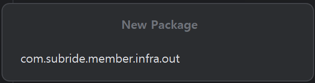   

- output adapter 클래스 복사  
    - output adapter 클래스 복사   
    클론 프로젝트의 com.subride.member.infra.out.adapter패키지를 선택하고 복사한 후,    
    개발 프로젝트의 com.subride.member.infra.out패키지를 선택한 후 붙여넣기 합니다.    
    
    - entity 클래스 복사    
    개발 프로젝트에 entity 패키지를 추가하고 클론 프로젝트에서 Entity클래스 2개를 복사합니다.  

    ```
    @Entity         //Entity임을 나타내고 Bean Class로 선언하여 애플리케이션 생성 시 객체가 자동 생성되게 함
    @Table(name = "accounts")   //accounts 테이블과 연결됨을 지정 
    @Getter
    @Setter
    @NoArgsConstructor(access = AccessLevel.PROTECTED)  //아래 주석 참조
    @AllArgsConstructor(access = AccessLevel.PRIVATE)   //아래 주석 참조
    /*
    @NoArgsConstructor(access = AccessLevel.PROTECTED)
    - JPA는 인자없는 기본 생성자를 대부분 요구하기 때문에 필요
    - Access Level을 PROTECTED로 하는 이유는 외부에서 new 키워드로 인스턴스 생성을 못하게 하기 위함임
    @AllArgsConstructor(access = AccessLevel.PROTECTED)
    - 모든 인자를 갖는 생성자를 생성
    - Access level을 PRIVATE으로 하여 해당 클래스에서만 사용할 수 있도록 제한함
    */
    public class AccountEntity {
        @Id         //PK(primary key)필드로 지정
        @Column(name = "user_id", unique = true, nullable = false)  //테이블 스키마 생성 시 필드명, 유일값 여부, 널값 허용여부를 지정
        private String userId;      //userId 프라퍼티는 테이블의 user_id와 연결됨. 테이블 필드명은 언더바 사용하고 프라퍼티는 Camel표기법 사용 

        @Column(nullable = false)
        private String password;    //테이블 필드도 프라퍼티와 동일한 이름으로 생성됨  

        @ElementCollection(fetch = FetchType.EAGER) //Aggregation 관계의 VO를 정의할 때 사용함. fetch type이 EAGER이면 값 즉시 로딩됨
        @CollectionTable(name = "account_roles", joinColumns = @JoinColumn(name = "user_id"))   //Aggregation VO 테이블 정의
        @Column(name = "role")
        private Set<String> roles = new HashSet<>();

        /*
        왜 static으로 메소드를 만드는가?
        - Access level에 PROTECTED라 외부에서 new 키워드로 인스턴스 생성을 못하므로 static 메소드로 만듬
        - 외부에서는 AccountEntity persistentAccount = AccountEntity.fromDomain(account)와 같이 사용
        */
        public static AccountEntity fromDomain(Account account) {   //Domain객체를 Entity객체로 형 변환
            return new AccountEntity(
                    account.getUserId(),
                    account.getPassword(),
                    account.getRoles()
            );
        }

        public Account toDomain() {         //Entity객체를 Domain객체로 형 변환 
            Account account = new Account();
            account.setUserId(this.userId);
            account.setPassword(this.password);
            account.setRoles(this.roles);
            return account;
        }
    }
    ``` 

    - Repository 클래스 복사     
    개발 프로젝트에 repo 패키지를 추가하고 클론 프로젝트에서 Repository 클래스 2개를 복사합니다.  
    Java ORM인 JPA와 Mabatis 중 JPA를 사용하였습니다.   
    JPA를 사용할 때는 이렇게 인터페이스만 만들어 주면 자동으로 테이블을 CRUD하는 메소드들이 만들어집니다.  
    또한 아래 2 메소드처럼 정해진 문법을 지켜서 추가적인 메소드를 만들 수 있습니다.   
    ```
    public interface IAccountRepository extends JpaRepository<AccountEntity, Long> {
        Optional<AccountEntity> findByUserId(String userId);
        Boolean existsByUserId(String userId);
    }
    ```

    - InfraException 클래스 복사   
    AuthProviderImpl에서 사용하는 InfraException클래스를 클론 프로젝트에서 복사합니다.  
    - 소스에서 일부 수정
      아직 구현하지 않을 부분을 수정합니다.   
      AuthenticationManager 프라퍼티를 주석 처리 합니다.  
      validateAuth메소드를 널을 리턴하는것으로 바꿉니다.  
    ```
    package com.subride.member.infra.out.adapter;

    @Service
    @RequiredArgsConstructor
    public class AuthProviderImpl implements IAuthProvider {
        //private final AuthenticationManager authenticationManager;
        private final IMemberRepository memberRepository;
        private final PasswordEncoder passwordEncoder;
        private final IAccountRepository accountRepository;

        @Override
        public Member validateAuth(String userId, String password) {
            return null;
        }

        @Override
        @Transactional
        public void signup(Member member, Account account) {
            try {
                MemberEntity memberEntity = MemberEntity.fromDomain(member);
                memberRepository.save(memberEntity);

                AccountEntity accountEntity = AccountEntity.fromDomain(account);
                //-- 암호를 단방향 암호화함
                accountEntity.setPassword(passwordEncoder.encode(account.getPassword()));
                accountRepository.save(accountEntity);
            } catch (Exception e) {
                throw new InfraException("데이터 저장 중 오류", e);
            }

        }
    }
    ```

    - AuthProviderImpl의 signup메소드 설명  
    service 'AuthServiceImpl'에서 전달 받은 member와 account객체를 Entity객체로 변환한 후,   
    JPA를 이용하여 저장합니다.  
    이때 암호는 passwordEncoder를 써서 단방향(평문으로 다시 변환 못함)으로 암호화하여 저장합니다.   

## Security Config 
Security Config는 인증 처리를 위해 필요합니다.  
아직 인증 처리가 필요 없지만 CORS(도메인이 다른 프론트엔드에서 접근),    
로그인/회원등록/Swagger페이지와 같이 인증 없이 접근할 페이지 지정,    
Password Encoder 객체 생성을 위해 만들어야 합니다.    

개발 프로젝트에 com.subride.member.infra.common.config패키지를 만듭니다.    
그 아래에 SecurityConfig클래스를 생성합니다.  
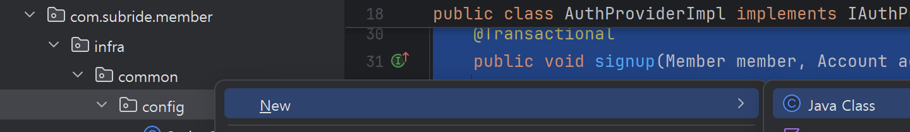    
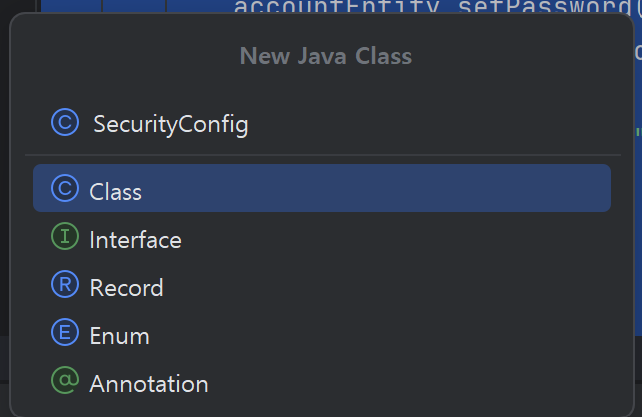    

아래 소스를 복사-붙여넣기 합니다.     
```
package com.subride.member.infra.common.config;

import org.springframework.context.annotation.Bean;
import org.springframework.context.annotation.Configuration;
import org.springframework.http.HttpMethod;
import org.springframework.security.authentication.AuthenticationManager;
import org.springframework.security.config.annotation.authentication.configuration.AuthenticationConfiguration;
import org.springframework.security.config.annotation.web.builders.HttpSecurity;
import org.springframework.security.config.annotation.web.configuration.EnableWebSecurity;
import org.springframework.security.config.annotation.web.configurers.AbstractHttpConfigurer;
import org.springframework.security.config.http.SessionCreationPolicy;
import org.springframework.security.crypto.bcrypt.BCryptPasswordEncoder;
import org.springframework.security.crypto.password.PasswordEncoder;
import org.springframework.security.web.SecurityFilterChain;
import org.springframework.web.cors.CorsConfiguration;
import org.springframework.web.cors.CorsConfigurationSource;
import org.springframework.web.cors.UrlBasedCorsConfigurationSource;

import java.util.List;

@Configuration               //Config 레이어의 클래스임을 나타내며 Bean클래스로 등록되어 실행시 자동으로 객체가 생성됨
@EnableWebSecurity              //인증 처리 라이브러리인 Spring Security를 활성화함   
@SuppressWarnings("unused")     //unused 경고를 표시하지 않게 하는 어노테이션 
public class SecurityConfig {

    @Bean       //Bean클래스로 등록해서 애플리케이션 실행 시 객체가 자동 생성되게 함
    public AuthenticationManager authenticationManager(AuthenticationConfiguration authConfig) throws Exception {
        return authConfig.getAuthenticationManager();
    }

    @Bean
    public SecurityFilterChain securityFilterChain(HttpSecurity http) throws Exception {
        /*
        아래와 같은 수행을 함
        - CORS설정: 접근을 허용할 도메인, 메서드, 헤더값 등을 설정함   
        - csrf : Cross Site Request Forgery(인증된 웹 세션을 사용하여 서버를 공격하는 행위)을 비활성화
                 JWT 방식을 사용하므로 불필요함. 만약 CSRF까지 활성화하면 클라이언트는 CSRF토큰도 요청 헤더에 보내야 함
        - authorizeHttpRequests: 인증이 필요없는 주소를 지정하고, 나머지는 인증이 안되어 있으면 접근을 금지시킴     
                swagger페이지와 로그인, 회원등록 페이지는 인증 안해도 접근하도록 설정함     
        - sessionManagement: 세션을 로컬에 저장하지 않도록 함 
        - 나머지 주석한 2줄은 인증에 필요한 설정인데 아직 구현 안했으므로 주석처리함        
  
        */
        http
                .cors(cors -> cors
                        .configurationSource(corsConfigurationSource())
                )
                .csrf(AbstractHttpConfigurer::disable)  
                .authorizeHttpRequests(auth -> auth
                        .requestMatchers(HttpMethod.GET, "/swagger-ui/**", "/v3/api-docs/**").permitAll()
                        .requestMatchers(HttpMethod.POST, "/api/auth/**").permitAll()
                        .anyRequest().authenticated()
                )
                .sessionManagement(session -> session
                        .sessionCreationPolicy(SessionCreationPolicy.STATELESS)
                );
                //.userDetailsService(customUserDetailsService)
                //.addFilterBefore(new JwtAuthenticationFilter(jwtTokenProvider), UsernamePasswordAuthenticationFilter.class);

        return http.build();
    }

    @Bean
    public CorsConfigurationSource corsConfigurationSource() {
        CorsConfiguration configuration = new CorsConfiguration();
        configuration.setAllowedOrigins(List.of("http://localhost:3000"));
        configuration.setAllowedMethods(List.of("GET", "POST", "PUT", "DELETE", "OPTIONS"));
        configuration.setAllowedHeaders(List.of("*"));
        configuration.setAllowCredentials(true);

        UrlBasedCorsConfigurationSource source = new UrlBasedCorsConfigurationSource();
        source.registerCorsConfiguration("/**", configuration);
        return source;
    }

    @Bean
    public PasswordEncoder passwordEncoder() {
        return new BCryptPasswordEncoder();
    }
}
```

## Swagger Config
API문서화에 사용되는 Swagger의 환경설정 클래스를 만듭니다.    
개발 프로젝트에 com.subride.member.infra.common.config패키지를 만듭니다.    
클론 프로젝트에서 동일 패키지 하위에 있는 SpringDocConfig클래스를 복사합니다.    

    ```
    @Configuration      //Config 레이어의 클래스임을 나타내며 Bean클래스로 등록되어 실행시 자동으로 객체가 생성됨
    @SuppressWarnings("unused")     //unused 경고를 표시하지 않게 하는 어노테이션 
    @SecurityScheme(                            //Swagger페이지에서 인증토큰을 설정하는 콘트롤이 나타나게 함
            name = "bearerAuth",
            type = SecuritySchemeType.HTTP,
            bearerFormat = "JWT",
            scheme = "bearer"
    )
    public class SpringDocConfig {

        @Bean
        public OpenAPI openAPI() {      //API에 대한 기본정보를 정의함 
            return new OpenAPI()
                    .info(new Info()
                            .title("Subride MemberEntity API")
                            .version("v1.0.0")
                            .description("Subride 회원 서비스 API 명세서입니다."));
        }
    }
    ```

## 애플리케이션 설정 파일 작성   
member-infra프로젝트의 src/main/resources디렉토리에 application.yml 파일을 만듭니다.   
    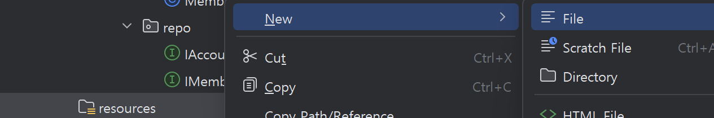    
    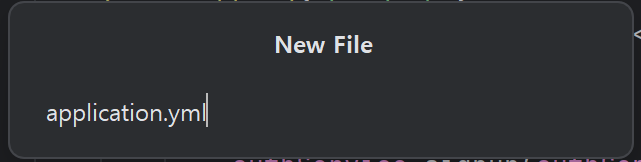    

클론 프로젝트의 동일 위치에 있는 application.yml의 내용을 복사-붙여넣기 합니다.  

```
server:
  port: ${SERVER_PORT:18080}    #애플리케이션 실행 포트. SERVER_PORT라는 환경변수값을 읽고 없으면 18080으로 지정함  
spring:
  application:
    name: ${SPRING_APPLICATION_NAME:member-service}
  datasource:                   #DB연결 정보 설정
    driver-class-name: ${DB_DRIVER:com.mysql.cj.jdbc.Driver}    #mysql driver
    url: ${DB_URL:jdbc:mysql://localhost:3306/member?serverTimezone=Asia/Seoul} #접속 주소. 로컬에 3306포트로 실행된 mysql 컨테이너와 연결
    username: ${DB_USERNAME:root}   
    password: ${DB_PASSWORD:P@ssw0rd$}
  jpa:                          #JPA설정
    database: mysql
    database-platform: org.hibernate.dialect.MySQLDialect
    show-sql: ${JPA_SHOW_SQL:false}                 # 자동생성된 SQL 표시 여부
    hibernate:
      ddl-auto: ${JPA_HIBERNATE_DDL_AUTO:update}    # Entity클래스에서 변경 시 테이블 스키마를 업데이트 함
    properties:
      hibernate:
        format_sql: ${JPA_HIBERNATE_FORMAT_SQL:true}    # 표시되는 SQL의 format을 가독성 있게 바꿀지 여부 
springdoc:                      # Swagger 설정
  swagger-ui:
    path: /swagger-ui.html      # Swagger 주소 지정. http://{host}:{port}/swagger-ui/index.html이 기본값임   

jwt:                            # JWT의 토큰 생성 Secret key, Access Token만료시간, Refresh 토큰 만료 시간 - 회원등록시엔 미사용 
  secret: ${JWT_SECRET:8O2HQ13etL2BWZvYOiWsJ5uWFoLi6NBUG8divYVoCgtHVvlk3dqRksMl16toztDUeBTSIuOOPvHIrYq11G2BwQ==}
  expiration-time: ${JWT_EXPIRATION_TIME:3600}
  refresh-token-expiration-time: ${REFRESH_TOKEN_EXPIRATION_TIME:36000}

# Logging
logging:
  level:
    root: INFO
    com.subride.member.infra.in: DEBUG      #로깅 수준은 상세한 순으로 DUBUG, INFO, WARN, ERROR가 있음   
    com.subride.member.infra.out: DEBUG
```

## Main 프로그램 개발  
애플리케이션 실행 시 제일 처음 실행되는 메인 프로그램을 개발합니다.   
com.subride.member.infra 패키지 밑에 MemberApplication 클래스를 추가 합니다.   
```
@SpringBootApplication
public class MemberApplication {
    public static void main(String[] args) {
        SpringApplication.run(MemberApplication.class, args);
    }
}
```

- MemberApplication을 com.subride.member패키지 밑으로 옮깁니다.   
이 메인 프로그램은 com.subride.member.member-biz와 com.subride.member.member-infra의    
모든 클래스 상위에 있어야 하므로 옮겨야 합니다.   
작성한 MemberApplication을 drag하여 java디렉토리에 떨굽니다.    
이동창에서 패키지명을 com.subride.member로 지정합니다.
그리고 하단의 Refactor 버튼을 누릅니다.   
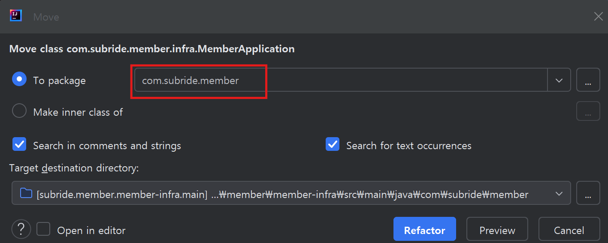    

아래와 같이 infra패키지와 같은 레벨로 이동되어야 합니다.    
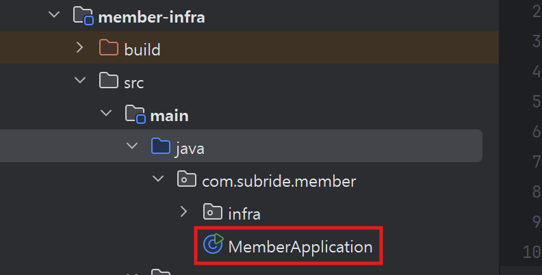


## 회원등록 테스트   
여기까지 한 후 에러가 나는 클래스가 없는지 체크 합니다.   
에러가 있는 클래스는 클래스명에 주름선같은게 보입니다.    
또한 클래스를 열었을 때 우측 상단에 에러, 경고, 약한 경고 카운트가 표시됩니다.   

- 실행 프로파일 작성   
    아래와 같이 실행 프로파일을 작성합니다.   

    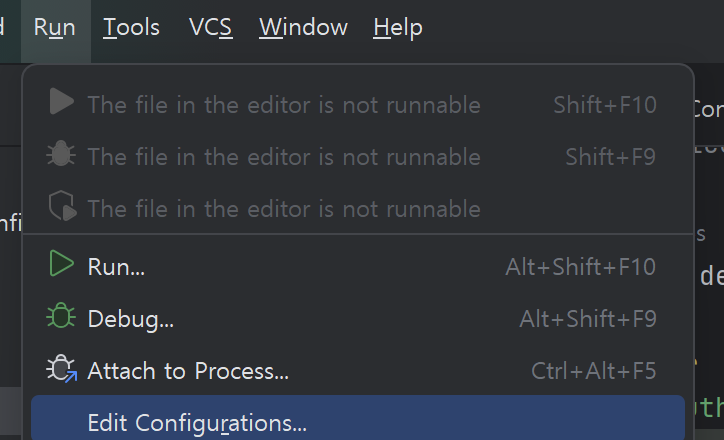    

    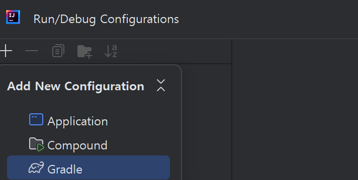    

    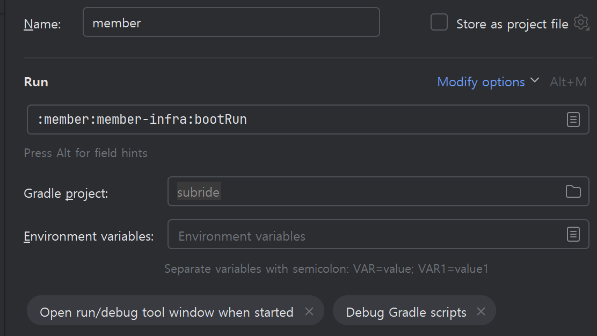     

- 실행 프로파일을 Service 목록에 추가   
    하단 맨 왼쪽 툴바 중 3번째에 있는 Service버튼을 누릅니다.  
    그리고 '+'아이콘을 클릭한 후 'Run Configuration type'을 선택하고 gradle을 지정합니다.      
    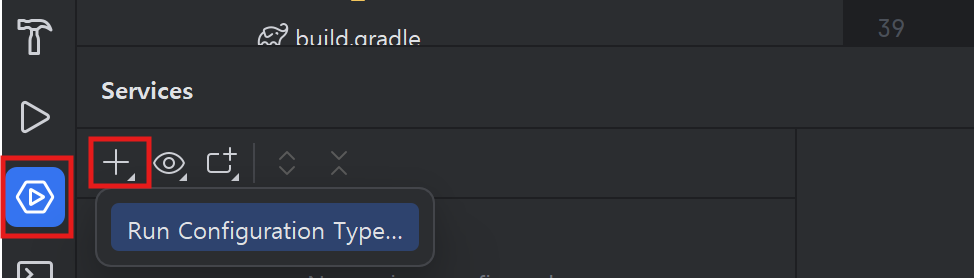
        

- 실행하기 
    실행 프로파일이 나타나면 위쪽에 있는 실행 아이콘을 눌러 애플리케이션을 실행합니다.   
    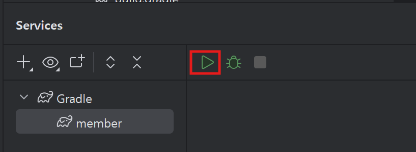

    아래와 같이 지정한 포트로 Tomcat이 실행되었다고 나오면 성공입니다.    
    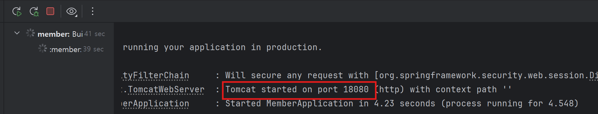

- Swagger 페이지에서 회원등록 테스트    
브라우저를 실행하고 http://localhost:18080/swagger-ui/index.html 로 접근합니다.    
Try it out 버튼을 누릅니다.   
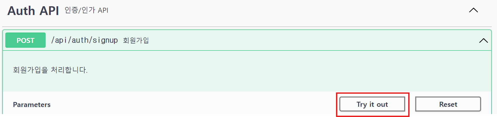    

Request body에 아래 예와 같이 값을 입력합니다.    
```
{
  "userId": "user01",
  "password": "P@ssw0rd$",
  "roles": [
    "USER"
  ],
  "userName": "유저01",
  "bankName": "KB",
  "bankAccount": "12345"
}
```

하단의 Execute 버튼을 누릅니다.    

아래로 내려 Server response에 아래와 같이 나오면 성공입니다.   
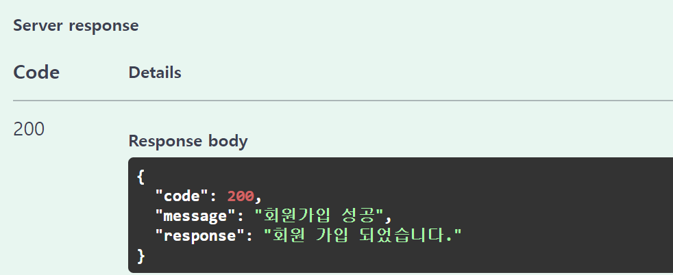

---

## 인증 처리 개발     
인증을 처리 코드를 개발 합니다.  

  - 보안 설정 Config 클래스 추가   
    member-infra프로젝트의 src/main   
    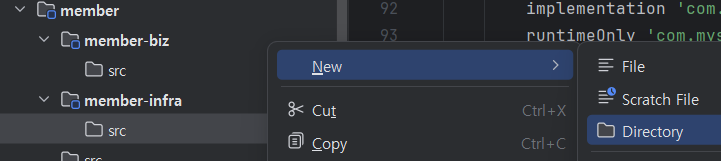


## Tip

- **로컬 Cache 삭제**      
  IntelliJ에서는 잘 발생 안하지만 아주 가끔 로컬 캐싱으로 문제가 없는데 컴파일이 안되는 경우가 있습니다.    
  이때는 아래와 같이 로컬 캐시를 전부 지우고, 다시 만들면 해결됩니다.    
  


