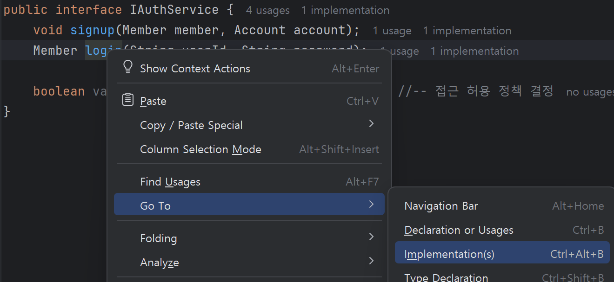

# 회원관리 서비스 개발(2)
회원관리의 나머지 부분을 개발합니다.   

## 개발 순서
| Group               | Task                          | Description                            | Link                                                           |
| :------------------ | :---------------------------- | :------------------------------------- | :------------------------------------------------------------- |
| 인증 개발 | JWT관련 라이브러리 추가 | JWT인증을 위한 라이브러리 추가 | [Link](#인증-개발--jwt-관련-라이브러리-추가)  |
|  | SecurityConfig클래스 수정 | 인증 관련 코드 추가 | [Link](#인증-개발--securityconfig클래스-수정)  |
| 로깅 | Logging 공통모듈 추가 | AOP 이용 로깅 공통모듈 추가 | [Link](#로깅--logging-공통모듈-추가)  |
| API 개발 | 로그인 API 개발 |  | [Link](#api-개발--로그인-api-추가)  |
|  | 인증 토큰 검증, 인틍 토큰 갱신 API 개발 |  | [Link](#api-개발--인증-토큰-검증-인증-토큰-갱신-api-추가)  |
|  | 회원 API 개발 |  | [Link](#api-개발--회원-api-추가)  |
| 테스트 | 회원 API 테스트 |  | [Link](#테스트--회원-api-테스트)  |
| 소스 저장 | Git 저장소 생성 및 소스 업로드 |  | [Link](#소스-저장--git-저장소-생성-및-소스-업로드)  |

## 인증 개발 > JWT 관련 라이브러리 추가 
클론 프로젝트에서 com.subride.member.infra.common.jwt를 선택하여 복사한 후,    
개발 프로젝트의 com.subride.member.infra.common패키지 밑에 붙여넣기 하십시오.    

- CustomUserDetailsService   
    인증은 Spring Security 라이브러리를 이용합니다.   
    이 라이브러리에서 인증을 처리하는 객체는 Authentication Manager입니다.   
    CustomUserDetailsService클래스는 Authentication Manager가 인증하는 과정 중    
    사용자 id와 암호를 DB에서 가져오는 부분을 재정의합니다.    
    당연히 우리가 만든 테이블에서 가져와야 하므로 이 재정의는 필수입니다.   
    이렇게 재정의된 클래스를 사용하겠다고 정의하는 부분은 SecurityConfig클래스에 있습니다.   

    ```
    @Override
    public UserDetails loadUserByUsername(String userId) throws UsernameNotFoundException {
        AccountEntity account = accountJpaRepository.findByUserId(userId)
                .orElseThrow(() -> new UsernameNotFoundException("User not found with userId: " + userId));

        Set<GrantedAuthority> authorities = account.getRoles().stream()
                .map(SimpleGrantedAuthority::new)
                .collect(Collectors.toSet());

        return User.builder()
                .username(account.getUserId())
                .password(account.getPassword())
                .authorities(authorities)
                .build();
    }
    ```
- JwtAuthenticationFilter    
    이 클래스는 웹으로 요청이 올때 이 이벤트를 가로채서 헤더에 있는 인증토큰을 검사하는 Filter 클래스입니다.   
    request객체에서 인증 토큰을 찾아내 유효한지 검증합니다.  
    ID/PW가 맞는지를 검사하는 것이 아닙니다.   
    단지 토큰이 정상적인지만 검사합니다. 
    즉, 만료된 토큰 여부, 정상적인 토큰인지 여부만 검사합니다.   
    토큰이 정상이면 SpringSecurity에 인증된 결과 객체를 저장하여 인증된 세션으로 처리되도록 합니다.   

    ```
    @Override
    protected void doFilterInternal(@NonNull HttpServletRequest request,
                                    @NonNull HttpServletResponse response,
                                    @NonNull FilterChain filterChain)
            throws ServletException, IOException {
        String token = jwtTokenProvider.resolveToken(request);

        if (token != null && jwtTokenProvider.validateToken(token) == 1) {
            Authentication authentication = jwtTokenProvider.getAuthentication(token);
            SecurityContextHolder.getContext().setAuthentication(authentication);
        }

        filterChain.doFilter(request, response);
    }
    ```

- JwtTokenProvider   
    JWT토큰의 생성, 갱신, 유효성 검사등을 처리하는 클래스입니다.   

    JWT토큰을 생성할 때는 디코딩할 때 쓸 Secret Key, 인증토큰 유효시간, 갱신토큰 유효시간을 정의해야 합니다.   
    Secret key는 매우 중요하기 때문에 환경변수로 분리하는 것이 안전합니다.   
    application.yml에 보면 JWT관련한 설정을 확인할 수 있습니다.    

    > **Secret Key 만들기**: openssl rand -base64 32  

    ```
    public JwtTokenProvider(
            @Value("${jwt.secret}") String secretKey,
            @Value("${jwt.expiration-time}") long accessTokenValidityInMilliseconds,
            @Value("${jwt.refresh-token-expiration-time}") long refreshTokenValidityInMilliseconds) {
        this.algorithm = Algorithm.HMAC512(secretKey);
        this.accessTokenValidityInMilliseconds = accessTokenValidityInMilliseconds * 1000;
        this.refreshTokenValidityInMilliseconds = refreshTokenValidityInMilliseconds * 1000;
    }
    ```
- DTO 클래스 추가   
    JWT에서 사용하하는 DTO와 로그인에서 사용하는 DTO를 복사합니다.    
    클론 프로젝트의 com.subride.member.infra.common.dto 패키지를 복사하여,   
    개발 프로젝트의 com.subride.member.infra.common 패키지 하위에 붙여 넣습니다.   
    이미 있는 클래스는 덮어 씁니다.   

| [Top](#개발-순서) |

---

## 인증 개발 > SecurityConfig클래스 수정   
    
  아래와 같이 Class명 하위에 JwtTokenProvider와 CustomUserDetailsService 객체가 생성되도록 합니다.   
    
    ```
    public class SecurityConfig {
        private final JwtTokenProvider jwtTokenProvider;
        private final CustomUserDetailsService customUserDetailsService;

        public SecurityConfig(JwtTokenProvider jwtTokenProvider, CustomUserDetailsService customUserDetailsService) {
            this.jwtTokenProvider = jwtTokenProvider;
            this.customUserDetailsService = customUserDetailsService;
        }

    ```


  아래와 같이 userDetailsService와 addFilterBefore라인의 주석을 해제 합니다.   
  그 위의 괄호 끝에 있던 세미콜론은 지워야 합니다.    

    ```
    @Bean
    public SecurityFilterChain securityFilterChain(HttpSecurity http) throws Exception {
        http
                .cors(cors -> cors
                        .configurationSource(corsConfigurationSource())
                )
                .csrf(AbstractHttpConfigurer::disable)
                .authorizeHttpRequests(auth -> auth
                        .requestMatchers(HttpMethod.GET, "/swagger-ui/**", "/v3/api-docs/**").permitAll()
                        .requestMatchers(HttpMethod.POST, "/api/auth/**").permitAll()
                        .anyRequest().authenticated()
                )
                .sessionManagement(session -> session
                        .sessionCreationPolicy(SessionCreationPolicy.STATELESS)
                )
                .userDetailsService(customUserDetailsService)
                .addFilterBefore(new JwtAuthenticationFilter(jwtTokenProvider), UsernamePasswordAuthenticationFilter.class);

        return http.build();
    }
    ```

| [Top](#개발-순서) |

---

## 로깅 > Logging 공통모듈 추가   
자동으로 로깅이 되도록 하는 공통모듈을 추가합니다.   
클론 프로젝트의 com.subride.member.infra.common.config디렉토리 하위에 있는    
LoggingAspect 클래스를 복사합니다.   

AOP(Aspect-Oriented Programming)라는 기법으로 지정된 대상 클래스에 어떤 이벤트가 발생했을때   
로깅을 하도록 만들어져 있습니다.   
이 방법을 쓰면 각 클래스의 시작과 끝에 로깅을 일일이 남기지 않아도 되어 편합니다.   


```
@Aspect       //Disable하려면 리마크 함
@Component
@Slf4j
@SuppressWarnings("unused")
public class LoggingAspect {
    private final Gson gson = new Gson();

    @Pointcut("execution(* com.subride..*.*(..))")      //로깅 대상 클래스 지정  
    private void loggingPointcut() {}

    @Before("loggingPointcut()")                            //클래스가 시작될 때 로깅 
    public void logMethodStart(JoinPoint joinPoint) {
        String className = joinPoint.getTarget().getClass().getSimpleName();
        String methodName = joinPoint.getSignature().getName();
        Object[] args = joinPoint.getArgs();

        String argString = getArgumentString(args);

        log.info("[START] {}.{} - Args: [{}]", className, methodName, argString);
    }

    @AfterReturning(pointcut = "loggingPointcut()", returning = "result")   //클래스 수행이 종료될 때 로깅
    public void logMethodEnd(JoinPoint joinPoint, Object result) {
        String className = joinPoint.getTarget().getClass().getSimpleName();
        String methodName = joinPoint.getSignature().getName();

        String resultString = getResultString(result);

        log.info("[END] {}.{} - Result: {}", className, methodName, resultString);
    }

    @AfterThrowing(pointcut = "loggingPointcut()", throwing = "exception")  //에러 발생 시 로깅
    public void logMethodException(JoinPoint joinPoint, Exception exception) {
        String className = joinPoint.getTarget().getClass().getSimpleName();
        String methodName = joinPoint.getSignature().getName();
        log.error("[EXCEPTION] {}.{} - Exception: {}", className, methodName, exception.getMessage());
    }

```

애플리케이션을 재시작하고 콘솔 로그를 보면 로깅이 자동으로 되는 걸 확인할 수 있습니다.   
    

Swagger페이지에서 회원등록 테스트를 하고 콘솔을 확인해 보십시오.   
>  **Tip**: 테스트 시 동일한 데이터로 하셔도 됩니다. 동일키 데이터는 업데이트 합니다.   
   

| [Top](#개발-순서) |

---

## API 개발 > 로그인 API 추가  
- AuthController, AuthControllerHelper 수정  
    로그인 API를 추가합니다.  

    클론 프로젝트의 AuthController에서 로그인 메소드를 복사하여   
    개발 프로젝트의 AuthController에 붙여 넣습니다.  

    아래와 같은 에러가 날 겁니다.   
    ```
    Cannot resolve method 'createToken' in 'AuthControllerHelper'
    ```

    클론 프로젝트의 AuthControllerHelper 복사하여   
    개발 프로젝트의 AuthControllerHelper를 덮어 씁니다.   

- 처리 흐름을 따라 가면서 수정   
    AuthController의 login 메소드에 보면 authService.login을 부르고 있습니다.   
    CTRL키를 누른 상태에서 마우스를 login 위에 대 보십시오.   
    클릭하면 authService의 해당 메소드로 이동합니다.   
    ```
    Member member = authService.login(loginRequestDTO.getUserId(), loginRequestDTO.getPassword());        
    ```

    authService는 인터페이스이기 때문에 코드가 없습니다.   
    실제 구현체인 AuthServiceImpl로 가야 합니다. 
    아래와 같이 login 위에서 우측 마우스를 누른 후 Go To > Implementation(s)를 선택합니다.  
       

    CTRL을 누른 상태에서 authProvider.validateAuth위에 마우스를 올린 후 클릭하여 
    AuthProvider로 이동합니다.   

    실제 구현체인 AuthProviderImpl의 해당 메소드로 가기 위해 CTRL-Alt-b를 누릅니다.  단축키입니다.  


    아래 처럼 임시로 널을 리턴하도록 되어 있을겁니다.  
    클론 프로젝트의 AuthProviderImpl에서 코드를 가져와서 붙입니다. 
    ```
    @Override
    public Member validateAuth(String userId, String password) {
        return null;
    }
    ```

    아래 에러가 날 겁니다.
    ```
    Cannot resolve symbol 'authenticationManager'
    ```

    조금 위로 올려보면 AuthenticationManager가 주석 처리된게 보일겁니다.   
    주석을 해제 합니다.  

    이제 에러가 사라졌을 겁니다.   

    이 다음 수행은 어디로 가야 할까요?    
    AuthProviderImpl에서 리턴하면 호출한 AuthServiceImpl로 가겠죠.   
    AuthServiceImpl에서는 리턴 받은 값을 자기를 호출한 AuthController로 리턴합니다.   
    그럼 다음 수행은 AuthController의 if문이 되겠네요.   
    ```
    Member member = authService.login(loginRequestDTO.getUserId(), loginRequestDTO.getPassword());
    if (member != null) {
        JwtTokenDTO jwtTokenDTO = authControllerHelper.createToken(member);
        return ResponseEntity.ok(CommonUtils.createSuccessResponse(200, "로그인 성공", jwtTokenDTO));
    } else {
        return ResponseEntity.status(HttpStatus.BAD_REQUEST).body(CommonUtils.createFailureResponse(0, "로그인 실패"));
    }
    ```

    authControllerHelper.createToken으로 CTRL키를 이용해서 가보면,   
    인증토큰이 생성되어 리턴되는 것을 보실 수 있을 겁니다.    

    다시 AuthController의 그 다음 수행을 보면 응답 데이터를 생성하여 리턴하는 것입니다.   

    이렇게 해서 로그인 처리가 끝나고 성공 코드, 메시지, 인증 토큰 값이 요청한 클라이언트로 리턴되게 됩니다.   

- 테스트
    애플리케이션을 재시작하고, swagger페이지를 열어 로그인을 테스트 해 보십시오.  
    아래와 같이 결과가 나오면 성공입니다.  
    

| [Top](#개발-순서) |

---

## API 개발 > 인증 토큰 검증, 인증 토큰 갱신 API 추가  
클론 프로젝트에서 소스를 복사하고, 흐름을 따라 가면서 코드를 이해해 보세요.   

> **Tip: 코드영역 최대화**:   
> 클래스 타이틀 영역에서 더블클릭하면 최대화 됩니다. 원래대로 돌리려면 더블클릭 다시 누르면 됩니다.  
> 

이미 다 개발이 되어 있어 수정할 건 없을 겁니다.  

애플리케이션을 재시작하고, 이번엔 프론트엔드 앱에서 로그인이 되는지 확인합니다.   

로그인이 잘 되고 메인화면에 로그인한 사용자의 정보가 나오면 성공입니다.  

| [Top](#개발-순서) |

---

## API 개발 > 회원 API 추가  
클론 프로젝트의 MemberController와 MemberControllerHelper를 복사합니다.  

MemberController에 **반드시 추가할 Annotation**이 있습니다.   
바로 **@SecurityRequirement(name = "bearerAuth")** 입니다.   
이 클래스의 API들은 인증이 필요하다는 설정입니다.   
그리고 그 인증 방식은 'bearerAuth'를 사용하겠다는 것입니다.    
bearerAuth방식은 요청 헤더의 'Authorization'키 값으로 인증토큰 값을 보낼거고,   
그 인증 토큰값은 'bearer' 다음에 있다는 것을 의미합니다.     
```
@Slf4j
@RestController
@SecurityRequirement(name = "bearerAuth")
@RequestMapping("/api/members")
@RequiredArgsConstructor
@Tag(name = "MemberEntity API", description = "회원 관련 API")
public class MemberController {
    private final MemberControllerHelper memberControllerHelper;

```

| [Top](#개발-순서) |

---

## 테스트 > 회원 API 테스트 

애플리케이션을 재시작하고 Swagger페이지를 엽니다.
사용자 API가 추가된 것을 보실 수 있을 겁니다.   
   

사용자 API를 아무거나 테스트 해 보십시오.   
성공하셨나요?  403(Forbidden) 에러가 나는게 정상입니다.   
   

인증이 안된 상태에서 사용자 정보를 요청하니까 에러가 나는겁니다.   
SecurityConfig클래스에서 우리가 그렇게 설정을 했으니까요.   
또한 MemberController의 **@SecurityRequirement(name = "bearerAuth")** 어노테이션으로  
인증토큰값을 보내는 방법을 설정했습니다.  

    

이제 약속대로 인증토큰값을 보내고 다시 테스트 해 보겠습니다.   
먼저 swagger에서 로그인 API를 테스트 한 후 그 결과값에서 accessToken키의 암호같은 긴 문자열을 복사 하십시오.   
이 값이 인증 토큰값입니다.   
    

Swagger 페이지의 우측 상단에 있는 Authorize버튼을 누릅니다.   
   

복사한 값을 붙여 넣습니다.   Authorize버튼을 누른 후 Close버튼을 눌러 닫습니다.   
   

이제 다시 회원정보 API를 테스트 합니다.   
이번에는 정상적으로 값이 리턴될 것입니다.   


진짜 요청 헤더에 인증 토큰이 약속한대로 보내지는지 봅시다.  
Swagger페이지에서 우측 마우스 버튼을 누르고 맨 아래의 '검사'메뉴를 선택하거나, F12버튼을 눌러 개발자 도구를 여세요.   
스마트폰 화면처럼 보여 너무 작으면 아래 그림에서 박스 친 왼쪽 버튼을 누르면 커집니다.   
박스 친 오른쪽 네트워크 탭을 누릅니다.   브라우저에서 서버로 보내는 요청 내용을 볼 수 있습니다.   
   

왼쪽에서 회원정보 API를 다시 테스트 합니다.   
아래 그림처럼 요청 기록이 나타날 겁니다.   


요청 기록을 누르면 상세 정보가 나옵니다.   
스크롤을 조금 내려 요청 헤더의 값을 보면 Authorization키의 값으로   
인증 토큰 값이 'Bearer'로 시작되는것을 볼 수 있습니다.   


| [Top](#개발-순서) |

---

## 소스 저장 > Git 저장소 생성 및 소스 업로드   

본인의 Git Repository를 만들고 소스를 업로드 합니다.   

- GibHub로그인, 레포지토리 만들기   
    프론트엔드 프로젝트 생성 시 해본것처럼 GitHub에 레포지토리를 만듭니다. -> [Git 업로드](https://github.com/cna-bootcamp/cna-handson/blob/main/front/create_project.md#git-%EC%97%85%EB%A1%9C%EB%93%9C)

    레포지토리의 이름은 'subride'로 합니다.  물론 변경해도 됩니다.   

- Git Push 하기  
    IntelliJ에서 GitBash 터미널을 엽니다.   
        

    > **Tip: IntelliJ 터미널에서 복사-붙여넣기**는 CTRL-c와 CTRL-v를 사용하십시오.     

    로컬 Git repository를 초기화 합니다. 
    ```
    git init 
    ```

    위에서 만든 원격 Git repository를 연결합니다.  
    아래는 예제이고 반드시 **본인 Git Repository주소로 변경** 해야 합니다.   
    ```
    git remote add origin https://github.com/hiondal/subride.git
    git remote get-url origin 
    ```

    로컬 Git repository의 브랜치를 member로 변경합니다.  
    ```
    git checkout -B member
    ```

    원격 Git repository에 푸시합니다.  
    ```
    git add . && git commit -m "member" && git push -u origin member
    ```

    v1.0.0으로 태깅하고 푸시합니다.  
    ```
    git tag -a v1.0.0 -m "회원관리 서비스" 
    git push origin v1.0.0
    ```

- 확인  
    github.com에서 잘 푸시되었는지 소스와 태그를 확인 합니다.  

---
---

지금까지 회원관리 서비스를 클론코딩 방식으로 개발했습니다.   

수고하셨습니다.  
