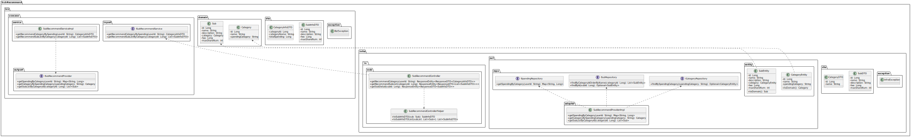
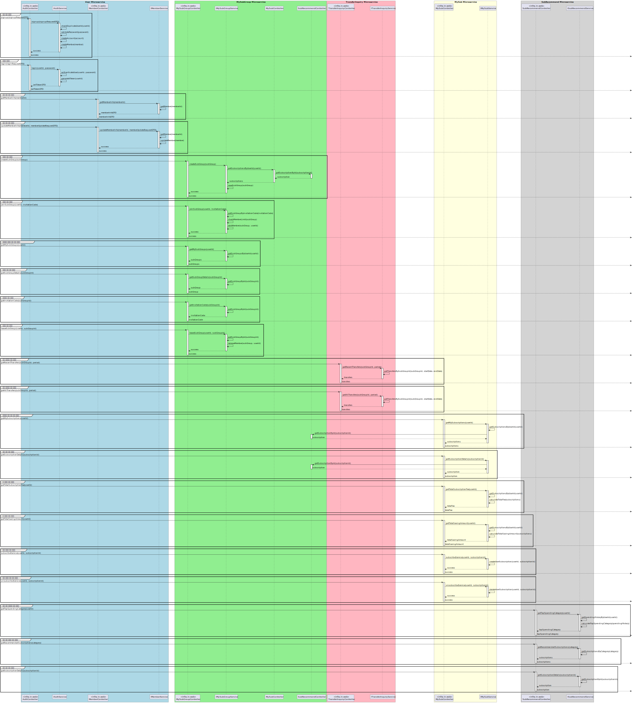
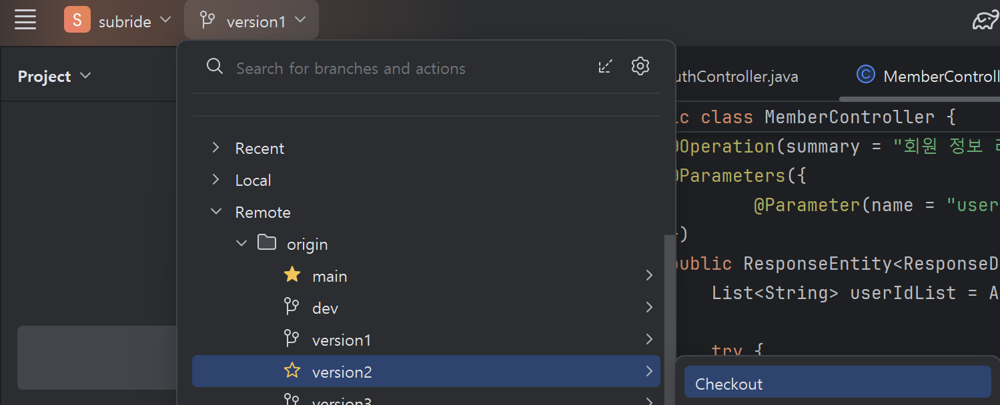
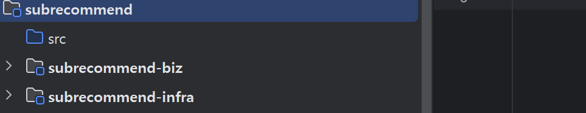

# 구독추천 서비스 개발 

## 아키텍처 설계 결과 

- **Class 설계**    
     


- **Sequence 설계**
      


## 패키지 구조  
구독추천 서비스를 개발해 봅시다.  
먼저 구독추천 서비스의 패키지 구조도입니다.  
클린 아키텍처에 맞춰서 subrecommend-biz와 subrecommend-infra 프로젝트로 나눠서   
잘 구조화되어 있습니다.  


```
subrecommend/
├── subrecommend-biz/
│   ├── src/
│   │   └── main/
│   │       └── java/
│   │           └── com/
│   │               └── subride/
│   │                   └── subrecommend/
│   │                       └── biz/
│   │                           ├── domain/
│   │                           │   ├── Category.java
│   │                           │   └── Sub.java
│   │                           ├── dto/
│   │                           │   ├── CategoryInfoDTO.java
│   │                           │   └── SubInfoDTO.java
│   │                           ├── exception/
│   │                           │   └── BizException.java
│   │                           └── usecase/
│   │                               ├── inport/
│   │                               │   └── ISubRecommendService.java
│   │                               ├── outport/
│   │                               │   └── ISubRecommendProvider.java
│   │                               └── service/
│   │                                   └── SubRecommendServiceImpl.java
│   └── build.gradle
│
└── subrecommend-infra/
    ├── src/
    │   ├── main/
    │   │   ├── java/
    │   │   │   └── com/
    │   │   │       └── subride/
    │   │   │           └── subrecommend/
    │   │   │               ├── SubRecommendApplication.java
    │   │   │               ├── infra/
    │   │   │               │   ├── common/
    │   │   │               │   │   ├── config/
    │   │   │               │   │   │   ├── DataInitializer.java
    │   │   │               │   │   │   ├── LoggingAspect.java
    │   │   │               │   │   │   ├── SecurityConfig.java
    │   │   │               │   │   │   └── SpringDocConfig.java
    │   │   │               │   │   ├── jwt/
    │   │   │               │   │   │   ├── JwtAuthenticationFilter.java
    │   │   │               │   │   │   └── JwtTokenProvider.java
    │   │   │               │   ├── dto/
    │   │   │               │   │   ├── CategoryDTO.java
    │   │   │               │   │   ├── CategorySpendingDTO.java
    │   │   │               │   │   └── SubDTO.java
    │   │   │               │   ├── exception/
    │   │   │               │   │   └── InfraException.java
    │   │   │               │   ├── in/
    │   │   │               │   │   └── web/
    │   │   │               │   │       ├── SubRecommendController.java
    │   │   │               │   │       └── SubRecommendControllerHelper.java
    │   │   │               │   └── out/
    │   │   │               │       ├── adapter/
    │   │   │               │       │   └── SubRecommendProviderImpl.java
    │   │   │               │       ├── entity/
    │   │   │               │       │   ├── CategoryEntity.java
    │   │   │               │       │   ├── SpendingEntity.java
    │   │   │               │       │   └── SubEntity.java
    │   │   │               │       └── repo/
    │   │   │               │           ├── ICategoryRepository.java
    │   │   │               │           ├── ISpendingRepository.java
    │   │   │               │           └── ISubRepository.java
    │   │   └── resources/
    │   │       └── application.yml
    └── build.gradle
```

회원관리 서비스를 개발하면서 패키지 구조에 익숙해졌으리라 생각합니다.  
이번 부터는 중요한 부분만 설명하면서 빨리 개발하도록 하겠습니다.   
설명 안한 소스에 궁금한게 있다면 저에게 묻거나 Claude에게 문의하기 바랍니다.   

## 개발 순서 
| Group | Task              | Description               | Link   |
| :-----| :-----------------| :------------------------ | :------|
| 생성 | 프로젝트 생성 | 구독추천 서비스 프로젝트 생성 | [Link](#)  |
|      | 빌드 스크립트 작성 | build.gradle 작성 | [Link](#)  |
| Biz 프로젝트 개발 | Usecase, Service, Domain 클래스 개발 | Biz 프로젝트의 클래스 복사 | [Link](#)  |
| Infra 프로젝트 개발  | Main 클래스 개발 |  | [Link](#)  |
|                     | 애플리케이션 설정 파일 작성 | application.yml 작성 | [Link](#)  |
|                     | Config, Jwt, utilility 클래스 개발 | infra.common 패키지 복사 | [Link](#)  |
|                     | DTO 클래스 개발 | infra.dto 패키지 복사 | [Link](#)  |
|                     | Entity 클래스 개발 | infra.out.entity 패키지 복사 | [Link](#)  |
|                     | Repository 클래스 개발 | infra.out.repo 패키지 복사 | [Link](#)  |
|                     | Exception 처리 클래스 개발 | infra.exception 패키지 복사 | [Link](#)  |
|                     | Controller 클래스 개발 | infra.in.web 패키지 하위에 개발 | [Link](#)  |
|                     | Gateway 클래스 개발 | infra.out.adapter 패키지 하위에 개발 | [Link](#)  |
| 테스트 | Swagger 테스트 | Swagger에서 API 테스트 | [Link](#)  |
| 소스 저장 | Git 푸시 | Gig에 소스 저장 | [Link](#)  |


## 생성 > 프로젝트 생성  

먼저 클론 프로젝트의 브랜치를 아래 그림처럼 version2로 변경하십시오.   
   

- 개발 프로젝트의 브랜치를 'subrecommend'로 변경합니다.  
    ```
    git checkout -B subrecommend
    ```

- 개발 프로젝트의 최상위에서 하위 모듈로 'subrecommend'를 추가합니다.  
- subrecommend 하위 모듈로 'subrecommend-biz'와, 'subrecommend-infa' 프로젝트를 추가합니다.
       
- subrecommend-infra 프로젝트의 src디렉토리 하위에서 아래 작업 수행  
  - main/java디렉토리 생성   
  - main/resources 디렉토리 생성   
  - main/java 디렉토리를 선택하고, 우측 마우스 메뉴에서  
    Mark Directory as > Source Root 선택   
    
  - main/resources 디렉토리 선택하고, 우측 마우스 메뉴에서  
    Mark Directory as > Resource Root 선택    
  - main/java 하위에 com.subride.subrecommend 패키지 생성   

- settings.gradle에 생성한 프로젝트를 추가합니다.  
    ```
    rootProject.name = 'subride'
    include 'common'
    include 'member:member-biz'
    include 'member:member-infra'
    include 'subrecommend:subrecommend-biz'
    include 'subrecommend:subrecommend-infra'
    ```

## subrecommend-biz 프로젝트 복사   
클론 프로젝트의 subrecommend/subrecommend-biz/src/main 디렉토리를 선택하고 CTRL-c를 눌러 복사합니다.   
개발 프로젝트의 subrecommend/subrecommend-biz/src디렉토리를 선택하고 붙여넣습니다.   
창이 두번 뜰텐데 계속 확인을 눌러 줍니다.   
두번째 창은 Git에 추가 여부를 묻는 창인데, 하단에 'Don't Ask ..' 눌러서   
이후에 안 묻고 자동 추가되게 함   

subrecommend-biz/src/main/java디렉토리 선택하고 우측 마우스 메뉴에서,   
Mark Directory as > Source Root 선택

## subrecommend-infra 기본 클래스 복사    
- infra.common 패키지 하위 클래스   
    com.subride.subrecommend 패키지 하위에 infra패키지를 추가합니다.  
    infra.common 패키지 하위 클래스를 클론 프로젝트에서 복사-붙여넣기 합니다.   

    infra.common.config.DataInitialize 클래스는 구독 카테고리와 구독 정보, 그리고   
    user01~user05의 지출 데이터를 애플리케이션 로딩 시에 생성합니다.   

    infra.common.util 하위의 TestDataGenerator는 나중에 테스트 코드 작성할 때,   
    테스트 초기 데이터를 만드는 클래스입니다.  지금은 쓰지 않지만 그냥 놔두십시오.    

- infra.dto 패키지 하위 클래스   
    클론 프로젝트의 infra.dto를 복사합니다.   
    개발 프로젝트의 com.subride.subrecommend.infra.common 패키지를 선택하고 붙여넣기 합니다.  
    Copy하는 창에서 맨 마지막의 common을 지워서 맨 끝 디렉토리가 infra가 되게 한 후 수행합니다.  
       

    CategorySpendingDTO는 지출 카테고리별 총 소비액을 담을 객체입니다.   


- infra.out.entity 패키지 하위 클래스  
    개발 프로젝트에 infra패키지 밑에 out패키지를 만듭니다.   
    클론 프로젝트의 infra.out.entiry 패키지를 복사하고,   
    개발 프로젝트의 infra.out 패키지 하위에 붙여넣기 합니다.   
        

    CategoryEntity, SpendingEntity, SubEntity

- infra.out.repo 패키지 하위 클래스   
    클론 프로젝트의 infra.out.repo 패키지를 선택하고 복사합니다.   
    개발 프로젝트의 infra.out.entity 패키지를 선택하고 붙여넣습니다.  
    Copy창에서 맨 마지막 entity를 지우고 수행합니다.  
    

- infra.exception 패키지 하위 클래스  
    클론 프로젝트의 infra.exception 패키지를 선택하고 복사합니다.   
    개발 프로젝트의 infra 패키지를 선택하고 붙여넣기 합니다.  

- SubRecommendApplication 클래스  
    클론 프로젝트의 SubRecommendApplication클래스를 복사합니다.  
    개발 프로젝트의 com.subride.subrecommend.infra 패키지를 선택하고 붙여넣기 합니다.   
    Copy창에서 Destination package를 com.subride.subrecommend로 지정하고 수행합니다.  

## subrecommend-infra의 build.gradle과 application.yml 파일 복사 
- build.gradle 복사 
    클론 프로젝트의 subrecommend-infra 밑에 있는 build.gradle파일을   
    개발 프로젝트의 동일 위치에 복사합니다.   
    복사 후 build.gradle파일을 열고 리프레시 버튼을 누르십시오.   
       

- application.yml 복사
    클론 프로젝트의 subrecommend-infra/src/main/resources/application.yml 파일을   
    개발 프로젝트의 동일 위치에 복사합니다.   

## infra.in.web의 SubRecommendController, SubRecommendControllerHelper 
개발 프로젝트의 infra 패키지 밑에 in.web 패키지를 만듭니다.   
클론 프로젝트에서 in.web 밑에 있는 SubRecommendController와   
SubRecommendControllerHelper 클래스를 복사합니다.   


## infra.out.adapter의 SubRecommendProviderImpl   
클론 프로젝트의 infra.out.adapter 를 선택하고 CTRL-c로 복사합니다.   
개발 프로젝트의 infra.out 패키지를 선택하고 붙여 넣습니다.  

## 처리  
