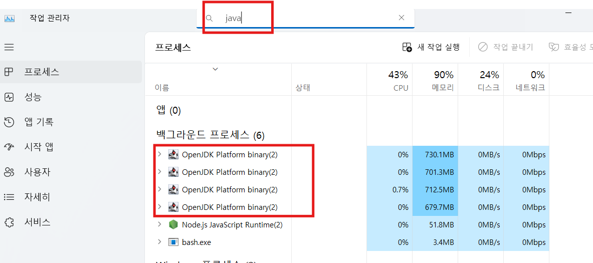
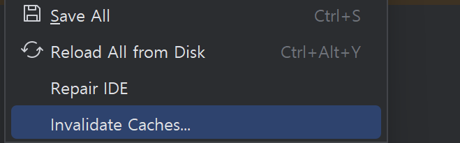

# Tip

## 백엔드 서비스 강제 종료  
가끔 백엔드 서비스가 종료되지 않는 경우가 있습니다.  
윈도우는 아래와 같이 작업관리자에서 java로 검색한 후 Java process를 강제로 종료하십시오.  
 

Mac은 아래 명령으로 java process를 찾은후 kill명령으로 프로세스를 종료합니다.  
process id는 결과 목록의 첫번째 컬럼입니다.  
```
ps -ef | grep java 
kill -9 {process id}
```

## **로컬 Cache 삭제**      
  IntelliJ에서는 잘 발생 안하지만 아주 가끔 로컬 캐싱에 문제가 생겨 컴파일이 안되는 경우가 있습니다.    
  이때는 아래와 같이 로컬 캐시를 전부 지우고, 다시 만들면 해결됩니다.    
  

