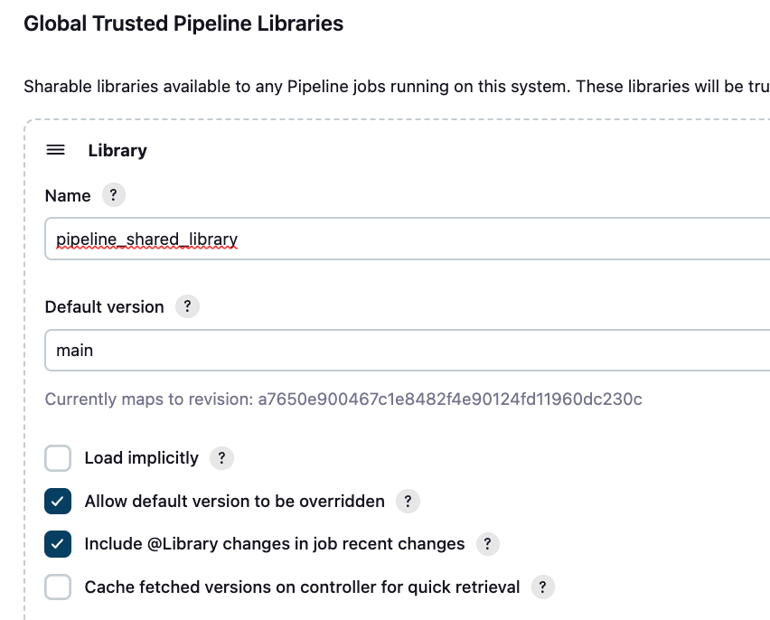
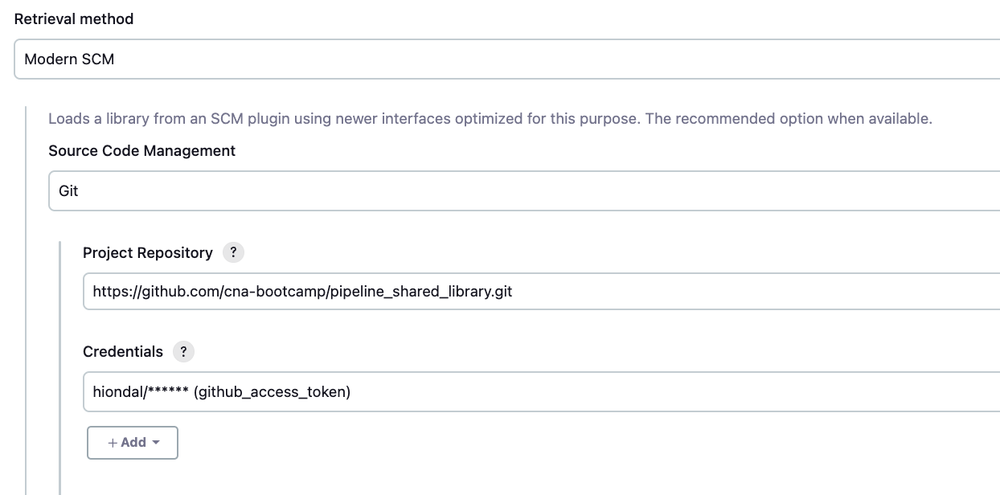

# 사전준비 및 체크사항
CI/CD를 실습하기 전에 사전에 준비하거나 체크할 사항입니다.  

## Jenkins, SonarQube 접근   
- PC의 /etc/hosts(Windows는 c:\windows\system32\drivers\etc\hosts)파일에 Jenkins, SonarQube 등록   
  ```
  43.200.12.214 myjenkins.io mydashboard.io mysonar.io
  ```  
- myjenkins.io 로그인: admin / P@ssw0rd$   
- mysonar.io 로그인: admin / P@ssw0rd$  

> mydashboard.io로 k8s dashboard로 로그인 해 보세요.   

---

## minikube 설치와 개발환경 구성

[minikube](https://m.site.naver.com/1rJS6)와 [개발환경 구성](https://m.site.naver.com/1rJRI)을 먼저 모두 완료합니다.  

- NFS Dynamic Provisioning 확인 
  - 파드 실행여부 확인  
    ```
    k get po -n nfs
    ```  
  - 기본 스토리지 클래스 확인
    ```
    k get sc
    ```
    기본 스토리지 클래스는 nfs-retain이어야 합니다.  
    없거나 기본스토리지 클래스가 아니면 [NFS서버 설치와 NFS Dynamic Provisioning 설정](https://happycloud-lee.tistory.com/178)을 참조하여 조치합니다. 
    > 팁: minikube시작 시 기본 스토리지클래스 자동으로 지정하기  
    > minikube는 재시작하면 기본 스토리지 클래스를 standard로 바꿔 버립니다.  
    > 아래 시작 shell로 minikube를 시작하면 시작 시 기본 스토리지 클래스를 nfs-retain으로 할 수 있습니다.  
    > 아래 내용으로 start_minikube.sh 파일을 만들고 chmod +x start_minikube.sh하여 실행파일로 만든 후   
    > minikube 시작할 때 이 shell로 시작하면 됩니다.  
    ```
    #!/bin/bash

    # minikube 시작
    minikube start --driver=none

    # nfs-retain을 기본 StorageClass로 설정
    kubectl patch storageclass nfs-retain -p '{"metadata": {"annotations":{"storageclass.kubernetes.io/is-default-class":"true"}}}'

    # standard StorageClass에서 기본 설정 제거
    kubectl patch storageclass standard -p '{"metadata": {"annotations":{"storageclass.kubernetes.io/is-default-class":"false"}}}'

    # StorageClass 상태 확인
    kubectl get storageclass
    ```

- Helm 설치 확인
  아래 명령으로 helm 설치와 버전을 확인합니다.  
  ```
  helm version
  ```
- Jenkins 설치 확인
  - 플러그인 설치 확인: Jenkins관리 > Plugins > Installed plugins에서 Kubernetes, Pipeline Utility Steps, Docker Pipeline, GitHub, Slack Notification, Blue Ocean 플러그인이 설치되어 있는지 확인합니다.   
  - Kubernetes 연결 설정 확인: Jenkins관리 > Clouds에 k8s cluster 연결 설정 있는지 확인  
  - Jenkins Agent 포트 설정 확인: Jenkins관리 > Security에서 'Agent'섹션의 TCP Port가 50000번으로 고정되어 있는지 확인  
    이 포트는 파이프라인 수행을 하는 파드에서 Jenkins서버를 호출할 때 사용됩니다.    
    아래 명령으로 jenkins 네임스페이스의 Service 오브젝트를 보면 jenkins-agent-listener라는 서비스가 50000번 포트로 생성된걸 볼 수 있습니다.   
    ```
    k get svc -n jenkins
    ```
  - SonarQube Credential: Jenkins관리 > Credentials에서 'sonarqube_access_token'이 등록 되었는지 확인   
  - Docker Hub Credential: Jenkins관리 > Credentials에서 'credential_dockerhub_{본인ID}'이 등록 되었는지 확인 
  - SonarQube 서버 정보 설정: Jenkins관리 > System에서 'SonarQube servers'섹션에서 확인   
  
- SonarQube 설정 확인
  - Webhook 등록 확인: Administration > Configuration에서 Webhooks선택하여 확인  
  - Quality Gate 확인: Quality Fates 메뉴에서 'Subride way' 등록 확인  

- envstr 컨테이너 이미지 확인: DockerHub로 로그인하여 envstr 이라는 이미지가 등록되었는지 확인   

- Docker Hub 접근 secret 확인   
  본인 namespace에 'dockerhub'라는 Secret 생성되었는지 확인   
  ```
  kubens {본인 namespace}
  k get secret dockerhub
  ```

---

## 공유 파이프라인 라이브러리 설정
Jenkins 관리 > System을 클릭하고 'Global Trusted Pipeline Libraries' 섹션으로 이동합니다.  
이미 등록이 되어 있을겁니다. 
나중에 본인의 라이브러리를 만드신다면 그걸로 변경해야 합니다.  
물론 자신만의 Jenkins 서버를 설치하고 거기서 바꾸셔야 합니다.  
   



---

## PC에 helm 설치  
Windows는 Chocolately 또는 scoop로 설치 합니다.  
```
$ choco install kubernetes-helm     // windows는 Chocolatey or scoop 사용

또는 

$ scoop install helm
```
Mac은 brew로 설치 합니다.  
```
brew install helm
```

리눅스는 https://happycloud-lee.tistory.com/3 을 참조하여 설치 합니다.  


