# CI/CD 파이프라인(Version1)
Version1은 하드코딩된 manifest파일을 이용하여 배포합니다.  

- [CI/CD 파이프라인(Version1)](#cicd-파이프라인version1)
  - [사전 준비](#사전-준비)
  - [Jenkins 파이프라인 작성](#jenkins-파이프라인-작성)
  - [SonarQube Project 생성](#sonarqube-project-생성)
  - [SonarQube 연결 설정](#sonarqube-연결-설정)
  - [Jenkins Piple 프로파일 작성](#jenkins-piple-프로파일-작성)
  - [Git Repository에 WebHook 추가](#git-repository에-webhook-추가)
  - [파이프라인 실행](#파이프라인-실행)


---
## 사전 준비 
- NFS Server 접근 Credential 생성
  'jenkins-nfs-ssh'라는 이름으로 SSH Username with private key 유형으로 credential을 만듭니다.   
  AWS에서 VM 만들때 받은 username과 private key파일의 내용을 넣습니다.  
  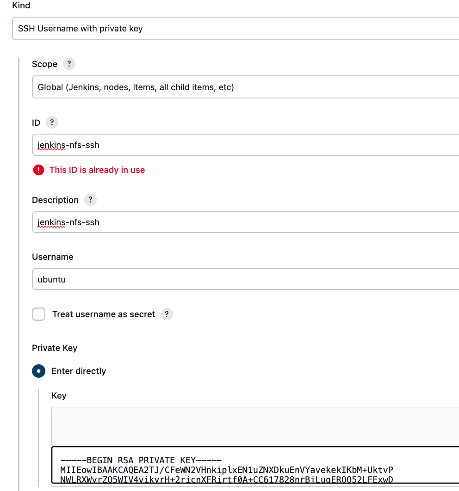  

- Git Credential 생성  
  'github_access_token_{본인ID}'라는 이름으로 Git 인증 credential을 만드십시오. 
  사실 이름은 중복되지만 않게 작성해도 됩니다.   
  등록 시 암호는 Git 로그인 암호가 아니라 Access Token을 입력해야 합니다.   

---

## Jenkins 파이프라인 작성
Spring Cloud Config 서버를 위한 파이프라인을 만들겠습니다.
- Spring Cloud Config 서버 오픈: intelliJ에서 본인이 만든 Spring Cloud Conifg 서버를 오픈     
- branch 변경: 'git checkout -B cicd1' 명령으로 branch를 'cicd1'으로 변경  
- config 디렉토리 밑에 파이프라인 관련 파일을 작성할 'deployment' 디렉토리 생성   
  - [예제 Git Repo](https://github.com/cna-bootcamp/sc/tree/cicd1/config/deployment)를 브라우저에서 엽니다.  
    **브랜치를 'cicd1'으로 변경**하고 config/deployment디렉토리로 이동합니다.  
    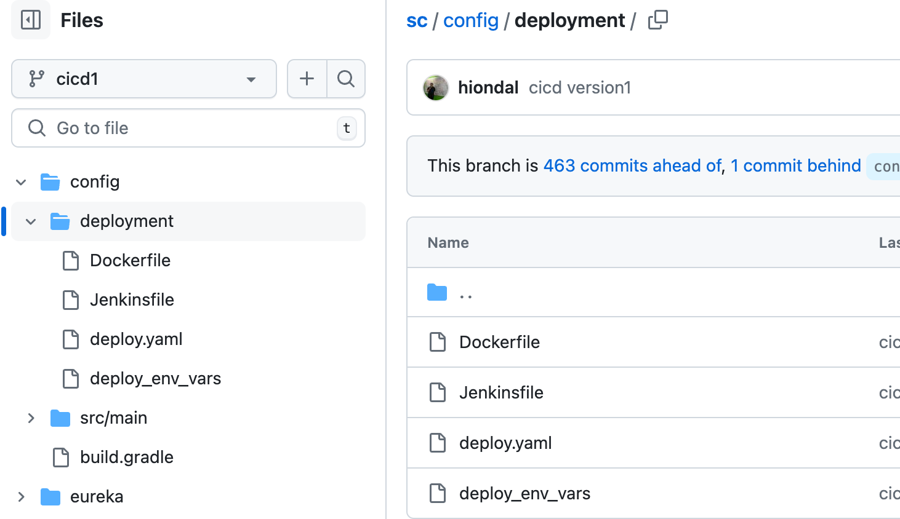
  - Dockerfile, Jenkinsfile, deploy.yaml, deploy_env_vars 파일의 내용을 복사하여   
    본인 프로젝트의 config/deployment디렉토리에 만듭니다.   

- 파이프라인 파일 내용 수정  
  - deploy.yaml
    - Deployment yaml의 spec.template.spec.containers항목 밑의 image 경로를 본인것으로 변경     
    - ConfigMap yaml의 GIT_URL, GIT_USERNAME을 본인의 Config repository 주소와 본인 Git username으로 변경  
    - Secret yaml의 GIT_TOKEN을 본인것으로 변경   
    - Ingress yaml의 host를 본인 것으로 변경: 맨 앞에 값을 본인 id로 변경   
  - deploy_env_vars
    - namespace: 배포할 본인 네임스페이스로 변경
    - image_org: 본인 Git Organization으로 변경. 별도로 Organization 안 만들었으면 로그인 username임  
    - image_tag: 파이프라인에서 생성할 Image tag임. 아무렇게나 바꿔도 됨
    - image_credential: Jenkins에 등록한 Docker Hub 접근 credential 
    - sonar_project_key: SonarQube에 등록할 SonarQube Project명. 조금 이따 만들것이고 sc-config-{본인ID}로 지정   
  - Dockerfile: 변경할 내용 없음  
  - Jenkinsfile: 변경할 내용 없음. 교재를 보고 파이프라인이 어떻게 개발되었는지 학습  

- 소스 업로드  
  아래와 같이 소스를 푸시 합니다.   
  '-u origin cicd1'은 브랜치의 소스를 최초 업로드 할때만 지정하면 됩니다.  
  ```
  git add . && git commit -m "add cicid1" && git push -u origin cicd1
  ```

---

## SonarQube Project 생성  
- SonarQube를 브라우저에서 로그인: http://mysonar.io   
- Projects 메뉴를 클릭하고 'Create Project'의 Local project 선택   
- Project name, Project key, Branch 지정
  name과 key는 동일하게 하고 deploy_env_vars파일에서 지정한 값과 동일해야 합니다. branch는 main으로 합니다.   
  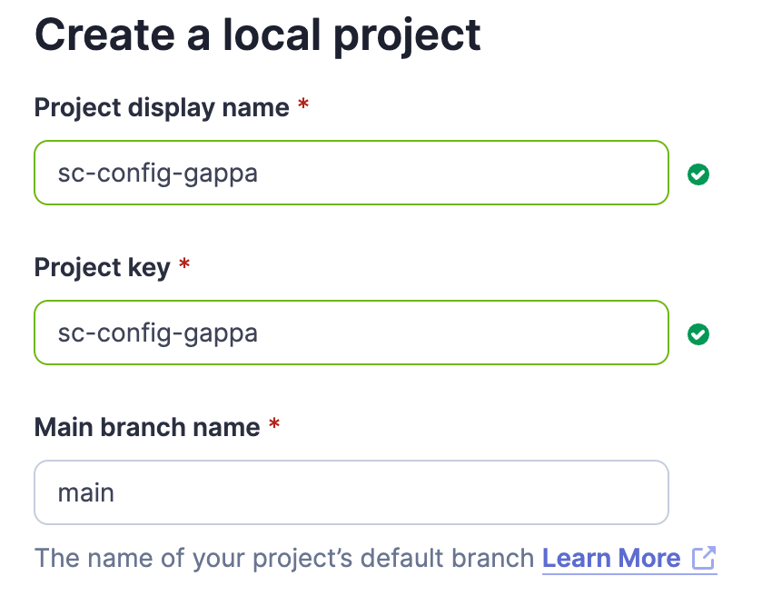  
  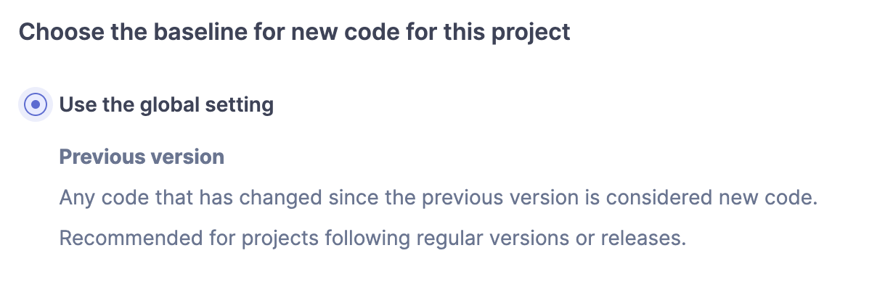  

---

## SonarQube 연결 설정 
- **Front 애플리케이션**  
  Root 폴더 밑에 'sonar-project.properties'파일 생성
  projectKey는 위에서 생성한 SonarQube Project key와 동일하게 변경  
  ```
  sonar.projectKey=subride-front-user15
  sonar.sources=src
  sonar.tests=src
  sonar.test.inclusions=src/**/*.test.js,src/**/*.test.jsx
  sonar.javascript.lcov.reportPaths=coverage/lcov.info
  ```
- **Backend 애플리케이션**    
  최상위 build.gradle에 SonarQube와 Jacoco 설정  
  plugin 'org.sonarqube' 추가  
  ```
  plugins {
	  id 'java'
	  id 'org.springframework.boot' version '3.2.6'
	  id "org.sonarqube" version "5.0.0.4638" apply false		//apply false 해야 서브 프로젝트에 제대로 적용됨
  }
  ```

  subprojects에 아래 항목 추가
  - apply plugin: 'org.sonarqube'
  - apply plugin: 'jacoco'
  - jacoco항목부터 jacocoTestReport항목까지 추가  
  ```
  subprojects {
  	apply plugin: 'org.springframework.boot'
  	apply plugin: 'org.sonarqube'
  	apply plugin: 'jacoco' // 서브 프로젝트에 JaCoCo 플러그인 적용
  
  	jacoco {
  		toolVersion = "0.8.8" // 사용할 JaCoCo 버전 지정
  	}
  
  	test {
  		finalizedBy jacocoTestReport
  	}
  
  	jacocoTestReport {
  		dependsOn test
  		reports {
  			xml.required = true
  			csv.required = false
  			html.required = true
  			html.outputLocation = layout.buildDirectory.dir("jacocoHtml").get().asFile
  		}
  	}
  }
  ```
  
---

## Jenkins Piple 프로파일 작성
My Views 클릭  
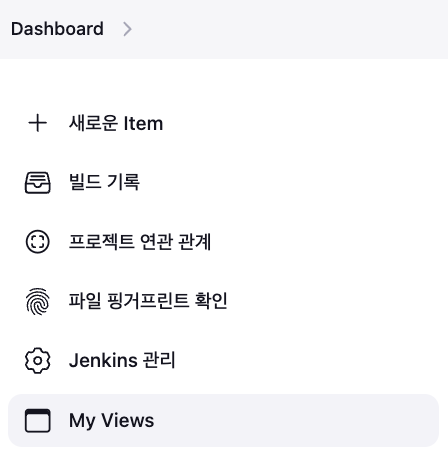   

새로운 Item 클릭  
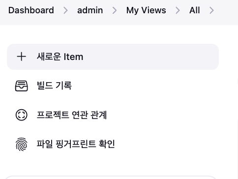  

이름을 입력하고 Pipeline을 선택  
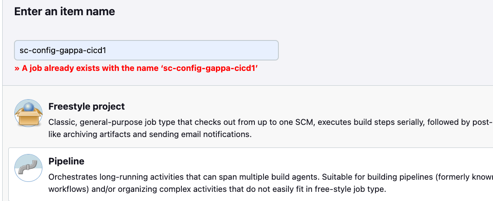

GubHub Repo의 소스 변경 시 자동으로 파이프라인 구동을 위해 체크   
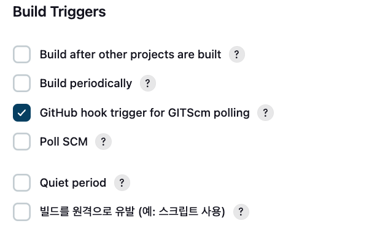   

Git Repository를 지정합니다.   
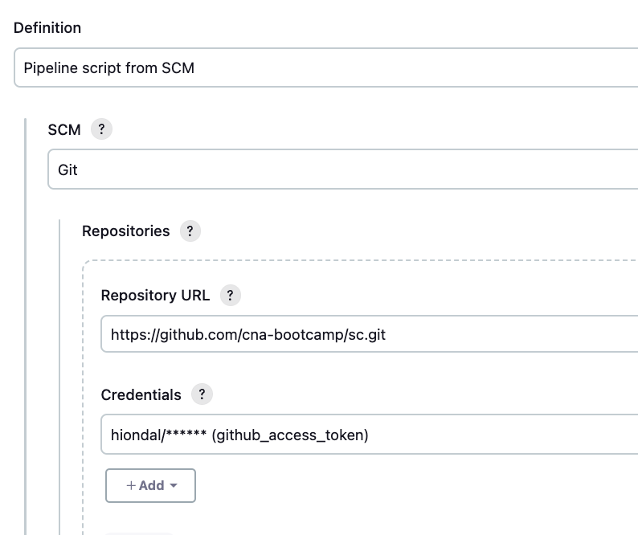

브랜치를 '*/cicd1'으로 하고, Jenkinsfile의 경로는 './config/deployment/Jenkinsfile'로 지정합니다.  
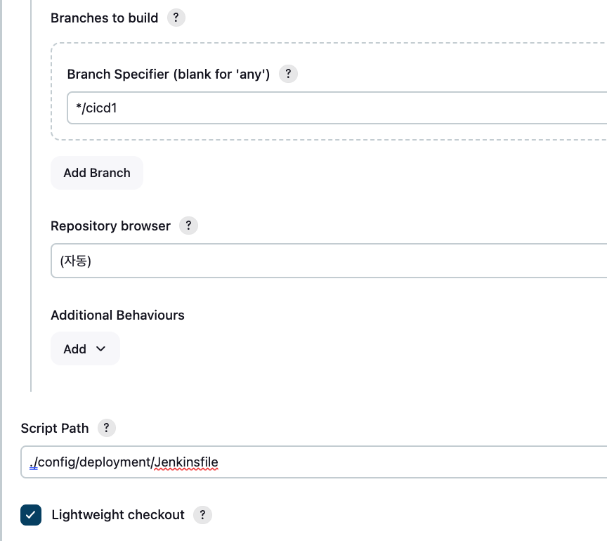 

---

## Git Repository에 WebHook 추가  
본인의 Spring Cloud Repository를 웹에서 접근합니다.   
Settings > Webhooks를 클릭합니다.   
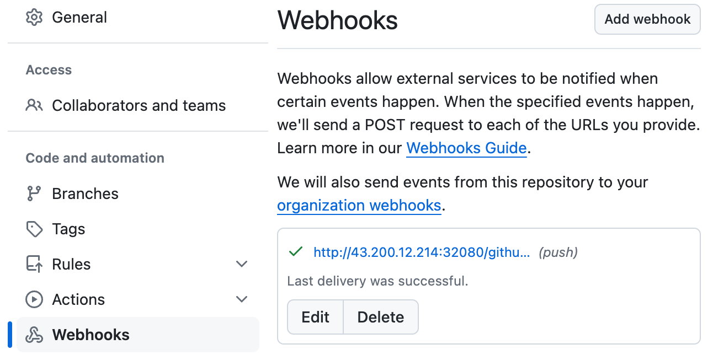   

'Add webhook'을 클릭합니다.   
주소는 minikube가 설치된 서버의 공인IP와 Jenkins의 k8s Service가 외부에 노출한 포트입니다.   
Jenkins service Port를 확인하려면 'k get svc -n jenkins' 해 보면 됩니다.   
'/github-webhook'은 고정 값이니 동일하게 입력합니다.    

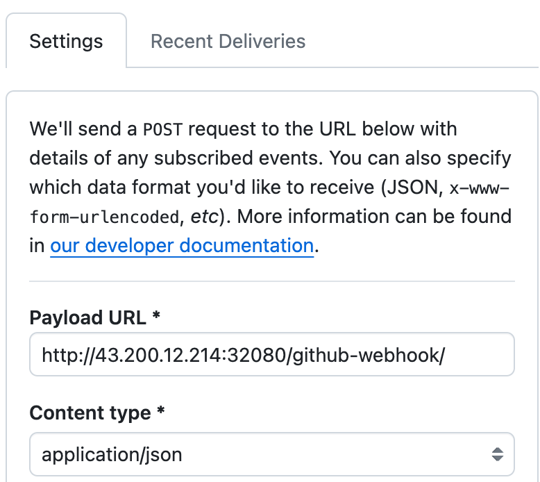

---

## 파이프라인 실행  
- 최초 실행
  소스 업로드 시 Git Webhook이 Jenkins에 파이프라인 구동을 요청하는 기능을 사용하기 위해서는   
  최소 1번은 수동으로 파이프라인을 실행해야 합니다.   
  - Jenkins의 My views에서 작성한 파이프라인을 클릭합니다.  
  - '지금 빌드'를 클릭합니다. 왼쪽 하단에서 시작되었다는 것을 확인할 수 있습니다.   
  - '블루 오션 열기'를 클릭합니다. 진행중인 파이프라인을 클릭하여 진행상황을 봅니다.   

- 소스 업로드 시 자동 파이프라인 실행   
  - 소스에서 아무 내용이나 수정합니다. 예를 들어 deployment/deploy.yaml에서 replicas를 조정합니다.   
  - 소스를 푸시 합니다.  
    ```
    git add . && git commit -m "test cicid1" && git push
    ```
  - Jenkins의 Blue Ocean 페이지에서 자동으로 파이프라인이 시작되는 것을 확인합니다.  
  

