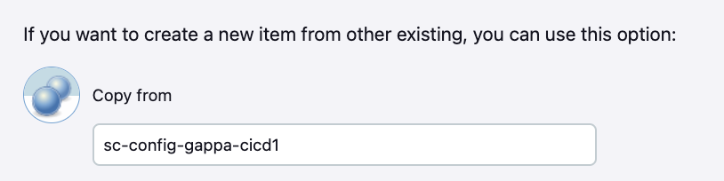

# CI/CD 파이프라인(Version2)
Version2는 템플릿화된 manifest파일을 이용하여 CI/CD합니다.  

- [CI/CD 파이프라인(Version2)](#cicd-파이프라인version2)
  - [Jenkins 파이프라인 작성](#jenkins-파이프라인-작성)
  - [Jenkins Piple 프로파일 작성](#jenkins-piple-프로파일-작성)
  - [파이프라인 실행](#파이프라인-실행)


---
## Jenkins 파이프라인 작성
Spring Cloud Config 서버를 위한 파이프라인을 만들겠습니다.
- Spring Cloud Config 서버 오픈: intelliJ에서 본인이 만든 Spring Cloud Conifg 서버를 오픈     
- branch 변경: 'git checkout -B cicd2' 명령으로 branch를 'cicd2'으로 변경  
- config/deployment 디렉토리로 이동   
  - deploy.yaml 삭제  
  - [예제 Git Repo](https://github.com/cna-bootcamp/sc/tree/cicd1/config/deployment)를 브라우저에서 엽니다.  
    **브랜치를 'cicd2'로 변경**하고 config/deployment디렉토리로 이동합니다.  
  - Jenkinsfile, deploy.yaml.template, deploy_env_vars 파일의 내용을 복사하여   
    본인 프로젝트의 config/deployment디렉토리에 만들거나 변경 합니다.    

- 파이프라인 파일 내용 수정  
  - deploy.yaml.template
    - ConfigMap yaml의 GIT_URL, GIT_USERNAME을 본인의 Config repository 주소와 본인 Git username으로 변경  
    - Secret yaml의 GIT_TOKEN을 본인것으로 변경   
    - Ingress yaml의 host를 본인 것으로 변경: 맨 앞에 값을 본인 id로 변경   
  - deploy_env_vars
    - namespace: 배포할 본인 네임스페이스로 변경
    - image_org: 본인 Git Organization으로 변경. 별도로 Organization 안 만들었으면 로그인 username임  
    - image_tag: 파이프라인에서 생성할 Image tag임. 아무렇게나 바꿔도 됨
    - image_credential: Jenkins에 등록한 Docker Hub 접근 credential 
    - sonar_project_key: 변경 불필요 
    - ingress_host: 본인 것으로 변경  
  - Dockerfile: 변경할 내용 없음  
  - Jenkinsfile: 변경할 내용 없음
    containerTempate에 'envsubst'가 추가된 것과 스테이지 'Generate deployment yaml'의 내용을 확인해 보세요.  

- 소스 업로드  
  아래와 같이 소스를 푸시 합니다.   
  '-u origin cicd2'은 브랜치의 소스를 최초 업로드 할때만 지정하면 됩니다.  
  ```
  git add . && git commit -m "add cicid2" && git push -u origin cicd2
  ```

---
## Jenkins Piple 프로파일 작성
My Views > 새로운 Item을 클릭 합니다.     
이름(예: sc-config-gappa-cicd2)을 입력하고 Pipeline을 클릭 합니다   
이전에 만든 파이프랑니에서 복사하여 만들면 구성을 더 빨리 할 수 있습니다.     
 

브랜치를 '*/cicd2'로 변경합니다.  

---

## 파이프라인 실행  
- 최초 실행
  소스 업로드 시 Git Webhook이 Jenkins에 파이프라인 구동을 요청하는 기능을 사용하기 위해서는   
  최소 1번은 수동으로 파이프라인을 실행해야 합니다.   
  - Jenkins의 My views에서 작성한 파이프라인을 클릭합니다.  
  - '지금 빌드'를 클릭합니다. 왼쪽 하단에서 시작되었다는 것을 확인할 수 있습니다.   
  - '블루 오션 열기'를 클릭합니다. 진행중인 파이프라인을 클릭하여 진행상황을 봅니다.   

- 소스 업로드 시 자동 파이프라인 실행   
  - 소스에서 아무 내용이나 수정합니다. 예를 들어 deployment/deploy_env_vars에서 image_tag를 조정합니다.   
  - 소스를 푸시 합니다.  
    ```
    git add . && git commit -m "test cicid2" && git push
    ```
  - Jenkins의 Blue Ocean 페이지에서 자동으로 파이프라인이 시작되는 것을 확인합니다.  
  

