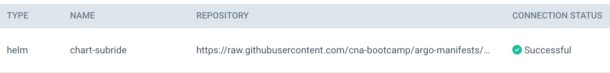
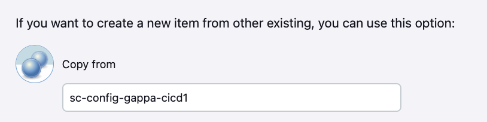

# CI/CD 파이프라인(Version4)
Version4는 ArgoCD를 연동하여 배포 합니다.  

- [CI/CD 파이프라인(Version4)](#cicd-파이프라인version4)
  - [Jenkins 파이프라인 작성](#jenkins-파이프라인-작성)
  - [manifest Git Repo 작성](#manifest-git-repo-작성)
  - [ArgoCD 설정](#argocd-설정)
  - [Jenkins Piple 프로파일 작성](#jenkins-piple-프로파일-작성)
  - [파이프라인 실행](#파이프라인-실행)
  - [ArgoCD에서 배포현황 모니터링](#argocd에서-배포현황-모니터링)


---

## Jenkins 파이프라인 작성
Spring Cloud Config 서버를 위한 파이프라인을 만들겠습니다.
- Spring Cloud Config 서버 오픈: intelliJ에서 본인이 만든 Spring Cloud Conifg 서버를 오픈     
- branch 변경: 'git checkout -B cicd4' 명령으로 branch를 'cicd4'로 변경  
- config/deployment 디렉토리로 이동   
  - [예제 Git Repo](https://github.com/cna-bootcamp/sc/tree/cicd1/config/deployment)를 브라우저에서 엽니다.  
    **브랜치를 'cicd4'로 변경**하고 config/deployment디렉토리로 이동합니다.  
  - Jenkinsfile, deploy_env_vars 파일의 내용을 복사하여   
    본인 프로젝트의 config/deployment디렉토리에 만들거나 변경 합니다.   

- 파이프라인 파일 내용 수정  
  - deploy_env_vars
    - image_org: 본인 Git Organization으로 변경. 별도로 Organization 안 만들었으면 로그인 username임  
    - image_tag: 파이프라인에서 생성할 Image tag임. 아무렇게나 바꿔도 됨
    - image_credential: Jenkins에 등록한 Docker Hub 접근 credential 
  - Dockerfile: 변경 내용 없음  
  - Jenkinsfile
    containerTempate에 'helm'이 삭제되고, 다시 'kubectl'이 추가된 것 확인   
    스테이지 'Modify ${MANIFEST_FILE}', 'Update ArgoCD Application', 
    'Push to Git', 'Apply ArgoCD Application'이 추가된 것 확인   

- 소스 업로드  
  아래와 같이 소스를 푸시 합니다.   
  '-u origin cicd4'은 브랜치의 소스를 최초 업로드 할때만 지정하면 됩니다.  
  ```
  git add . && git commit -m "add cicid4" && git push -u origin cicd4
  ```

---

## manifest Git Repo 작성  
ArgoCD Application과 각 애플리케이션 manifest를 관리할 Repository를 만듭니다.   
- Repository 생성  
  GitHub에서 빈 Repository를 추가 합니다.   
- 로컬 작업 디렉토리 하위에 'argo-manifests'디렉토리 생성 후 이동   
  ```
  mkdir -p ~/workspace/argo-manifests && cd ~/workspace/argo-manifests 
  ```
- manifest 복사
  복사할 파일이 많으므로 https://github.com/cna-bootcamp/argo-manifests 을 로컬에 클론합니다.   
  임시 디렉토리를 만들고 거기에 클론 합니다.   
  ```
  mkdir -p ~/workspace/tmp && cd ~/workspace/tmp  
  git clone https://github.com/cna-bootcamp/argo-manifests.git  
  ```

  - ArgoCD Application yaml 생성  
    argocd/config.yaml 내용을 복사하여 로컬 Git Repo에 만듭니다.   
    - spec.project: subride-{본인ID} 형식으로 변경합니다.  
    - spec.source.repoURL에서 'cna-bootcamp'를 본인의 Git Organization으로 변경합니다.  
    - spec.source.helm.values 항목 하위의 값은 그대로 놔두십시오.      
      왜냐하면 파이프라인에서 이 부분의 값을 변경할 것이기 때문입니다.  
      사실 helm항목을 지우셔도 됩니다.    
    - destination.namespace를 본인 네임스페이스로 변경합니다.   

  - 애플리케이션 Config yaml 생성  
    config/config.yaml을 복사하여 본인의 로컬 Git Repo에 만듭니다.  
    - image.repository 수정 
    - configMap.data에서 GIT_URL, GIT)USERNAME 수정  
    - secret.data의 GIT_TOKEN을 본인것으로 변경   
    - ingress.rules.host를 본인 것으로 변경: 맨 앞에 값을 본인 id로 변경  

- Helm chart 복사 
  관리 편의를 위해 Helm chart도 manifest 관리 Repository로 옮깁니다.   
  샘플 Git Repo의 charts디렉토리를 통째로 본인 Git Repo로 복사합니다.   

  charts디렉토리로 이동하여 stable/index.yaml을 갱신합니다.  
  ```
  cd charts 
  rm stable/subride-1.0.4.tgz
  helm package source/subride
  mv subride-1.0.4.tgz stable/
  helm repo index stable
  ```

- Git push
  - 로컬의 helm-charts 디렉토리에서 로컬 Git 생성
    ```
    git init
    ```
  - 원격 Git Repo와 연결
    ```
    git remote add origin {원격 Git Repo 주소}
    ```

  - 로컬 브랜치 main으로 변경
    ```
    git checkout –B main
    ```
  - 원격 Git Repo에 푸시
    ```
    git add . && git commit –m "add argo-manifests" && git push –u origin main
    ```

---
## ArgoCD 설정
ArgoCD에 Project를 만들고 Helm chart 연결 설정도 합니다.  

https://argo.43.200.12.214.nip.io로 접근하여 username 'admin', password 'P@ssw0rd$'로 로그인합니다.  

- Project 추가 및 설정
  Settings > Projects를 클릭합니다.  
  New Project를 클릭합니다.  
  Project명에 subride-{본인id} 형식으로 입력합니다.   
  argocd/config.yaml의 spec.project와 동일한 값을 입력해야 합니다.  
  
  
  Source Repository에 Helm chart주소를 추가합니다.
  'cna-bootcamp'는 본인의 Git Organization으로 변경해야 합니다.    
  

  Destination을 설정합니다. namespace는 본인 것으로 변경해야 합니다.  
  

- Repository 연결  
  Settings > Repositories를 클릭합니다.  
  아래 그림과 같이 연결 설정을 합니다. Name, Project, Repository URL은 본인 것으로 변경하십시오.   
  private repo인 경우에는 반드시 username과 password도 넣어야 합니다.   
  password는 Git login 암호가 아니라 Access Token을 넣어야 합니다.   
  

  이렇게 연결 상태가 'Successful'로 나와야 합니다.   
  


---
## Jenkins Piple 프로파일 작성
My Views > 새로운 Item을 클릭 합니다.     
이름(예: sc-config-gappa-cicd4)을 입력하고 Pipeline을 클릭 합니다   
이전에 만든 파이프랑니에서 복사하여 만들면 구성을 더 빨리 할 수 있습니다.     
 

브랜치를 '*/cicd4'로 변경합니다.  

---

## 파이프라인 실행  
- 최초 실행
  소스 업로드 시 Git Webhook이 Jenkins에 파이프라인 구동을 요청하는 기능을 사용하기 위해서는   
  최소 1번은 수동으로 파이프라인을 실행해야 합니다.   
  - Jenkins의 My views에서 작성한 파이프라인을 클릭합니다.  
  - '지금 빌드'를 클릭합니다. 왼쪽 하단에서 시작되었다는 것을 확인할 수 있습니다.   
  - '블루 오션 열기'를 클릭합니다. 진행중인 파이프라인을 클릭하여 진행상황을 봅니다.   

- 소스 업로드 시 자동 파이프라인 실행   
  - 소스에서 아무 내용이나 수정합니다. 예를 들어 deployment/deploy_env_vars에서 replicas를 조정합니다.   
  - 소스를 푸시 합니다.  
    ```
    git add . && git commit -m "test cicid4" && git push
    ```
  - Jenkins의 Blue Ocean 페이지에서 자동으로 파이프라인이 시작되는 것을 확인합니다.  
  
---

## ArgoCD에서 배포현황 모니터링  

파이프라인이 모두 수행된 후 ArgoCD Application이 나타나고, 클릭하여 세부정보를 보면  
배포된 k8s 오브젝트가 나타나는지 확인합니다.  


> 주의: k8s 오즈겍트를 수동으로 지울 수 없게 됨  
> 예를 들어 콘솔에서 k delete deploy config로 Deployment객체를 지워도   
> 다시 객체가 살아나 지워지지 않습니다.   
> 왜냐하면 ArgoCD가 자동으로 k8s객체의 상태를 자신이 갖고 있는 정보와 동일하게 유지해 주기 때문입니다.   

수동으로 객체를 지우려면 ArgoCD Application의 동기화 옵션을 Manual로 변경해야 합니다.   
ArgoCD Application의 상세정보로 들어가서 상단 좌측의 'DETAILS'를 클릭한 후   
맨 아래쯤의 SYNC OPTIONS에서 변경합니다.   

