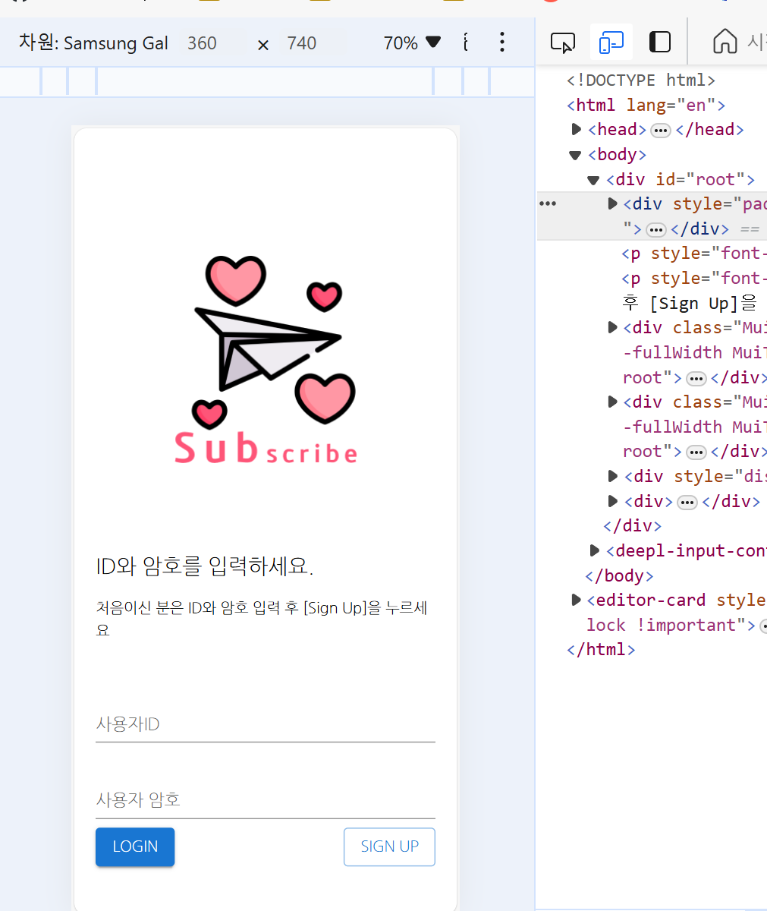
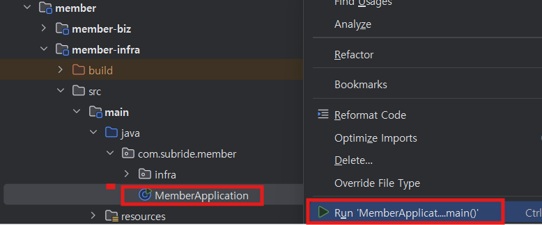
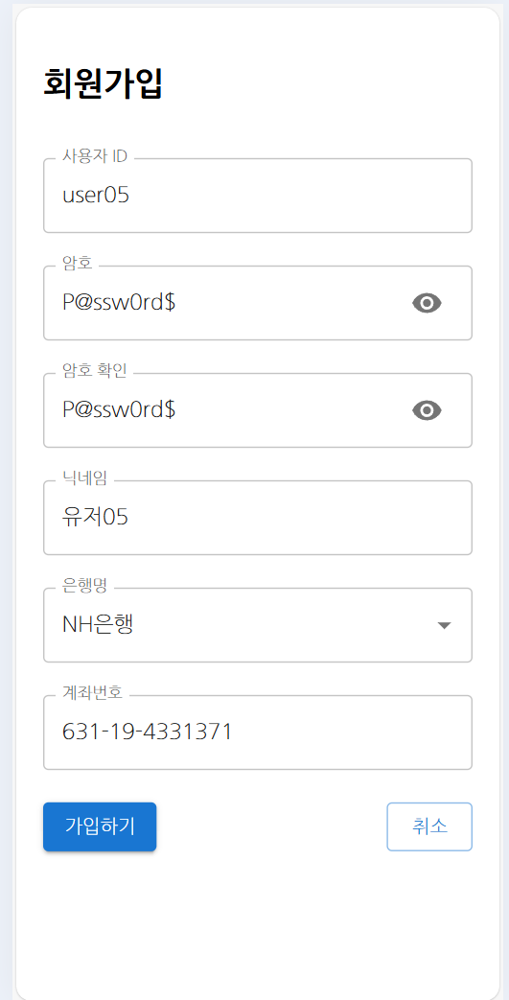
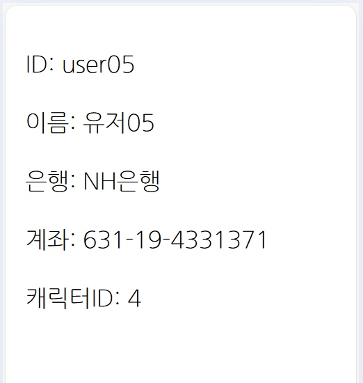
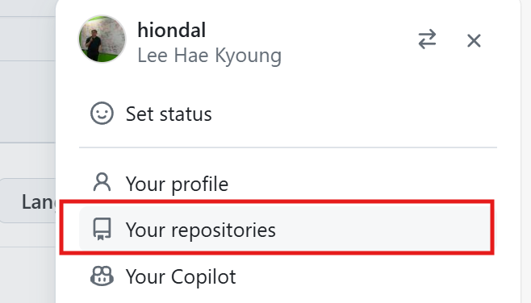
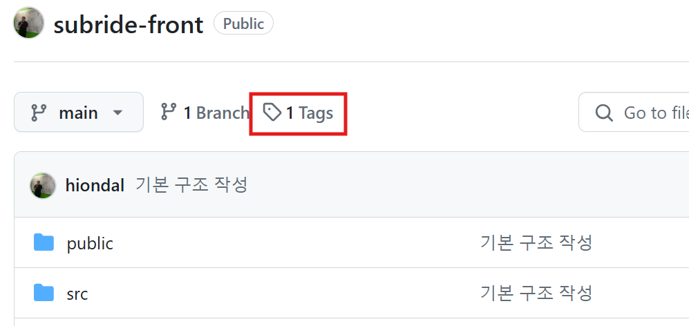
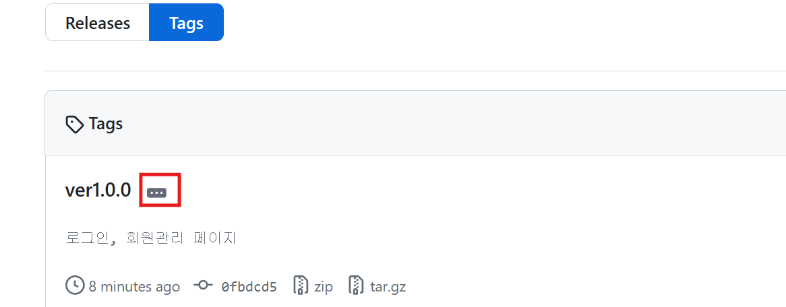

# Version1 개발  

Version1에서는 로그인 페이지와 회원가입 페이지를 만듭니다.   

## 로컬 Git 브랜치 변경    
앞으로 개발될 각 버전별로 브랜치를 나눌것입니다.   
첫번째 버전의 브랜치명은 'version1'으로 합니다.   
- 아래 명령으로 version1 브랜치를 만듭니다.  
> -B 옵션은 브랜치가 없으면 생성하고 이동하는 것임   
```
git checkout -B version1 
```

## 로그인 페이지 개발  
React 컴포넌트(페이지)는 목적별로 디렉토리를 만드는 것이 관리하기 쉽습니다.   
- 컴포넌트 디렉토리 생성   
아래와 같이 pages디렉토리를 만들고 하위에 Auth와 Main 디렉토리를 만드십시오.   
   
   
Main폴더를 만들때는 'pages' 위에서 우측 마우스 버튼을 누르면 됨   


- 로그인 컴포넌트 개발   
  - Login.jsx파일 복사: 클론 프로젝트에서 Login.jsx파일을 복사합니다.   
    > **Tip: 확장자 js와 jsx의 차이**  
    > js: javascript의 약자로 스크립트 작성 용도로 사용    
    > jsx: javascript XML의 약자로 스크립트와 HTML을 사용   
    > 확장자를 js로 개발해도 되나 React 컴포넌트는 보통 jsx확장자를 씀   
  
  - 아래와 같이 TextField 객체에 onChange, onKeyDown등의 이벤트 발생시 처리 함수를 적절히 지정함    
  ```
    <TextField
    id="userId"
    label="사용자ID"
    variant="standard"
    type="text"
    value={userId}
    onChange={handleUserIdChange}
    onKeyDown={handleUserIdKeyDown}
    fullWidth
    margin="normal"
    error={!!userIdError}
    helperText={userIdError}
    />
  ```

  사용자가 id를 입력할 때마다 setUserId함수로 userId값이 바뀌게 됨   
  ```
  const [userId, setUserId] = useState("");
  {중략}
  const handleUserIdChange = (event) => {
    setUserId(event.target.value);
    setUserIdError("");
  };
  ```

  - 로그인 처리     
  ```
    <Button variant="contained" onClick={handleLogin}>
        Login
    </Button>
  ```

  입력값 체크를 하고 login함수를 호출. 그 결과값에 따른 수행을 함   
  ```
  const handleLogin = () => {
    if (!userId) {
      setUserIdError("사용자ID를 입력하세요");
      return;
    }
    if (!password) {
      setPasswordError("암호를 입력하세요");
      return;
    }

    login(userId, password).then((result) => {
        ...
    }
  }
  ```

  과거 accessToken이 있으면 요청 헤더에 인증 토큰이 넘어가므로 초기화함  
  api 모듈을 이용하여 API를 호출. await는 Non-Blocking 통신을 하겠다는 의미임   
  즉, API 호출 후 페이지의 다른 객체들은 계속 동작하도록 하고, 응답이 오면 그 다음줄의 return data가 수행됨  
  ```
    const login = async (userId, password) => {
        try {
            sessionStorage.removeItem("accessToken");
            const { data } = await api("member").post("/auth/login", { userId, password });
            return data;
        } catch (err) {
            return err;
        }
    };
  ```

  API결과값(result)을 받아 처리함.   
  로그인 성공(result.code가 200)이면 인증토큰과 리프레시 토큰을 세션 스토리지에 저장함    
  > **인증토큰**  
  > API호출 시 'api'모듈에 의해 요청 헤더에 추가됨   
  > 백엔드 애플리케이션은 이 인증토큰 유효성 검사를 해서 유효한 요청만 처리함   
   
  > **리프레시 토큰**  
  > 보안 상 인증토큰의 유효 시간은 짧게 가져감(보통 30분)  
  > 이 시간이 경과하면 리프레시 토큰을 회원관리 서비스로 보내 인증토큰을 재생성함   
  > 그래서 인증토큰 만료시간과 리프레시 토큰 만료 시간을 다르게 가져감   
  > 당연히 리프레시 토큰 만료 시간은 길게 가져감(보통 1일 정도)  
  > 이 처리는 utils/useAuthCheck.js에서 하게 되고, App.js에서 이 모듈을 불렀기 때문에  
  > 애플리케이션이 실행되는 동안 useAuthCheck는 계속 인증 관련 Task를 수행함   
  > useAuthCheck는 주기적으로 인증토큰이 유효한 지 멤버서비스에 요청하고,   
  > 만료가 되면 리프레시 토큰을 보내 인증 토큰을 재생성함   
  > 또한, 일정 시간 사용하지 않으면 자동으로 로그아웃 처리도 함   

  > **세션 스토리지**:   
  > 쿠키와 비슷하게 브라우저가 제공하는 로컬 저장공간임   
  > 페이지를 새로고침만 해도 없어져서 쿠키보다 조금 더 안전함   
  > 그러나 브라우저의 '검사'도구(F12누르면 나옴)로 보거나 변조할 수 있어 중요 데이터는 저장하면 안됨   
  > 그래서 실제 운영시에는 HTTPS를 사용하고 HTTP Only쿠키라는 것을 사용해서 사용자가 접근 못하게 함  

  인증토큰과 리프레시 토큰을 세션스토리지에 저장한 후에는  
  인증토큰을 디코드하여 사용자의 정보를 user객체에 담습니다.  
  그리고 로그인 페이지가 호출될 때 파라미터로 전달받은 handleAfterLogin함수를 부릅니다.  
  handleAfterLogin함수는 App.js에 있고, 사용자 정보를 세션스토리지 저장하여   
  다른 컴포넌트에서 사용할 수 있도록 합니다.  
  ```
    login(userId, password).then((result) => {
      //console.log(result);
      if (result.code === 200) {
        sessionStorage.setItem("accessToken", result.response.accessToken);
        sessionStorage.setItem("refreshToken", result.response.refreshToken);
        
        const decodedToken = jwtDecode(result.response.accessToken);
        const user = {
          id: decodedToken.sub, 
          userId: decodedToken.sub,
          userName: decodedToken.userName,
          bankName: decodedToken.bankName,
          bankAccount: decodedToken.bankAccount,
          profileImg: decodedToken.characterId,
        }
        
        handleAfterLogin(user);
      } else { ... }
  ```

  - 회원가입 컴포넌트로 이동   

  navigate모듈을 이용하여 signup페이지로 이동하게 합니다.  
  ```
  const handleSignUp = () => {
    navigate("/signup");
  };
  ```

## 회원가입 페이지 개발  

- 클론프로젝트의 'Signup.jsx'를 Auth폴더 밑으로 복사합니다.  
- 회원가입 버튼을 누르면 handleSubmit함수를 호출하여 등록 처리를 합니다.   

api모듈을 이용하여 회원관리 서비스에 사용자 등록을 요청합니다.  
요청할 때 사용자가 입력한 데이터를 전송합니다.  
```
const handleSubmit = async (e) => {
    {중략}
    try {
      sessionStorage.removeItem("accessToken");
      const { data:result } = await api("member").post("/auth/signup", {
        // apiInstance 사용
        userId: userId,
        password: password,
        roles: ["USER"],
        userName,
        bankName,
        bankAccount,
      });
    }
   {중략}
} 
```

## 간이 메인 컴포넌트 개발
테스트를 위해 간이로 메인 컴포넌트를 개발합니다.   
로그인한 사용자 정보를 표시하는 간단한 페이지입니다.   
- 클론프로젝트의 Main/Main.jsx를 동일한 위치에 복사합니다.   

## 1차 테스트  
- 라이브러리 설치: package.json에 정의된 라이브러리를 설치   
터미널에서 아래 명령으로 설치합니다.  설치된 라이브러리는 node_modules디렉토리에 설치됩니다.  
> '-s'옵션은 silent mode 옵션입니다. 경고 나오는게 보기 싫어서 지정했습니다.  
```
npm install -s   
```

- 애플리케이션을 실행합니다.   
```
npm start 
```

- 자동으로 브라우저에 로그인 페이지가 나올 겁니다.  
스마트폰 사이즈로 보기 위해 마우스 우측 메뉴에서 맨 아래에 있는 '검사'를 누릅니다.   


위와 같이 로그인 페이지가 나오면 성공입니다. 

## 회원관리 서비스 연동
백엔드 연동 테스트를 위해 회원관리 서비스를 실행하겠습니다.   
회원관리 서비스 개발은 별도의 교재에서 설명 합니다.   

- 백엔드 애플리케이션 소스 다운로드   
  - MobaXTerm 터미널(Mac사용자는 맥터미널)을 여십시오.  
  - {HOME}/clone 디렉토리로 이동    
  ```
  cd ~/clone
  ```    
  
  - 백엔드 서비스 중 회원관리 서비스가 개발된 version1 브랜치를 clone합니다.   
  ```
  git clone -b version1 https://github.com/cna-bootcamp/subride.git 
  ```    
  
  - IntelliJ를 실행하고 {HOME}/clone/subride 프로젝트를 오픈합니다.   

- MySQL 컨테이너를 실행합니다.   
  개발환경 설정 시에 이미 실행중인 MySQL컨테이너가 있을 수 있습니다.    
  먼저 아래와 같이 컨테이너를 검사하고 만약 있으면 하실 필요 없습니다.    
  ```
  docker ps
  ```
  > **Tip: 컴퓨터 재부팅 시 Docker 엔진 실행**    
  > Windows에 설치한 Docker Desktop은 재부팅 시 자동으로 실행됩니다.    
  > 그러나 Mac은 수동으로 실행해 줘야 합니다.    
  > 터미널에서 open -a docker 명령으로 시작해 주십시오.    

  아래 예와 같이 mysql 컨테이너가 실행 중이라면 또 실행할 필요 없습니다.
  ```
    [LG.DESKTOP-54V95N8] ⮞ docker ps
    CONTAINER ID   IMAGE                      COMMAND                  CREATED        STATUS        PORTS                                                                                                         NAMES
    88d268ac9a65   mysql                      "docker-entrypoint.s?�?"   33 hours ago   Up 33 hours   0.0.0.0:3306->3306/tcp, 33060/tcp                                                                             mysql
  ```
  
  실행은 안되어 있지만 정지만 되어 있을 수 있습니다. 
  아래 명령으로 체크해 보십시오.    
  ```
  docker ps -a 
  ```

  아래 예와 같이 STATUS가 'Exited'인 mysql 컨테이너가 있는지 체크 하십시오.   

  ```
    CONTAINER ID   IMAGE                      COMMAND                  CREATED        STATUS                     PORTS                                                                                                         NAMES
    88d268ac9a65   mysql                      "docker-entrypoint.s?�?"   33 hours ago   Exited (0) 9 seconds ago                                                                                                                 mysql
  ```

  만약 있다면 아래 명령으로 MySQL 컨테이너를 시작하십시오.      
  시작 후에 상태가 'Up'으로 바뀌었으면 잘 시작된겁니다.   
  ```
  docker start mysql 
  docker ps
  ```

  새로 MySQL 컨테이너를 실행해야 할 상황이면 아래 명령으로 실행하십시오.    
  ```
  docker run -d --name mysql -p 3306:3306 -e MYSQL_ROOT_PASSWORD=P@ssw0rd$ mysql
  ```

  - 회원관리 서비스를 시작합니다.    
  MemberApplication을 찾아 우측 마우스 메뉴에서 실행하십시오.   
      


- 회원가입 테스트   
  - 로그인 화면에서 [SIGN UP]버튼을 눌러 회원가입 페이지로 이동합니다.    
  - 사용자 ID는 user01~user05사이의 값으로 입력합니다. 테스트 소비 데이터가 그 ID로 생성되었기 때문입니다.    
  - 나머지 항목은 자유롭게 입력 하십시오.   
     
  - 회원가입 버튼 클릭 시 '회원 가입이 되었습니다.'라는 토스트 메시지가 잠깐 나오고    
  로그인 페이지로 이동하면 성공입니다.   

- 로그인 테스트   
  - 등록한 ID와 패스워드로 로그인 합니다.   
  - 아래와 같이 로그인한 사용자 정보가 나오면 성공입니다.   
     

## 푸시 및 Tagging  
- Git에 푸시 합니다.   
> **Tip: 이전 명령어 찾기**    
> 터미널에서 위/아래 화살표를 누르면 이전에 사용한 명령어를 볼 수 있습니다.    
> history라는 명령을 치면 이전 명령어 목록을 볼 수 있습니다.    
> CTRL-r을 누르면 키워드로 명령어를 찾을 수 있습니다. 찾은 후 ESC를 누르고 수정한 후 실행하면 됩니다.     
   
```
git add . && git commit -m "로그인, 회원가입 페이지 완료" && git push -u origin main
```

- Version 태깅: 버전관리를 위해 tagging합니다.   
```
git tag -a ver1.0.0 -m "로그인, 회원관리 페이지"
git push origin ver1.0.0
``` 
GitHub에서 레포지토리로 이동합니다.  
맨 우측 상단의 본인 프로파일 아이콘 눌러 레포지토리로 이동 합니다.       


Tags를 클릭합니다. 버전 태그를 확인할 수 있습니다.   
    
    

> **Tip: 태그 삭제**  
> 로컬 Git repository 태그 삭제: ex) git tag -d ver1.0.0    
> 원격 Git repository 태그 삭제: ex) git push origin :refs/tags/ver1.0.0    


## 프로세스 정리   
이후 개발과 테스트를 위해 프론트엔드, 백엔드를 중지합니다.   
- 프론트엔드: vscode 터미널에서 CTRL-C를 눌러 중지   
- 백엔드: IntelliJ에서 아래 화면 참고해서 중지   
   
> **MySQL**은 이후 계속 사용하므로 실행해 놓습니다.   


