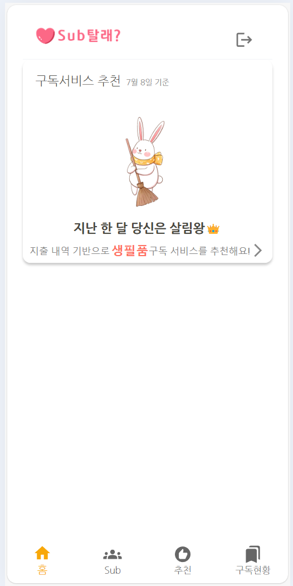
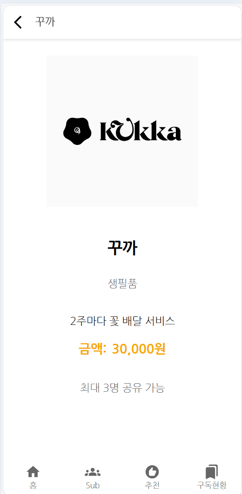

# 구독추천 서비스 프론트엔드 개발  

구독추천 서비스의 프론트엔드를 개발합니다.   
프론트엔드 개발 전에 [구독추천 서비스 개발하기](https://github.com/cna-bootcamp/cna-handson/blob/main/backend/02.develop_subrecommend.md)를 먼저 하십시오.  

> **구독추천 프론트엔드 개발 화면**   
> 메인화면  
>     
> 구독추천 서브 화면   
>   
> 구독서비스 상세 화면  
>     

- [구독추천 서비스 프론트엔드 개발](#구독추천-서비스-프론트엔드-개발)
  - [브랜치 만들기](#브랜치-만들기)
  - [메인화면 개발](#메인화면-개발)
  - [구독추천 서브 화면 개발](#구독추천-서브-화면-개발)
  - [구독서비스 상세화면 개발](#구독서비스-상세화면-개발)
  - [라우팅 설정](#라우팅-설정)
  - [애플리케이션 실행](#애플리케이션-실행)
  - [Git 푸시](#git-푸시)

---

## 브랜치 만들기  
vscode에서 터미널을 열고 아래 명령으로 새로운 브랜치를 만듭니다.   
```
git checkout -B subrecommend 
```

## 메인화면 개발  
클론 프로젝트의 pages/Main/Main.jsx 내용을 복사하여 바꿉니다.  
아래와 같이 메인 화면의 컴포넌트를 Header와 RecommendService로 구성하였습니다.  
React는 이렇게 화면 컴포넌트를 모듈화하여 재사용성을 높일 수 있습니다.  
Navigation 컴포넌트는 맨 하단의 메인메뉴 네비게이터입니다.   


```
import React from "react";
import { useNavigate } from "react-router-dom";
import Header from "pages/Main/components/Header";
import Navigation from "components/Navigation";
import RecommendService from "pages/Main/components/RecommendService";

function Home({ user }) {
  const navigate = useNavigate();

  const handleLogout = () => {
    sessionStorage.removeItem("user");
    sessionStorage.removeItem("accessToken");
    sessionStorage.removeItem("refreshToken");
    navigate("/login");
  };
 
  return (
    <>
      <Header handleLogout={handleLogout} />
    
      <RecommendService navigate={navigate} user={user} />
      
      <Navigation />
    </>
  );
}

export default Home;
```
클론 프로젝트의 pages/Main/components 디렉토리를 복사합니다.  
클론 프로젝트에서 pages/Main/components 디렉토리를 선택하고 CTRL-c를 누른 후,  
개발 프로젝트에서 pages/Main 디렉토리를 선택하고 붙여넣기를 하면 됩니다.   

Header 컴포넌트는 로고와 로그아웃 버튼을 표시합니다.  

상단에 Style sheet가 정의되어 있는걸 볼 수 있을겁니다.   
각 컴포넌트는 재사용을 위해 자신의 화면 표시에 필요한 CSS(Cascading Style Sheets)를 갖고 있습니다.   


```
<Link to="/" style={{ textDecoration: "none", color: "#0E131A" }}>
</img>
</Link>
<IconButton onClick={handleLogout}>
<Logout />
</IconButton>
```

RecommendService 컴포넌트는 가장 소비가 많은 소비 카테고리를 대표하는 이미지,   
최고 소비 카테고리, 추천 구독 카테고리를 표시합니다.  
그리고 추천 구독 카테고리를 클릭하면 구독 추천 서브 화면으로 이동합니다.   
```
  return (
    <RecommendServiceContainer>
      <p>
        구독서비스 추천 <span>{getYesterdayDate()}</span>
      </p>
      <div className="content">
        
        <p>지난 한 달 당신은 {getKingTitle(recommendData.spendingCategory)}👑</p>
        <button
          className="bottom"
          onClick={() =>
            navigate("/subscription/recommend", {
              state: { defaultCategory: recommendData.categoryId },
            })
          }
        >
          지출 내역 기반으로 <span className="highlight">{recommendData.categoryName}</span> 구독 서비스를
          추천해요!
          <ArrowForwardIos fontSize="small" />
        </button>
      </div>
    </RecommendServiceContainer>
  );

```

추천 데이터는 아래와 같이 백엔드 API를 호출하여 구합니다.  
초기에는 recommendData가 널이기 때문에 Loading이 표시됩니다.   
useEffect모듈이 API에서 값을 가져와 셋팅되면 화면이 표시됩니다.  
```
function RecommendService({ navigate, user }) {
  const [recommendData, setRecommendData] = useState(null);

  useEffect(() => {
    const fetchRecommendData = async () => {
      try {
        const { data } = await api("subrecommend").get(`/subrecommend/category?userId=${user.userId}`);
        setRecommendData(data.response);
      } catch (err) {
        console.error(err);
      }
    };

    fetchRecommendData();
  }, [user.userId]);

  if (!recommendData) {
    return <div>Loading...</div>;
  }

```

## 구독추천 서브 화면 개발 
개발 프로젝트의 pages 디렉토리 밑에 Subscription 디렉토리를 만듭니다.  
pages를 선택하고 우측 마우스 메뉴에서 'New Folder'를 선택하여 만드세요.   

클론 프로젝트에서 pages/Subscription 밑에 있는 Recommend.jsx를 복사합니다.   

**BackHeader: 뒤로 가기 버튼과 페이지 타이틀 표시**    
```
<BackHeader text="추천"></BackHeader>
```

**제목과 지출액 표시**   
```
<RecommendPage>
    <p className="title">
        {user.userName}님을 위한{" "}
        <span style={{ fontSize: "20px", color: "#F8A809" }}>
        구독서비스 추천
        </span>
    </p>
    {recommendData && (
        <p className="sub-title">
        지난 한달 {getSpendingTitle(recommendData.spendingCategory)}에{" "}
        {recommendData.totalSpending.toLocaleString("ko-KR")}원을 지출했어요
        </p>
    )}
</RecommendPage>
```

**구독 카테고리 표시**   
카테고리 버튼을 클릭하면 handleCategoryClick함수가 호출되어 구독서비스 목록을 다시 그립니다.  
categoryList 목록을 반복(map)하면서 표시합니다.  
```
<Grid container spacing={2} sx={{ mt: 4 }}>
{categoryList.map((item) => (
    <Grid item xs={4} key={item.id}>
    <Button
        fullWidth
        variant={selectedCategory === item.categoryId ? "contained" : "outlined"}
        color={selectedCategory === item.categoryId ? "primary" : "inherit"}
        onClick={() => handleCategoryClick(item.categoryId)}
    >
        {item.categoryName}
    </Button>
    </Grid>
))}
</Grid>
```

**선택한 구독 카테고리의 구독 서비스 목록 표시**  
subscribeList을 반복하면서 표시 합니다.  

```
<Grid container spacing={2} sx={{ mt: 4, mb: 8 }}>
    {subscribeList.map((item) => (
        <Grid item xs={6} sm={4} md={3} key={item.id}>
        <StyledCard
            sx={{ height: '100%', display: 'flex', flexDirection: 'column' }}
            onClick={() => handleServiceClick(item.id)}
        >
            <CardMedia component="img" height="140" image={process.env.PUBLIC_URL +
            `/service/` + item.logo} alt={item.name} />
            <CardContent sx={{ flexGrow: 1 }}>
            <Typography gutterBottom variant="h5" component="div">
                {item.name}
            </Typography>
            <Typography variant="body2" color="text.secondary" sx={{
                display: '-webkit-box',
                WebkitLineClamp: '2',
                WebkitBoxOrient: 'vertical',
                overflow: 'hidden',
                textOverflow: 'ellipsis',
            }}>
                {item.description}
            </Typography>
            <Typography variant="body2" color="text.primary">
                {item.fee.toLocaleString("ko-KR")}원
            </Typography>
            </CardContent>
        </StyledCard>
        </Grid>
    ))}
</Grid>
```

**카테고리 선택 시 어떻게 구독 서비스 목록이 다시 표시**되는지 보겠습니다.   
카테고리를 선택하면 아래 함수가 호출됩니다.   
**setSelectedCategory가 수행되어 selectedCategory변수가 바뀝니다.**   
```
  const handleCategoryClick = useCallback((category) => {
    setSelectedCategory(category);
  }, []);

```

**useEffect모듈**은 감시하고 있는 객체 중 하나인 selectedCategory가 변했으므로,   
**fetchEnrollList함수를 수행**합니다.   
```
  useEffect(() => {
    fetchEnrollList(selectedCategory, user.id);
  }, [fetchEnrollList, user.id, selectedCategory]);

```

fetchEnrollList는 getEnrollList를 호출하고 그 결과를 setSubscribeList함수를 호출하여   
**subscribeList 변수에 반영**합니다.  
**변수값이 변하면 화면이 자동으로 다시 렌더링** 됩니다.   

```
  const fetchEnrollList = useCallback(async (categoryId, userId) => {
    try {
      const result = await getEnrollList(categoryId, userId);
      console.log(result);
      setSubscribeList(result);
    } catch (err) {
      console.log(err);
    }
  }, []);
```

**getEnrollList는 API를 호출하여 구독 서비스 목록을 반환**합니다.   
이 API는 이미 구독한 서비스를 제외한 목록을 리턴합니다.   
```
const getEnrollList = async (categoryId, userId) => {
  try {
    const { data } = await api("subrecommend").get("/subrecommend/list", {
      params: { categoryId, userId },
    });
    return data.response;
  } catch (err) {
    return err;
  }
};
```

**하단에 메인 메뉴 네비게이터**를 표시합니다.   
```
      <Navigation />
```

구독 서비스를 선택하면 **handleServiceClick함수가 호출되어 구독서비스 상세화면으로 이동**합니다.   
'state: { serviceId: serviceId, alreadyEnroll:false }' 부분을 주목하십시오.   
navigate모듈로 페이지를 이동할 때 데이터를 넘기는 방법입니다.   
state라는 키로 데이터를 지정해서 넘기면, 이동되는 페이지에서는 location.state로 데이터를 읽을 수 있습니다.   
```
  const handleServiceClick = useCallback((serviceId) => {
    navigate(`/subscription/service/${serviceId}`, { state: { serviceId: serviceId, alreadyEnroll:false } });
  }, [navigate]);
```

## 구독서비스 상세화면 개발   
클론 프로젝트에서 pages/Subscription 디렉토리 밑에 있는 ServiceDetail.jsx를 복사합니다.  

location.state로 선택된 serviceId를 읽었습니다.  
API의 응답을 setService함수를 이용하여 service객체에 셋팅합니다.  
```
function ServiceDetail({ user }) {
  const location = useLocation();
  const navigate = useNavigate();
  const serviceId = location.state?.serviceId;
  const [service, setService] = useState(null);
  
  useEffect(() => {
    const fetchService = async () => {
      try {
        const { data } = await api("subrecommend").get("/subrecommend/detail/" + serviceId);
        setService(data.response);
      } catch (err) {
        console.error(err);
      }
    };

    if (serviceId) {
      fetchService();
    }
  }, [serviceId]);

```

뒤로가기, 서비스 상세 정보, 네비게이터가 표시됩니다.  
서비스 상세정보는 위에서 셋팅한 service객체의 값으로 표시합니다.  
```
<BackHeader text={service.name} navigate={navigate} />
<ServiceDetailContainer>
    <LogoImage
        src={process.env.PUBLIC_URL + `/service/` + service.logo}
        alt={service.name}
    />
    <ServiceName>{service.name}</ServiceName>
    <CategoryName>{service.categoryName}</CategoryName>
    <Description>{service.description}</Description>
    <FeeContainer>
        <FeeLabel>금액:</FeeLabel>
        <FeeAmount>{service.fee.toLocaleString("ko-KR")}원</FeeAmount>
    </FeeContainer>
    <MaxUser>최대 {service.maxShareNum}명 공유 가능</MaxUser>
</ServiceDetailContainer>
<Navigation />
```

## 라우팅 설정   
routes/index.js에 라우팅을 추가합니다.  

subscription 경로에 대한 라우팅을 추가합니다.  
import문과 Route설정이 추가 되었습니다.  
```

import React from "react";
import { Routes, Route } from "react-router-dom";
import PrivateRouter from "components/PrivateRouter";
import AuthRoutes from "routes/auth.routes";
import MainRoutes from "routes/main.routes";
import SubscriptionRoutes from "routes/subscription.routes";

const AppRoutes = ({ user, handleAfterLogin }) => {
  return (
    <Routes>
      <Route path="/*" element={<AuthRoutes handleAfterLogin={handleAfterLogin} />} />
      <Route path="/*" element={<PrivateRouter isLoggedIn={!!user} />}>
        <Route path="/*" element={<MainRoutes user={user} />} />
        <Route path="subscription/*" element={<SubscriptionRoutes user={user} />} />
      </Route>
    </Routes>
  );
};

export default AppRoutes;
```

클론 프로젝트의 routes/subscription.routes.js을 routes디렉토리 밑으로 복사합니다.  
구독추천 페이지의 라우팅 설정입니다.  
index.js에서 설정한 subscription하위의 경로를 지정합니다.   
즉, /subscription/recommend가 구독추천 서브화면이고, /subscription/service/{serviceId}가 구독상세 화면입니다.  
':serviceId' 변수명은 Recommend.jsx의 handleServiceClick에서 지정한 변수명 ${serviceId}와 동일해야 합니다.  

```
import React from "react";
import { Routes, Route } from "react-router-dom";
import ServiceDetail from "pages/Subscription/ServiceDetail";
import Recommend from "pages/Subscription/Recommend";

const SubscriptionRoutes = ({ user }) => {
  return (
    <Routes>
      <Route path="/recommend" element={<Recommend user={user} />} />
      <Route path="/service/:serviceId" element={<ServiceDetail user={user} />} />
    </Routes>
  );
};

export default SubscriptionRoutes;
```

애플리케이션을 실행하고 각 페이지 이동 시에 웹브라우저의 주소가 어떻게 변하는지 보면서  
라우팅 설정을 이해 하십시오.   


## 애플리케이션 실행  
- 지출 카테고리 이미지 복사   
  클론 프로젝트의 public/spending 디렉토리 전체를 public밑으로 복사합니다.  

- utils/apiInstance.js수정 
  serviceName이 잘못되어 있습니다. recommend를 subrecommend로 바꾸세요.   

  ```
    const getBaseUrl = (serviceName) => {
    switch (serviceName) {
        case "member":
        return "http://localhost:18080";
        case "subrecommend":
        return "http://localhost:18081";
        case "mysub":
        return "http://localhost:18082";
        case "mygrp":
        return "http://localhost:18083";
        case "transfer":
        return "http://localhost:18084";

        default:
        throw new Error(`Invalid service name: ${serviceName}`);
    }
    };
  ```
- 터미널에서 애플리케이션을 시작하십시오.  
  ```
  npm start
  ```

  테스트가 끝나면 **터미널에서 CTRL-c로 중단**합니다.   
  

## Git 푸시 
원격 Git repository에 소스를 푸시합니다.  
```
git add . && git commit -m "subrecommend" && git push -u origin subrecommend 
```

Tag를 추가하고 푸시합니다.  
```
git tag -a v2.0.0 -m "구독추천"
git push origin v2.0.0
```

---

구독추천 프론트엔드를 추가 개발 했습니다.  
수고하셨습니다.  

