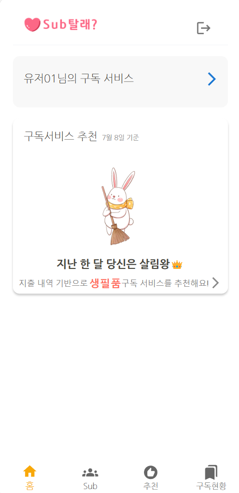
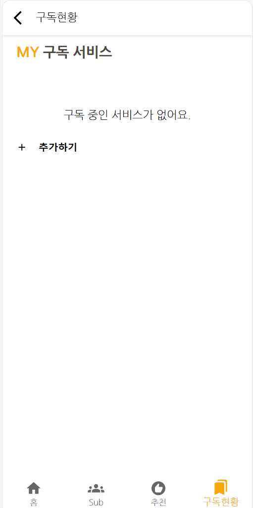
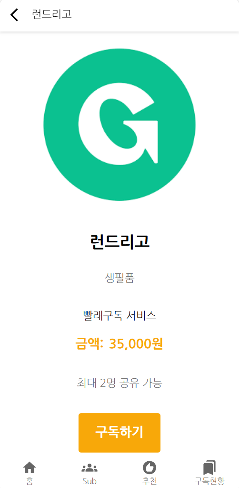

# 마이구독 서비스 프론트엔드 개발  

마이구독 서비스의 프론트엔드를 개발합니다.   
프론트엔드 개발 전에 [마이구독 서비스 개발하기](https://github.com/cna-bootcamp/cna-handson/blob/main/backend/03.develop_mysub.md)를 먼저 하십시오.  

> **마이구독 프론트엔드 개발 화면**   
> 메인화면  
>     
> 마이구독 서브 화면   
>   
> 구독서비스 상세 화면: 구독하기/구독취소 추가   
> 

- [마이구독 서비스 프론트엔드 개발](#마이구독-서비스-프론트엔드-개발)
  - [브랜치 만들기](#브랜치-만들기)
  - [메인화면 개발](#메인화면-개발)
  - [마이구독 서브 화면 개발](#마이구독-서브-화면-개발)
  - [구독서비스 상세: 구독하기/구독취소 추가](#구독서비스-상세-구독하기구독취소-추가)
  - [라우팅 설정](#라우팅-설정)
  - [애플리케이션 실행](#애플리케이션-실행)
  - [Git 푸시](#git-푸시)

---

## 브랜치 만들기  
vscode에서 터미널을 열고 아래 명령으로 새로운 브랜치를 만듭니다.   
```
git checkout -B mysub 
```

## 메인화면 개발  
클론 프로젝트의 pages/Main/Main.jsx 내용을 복사하여 바꿉니다.  
SubscriptionList 컴포넌트가 추가 되었습니다.    

```
{중략}
import SubscriptionList from "pages/Main/components/SubscriptionList";
{중략}
      <SubscriptionList
        user={user}
        navigate={navigate}
      />
```  

클론 프로젝트의 pages/Main/components/SubscriptionList.jsx 파일을 복사합니다.

가입한 구독 서비스의 이미지와 이름을 표시합니다.  
더보기를 누르면 'handleNavigateToMySubscription'함수가 실행되어 마이구독 서브 화면으로 이동합니다.   
각 구독서비스를 누르면 'handleServiceClick(item.subId)'가 실행되어 구독서비스 상세 화면으로 이동합니다.   

```
  return (
    <SubscriptionListContainer>
      <div className="display-flex">
        <p className="title">{user.userName}님의 구독 서비스</p>
        <Button
          onClick={handleNavigateToMySubscription}
          sx={{ marginRight: "-1.5rem" }}
        >
          <ArrowForwardIos />
        </Button>
      </div>
      <ul className="images">
        {subscriptionList.map((item) => (
          <li
            key={item.subId}
            className="image-box"
            onClick={() => handleServiceClick(item.subId)}
          >
            
            <p>{item.subName}</p>
          </li>
        ))}
      </ul>
    </SubscriptionListContainer>
  );
```

구독서비스 목록을 가져오는 부분은 아래 코드입니다.   
'await Promise.all'은 Non-blocking처리 함수이고 getSubscriptionList함수에서 리턴(callback)이 올때까지   
기다리는 처리를 합니다.  callback이 오면 'setSubscriptionList(subscriptionList);'이 수행 됩니다.  

```
{중략}
export const getSubscriptionList = async (userId) => {
  try {
    const { data } = await api("mysub").get("/my-subs", {
      params: { userId },
    });
    return data.response;
  } catch (err) {
    return err;
  }
};


function SubscriptionList({ user, navigate }) {
  const [subscriptionList, setSubscriptionList] = useState([]);

  useEffect(() => {
    const fetchData = async () => {
      try {
        const [subscriptionList] = await Promise.all([
          getSubscriptionList(user.id),
        ]);
        setSubscriptionList(subscriptionList);
      } catch (err) {
        console.log(err);
      }
    };

    fetchData();
  }, [user]);

  {중략}
}
```

더보기를 클릭하면 마이구독 서브메인 화면으로 이동합니다.   
```
  const handleNavigateToMySubscription = () => {
    navigate("/subscription/mysubscription");
  };
```

구독서비스 하나를 선택하면 상세화면으로 이동합니다.    
구독서비스 상세화면은 이미 개발되어 있습니다.   
```
  const handleServiceClick = (serviceId) => {
    navigate(`/subscription/service/${serviceId}`, {
      state: { serviceId: serviceId },
    });
  };

```

## 마이구독 서브 화면 개발 

클론 프로젝트에서 pages/Subscription 밑에 있는 MySubscription.jsx를 복사합니다.   
그리고 pages/Subscription/components 디렉토리도 복사합니다.    
components 밑에는 SubscriptItem.jsx 파일이 있습니다.    
SubscriptItem 컴포넌트는 각 구독서비스 정보를 표시할 때 사용됩니다.  
'\<SubscriptItem item={item} index={index} /\>' 부분입니다.  


'{mySubscriptionList.length > 0 ? {중략} : {중략}}'와 같이 조건문을 사용할 수 있습니다.   

```
  return (
    <>
      <BackHeader text="구독현황" />
      <MySubscriptionPage>
        <p className="title" style={{ color: "rgb(248, 168, 9)" }}>
          MY <span style={{ color: "#4a483f" }}> 구독 서비스</span>
        </p>

        <List sx={{ width: "100%" }}>
          {mySubscriptionList.length > 0 ? (
            mySubscriptionList.map((item, index) => (
              <div key={item.subId} className="list-item">
                <div className="clickable" onClick={() => handleServiceClick(item.subId)}>
                  <SubscriptItem item={item} index={index} />
                </div>
              </div>
            ))
          ) : (
            <div style={{ textAlign: "center", marginTop: "1rem" }}>구독 중인 서비스가 없어요.</div>
          )}
        </List>
        <button
          className="add-button"
          onClick={() => navigate("/subscription/recommend")}
        >
          <AddIcon sx={{ fontSize: "1rem", marginRight: "1rem" }} />
          <p>추가하기</p>
        </button>
      </MySubscriptionPage> 
      <Navigation />
    </>
  );
```

## 구독서비스 상세: 구독하기/구독취소 추가   

클론 프로젝트의 ServiceDetail.jsx의 내용을 복사하여,   
개발 프로젝트의 동일 파일 내용을 변경 하십시오.   

- **구독하기/구독취소 추가 부분**   
  아래와 같이 구독하기/구독취소가 추가 되었습니다.   

  구독하기 버튼의 활성화 여부가 'isLoading'이라는 변수로 제어되고 있는것에 주목 하세요.   
  구독하기 버튼을 누르면 이 변수는 true가 되어서 버튼을 비활성화 합니다.   
  이 방법으로 중복해서 버튼이 안 눌리도록 합니다.   
  ```
        {!isSubscribed && (
          <SubscribeButton onClick={handleSubscribe} disabled={isLoading}>
            {isLoading ? "구독 중..." : "구독하기"}
          </SubscribeButton>
        )}
        {isSubscribed && (
          <UnsubscribeButton onClick={handleOpenConfirmDialog}>
            구독 취소
          </UnsubscribeButton>
        )}
  ```

- **구독하기**  
  
  API를 호출하여 구독 데이터를 마이구독 저장소에 저장합니다.  
  결과 메시지는 토스트 팝업으로 표시하고 팝업이 닫히면서 다시 구독서비스 상세화면으로 이동합니다.   
  ```
  const handleSubscribe = async () => {
    setIsLoading(true);
    try {
      const { data } = await api("mysub").post("/my-subs/"+serviceId, null, {
        params: { userId: user.id }
      });
      toast.success(data.message, {
        onClose: () =>
          navigate("/subscription/mysubscription", {
            state: { from: "/subscription/service/" + serviceId },
          }),

        position: "top-center",
        autoClose: 300, //  자동으로 사라짐
        hideProgressBar: true, // 진행바 숨김
        closeOnClick: true, // 클릭 시 닫힘
        pauseOnHover: false, // 마우스 오버 시 자동 닫힘 일시 정지
        draggable: false, // 드래그 가능
      });
    } catch (err) {
      console.log(err);
      toast.error(err.message, { autoClose: 300 });
      setIsLoading(false);
    }
  };
  ```

- **구독취소**   
  
  구독취소를 클릭하면 아래 함수가 수행됩니다.   
  이 함수는 단순히 openConfirmDialog라는 변수를 true로 만듭니다.   
  ```
  const handleOpenConfirmDialog = () => {
    setOpenConfirmDialog(true);
  };
  ```

  컴포넌트의 끝에쯤 보면 아래와 같이 구독취소를 confirm하는 다이알로그가 있습니다.   
  open의 값인 openConfirmDialog에 따라 다이알로그가 보이거나 숨겨집니다.   
  위에서 true로 만들었기 때문에 구독취소를 누르면 이 다이알로그가 보이게 됩니다.   
  ```
      <Dialog open={openConfirmDialog} onClose={handleCloseConfirmDialog}>
        <DialogTitle>구독 취소 확인</DialogTitle>
        <DialogContent>
          <DialogContentText>정말 구독을 취소하시겠습니까?</DialogContentText>
        </DialogContent>
        <DialogActions>
          <Button onClick={handleCloseConfirmDialog} color="primary">
            취소
          </Button>
          <Button onClick={handleConfirmUnsubscribe} color="primary" autoFocus>
            확인
          </Button>
        </DialogActions>
      </Dialog>
  ```

  다이알로그에서 '확인'버튼을 누르면 'handleConfirmUnsubscribe' 함수가 호출됩니다.   
  이 함수에서는 API를 호출하여 마이구독 저장소에 저장된 데이터를 삭제합니다.   
  토스트팝업으로 결과를 표시하고 팝업이 닫히면 이전 페이지로 이동합니다.   
  ```
  const handleConfirmUnsubscribe = async () => {
    try {
      const { data } = await api("mysub").delete("/my-subs/"+serviceId, {
        params: { userId: user.id }
      });
     
      if (data.code === 200) {
        toast.success(data.message, {
          autoClose: 300,
          onClose: () => {
            navigate(-1);
          },
        });
      } else {
        toast.error(data.message, {
          autoClose: 500,
        });
      }
    } catch (err) {
      //console.log(err);
      toast.error(`구독 취소에 실패했습니다.(${err.message})`, {
        autoClose: 500,
      });
    }
    handleCloseConfirmDialog();
  };
  ```

## 라우팅 설정   
클론 프로젝트의 routes/subscription.routes.js의 내용을 복사하여   
개발 프로젝트의 동일한 파일 내용을 덮어 씁니다.     
마이구독 서브 메인 이동을 위한 라우팅 설정이 추가 되었습니다.     

```
{중략}
import MySubscription from "pages/Subscription/MySubscription";

{중략}

const SubscriptionRoutes = ({ user }) => {
  return (
    <Routes>
      <Route path="/mysubscription" element={<MySubscription user={user} />} />
      {중략}
    </Routes>
  );
};

export default SubscriptionRoutes;
```

## 애플리케이션 실행  

  터미널에서 애플리케이션을 시작하십시오.  
  ```
  npm start
  ```

  구독서비스 추가와 구독 취소도 테스트 합니다.   


  테스트가 끝나면 **터미널에서 CTRL-c로 중단**합니다.   
  

## Git 푸시 
원격 Git repository에 소스를 푸시합니다.  
```
git add . && git commit -m "mysub" && git push -u origin mysub 
```

Tag를 추가하고 푸시합니다.  
```
git tag -a v3.0.0 -m "마이구독"
git push origin v3.0.0
```

---

마이구독 프론트엔드를 추가 개발 했습니다.  
수고하셨습니다.  

