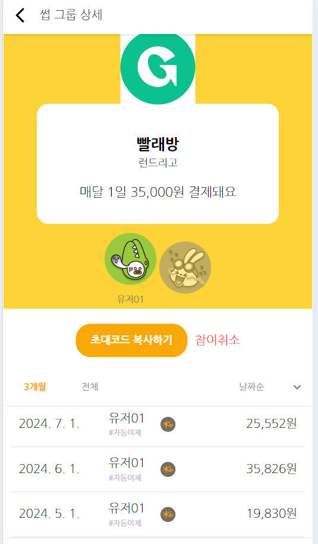

# 이체조회 서비스 프론트엔드 개발  

이체조회 서비스의 프론트엔드를 개발합니다.   
프론트엔드 개발 전에 [이체조회 서비스 개발하기](https://github.com/cna-bootcamp/cna-handson/blob/main/backend/05.develop_transfer.md)를 먼저 하십시오.  

> **이체조회 프론트엔드 개발 화면**   
> **이체내역 화면**: 구독그룹 상세 화면에 추가됨     
> 

- [이체조회 서비스 프론트엔드 개발](#이체조회-서비스-프론트엔드-개발)
  - [브랜치 만들기](#브랜치-만들기)
  - [이체조회 컴포넌트 개발](#이체조회-컴포넌트-개발)
  - [애플리케이션 실행](#애플리케이션-실행)
  - [Git 푸시](#git-푸시)

---

## 브랜치 만들기  
vscode에서 터미널을 열고 아래 명령으로 새로운 브랜치를 만듭니다.   
```
git checkout -B transfer 
```

## 이체조회 컴포넌트 개발     
클론 프로젝트의 pages/SubGroup/components/**PaymentDetail.jsx파일을 복사**합니다.   

이체조회 서비스 API를 이용하여 현재 구독그룹의 특정기간 이체 내역을 갖고 옵니다.  
기간은 디폴트로 최근 3개월이고 '전체'는 최근 1년입니다.    
```
const getPayHistory = useCallback(async (groupId, period) => {
  try {
    const { data } = await api("transfer").get("/transfer", {
      params: { groupId, period },
    });
    return data.response;
  } catch (err) {
    return err;
  }
}, []);
```

날짜 내림차순/오름차순으로 정렬하는 함수입니다.  
'...data'는 원본인 data객체를 새로운 배열로 복사하는 스프레드 연산자(Spread operator)입니다.  
복사된 data객체의 각 값을 sort함수 내에서 transferDate값을 비교합니다.  
그리고 정렬된 결과를 리턴합니다.    
```
const sortData = useCallback((data) => {
  return [...data].sort((a, b) => {
    if (sortOrder === "desc") {
      return new Date(b.transferDate) - new Date(a.transferDate);
    } else {
      return new Date(a.transferDate) - new Date(b.transferDate);
    }
  });
}, [sortOrder]);
```

개발 프로젝트의 pages/SubGroup/GroupDetail.jsx에 **PaymentDetail컴포넌트를 추가** 합니다.   

```
{중략}
import PaymentDetail from "./components/PaymentDetail";

function GroupDetail({ user }) {
  {중략}
  return (
    <>
      <BackHeader text="썹 그룹 상세"></BackHeader>
      {groupData && (<GroupInfo groupData={groupData} />)}
      {groupData && (<InvitationButtonComponent groupData={groupData} user={user} />)}
      <PaymentDetail groupId={groupId} groupData={groupData} />
      <Navigation />
    </>
  );  
}
```

## 애플리케이션 실행  

  터미널에서 애플리케이션을 시작하십시오.  
  ```
  npm start
  ```

  먼저 [이체조회 Swagger 페이지](http://localhost:18084/swagger-ui/index.html)에서 테스트 데이터를 생성하십시오.   
  구독그룹 상세 화면에 들어가 이체내역이 잘 조회되는지 체크하십시오.   

  테스트가 끝나면 **터미널에서 CTRL-c로 중단**합니다.   
  

## Git 푸시 
원격 Git repository에 소스를 푸시합니다.  
```
git add . && git commit -m "transfer" && git push -u origin transfer 
```

Tag를 추가하고 푸시합니다.  
```
git tag -a v5.0.0 -m "이체조회"
git push origin v5.0.0
```

---

이체조회 프론트엔드를 추가 개발 했습니다.  
그리고 구독관리 서비스의 백엔드와 프론트엔드 개발을 모두 완료하였습니다.   

정말 수고하셨습니다.  


