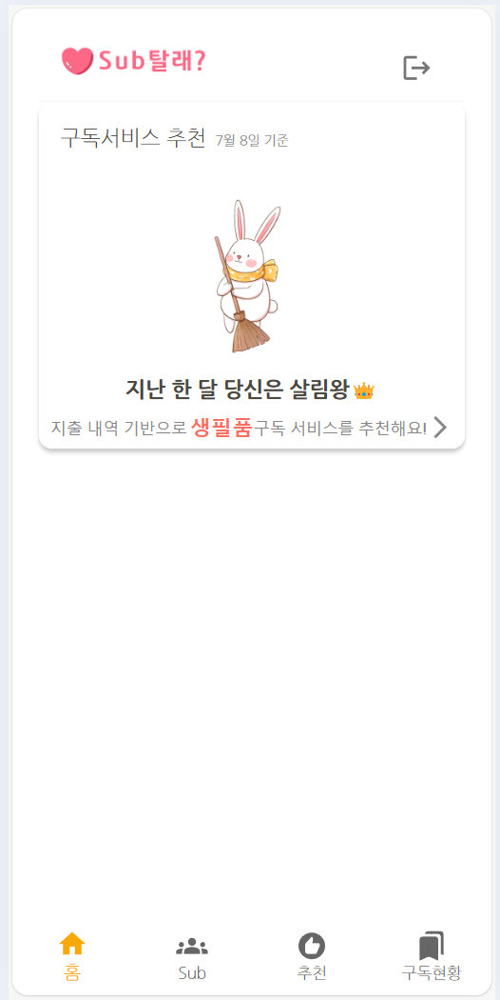
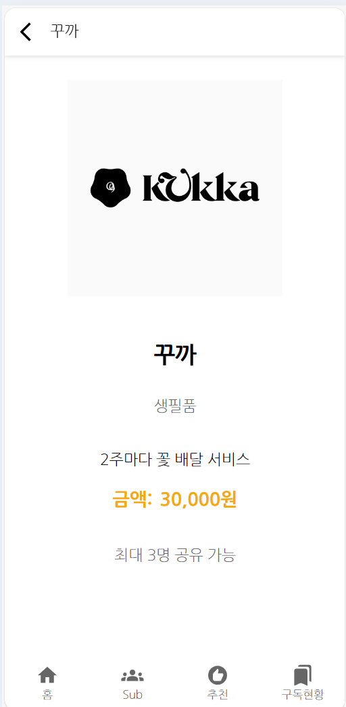

# 구독추천 서비스 프론트엔드 개발  

구독추천 서비스의 프론트엔드를 개발합니다.   
프론트엔드 개발 전에 [구독추천 서비스 개발하기](https://github.com/cna-bootcamp/cna-handson/blob/main/backend/02.develop_subrecommend.md)를 먼저 하십시오.  

> **구독추천 프론트엔드 개발 화면**   
> 메인화면  
>     
> 구독추천 서브 화면   
>   
> 구독서비스 상세 화면  
>     
>

