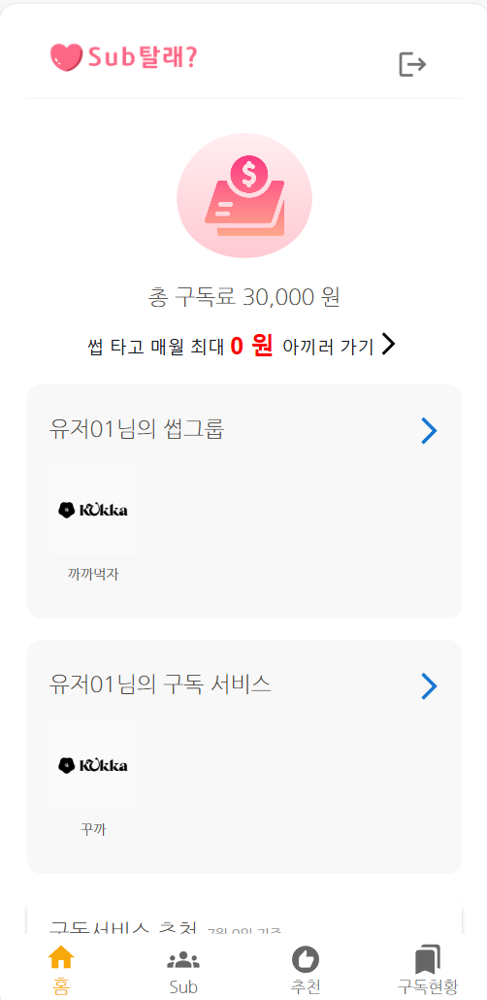
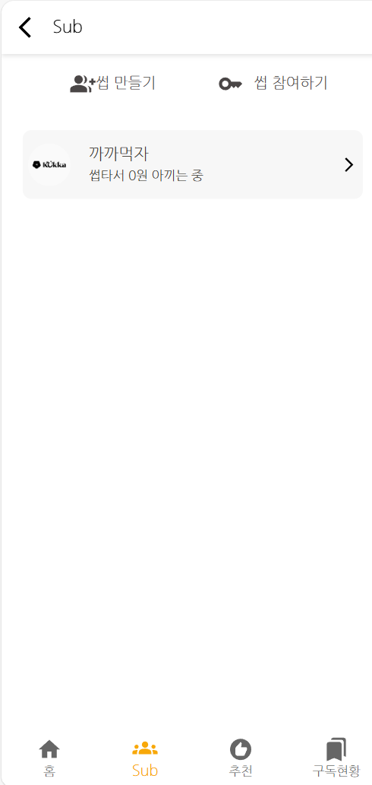
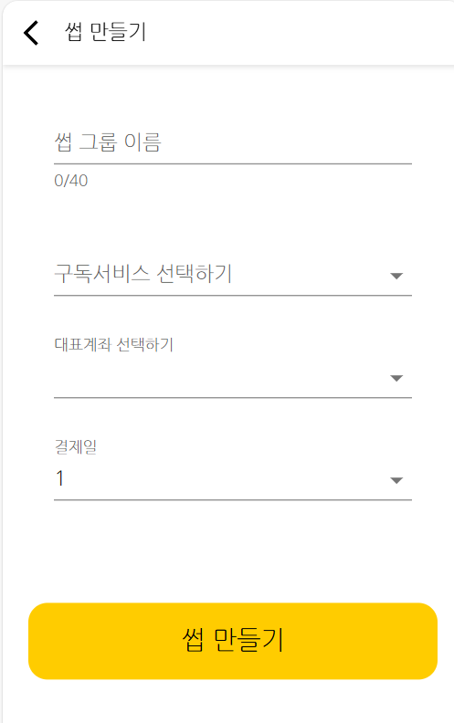
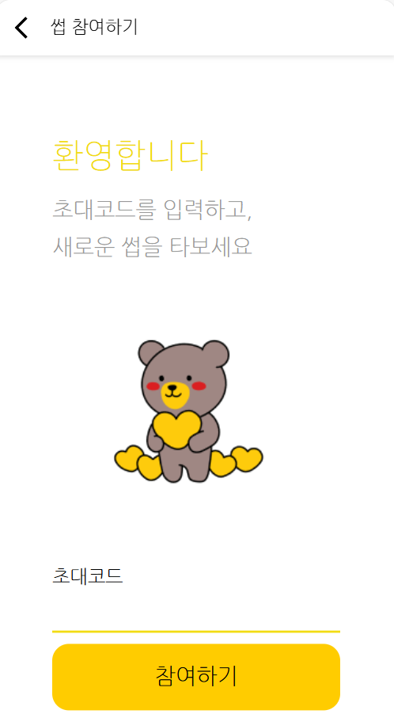
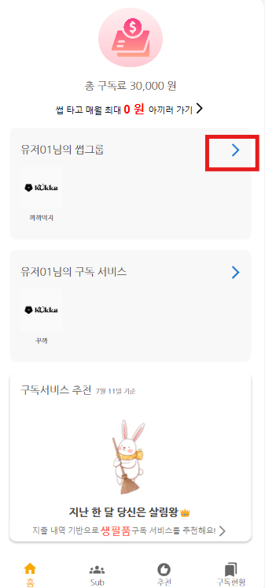
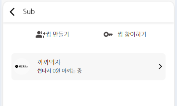
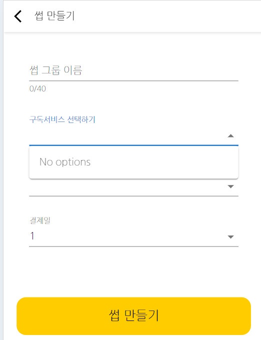
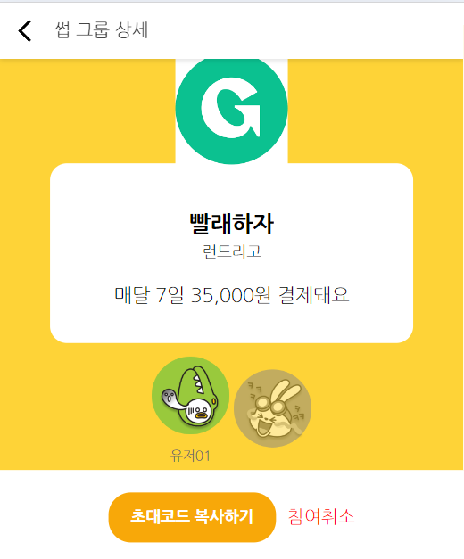
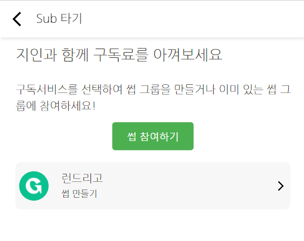

# 마이그룹 서비스 프론트엔드 개발  

마이그룹 서비스의 프론트엔드를 개발합니다.   
프론트엔드 개발 전에 [마이그룹 서비스 개발하기](https://github.com/cna-bootcamp/cna-handson/blob/main/backend/04.develop_mygrp.md)를 먼저 하십시오.  

> **마이그룹 프론트엔드 개발 화면**   
> **메인화면**: 구독 비용과 구독그룹 목록 추가    
>     
> **마이그룹 서브메인 화면**   
>    
> **구독그룹 생성**   
>    
> **구독그룹 참여**  
>   

- [마이그룹 서비스 프론트엔드 개발](#마이그룹-서비스-프론트엔드-개발)
  - [브랜치 만들기](#브랜치-만들기)
  - [메인화면 개발](#메인화면-개발)
  - [마이그룹 서브 화면 개발](#마이그룹-서브-화면-개발)
  - [구독추천 화면 업그레이드](#구독추천-화면-업그레이드)
  - [Git 푸시](#git-푸시)

---

## 브랜치 만들기  
vscode에서 터미널을 열고 아래 명령으로 새로운 브랜치를 만듭니다.   
```
git checkout -B mygrp 
```

## 메인화면 개발  

클론 프로젝트의 pages/Main/**Main.jsx 내용을 복사하여 바꿉니다**.  
TotalFeeSave와 SubGroupList 컴포넌트가 추가 되었습니다.    

> **총 구독비용과 최대 절감액 표시**   
> TotalFeeSave 컴포넌트는 총 구독비용에 따른 이미지, 총 구독비용, 최대 절감액을 표시합니다.  
> TotalFee 객체를 전달받아 표시를 하는데, TotalFee 객체를 만들어서 전달하는   
> 컴포넌트는 SubscriptionList입니다.  
> - SubscriptionList 로딩 시 API 호출하여 가입구독서비스 정보를 얻고 TotalFee객체 생성  
> - TotalFee객체가 생성되면 onTatalFee이벤트가 발생하고 Main의 handleTotalFee가 실행됨   
> - handleTotalFee는 totalFee변수에 값을 셋팅하게 됨   
> - TotalFeeSave 컴포넌트에 변경된 totalFee 객체 값이 전달되고 정보가 표시됨    

```
{중략}
import TotalFeeSave from "pages/Main/components/TotalFeeSave";
{중략}
import SubGroupList from "pages/Main/components/SubGroupList";
{중략}
function Home({ user }) {
  {중략}
  const handleTotalFee = (data) => {
    setTotalFee(data);
  };

  {중략}
  
  return (
    <>
      {중략}

      <TotalFeeSave totalFee={totalFee} navigate={navigate} />

      <SubGroupList
        user={user}
        navigate={navigate}
      />

      <SubscriptionList
        user={user}
        navigate={navigate}
        onTotalFee={handleTotalFee}
      />
      {중략}
    </>
  );
}
```  

클론 프로젝트의 pages/Main/components/SubscriptionList.jsx 파일의 내용을 복사하여  
**SubscriptionList.jsx을 변경**합니다.  
구독비용과 최대절감액을 계산하여 TotalFee객체를 생성하는 수행이 추가되었습니다.  
```
  useEffect(() => {
    const fetchData = async () => {
      try {
        const [subscriptionList] = await Promise.all([
          getSubscriptionList(user.id),
        ]);
        setSubscriptionList(subscriptionList);

        // totalFee 객체 생성
        const newTotalFee = subscriptionList.reduce(
          (acc, item) => {
            acc.payedFee += item.payedFee;
            acc.discountedFee += item.discountedFee;
            return acc;
          },
          { payedFee: 0, discountedFee: 0, feeLevel: 0 }
        );

        // feeLevel 계산
        let feeLevel = 0;
        if (newTotalFee.payedFee >= 200000) {
          feeLevel = 3;
        } else if (newTotalFee.payedFee >= 100000) {
          feeLevel = 2;
        } else if (newTotalFee.payedFee >= 50000) {
          feeLevel = 1;
        }
        newTotalFee.feeLevel = feeLevel;

        setTotalFee(newTotalFee);
      } catch (err) {
        console.log(err);
      }
    };

    fetchData();
  }, [user]);

  useEffect(() => {
    onTotalFee(totalFee);
  }, [totalFee, onTotalFee]);
```

클론 프로젝트의 pages/Main/**SubGroupList와 TotalFeeSave** 파일을 복사하여  
개발 프로젝트의 동일 위치에 붙여 넣습니다. 

---

## 마이그룹 서브 화면 개발 
마이그룹 관련 페이지들을 하나 하나 붙여 가면서 개발해 보겠습니다. 
먼저 백엔드 애플리케이션을 시작하고, 프론트엔드 애플리케이션도 시작하십시오.
```
npm start
```

로그인을 하면 아래와 같이 메인화면이 표시가 될겁니다.    
   

- **썹 그룹 서브 화면 개발**     
  썹 그룹 더보기를 눌렀을 때 화면부터 개발 해 보겠습니다.   
  개발 프로젝트의 pages 밑에 SubGroup 이라는 디렉토리를 추가 합니다.  
  그리고 클론 프로젝트의 **pages/MySubGroup.jsx 파일을 복사**합니다.   
  
  페이지가 로딩되면서 API를 호출하여 참여한 구독그룹 데이터를 갖고와서 표시하는 화면입니다.   
  ```
  const getSubGroupList = useCallback(async (userId) => {
    try {
      const { data } = await api("mygrp").get("/my-groups", {
        params: { userId },
      });
      return data.response;
    } catch (err) {
      return err;
    }
  }, []);

  ```
  각 구독그룹 데이터를 표시하기 위한 페이지인 **'components/SubListItem.jsx'파일을 복사**합니다.  
  

  화면 이동을 위한 **라우팅 설정도 추가**해야 합니다.   
  routes 폴더 밑에 **subgroup.routes.js 파일**을 만들고 아래 내용을 붙여 넣습니다.      
  붙여 넣고 **꼭 저장**을 하세요.  
  ```
  import React from "react";
  import { Routes, Route } from "react-router-dom";
  import MySubGroup from "pages/SubGroup/MySubGroup";

  const SubGroupRoutes = ({ user }) => {
    return (
      <Routes>
        <Route path="/mysubgroup" element={<MySubGroup user={user} />} />

      </Routes>
    );
  };

  export default SubGroupRoutes;
  ```

  **routes/index.js를 수정**합니다. 구독그룹 화면 routing이 추가되었습니다.   
  아래 내용 붙여넣고 저장을 합니다.  
  ```
  import React from "react";
  import { Routes, Route } from "react-router-dom";
  import PrivateRouter from "components/PrivateRouter";
  import AuthRoutes from "routes/auth.routes";
  import MainRoutes from "routes/main.routes";
  import SubscriptionRoutes from "routes/subscription.routes";
  import SubGroupRoutes from "routes/subgroup.routes";

  const AppRoutes = ({ user, handleAfterLogin }) => {
    return (
      <Routes>
        <Route path="/*" element={<AuthRoutes handleAfterLogin={handleAfterLogin} />} />
        <Route path="/*" element={<PrivateRouter isLoggedIn={!!user} />}>
          <Route path="/*" element={<MainRoutes user={user} />} />
          <Route path="subscription/*" element={<SubscriptionRoutes user={user} />} />
          <Route path="subgroup/*" element={<SubGroupRoutes user={user} />} />
        </Route>
      </Routes>
    );
  };

  export default AppRoutes;
  ```

  수정된 사항은 실행된 프론트엔드에 바로 반영이 되어서 재시작을 안해도 됩니다.   
  이제 구독그룹 더 보기를 누르면 아래처럼 개발된 화면이 표시될겁니다.   
    

- **썹만들기 화면 개발**     
  클론 프로젝트의 **SubGroup/MakeGroup.jsx 파일을 복사**합니다.   
  
  '/sub'에서 넘어온 경우라는 것은 마이구독 서브화면에서 호출된 경우를 의미합니다.  아직 구현하지 않았습니다.   
  이 경우에는 구독그룹을 만들 구독서비스의 subId가 있어서 구독서비스 목록을 갖고 올 필요가 없습니다.  
  그래서 fetchServices에서는 isFixedService가 false인 경우에만 API를 호출하도록 했습니다.    
  ```
  function MakeGroup({ user }) {
    const { state } = useLocation(); //-- '/sub'에서 넘어온 경우 구독객체 받기
    const isFixedService = state && state.subId ? true : false;
    
    {중략}

    const fetchServices = useCallback(async () => {
      try {
        if (!isFixedService) {
          const { data } = await api("mysub").get("/my-subs/not-join-group", {
            params: { userId: user.id },
          });
          setServiceOptions(data.response);
        }
      } catch (err) {
        console.error(err);
      }
    }, [user, isFixedService]);
    {중략}
  }
  ```
  
  **라우팅을 추가**합니다.  subgroup.routes.js에 구독그룹 작성화면 라우팅을 추가 합니다.   

  ```
  {중략} 

  import MakeGroup from "pages/SubGroup/MakeGroup";

  const SubGroupRoutes = ({ user }) => {
    return (
      <Routes>
        <Route path="/mysubgroup" element={<MySubGroup user={user} />} />
        <Route path="/makegroup" element={<MakeGroup user={user} />} />
      </Routes>
    );
  };

  export default SubGroupRoutes;
  ```
  저장을 하고 화면에서 '썹 만들기'를 클릭합니다.   
  작성화면이 잘 나오는데 가입한 구독서비스가 없어서 구독서비스를 선택할 수 없네요.   
  구독서비스 가입을 하고 다시 구독그룹 작성을 눌러 보십시오.   
    
  
  '썹 만들기'를 클릭하면 아래 함수가 실행됩니다.   
  input값에 대한 validation 검사를 하고, 문제가 없으면 API를 호출합니다.   
  정상적으로 저장되면 '/subgroup/success-room'으로 이동합니다.  
  ```
  const createGroup = () => {
    const isValid = validateInputs();
    if (isValid) {
      const groupData = {
        groupName,
        subId: selectedService?.subId,
        leaderId: user.id,
        bankName: representativeAccount.split(':')[0].trim(),
        bankAccount: representativeAccount.split(':')[1].trim(),
        paymentDay: payDate,
      };

      api("mygrp")
        .post("/my-groups", groupData)
        .then((response) => {
          //window.localStorage.setItem("invitationCode", response.data.invitationCode);
          navigate("/subgroup/success-room", {
            state: { inviteCode: response.data.response },
          });
        })
        .catch((error) => {
          console.error(error);
        });
    }
  };
  ```

- **구독그룹 작성 완료 화면 개발**   
  클론 프로젝트의 SubGroup/SuccessRoom.jsx파일을 복사합니다.    

  라우팅을 추가합니다.  subgroup.routes.js를 수정합니다.   
  ```
  // src/routes/subgroup.routes.js
  import React from "react";
  import { Routes, Route } from "react-router-dom";
  import MySubGroup from "pages/SubGroup/MySubGroup";
  import MakeGroup from "pages/SubGroup/MakeGroup";
  import SuccessRoom from "pages/SubGroup/SuccessRoom";

  const SubGroupRoutes = ({ user }) => {
    return (
      <Routes>
        <Route path="/mysubgroup" element={<MySubGroup user={user} />} />
        <Route path="/makegroup" element={<MakeGroup user={user} />} />
        <Route path="/success-room" element={<SuccessRoom />} />
      </Routes>
    );
  };

  export default SubGroupRoutes;
  ```

  화면에서 구독그룹을 생성해 봅니다.   


- **구독그룹 상세화면 개발**   
  구독그룹을 클릭했을 때 상세화면을 개발하겠습니다.   
  클론프로젝트의 SubGroup/GroupDetail.jsx 파일을 복사합니다.  
  
  아래와 같이 GroupInfo와 InvitationButtonCommponent로 구성되어 있습니다.   
  ```
  return (
    <>
      <BackHeader text="썹 그룹 상세"></BackHeader>
      {groupData && (<GroupInfo groupData={groupData} />)}
      {groupData && (<InvitationButtonComponent groupData={groupData} user={user} />)}
    
      <Navigation />
    </>
  );
  ```
  
  클론프로젝트의 SubGroup/components/**GroupInfo.jsx**와 SubGroup/components/**InvitationButton.jsx파일을 복사**합니다.  
  GroupInfo.jsx에는 구독그룹의 정보와 참여인원 캐릭터 아이콘을 표시하는 부분이 있습니다.   
  InvitationButton.jsx에는 초대코드 복사와 참여취소 버튼이 있습니다.  

  라우팅을 추가합니다.  
  ```
  // src/routes/subgroup.routes.js
  import React from "react";
  import { Routes, Route } from "react-router-dom";
  import MySubGroup from "pages/SubGroup/MySubGroup";
  import MakeGroup from "pages/SubGroup/MakeGroup";
  import SuccessRoom from "pages/SubGroup/SuccessRoom";
  import GroupDetail from "pages/SubGroup/GroupDetail";

  const SubGroupRoutes = ({ user }) => {
    return (
      <Routes>
        <Route path="/mysubgroup" element={<MySubGroup user={user} />} />
        <Route path="/makegroup" element={<MakeGroup user={user} />} />
        <Route path="/success-room" element={<SuccessRoom />} />
        <Route path="/groupdetail" element={<GroupDetail user={user} />} />
      </Routes>
    );
  };

  export default SubGroupRoutes;
  ```

  저장을 하고 화면에서 작성한 구독그룹을 클릭합니다.  
  초대코드 복사하기와 참여취소를 테스트해 봅니다.  
     

- **썹 참여하기 개발**    
  클론 프로젝트의 **SubGroup/JoinGroup.jsx 파일을 복사**합니다.   
  isJoining이라는 변수로 중복처리를 방지합니다.   
  초대하기 버튼 속성을 'disabled={isJoining}'으로 하고 버튼 클릭시 함수에서 true로 만들어 버튼을 비활성화 합니다.  

  ```
  const handleJoinGroup = async () => {
    
    {중략}

    setIsJoining(true);
    const lastData = {
      userId: userData.id,
      inviteCode: password,
    };

    try {
      const { data } =  await api("mygrp").post("/my-groups/join", lastData);
      if(data.code === 200) {
        toast.success("가입 되었습니다.", {
          {중략}
        });
      } 
    } catch (err) {
      toast.error(err.response.data.message, {
        {중략}
      });

      setIsJoining(false);
      
      {중략}

    }
  };

  ```

  ```
  return (
    <>
      {중략}
      <PasswordContainer>
        <div className="password-text">초대코드</div>
        <input className="input-box" id="비밀번호" ref={passwordInputRef} />
        <CommonButton
          text={isJoining ? "참여중..." : "참여하기"}
          handleClick={handleJoinGroup}
          disabled={isJoining}
        />
      </PasswordContainer>
    </>
  );
  ```

  **라우팅을 추가**합니다.   
  ```
  // src/routes/subgroup.routes.js
  import React from "react";
  import { Routes, Route } from "react-router-dom";
  import MySubGroup from "pages/SubGroup/MySubGroup";
  import MakeGroup from "pages/SubGroup/MakeGroup";
  import SuccessRoom from "pages/SubGroup/SuccessRoom";
  import GroupDetail from "pages/SubGroup/GroupDetail";
  import JoinGroup from "pages/SubGroup/JoinGroup";

  const SubGroupRoutes = ({ user }) => {
    return (
      <Routes>
        <Route path="/mysubgroup" element={<MySubGroup user={user} />} />
        <Route path="/makegroup" element={<MakeGroup user={user} />} />
        <Route path="/success-room" element={<SuccessRoom />} />
        <Route path="/groupdetail" element={<GroupDetail user={user} />} />
        <Route path="/joingroup" element={<JoinGroup />} />
      </Routes>
    );
  };

  export default SubGroupRoutes;
  ```  

  새로운 구독그룹을 만들고 초대코드를 복사합니다.   
  > 주의: 참여취소를 했던 구독그룹명과 동일하게 만들려고 하면 이미 등록되었다고 나옵니다.  
  > 현재 사용자가 멤버에서 없어진거지 구독그룹 데이터 자체는 아직 있기 때문입니다.  

  참여취소를 합니다.   

  홈에서 구독그룹 더보기를 누른 후 '썹 참여하기'를 클릭합니다.   

  복사한 초대코드를 붙여넣고 참여하기를 클릭합니다.   

- **구독그룹 참여가능 목록 화면 개발**   
  메인화면 상단의 '썹 타고 매월 최대 ㅇㅇㅇ원 아끼러 가기'를 클릭했을 때 화면을 개발합니다.   
  클론프로젝트의 **SubGroup/SubGroupCandidate.jsx파일을 복사**합니다.   

  아직 구독그룹에 참여하지 않은 구독서비스 목록을 가져와 표시합니다.  
  ```
  const fetchMySub = useCallback(async () => {
    try {
      const { data } = await api("mysub").get("/my-subs/not-join-group", {
        params: { userId: user.id },
      });
      setServiceList(data.response);
    } catch (err) {
      console.log(err);
    }
  }, [user]);  
  ```  

  **라우팅을 추가**합니다.   
  ```
  // src/routes/subgroup.routes.js
  import React from "react";
  import { Routes, Route } from "react-router-dom";
  import MySubGroup from "pages/SubGroup/MySubGroup";
  import MakeGroup from "pages/SubGroup/MakeGroup";
  import SuccessRoom from "pages/SubGroup/SuccessRoom";
  import GroupDetail from "pages/SubGroup/GroupDetail";
  import JoinGroup from "pages/SubGroup/JoinGroup";
  import SubGroupCandidate from "pages/SubGroup/SubGroupCandidate";

  const SubGroupRoutes = ({ user }) => {
    return (
      <Routes>
        <Route path="/mysubgroup" element={<MySubGroup user={user} />} />
        <Route path="/makegroup" element={<MakeGroup user={user} />} />
        <Route path="/success-room" element={<SuccessRoom />} />
        <Route path="/groupdetail" element={<GroupDetail user={user} />} />
        <Route path="/joingroup" element={<JoinGroup />} />
        <Route path="/subgroup-candidate" element={<SubGroupCandidate user={user} />} />
      </Routes>
    );
  };

  export default SubGroupRoutes;
  ```

  메인화면에서 '썹 타고 매월 최대 ㅇㅇㅇ원 아끼러 가기'를 클릭합니다.  
    
  
  '썹 참여하기'와 '썹 만들기'를 클릭했을 때 정상적으로 화면이 연결되는지 확인합니다.   

## 구독추천 화면 업그레이드   
현재 구독 추천 목록에는 이미 가입한 구독서비스가 나오고 있습니다.   
구독추천 서비스에 추가된 API 'non-subscribe-list'을 호출하여 이미 구독한 서비스는 목록에 안나오게 바꿉니다.  
아래와 같이 호출하는 API 주소를 변경합니다.  
```
const getEnrollList = async (categoryId, userId) => {
  try {
    const { data } = await api("subrecommend").get("/subrecommend/non-subscribe-list", {
      params: { categoryId, userId },
    });
    return data.response;
  } catch (err) {
    return err;
  }
};

```


## Git 푸시 
**터미널에서 CTRL-c로 애플리케이션을 중단**합니다.   


원격 Git repository에 소스를 푸시합니다.  
```
git add . && git commit -m "mygrp" && git push -u origin mygrp 
```

Tag를 추가하고 푸시합니다.  
```
git tag -a v3.0.0 -m "마이그룹"
git push origin v3.0.0
```

---

마이그룹 프론트엔드를 추가 개발 했습니다.  
수고하셨습니다.  

