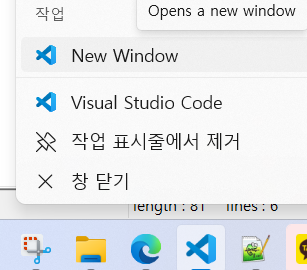
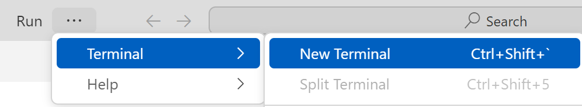
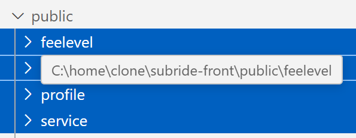
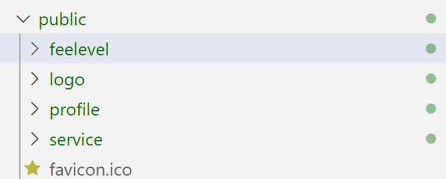

# React 프로젝트 생성 

## 새로운 프로젝트 작성
- MobaXTerm에서 Local 세션 열기 (Mac은 터미널 오픈)   

- {홈디렉토리}/workspace로 이동  
```
cd ~/home/workspace  
```   

- 아래 명령으로 새 프로젝트를 생성   
```
npx create-react-app subride-front
```  

- vscode실행하고 'subride-front'폴더 오픈   
   
   

## 클론 프로젝트 다운로드   
- MobaXTerm에서 로컬 터미널 열기(왼쪽 'Local'더블클릭). Mac은 새탭이나 새창으로 터미널 열기   
- 클론코드 다운로드   
  - 홈디렉토리 하위에 'clone'디렉토리 생성   
  ```
  mkdir -p ~/clone && cd ~/clone
  ```   
  - 클론 프로젝트 다운로드   
  ```
  git clone -b version1 https://github.com/cna-bootcamp/subride-front  
  ```
  - 새로운 vscode실행하고 '{홈}/clone/subride-front'폴더 열기  


## 기본 구조 작성
- public폴더 이미지 복사   
  - 클론 프로젝트의 public디렉토리 하위의 폴더 선택하고 CTRL-C로 복사   
      
  - 내 프로젝트 public디렉토리를 선택하고 붙여넣기   
    

- jsconfig.json 생성: 클론 프로젝트 루트에 있는 jsconfig.json복사하여 붙여넣기   
이 파일의 역할은 소스 디렉토리의 위치를 지정하는 것입니다.  
```
{
    "compilerOptions": {
        "baseUrl": "src"
    },
    "include": ["src"]
}
```

- package.json 내용 복사: 클론 프로젝트 루트에 있는 package.json파일 내용을 복사  
이 파일은 프로젝트의 기본정보와 라이브러리가 정의되어 있습니다.   

- 내 프로젝트의 package-lock.json파일 삭제   
  이 파일은 라이브러리 설치 시 다시 생성되며, 과거 정보가 있으면 문제 생길 수 있으므로 삭제   

- src/assets 디렉토리 복사: 공통 이미지          
- src/components 디렉토리 복사: 공통적인 화면 구성요소를 모은 컴포넌트  
  > **공통 화면 컴포넌트**  
  > BackHeader.jsx: 뒤로가기 버튼  
  > CommonButton.jsx: 사용안함  
  > Navigation.jsx: 앱 하단의 바로가기 버튼  
  > PrivateRouter.jsx: 각 페이지 라우팅 설정 시 미 로그인 시 로그인 페이지 가게함  
  
- src/fonts 디렉토리 복사: 사용할 폰트이며 나눔고딕체를 사용  

- index.html 바꾸기: 클론 프로젝트의 public/index.html 내용으로 변경   
  앱이 실행될 때 index.html이 실행됨. root 디비전안에 index.js파일이 불려짐     
  ```
  <body>
    <div id="root"></div>
  </body>
  ```  

- index.js 파일 내용 복사  
  \<App /\>부분에 App.js가 불려짐    
  ```
  root.render(
  //<React.StrictMode>
    <BrowserRouter>
      <ThemeProvider theme={theme}>
        <CssBaseline/>
        <App />
      </ThemeProvider>
    </BrowserRouter>
  //</React.StrictMode>
  );
  ```
  > **React.StrictMode**를 리마크한 이유:   
  > 개발 시에만 사용하는 모드로 의도하지 않은 부작용 감지를 위해 렌더링을 두 번 실행하므로   
  > 서버 API도 2번씩 호출함.  리마크 안해도 되나 디버그할 때 2번 API 호출되는게  
  > 계속 눈에 거슬려 리마크함. 사실 리마크 안하는게 권장사항   

- index.css 파일 내용 복사

- App.js 파일 내용 복사: 앱의 메인 프로그램임     
  - react라이브러리: React의 가장 기본 라이브러리   
    React에서 라이브러리를 import할 때는 import <모듈명> from <라이브러리명>으로 함   
    react라이브러리안의 useState, useEffect, useCallback이라는 모듈을 불러들임   
    라이브러리에서 정한 이름을 그대로 사용함   
    ```
    import { useState, useEffect, useCallback } from "react";
    ```  
  - react-router-dom: DOM(Document Object Model: HTML을 구성하는 버튼, 체크박스 등의 객체)객체 처리 라이브러리  
    ```
    import { useNavigate, useLocation } from "react-router-dom";
    ``` 
  - react-toastify: 토스트 팝업(잠깐 나왔다 사리지는 창) 라이브러리   
    ```
    import { ToastContainer } from "react-toastify";
    ```

  - 개발한 모듈 import: 개발한 모듈도 유사하게 import할 수 있음     
    useAuthCheck: 인증 토큰이 유효한지와 재갱신처리를 담당하는 모듈  
    routes: 컴포넌트간 라우팅을 정의한 모듈. 'routes/index'인데 index를 생략하면 index.js가 불려짐   
    ```
    import useAuthCheck from "utils/useAuthCheck";
    import AppRoutes from "routes";
    ```  

  - useState모듈: 컴포넌트내에 다른 객체의 변화가 있을 때 자신의 데이터를 동적으로 변경할 때 사용    
    컴포넌트의 다른 객체의 변화는 useEffect모듈로 감지하고 자신의 데이터 객체명을 앞에, 바꾸는 함수를 뒤에 정의함  
    아래 예에서 user객체를 변경시키는 함수를 setUser로 정의한 것임   
    user객체의 초기값은 useState의 파라미터값임. 아래 예에서는 초기값을 null로 한 것임   
    ```
    const [user, setUser] = useState(null);

    ```

  - import한 모듈을 처리할 객체를 생성   
    > **navigate**: 컴포넌트 이동 처리   
    > **location**: 현재 컴포넌트 위치를 담고있는 객체   
    > **isTokenVefified**: 인증 토큰이 유효한지와 재갱신처리를 담당하는 객체  
    ```
    const navigate = useNavigate();
    const location = useLocation();
    const isTokenVerified = useAuthCheck();
    ```    
  
  - useEffect: 컴포넌트 내의 어떤 객체의 값의 변화를 감지하여 필요한 처리를 하는 모듈  
    아래 예에서는 감지할 객체가 '[]'임. 이 객체는 컴포넌트 자체라서 컴포넌트가 로딩되는 것을 감지함   
    즉, 컴포넌트가 로딩될 때 setUser가 호출되어 user객체의 값이 셋팅 됨    
    ```
    useEffect(() => {
        setUser(JSON.parse(sessionStorage.getItem("user")));
    }, []);
    ```

  - useCallback모듈은 수행 요청을 받았을 때 무조건 수행하지 않고, 지정한 객체의 값이 변경되었을 때만 하게 함   
    아래 예에서는 handleAfterLogin 함수가 불려 졌을 때, navigate객체의 값이 변경되었는지 체크하고 수행함  
    handleAfterLogin은 로그인 컴포넌트에서 로그인이 성공했을 때 호출함    
    ```  
    const handleAfterLogin = useCallback(
        (userData) => {
            sessionStorage.setItem("user", JSON.stringify(userData));
            setUser(userData);
            navigate("/");
        },
        [navigate]
    );
    ```
  
  - index.js에서 App모듈이 불려지므로 아래와 같이 리턴을 해줘야 화면에 나타남   
    React에서는 1개의 DOM객체만 리턴할 수 있음.  
    만약 여러개의 DOM객체를 리턴해야 한다면 아래와 같이 '<>'과 '</>'사이에 리턴값을 지정해야 함  
    \<ToastContainer /\>는 토스트 팝업을 표시하기 위해 생성한 것임.  '
    각 컴포넌트에서 토스트 팝업을 요청하면 이 영역에 팝업 내용이 동적으로 들어가고 표시 위치가 적절히  
    지정되어 화면에 나타나게 됨     
    ```
    return (
        <>
        {isTokenVerified || location.pathname === "/login" ? (
            <AppRoutes user={user} handleAfterLogin={handleAfterLogin} />
        ) : (
            <div>Loading...</div>
        )}
        <div>
            <ToastContainer />
        </div>
        </>
    );
    ```
    > **컴포넌트 간 변수와 함수 전달**    
    > AppRoute 컴포넌트를 호출하면서 파라미터로 user객체와 handleAfterLogin함수를 전달하고 있음    
    > 이렇게 각 컴포넌트 간에 파라미터로 변수와 함수를 전달함    
    

  - 모듈 Export: 다른 모듈에서 쓸 수 있도록 외부에 모듈을 공개함   
    ```
    export default App;
    ```

- src/routes 디렉토리 복사: 페이지 간 연결 정보 정의됨   
  > **페이지 라우팅** 정의: 라우팅 정의는 한 파일에 할 수 있지만 페이지의 계층적 구조에 따라 분할하는 것이 좋음   
  > index.js: 최상위 라우팅 정의 파일   
  > auth.route.js: 로그인과 회원가입 페이지의 라우팅 정의    
  > main.routes.js: 메인화면의 라우팅 정의   
  ※ 앞으로 '페이지'라는 말 대신에 **'컴포넌트'**라는 말을 사용하겠음

- src/utils 디렉토리 복사: 공통 유틸리티 모듈과 함수      
  > **apiInstance.js**: 백엔드 API 요청을 처리하는 객체 생성. 서비스명별 주소와 요청헤더에 인증토큰을 추가함   
  > **cookieHelper.js**: 쿠키처리 함수. 사용안함   
  > **palette.js**: 화면 스타일을 정의한 모듈. index.js에서 불려짐  
  > **useAuthCheck.js**: 인증 토큰이 유효한지와 재갱신처리를 담당하는 모듈  

## Git 업로드  
소스를 Git저장소에 업로드함   
