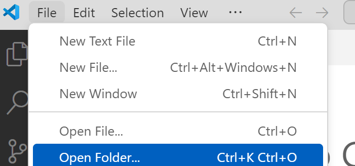

# React 프로젝트 생성 

## 새로운 프로젝트 작성
- MobaXTerm에서 Local 세션 열기 (Mac은 터미널 오픈)   

- {홈디렉토리}/workspace로 이동  
```
cd ~/home/workspace  
```   

- 아래 명령으로 새 프로젝트를 생성   
```
npx create-react-app subride-front
```  

- vscode실행하고 'subride-front'폴더 오픈   
   
   

## 클론 프로젝트 다운로드   
- MobaXTerm에서 로컬 터미널 열기(왼쪽 'Local'더블클릭). Mac은 새탭이나 새창으로 터미널 열기   
- 클론코드 다운로드   
  - 홈디렉토리 하위에 'clone'디렉토리 생성   
  ```
  mkdir -p ~/clone && cd ~/clone
  ```   
  - 클론 프로젝트 다운로드   
  ```
  git clone -b version1 https://github.com/cna-bootcamp/subride-front  
  ```
  - 새로운 vscode실행하고 '{홈}/clone/subride-front'폴더 열기  


## 기본 구조 작성
- public폴더 이미지 복사   
  - 클론 프로젝트의 public디렉토리 하위의 폴더 선택하고 CTRL-C로 복사   
      
  - 내 프로젝트 public디렉토리를 선택하고 붙여넣기   
    

- jsconfig.json 생성: 클론 프로젝트 루트에 있는 jsconfig.json복사하여 붙여넣기   
이 파일의 역할은 소스 디렉토리의 위치를 지정하는 것입니다.  
```
{
    "compilerOptions": {
        "baseUrl": "src"
    },
    "include": ["src"]
}
```

- package.json 내용 복사: 클론 프로젝트 루트에 있는 package.json파일 내용을 복사  
이 파일은 프로젝트의 기본정보와 라이브러리가 정의되어 있습니다.   

- 내 프로젝트의 package-lock.json파일 삭제   
  이 파일은 라이브러리 설치 시 다시 생성되며, 과거 정보가 있으면 문제 생길 수 있으므로 삭제   

- src/assets 디렉토리 복사: 공통 이미지          
- src/components 디렉토리 복사  
  > **공통컴포넌트**  
  > BackHeader.jsx: 뒤로가기 버튼  
  > CommonButton.jsx: 사용안함  
  > Navigation.jsx: 앱 하단의 바로가기 버튼  
  > PrivateRouter.jsx: 각 페이지 라우팅 설정 시 미 로그인 시 로그인 페이지 가게함  
  
- src/fonts 디렉토리 복사: 사용할 폰트이며 나눔고딕체를 사용  

- index.html 바꾸기: 클론 프로젝트의 public/index.html 내용으로 변경   
  앱이 실행될 때 index.html이 실행됨. root 디비전안에 index.js파일리 불려짐     
  ```
  <body>
    <div id="root"></div>
  </body>
  ```  

- index.js 파일 내용 복사  
  <App />부분에 App.js가 불려짐    
  ```
  root.render(
  //<React.StrictMode>
    <BrowserRouter>
      <ThemeProvider theme={theme}>
        <CssBaseline/>
        <App />
      </ThemeProvider>
    </BrowserRouter>
  //</React.StrictMode>
  );
  ```
  > **React.StrictMode**를 리마크한 이유: 
  > 개발 시에만 사용하는 모드로 의도하지 않은 부작용 감지를 위해 렌더링을 두 번 실행하므로  
  > 서버 API도 2번씩 호출함.  리마크 안해도 되나 디버그할 때 2번 API 호출되는게  
  > 계속 눈에 거슬려 리마크함. 사실 리마크 안하는게 권장사항   

- index.css 파일 내용 복사

- App.js 파일 내용 복사: 앱의 메일 프로그램임     
  - react라이브러리: React의 가장 기본 라이브러리   
    React에서 라이브러리를 import할 때는 import <객체명> from <라이브러리명>으로 함   
    react라이브러리안의 useState, useEffect, useCallback이라는 객체를 불러들임   
    라이브러리에서 정한 이름을 그대로 사용함   
    ```
    import { useState, useEffect, useCallback } from "react";
    ```  
  - 


- src/routes 디렉토리 복사: 페이지 연결 정보 정의됨   
  > **페이지 라우팅** 정의  
  > index.js: 최상위 라우팅 정의 파일   
   

## Git 업로드  
