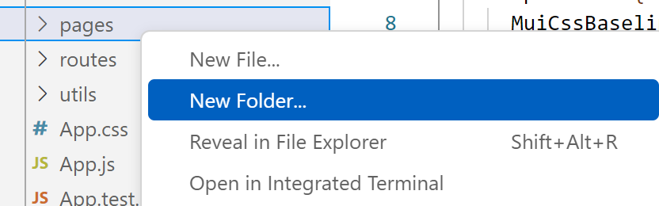
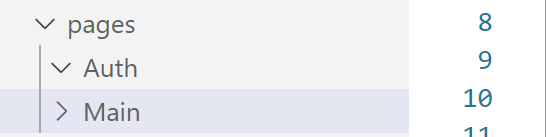

# Version1 개발  

Version1에서는 로그인 페이지와 회원가입 페이지를 만듭니다.   

## 로컬 Git 브랜치 변경    
앞으로 개발될 각 버전별로 브랜치를 나눌것입니다.   
첫번째 버전의 브랜치명은 'version1'으로 합니다.   
- 아래 명령으로 version1 브랜치를 만듭니다.  
> -B 옵션은 브랜치가 없으면 생성하고 이동하는 것임   
```
git checkout -B version1 
```

## 로그인 페이지 개발  
React 컴포넌트(페이지)는 목적별로 디렉토리를 만드는 것이 관리하기 쉽습니다.   
- 컴포넌트 디렉토리 생성   
아래와 같이 pages디렉토리를 만들고 하위에 Auth와 Main 디렉토리를 만드십시오.   
   
   
Main폴더를 만들때는 'pages' 위에서 우측 마우스 버튼을 누르면 됨   



- 로그인 컴포넌트 개발   
  - Login.jsx파일 복사: 클론 프로젝트에서 Login.jsx파일을 복사합니다.   
    > **Tip: 확장자 js와 jsx의 차이**  
    > js: javascript의 약자로 스크립트 작성 용도로 사용    
    > jsx: javascript XML의 약자로 스크립트와 HTML을 사용   
    > 확장자를 js로 개발해도 되나 React 컴포넌트는 보통 jsx확장자를 씀   
  
  - 아래와 같이 TextField 객체에 onChange, onKeyDown등의 이벤트 발생시 처리 함수를 적절히 지정함    
  ```
    <TextField
    id="userId"
    label="사용자ID"
    variant="standard"
    type="text"
    value={userId}
    onChange={handleUserIdChange}
    onKeyDown={handleUserIdKeyDown}
    fullWidth
    margin="normal"
    error={!!userIdError}
    helperText={userIdError}
    />
  ```

  사용자가 id를 입력할 때마다 setUserId함수로 userId값이 바뀌게 됨   
  ```
  const [userId, setUserId] = useState("");
  {중략}
  const handleUserIdChange = (event) => {
    setUserId(event.target.value);
    setUserIdError("");
  };
  ```

  - 로그인과 회원가입 이동 버튼   
  ```
      <div style={{ display: "flex", justifyContent: "space-between" }}>
        <Button variant="contained" onClick={handleLogin}>
          Login
        </Button>
        <Button variant="outlined" onClick={handleSignUp}>
          Sign Up
        </Button>
      </div>
  ```
