# minikube 설치하기

minikube는 단일 노드에 Kubernetes cluster를 설치하는 말 그대로 미니k8s입니다.  


---

## VM 만들기  
- **AWS 콘솔 로그인 후 EC2를 검색합니다.**   
  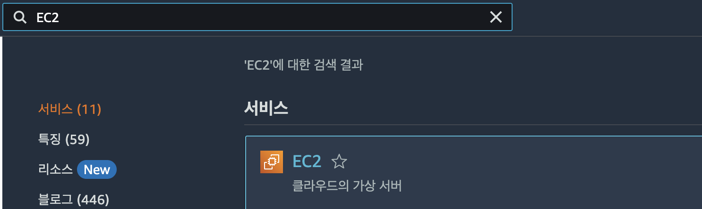

- **VM 인스턴스 작성**   
  좌측 메뉴에서 '인스턴스'를 클릭하고 우측에서 '인스턴스 시작'버튼을 누릅니다.   
  
  - 적절한 이름과 OS를 선택합니다.     
    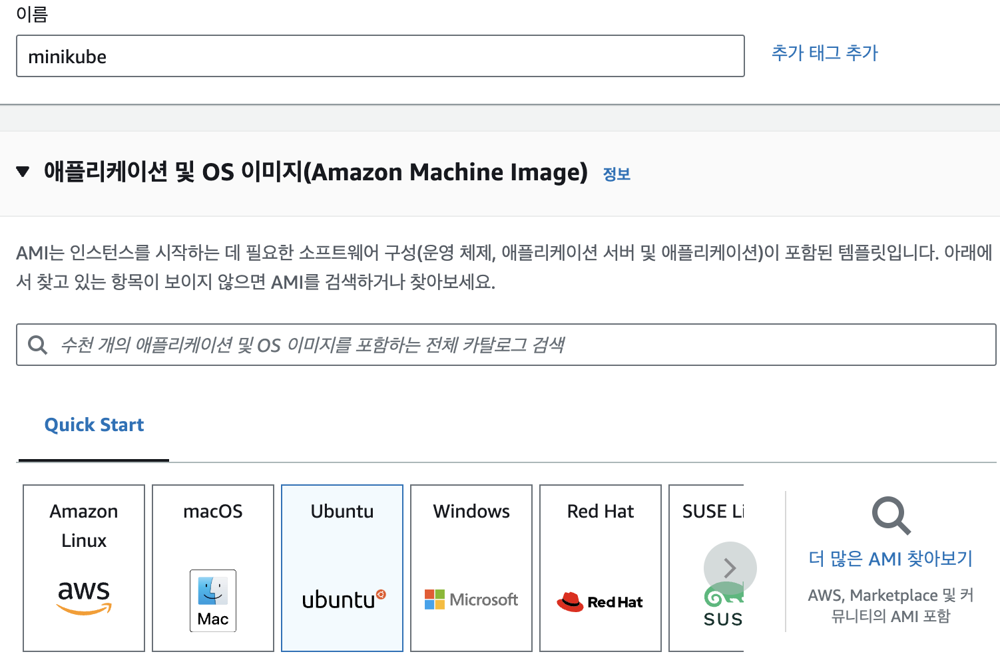   

  - 원하는 사양의 인스턴스 유형을 선택합니다. 이후 리소스 조정 필요 시 다른 인스턴스 유형으로 변경 가능합니다.     
    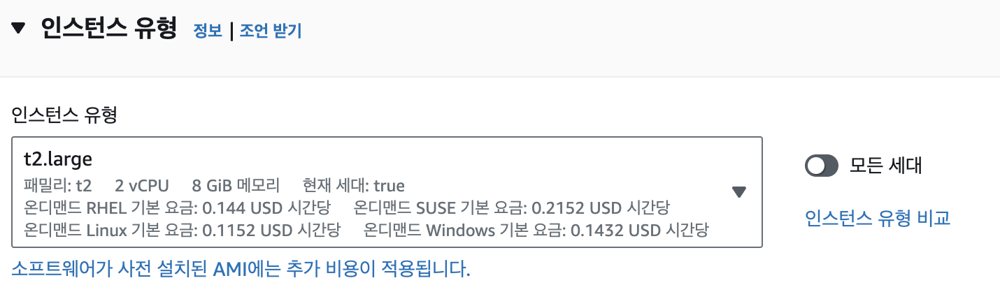
  
  - 키페어를 생성합니다. ssh로 로그인 시 사용할 private key입니다.   
    private key파일이 다운로드 됩니다. 적절한 위치에 다운로드 하십시오.    
    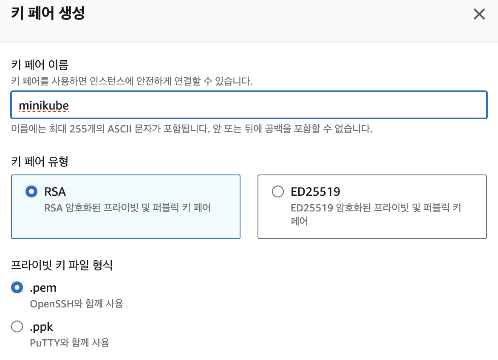   

  - 보안그룹 지정: 방화벽 설정을 하는 보안그룹을 생성합니다.  
    이미 있다면 기존 보안그룹을 선택합니다.      
    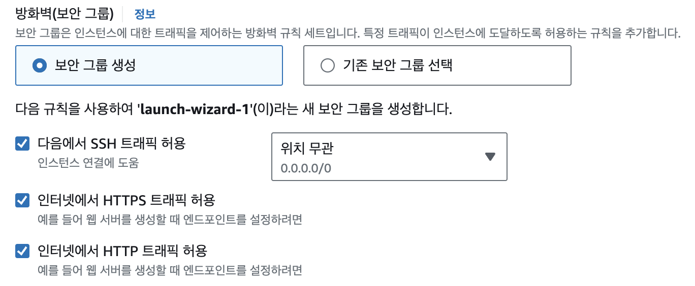    

  - 스토리지 구성  
    기본 스토리지는 최대값 30GB를 지정합니다.   
    NFS(Network File Server)스토리지와 container image 저장 디렉토리를 별도의 볼륨으로 하려면,   
    추가 볼륨을 적당한 크기로 지정합니다.   
    > 참고: 혼자 스터디 목적으로 minikube 설치 시에는 추가 볼륨 필요 없습니다.  
    > 여러명이 사용하거나 실제 환경에서 볼륨 추가하는 방법까지 알고 싶은 분만 추가하십시오.  

    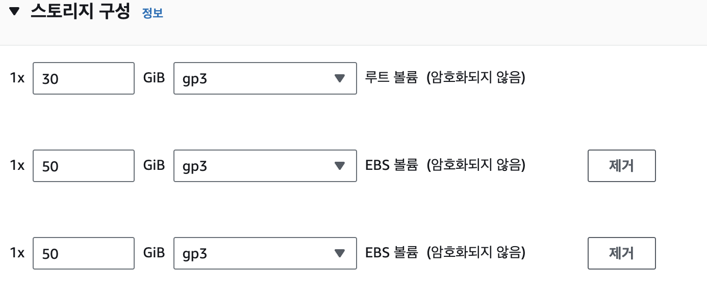  

- **ssh로 접근하기**  
  인스턴스에 연결을 클릭합니다.  
  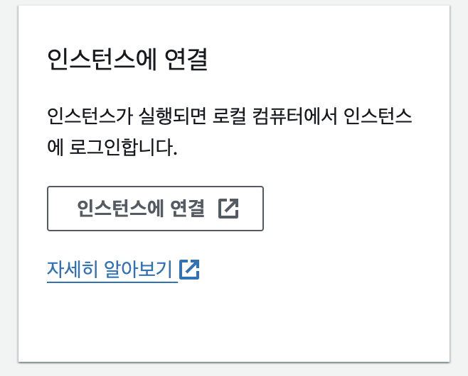  

  SSH클라이언트 탭에서 맨 아래쯤에 있는 ssh 연결 명령어를 복사 합니다.  
  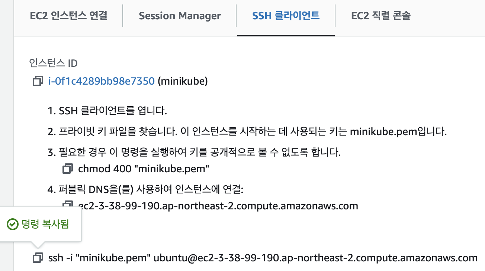  

  아래 예와 같이 private key의 모드를 바꿉니다. 
  ```
  chmod 400 minikube.pem
  ```

  복사한 명령을 붙여넣어 로그인합니다. 최초에 계속할 지 물어보는 질문에 yes를 입력합니다.   
  ```
  ssh -i "minikube.pem" ubuntu@ec2-3-38-99-190.ap-northeast-2.compute.amazonaws.com
  ...
  Are you sure you want to continue connecting (yes/no/[fingerprint])? yes
  ```

- **유저계정에 sudo 권한 부여하기**  
  root계정으로 작업하는 건 권장되지 않으므로, 유저계정에 sudo 권한을 부여합니다.  
  sudo권한이 부여되면 root계정으로 수행하는 명령을 'sudo 명령어'로 실행할 수 있습니다.  
  
  현재 유저 계정 이름을 확인합니다.   
  ```
  id
  uid=1000(ubuntu) gid=1000(ubuntu) ...
  ```

  root계정으로 전환합니다.    
  ```
  sudo -i
  ```

  sudo권한 설정 파일을 엽니다.    
  ```
  vi /etc/sudoers
  ```

  아래 부분을 찾아서 유저계정(아래 예에서는 ubuntu)을 추가합니다.   
  NOPASSWD 옵션은 sudo 명령 사용 시 암호를 묻지 않게 하는 겁니다.
  수정할 위치로 커서를 이동하고 'i'를 누르고 추가합니다.       
  ```
  # User privilege specification
  root    ALL=(ALL:ALL) ALL
  ubuntu  ALL=(ALL:ALL) NOPASSWD:ALL
  ```
  ESC키를 누르고 ':'입력 후 'wq!'를 입력하여 저장후 닫습니다.  
  
  'exit'를 입력하여 유저계정으로 돌아갑니다.  
  유저 계정에서 또 'exit'를 입력하여 PC터미널로 나갑니다.   
  그리고 다시 ssh로 접근합니다. 위에 화살표를 누르면 이전 명령이 나타납니다.   

  sudo 권한이 잘 부여되어 있는지 아래 명령으로 curl을 설치합니다.  
  암호를 묻지 않고 설치되면 잘 된겁니다.   
  ```
  sudo apt-get install -y curl
  ``` 

- **VM 리소스 조정**  
  사용량에 따라 VM 리소스를 늘리거나 줄일 필요가 있을 때 수행 하십시오.    
  먼저 VM을 중지합니다.   
  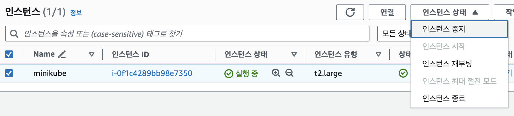  

  인스턴스 유형 변경을 선택합니다.   
  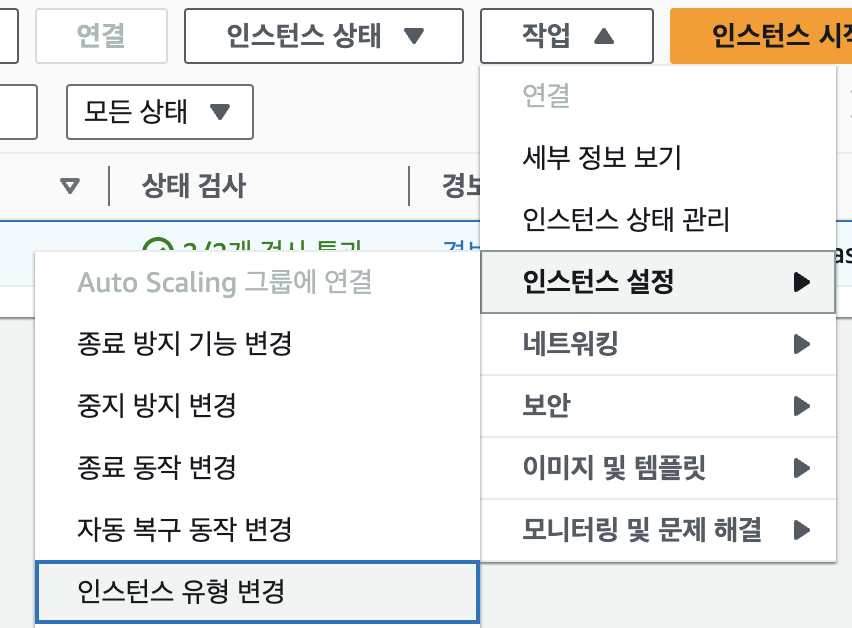  

  새 인스턴스 유형을 선택합니다.  
  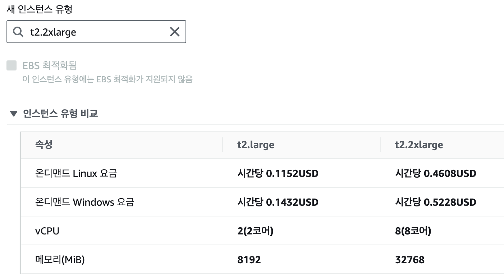
  
  하단의 [적용]버튼을 클릭합니다.   

  VM을 다시 시작합니다. [작업] > [인스턴스 시작]을 실행 합니다.  

  인스턴스 유형을 바꾸면 퍼블릭IP와 도메인이 변경됩니다.  
  인스턴스의 [연결]정보를 클릭하여 ssh명령을 다시 복사하여 접속합니다.    
  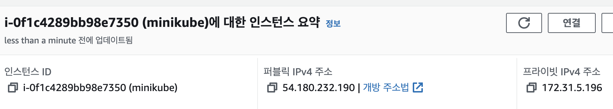    
  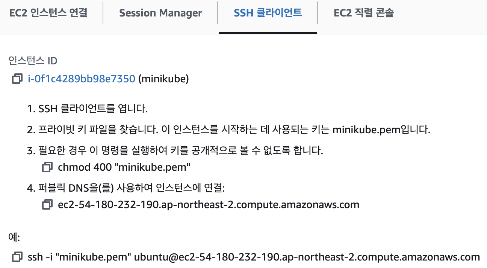   

  아래 명령으로 조정된 CPU와 메모리를 확인합니다.   
  ```
  lscpu
  free -h
  ```

---

## Docker 설치
- **Docker 설치**   
  아래 링크를 참조하여 Docker를 설치합니다.  
  명령어 앞에는 sudo를 붙여야 합니다.   
  [Docker 설치](https://happycloud-lee.tistory.com/14?category=830565)  

  모두 설치 후 유저계정을 docker 그룹에 추가합니다.  
  ```
  sudo usermod -aG docker $USER
  ```

  'exit'로 로그아웃하고 다시 로그인합니다.   
  그리고 아래 명령으로 docker 그룹에 추가되었는지 확인합니다.  
  ```
  ubuntu@ip-172-31-5-196:~$ groups ubuntu
  ubuntu : ubuntu adm cdrom sudo dip lxd docker
  ```

  이제 부터는 sudo를 안 붙이고 docker 명령을 사용할 수 있습니다.  
  ```
  docker version
  ```

- **(옵션) 디스크 파티션, 파일시스템 만들기, 마운트 하기**  
  추가 볼륨을 만드신 분만 수행하십시오.  
  추가한 디스크를 사용할 수 있게 파티셔닝과 파일시스템 생성 후 마운트 합니다.   
  아래 글에 좀 더 자세한 정보가 있습니다.   
  [스토리지 관리](https://happycloud-lee.tistory.com/161)  

  - root 계정으로 전환   
    ```
    sudo -i
    ```

  - 볼륨 리스트 확인   
    아래 예에서는 xvdb와 xvdc가 추가한 볼륨입니다.  
    ```
    root@ip-172-31-5-196:~# lsblk
    NAME     MAJ:MIN RM  SIZE RO TYPE MOUNTPOINTS
    loop0      7:0    0 25.2M  1 loop /snap/amazon-ssm-agent/7993
    loop1      7:1    0 55.7M  1 loop /snap/core18/2829
    loop2      7:2    0 38.8M  1 loop /snap/snapd/21759
    xvda     202:0    0   30G  0 disk 
    ├─xvda1  202:1    0   29G  0 part /
    ├─xvda14 202:14   0    4M  0 part 
    ├─xvda15 202:15   0  106M  0 part /boot/efi
    └─xvda16 259:0    0  913M  0 part /boot
    xvdb     202:16   0   50G  0 disk 
    xvdc     202:32   0   50G  0 disk 
    ```  
  - 파티션 만들기  
    아래 예와 같이 fdisk로 파티션을 만듭니다.  
    볼륨 이름 앞에 '/dev/'를 붙여야 합니다.   
    여러 파티션으로 분할하지 않는다면 계속 ENTER쳐서 디폴트값을 적용하면 됩니다.   
    ```
    root@ip-172-31-5-196:~# fdisk /dev/xvdb

    {중략}

    Command (m for help): n
    Partition type
      p   primary (0 primary, 0 extended, 4 free)
      e   extended (container for logical partitions)
    Select (default p): p
    Partition number (1-4, default 1): 
    First sector (2048-104857599, default 2048): 
    Last sector, +/-sectors or +/-size{K,M,G,T,P} (2048-104857599, default 104857599): 

    Created a new partition 1 of type 'Linux' and of size 50 GiB.

    Command (m for help): w
    The partition table has been altered.
    Calling ioctl() to re-read partition table.
    Syncing disks.
    ```
  - lsblk를 다시 입력하면 파티션이 만들어진걸 확인할 수 있습니다.   
    xvdb밑에 xvdb1이 새로 만들어진 파티션입니다.  
    ```
    root@ip-172-31-5-196:~# lsblk 
    NAME     MAJ:MIN RM  SIZE RO TYPE MOUNTPOINTS
    loop0      7:0    0 25.2M  1 loop /snap/amazon-ssm-agent/7993
    loop1      7:1    0 55.7M  1 loop /snap/core18/2829
    loop2      7:2    0 38.8M  1 loop /snap/snapd/21759
    xvda     202:0    0   30G  0 disk 
    ├─xvda1  202:1    0   29G  0 part /
    ├─xvda14 202:14   0    4M  0 part 
    ├─xvda15 202:15   0  106M  0 part /boot/efi
    └─xvda16 259:0    0  913M  0 part /boot
    xvdb     202:16   0   50G  0 disk 
    └─xvdb1  202:17   0   50G  0 part 
    xvdc     202:32   0   50G  0 disk 
    ```
  - 생성된 파티션에 파일 시스템을 만듭니다.     
    mkfs.ext4 /dev/파티션명 명령으로 만듭니다. 
    ```
    root@ip-172-31-5-196:~# mkfs.ext4 /dev/xvdb1
    mke2fs 1.47.0 (5-Feb-2023)
    Creating filesystem with 13106944 4k blocks and 3276800 inodes
    Filesystem UUID: b0b6aeab-571b-444e-8c5b-f11a4cfac994
    Superblock backups stored on blocks: 
      32768, 98304, 163840, 229376, 294912, 819200, 884736, 1605632, 2654208, 
      4096000, 7962624, 11239424

    Allocating group tables: done                            
    Writing inode tables: done                            
    Creating journal (65536 blocks): done
    Writing superblocks and filesystem accounting information: done    
    ```
  
  - 마운트 하기  
    첫번째 볼륨은 NFS(Network File Server)의 볼륨으로 사용하겠습니다.   
    NFS볼륨은 k8s 파드가 사용하는 볼륨이 됩니다.  
    '/data' 디렉토리로 마운트 되도록 하겠습니다.  
    파일시스템의 UUID를 확인합니다.   
    ```
    root@ip-172-31-5-196:~# lsblk --fs
    NAME     FSTYPE FSVER LABEL           UUID                     
    {중략}
    xvdb                                                                                      
    └─xvdb1  ext4   1.0                   b0b6aeab-571b-444e-8c5b-f11a4cfac994
    ```

    마운트 정의 파일인 /etc/fstab파일을 엽니다.  
    끝에 아래 예와 같이 마운트 설정을 추가합니다.  LABEL이 아니라 UUID인걸 주의 하십시오.  
    ```
    {중략}
    UUID=b0b6aeab-571b-444e-8c5b-f11a4cfac994 /data ext4 defaults 0 1
    ```

    '/data'디렉토리를 만듭니다.   
    ```
    mkdir -p /data
    ```

    시스템에 변경사항을 반영합니다.   
    ```
    systemctl daemon-reload 
    ```

    아래 명령으로 마운트 시킵니다.  
    ```
    mount -a
    ```

    아래 명령으로 마운트 결과를 확인합니다.  
    ```
    root@ip-172-31-5-196:~# df -h
    Filesystem      Size  Used Avail Use% Mounted on
    /dev/root        29G  2.3G   26G   9% /
    {중략}
    /dev/xvdb1       49G   24K   47G   1% /data
    ``` 

  - 두번째 볼륨을 Docker image 저장소로 마운트 하기  
    두번째 볼륨의 파티션을 만들고 파일 시스템 생성을 하십시오.   
    두번째 볼륨은 Docker image 저장소인 /var/lib/docker 디렉토리로 마운트 시킵니다.   
    생성한 파일시스템의 UUID를 확인하고 /etc/fatab에 마운트 설정을 추가합니다.  
    
    ```
    {중략}
    UUID=b0b6aeab-571b-444e-8c5b-f11a4cfac994 /data ext4 defaults 0 1
    UUID=c29da2a1-be8d-4f3f-ab05-9a9714a57a1c /var/lib/docker ext4 defaults 0 1    
    ```
    
    Docker를 중단합니다.   
    ```
    systemctl stop docker
    ```

    변경 사항을 시스템에 반영하고, 마운트 한 후, 결과를 확인합니다.  
    ```
    systemctl daemon-reload
    mount -a
    df -h
    ```

    Docker를 다시 시작합니다.  
    ```
    systemctl start docker
    ```

    테스트로 이미지를 다운로드 해 봅니다.   
    정상적으로 다운로드되면 잘 마운트 된 겁니다.    
    ```
    docker pull nginx
    ```

---

## minikube 설치  
아래 글을 참고하여 minikube를 설치 합니다.  
minikube는 유저 권한으로 설치해야 합니다.  
[k8s설치하기](https://happycloud-lee.tistory.com/20)  

설치 후 대시보드, ingress 활성화, 메트릭 서버 활성화, 추가 편의 작업까지  
모두 하십시오.   
kubectx는 필요 없습니다. kubens만 만들어 주십시오.  

- **대시보드 접근을 위한 보안그룹 설정 추가**  
대시보드를 PC에서 접속하기 위해서는 아래와 같이 보안 설정을 추가해야 합니다.  
인스턴스 상세화면에서 보안 탭을 누르고 보안그룹을 클릭합니다.  
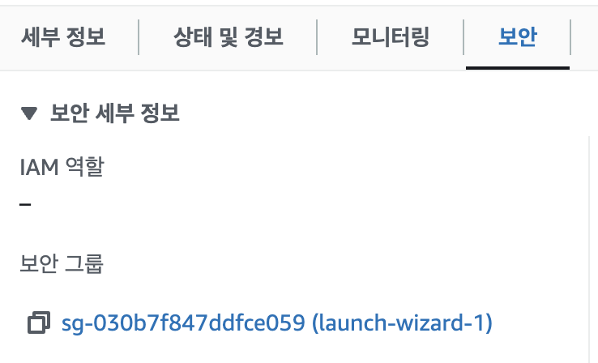  

[인바운드 규칙 편집]을 클릭합니다.   
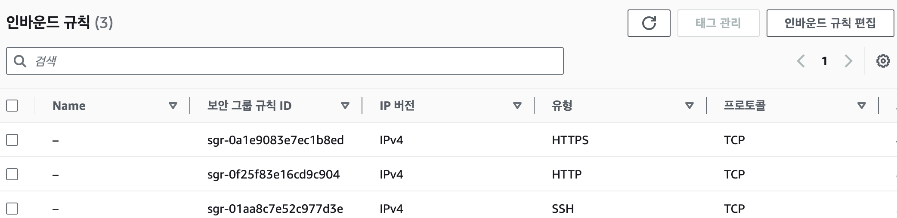  

[규칙추가]버튼을 누르고 아래 그림처럼 30000 - 32767 포트를 허용합니다.  
포트범위에 30000입력하고 '-'를 추가하면 에러 메시지 나오는데 무시하고 32767을 입력하면 됩니다.   
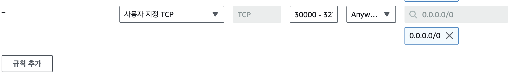  
추가 후 하단 오른쪽의 [규칙저장]을 반드시 누르십시오.   

인스턴스 세부 정보에서 도메인이나 퍼블릭 IP를 확인합니다.  
  

http://{도메인 또는 퍼블릭 IP}:{kubernetes-dashboard 외부 포트}로 대시보드를 열 수 있습니다.  
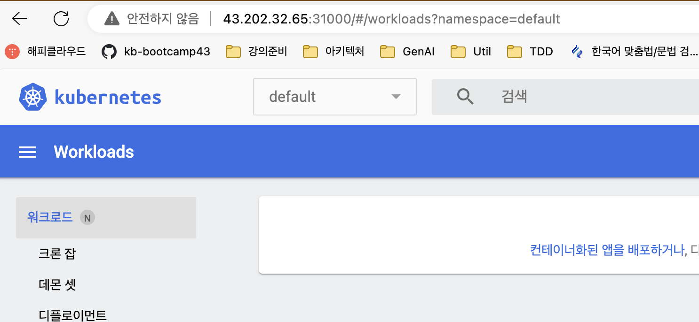  


---

## OS user 생성과 kubernetes config 자동화   
k8s cluster를 여러 사람이 사용하기 위해서는 OS user를 각각 만들고,   
각 OS user에게 특정 namespace만 Write할 수 있도록 허용해야 합니다. 
이를 자동화하기 위한 Shell을 공유합니다.  

[OS user생성과 kubernetes config 자동화](https://happycloud-lee.tistory.com/223)  

---

## ssh key 구성  
OS user로 로그인할 때 ID와 PW를 사용하는 것은 보안 취약점이 될 수 있습니다.  
그래서 VM에 접근할 때는 id/pw로는 접근 못하게 합니다.  
새로 만든 OS user로 접근하기 위한 ssh key를 만드는 방법과 접근 방법을 설명합니다.  

- **ssh key 생성**  
  생성된 OS user를 su로 접근합니다.  
  ```
  ubuntu@ip-172-31-5-196:~$ su - ondal
  ```

  ssh key를 생성합니다. 
  ~/.ssh 디렉토리에 private key인 id_rsa파일과 public key인 id_rsa.pub파일이 생성됩니다.  
  명령 실행 후 계속 Enter치면 됩니다.  
  ```
  ondal@ip-172-31-5-196:~$ ssh-keygen -t rsa -b 4096
  ```

  ~/.ssh 디렉토리로 이동합니다. 
  ```
  cd ~/.ssh
  ```

  authorized_keys파일에 public key파일 내용을 추가합니다.  
  기존에 authorized_keys파일이 없으면 아래 명령 수행 시 자동으로 생성됩니다.  
  ```
  cat id_rsa.pub >> authorized_keys
  ```

  private key id_rsa의 내용을 아래 명령 수행하여 복사합니다.  
  ```
  cat id_rsa
  ```

- **PC에서 ssh 접근 환경 설정 for Mac/Linux**  
  홈 디렉토리에 .ssh 디렉토리를 만듭니다.  
  ```
  mkdir -p ~/.ssh && cd ~/.ssh
  ```

  아래 예와 같이 위에서 복사한 private key 내용으로 private key 파일을 만듭니다.  
  파일명은 적절하게 만듭니다.   
  ```
  vi cna.ondal
  ```

  만든 파일의 모드를 400으로 변경 합니다.   
  ```
  chmod 400 {private key}
  ```
  
  config 파일을 만듭니다.   
  ```
  vi config 
  ```

  내용은 아래 예와 같이 입력합니다.  
  > Host: 프로파일명이며 ssh 뒤에 이 이름으로 로그인함  
  > Hostname: 접근할 서버의 public ip나 도메인명  
  > Port: ssh 포트이며 보통 22번 포트 사용  
  > User: 접근할 유저  
  > IdentityFile: 위에서 만든 private key 파일명 경로  

  ```
  Host ondal
      HostName 43.202.32.65
      Port 22
      User ondal
      IdentityFile ~/.ssh/cna.ondal
  ```

  아래 예와 같이 지정한 프로파일명으로 로그인 합니다.  
  ```
  ssh ondal
  ```

- **PC에서 ssh 접근 환경 설정 for Window**  
  
  위에서 복사한 private key 내용으로 private key 파일을 만듭니다.  
  파일명은 적절하게 만듭니다.   

  MobaXTerm 세션 프로파일에 private key 파일을 지정합니다.  


