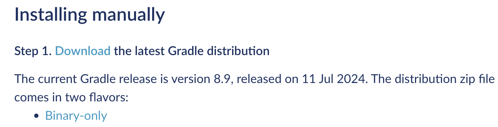
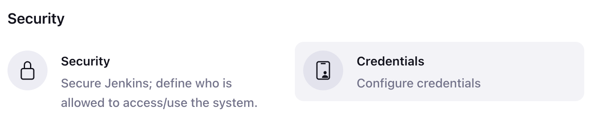
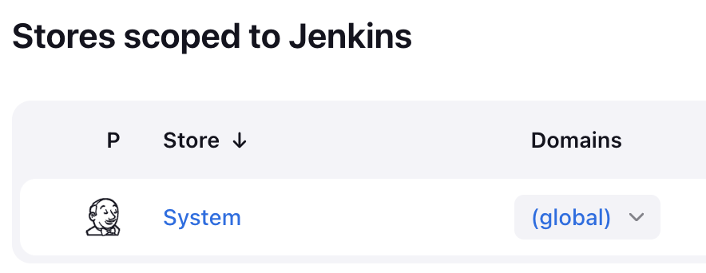
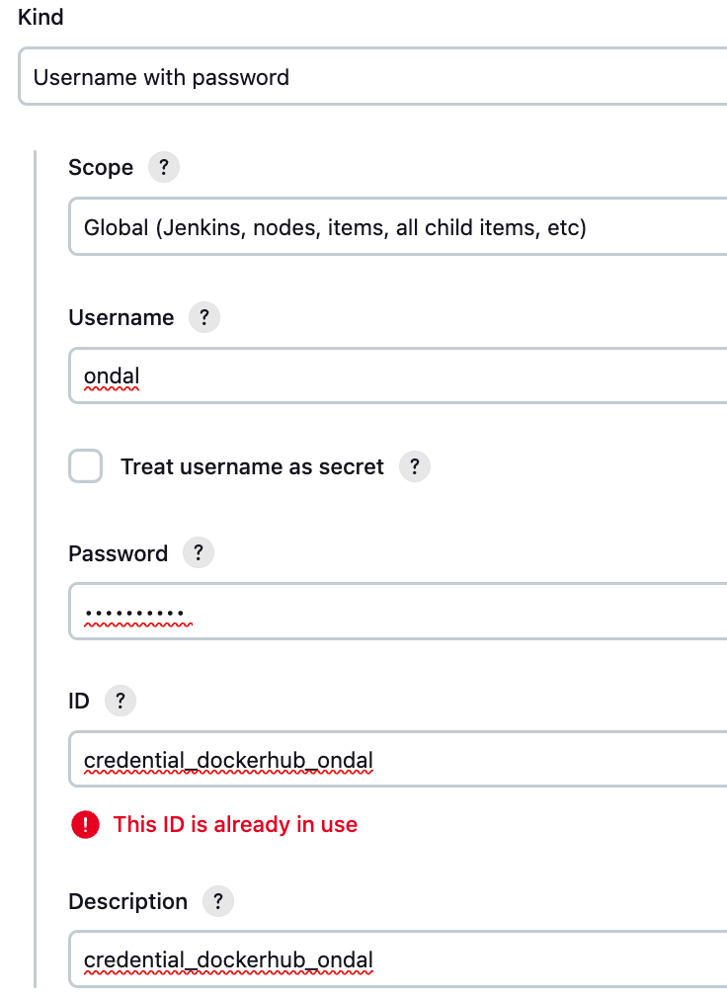

# 개발 환경 구성
샘플 애플리케이션 배포를 위한 개발 환경 구성을 합니다.  

- [개발 환경 구성](#개발-환경-구성)
  - [NFS Dynamic Provisioning](#nfs-dynamic-provisioning)
  - [OpenJDK 설치](#openjdk-설치)
  - [Gradle 설치](#gradle-설치)
  - [Helm 설치](#helm-설치)
  - [Jenkins 설치 및 환경 구성](#jenkins-설치-및-환경-구성)
  - [SonarQube 설치](#sonarqube-설치)
  - [MySQL과 RabbitMQ 설치](#mysql과-rabbitmq-설치)
  - [배포 준비 기타 작업](#배포-준비-기타-작업)


---

## NFS Dynamic Provisioning 
NFS서버를 만들고 PVC만 만들면 자동으로 NFS 공유 디렉토리에 PV가 생성되도록 합니다.  
아래 글을 참고하여 수행합니다.  
[NFS서버 설치와 NFS Dynamic Provisioning 설정](https://happycloud-lee.tistory.com/178)  

| [Top](#개발-환경-구성) |

---

## OpenJDK 설치
아래 글을 참고하여 jdk17 이상을 설치합니다.  
[Ubuntu/CentOS/Mac에 openjdk와 maven 설치](https://happycloud-lee.tistory.com/186)  

| [Top](#개발-환경-구성) |

---

## Gradle 설치
Gradle을 VM에 설치 합니다.  

- 설치 파일 다운로드 및 업로드  
  아래 사이트에 접속하여 설치 파일을 PC에 다운로드 합니다.  
  [Gradle 설치파일 다운로드](https://gradle.org/install/)

     

  다운로드한 zip파일을 VM에 복사합니다.  
  아래 예와 같이 private key가 있는 디렉토리에서 수행합니다.  
  ```
  scp -i minikube.pem ~/Downloads/gradle-8.9-bin.zip ubuntu@43.200.12.214:gradle-8.9-bin.zip
  ```

- 압축해제  
  unzip 프로그램을 설치 합니다.   
  ```
  Ubuntu: sudo apt-get instll -y unzip   
  CentOS: sudo yum install -y unzip 
  ```

  ```
  sudo mkdir /opt/gradle
  sudo unzip -d /opt/gradle gradle-8.9-bin.zip 
  ```

- 설정  
  아래 예와 같이 /etc/profile에 Gradle 경로를 추가 합니다.  
  ```
  GRADLE_HOME=/opt/gradle/gradle-8.9

  PATH=$PATH:$JAVA_HOME/bin:$HOME/bin:$GRADLE_HOME/bin

  export JAVA_HOME PATH CLASSPATH
  ````

- 확인  
  gradle -v 명령을 설치가 잘되었는지 확인합니다.   

| [Top](#개발-환경-구성) |

---

## Helm 설치  
Helm은 kubernetes에 Pod로 서비스 설치를 지원하는 툴입니다.  
아래 글을 참고하여 helm을 설치 합니다.  

[Helm 설치](https://happycloud-lee.tistory.com/3)

| [Top](#개발-환경-구성) |

---

## Jenkins 설치 및 환경 구성  
CI/CD 메인툴인 Jenkins를 설치하고 환경 구성을 합니다. 
아래 글을 참고하여 설치 하십시오.  
[Jenkins 설치](https://happycloud-lee.tistory.com/48)
  

Jenkins 환경 구성도 위 글을 참고하여 수행 하십시오.    

| [Top](#개발-환경-구성) |

---

## SonarQube 설치 

아래 글을 참조하여 SonarQube를 설치하고 환경설정을 합니다.     
[SonaqQube 설치](https://happycloud-lee.tistory.com/49)  

Jenkins에 'SonarQube Scanner' 플러그인을 추가로 설치합니다.  

| [Top](#개발-환경-구성) |

---

## MySQL과 RabbitMQ 설치  
서비스가 배포될 네임스페이스에 설치 합니다.   
namespace는 이미 있을 수 있으니 확인 후 없으면 생성하세요.  
- namespace 생성/이동
  ```
  k create ns ondal
  kubens ondal
  ```

- MySQL설치
  아래 글의 끝에 있습니다.  
  'standalone' 모드로 1대만 설치 하십시오.  
  https://happycloud-lee.tistory.com/4

- RabbitMQ 설치
  namespace는 본인 네임스페이스로 바꾸고, Service Account는 'k get sa'로 확인하여 'sa-'로 시작하는   
  Service Account를 지정하세요.   
  https://happycloud-lee.tistory.com/209

| [Top](#개발-환경-구성) |

---

## 배포 준비 기타 작업

- jenkins의 기본 Service Account에 cluster admin 권한을 부여합니다.  
  ``` 
  kubectl create clusterrolebinding crb_jenkins_default --clusterrole=cluster-admin --serviceaccount=jenkins:default
  ```

- image pull secret 생성  
  **username과 암호는 본인것으로 바꿔야** 합니다.   
  또한 namespace도 서비스가 배포될 본인 namespace로 바꿔야 합니다.  

  ```
  kubectl create secret docker-registry dockerhub \
  --docker-server=docker.io \
  --docker-username=hiondal \
  --docker-password=**** -n ondal
  ```

- Jenkins에 registry credential 작성    
    

  'global'클릭  
    

  본인의 Docker Hub username, password를 입력합니다.  

  ID와 Description에 동일한 값을 붙여 넣습니다. 값은 본인 것으로 바꿔야 합니다.    
  

- envsubst 컨테이너 이미지 제작해서 docker hub에 푸시   
  CI/CD Pipeline에서 사용할 이미지를 제작합니다.   
  envsubst는 환경변수를 읽어 파일 내용을 치환하는 툴입니다.    
  아래 내용으로 Dockerfile을 만들어 이미지를 생성하고 푸시합니다.  
  ```
  $ vi envstr.yaml
  
  FROM alpine:latest

  RUN apk add --no-cache gettext

  CMD ["tail", "-f", "/dev/null"]
  ```   

  이미지를 만듭니다. 'hiondal'은 본인의 organization으로 변경해야 합니다.  
  ```
  docker build -f envstr.yaml -t hiondal/envstr .
  ```

  Docker Hub에 푸시 합니다.  
  ```
  docker login 
  docker push hiondal/envstr
  ```

| [Top](#개발-환경-구성) |

---

