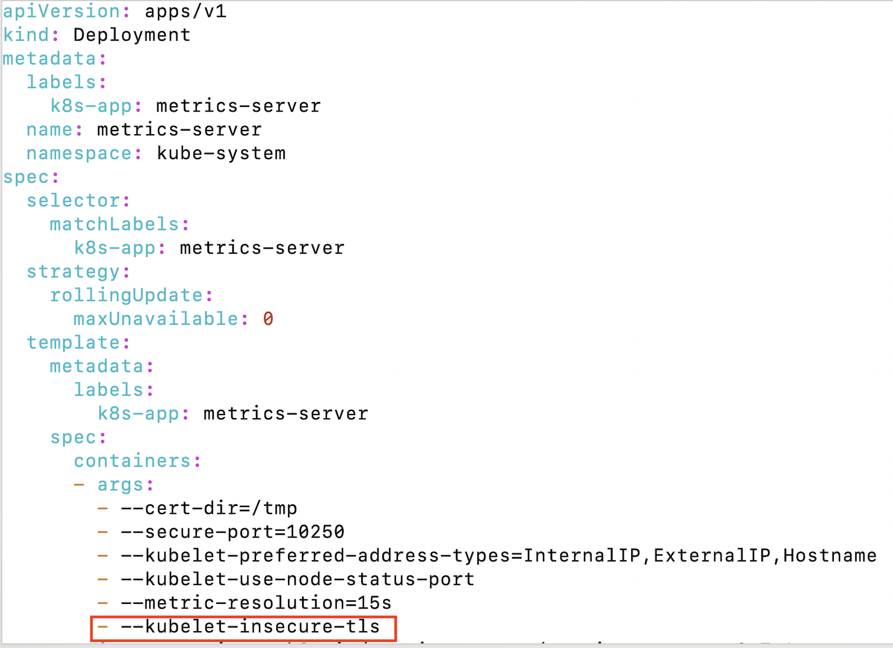

# 쿠버네티스 주요 리소스 실습

- [쿠버네티스 주요 리소스 실습](#쿠버네티스-주요-리소스-실습)
  - [샘플 오브젝트 생성](#샘플-오브젝트-생성)
  - [서비스 실습](#서비스-실습)
  - [ConfigMap/Secret 실습](#configmapsecret-실습)
  - [PV/PVC 실습](#pvpvc-실습)
  - [HPA 실습](#hpa-실습)

실습하는 minikube 노드의 퍼블릭 IP는 43.200.12.214입니다.  
다른 노드에서 실습할 때는 퍼블릭 IP를 자신의 노드로 변경하여 실습하십시오.  

---

## 샘플 오브젝트 생성
이전 '03.kubectl 실습'때 만든 config.yaml을 이용하여 아래 명령으로 오브젝트들을 생성합니다. 
```
kubectl apply -f config.yaml
```

--- 

## 서비스 실습
- Headless 서비스 만들기  
아래 내용으로 headless 정의 yaml 파일을 'headless.yaml'로 만듭니다.   
기존 서비스 정의와 달라진 점은 metadata.name을 변경한 것과 spec.clusterIP=None 이 추가된것뿐입니다.   
```
apiVersion: v1
kind: Service
metadata:
  name: config-headless
  namespace: gappa
spec:
  type: ClusterIP
  clusterIP: None
  selector:
    app: config
  ports:
    - name: config
      port: 18080
      targetPort: 18080

```

headless 서비스를 생성합니다.  
```
k apply -f headless.yaml  
```

파드 수를 늘립니다.  
```
$ k scale deploy config --replicas=2
```

curl 파드로 들어가서 nslookup으로 기존 서비스와 headless 서비스를 조회해 봅니다.   
결과값 차이를 보시면 headless 서비스는 파드의 각 주소를 리턴하는걸 알 수 있습니다.   
```
$ k exec -it curl -- sh
nslookup config
nslookup config-headless
```

- nodePort
아래 내용으로 nodeport.yaml 파일을 만듭니다.   
namespace는 본인 것으로 바꿉니다.  
여러 사람이 하는 경우 외부 포트가 충돌 나므로 31080값을 중복되지 않는 값으로 바꿔서 정의 합니다.   
```
apiVersion: v1
kind: Service
metadata:
  name: config-nodeport
  namespace: gappa
spec:
  type: NodePort
  selector:
    app: config
  ports:
    - name: config
      port: 18080
      targetPort: 18080
      nodePort: 31080
``` 

서비스를 생성하고 외부 포트를 확인합니다.  
```
k apply -f nodeport.yaml
k get svc
```

브라우저에서 http://{퍼블릭IP}:{외부포트}/member-service/default로 접근해 봅니다.   

---

## ConfigMap/Secret 실습
- from-file과 from-env-file

아래 내용으로 imgreg.conf 파일을 만듭니다.   
```
registry=docker.io 
organization=hiondal
repo=member
```

from-file로 ConfigMap 'cm1'을 만듭니다.  
```
k create cm cm1 --from-file imgreg.conf
```

from-env-file로 ConfigMap 'cm2'를 만듭니다.  
```
k create cm cm2 --from-env-file imgreg.conf
```

각 ConfigMap 객체의 내용을 확인해 봅니다.  
```
k describe cm cm1
k describe cm cm2
```

> Tip: k8s 대시보드에서 더 쉽게 오브젝트 정보를 볼 수 있음: http://43.200.12.214:31000

- ConfigMap을 볼륨 마운트 하기  

아래 내용으로 cmvol.yaml 파일을 만듭니다.   

```
apiVersion: v1
kind: ConfigMap 
metadata:
  name: cmvol
data:
  cm.conf: |
    {
      name: "busybox"
      description: "test config"
    }
  imgreg.conf: |+
    registry=docker.io 
    organization=hiondal
    repo=member
```

ConfigMap을 생성합니다.  
```
k apply -f cmvol.yaml
```

config.yaml을 열어 Deployment정의에 아래와 같이 volumeMounts와 volumes항목을 추가합니다.  
> 주의: volumeMounts는 containers.resources와 같은 레벨이고,   
> vaolumes는 containers와 같은 레벨입니다.  

```
{중략}
      containers: 
      {중략}
          resources: 
          {중략}
          volumeMounts:
            - name: myconfig
              mountPath: /home/config
      volumes:
        - name: myconfig
          configMap:
            name: cmvol

```

config.yaml을 다시 적용하여 파드를 재생성합니다.  
```
k apply -f config.yaml 
```

새 파드 생성 후 아래 명령으로 마운트가 제대로 되었는지 확인합니다.   
파드명은 본인 것으로 바꿔야 합니다.   
```
k exec -it config-776bfbc885-vpm69 -- ls -al /home/config
k exec -it config-776bfbc885-vpm69 -- cat /home/config/cm.conf
```

ConfigMap을 변경하면 파드안에 동적으로 반영되는지 확인하겠습니다.   
cmvol.yaml파일을 data 밑의 파일 내용을 변경합니다.   
예를 들어 'name: "busybox"'을 'name: "busybox2"'으로 변경합니다.   
그리고 kubectl apply -f cmvol.yaml로 적용합니다.   

약 1분 후에 변경한 파일의 내용을 확인해 봅니다.   
```
k exec -it config-776bfbc885-vpm69 -- cat /home/config/cm.conf
```

- Image Pull Secret 생성   
Docker Hub의 인증 시크릿 객체를 만듭니다.   
username과 password는 본인것으로 변경합니다.  
```
kubectl create secret docker-registry dockerhub \
--docker-server=docker.io \
--docker-username=hiondal \
--docker-password=11111 
```

Pod를 삭제합니다.  

파드가 생성되면서 ErrImagePull에러가 발생합니다.   
기존에는 Image Pull Secret이 없으니까 무시하고 이미지를 다운로드 하려했고, 퍼블릭 레포지토리의 이미지이므로 잘 다운로드 되었습니다.   
ImagePullSecret이 생기고 나서는 그 인증정보로 접근한 Organization에 이미지가 없기 때문에 에러가 발생합니다.   

docker tag를 이용하여 이미지를 본인 oranization으로 변경하고 본인 Organization에 업로드 합니다.    
ondalk8s는 본인것으로 변경해야 합니다.   
```
docker login
docker tag hiondal/config:2.0.0 ondalk8s/config:2.0.0
dokcer push ondalk8s/config:2.0.0
```

config.yaml을 열어 image명을 본인것으로 변경합니다.   
```
...
      containers:
        - name: config
          image: docker.io/ondalk8s/config:2.0.0
```  

다시 config.yaml을 적용하여 파드가 제대로 생성되는지 확인합니다.  
```
k apply -f config.yaml
``` 

---

## PV/PVC 실습
- Storage Class 만들기  
Storage Class는 아래 명령으로 확인 합니다.  
실행하면 아래와 같은 에러가 발생할 겁니다.   
```
k get sc 

Error from server (Forbidden): storageclasses.storage.k8s.io is forbidden: User "system:serviceaccount:gappa:sa-gappa" cannot list resource "storageclasses" in API group "storage.k8s.io" at the cluster scope
```

왜냐하면 각 유저는 'sa-{유저ID}'라는 Service Account로 k8s클러스터를 접근하는데, 이 Service Account에는 Storage Class에 대해  
아무런 권한이 없기 때문입니다.   

잠깐 admin으로 바꿉니다. 
아래와 같이 kubeconfig파일을 확인해 보면 minikube라는 다른 context가 있는걸 볼 수 있습니다.  
```
vi ~/.kube/config
```

k8s context를 minikube로 바꾸면 admin 권한이 부여됩니다.  
```
k config use-context minikube
```  
변경 후 반드시 본인 네임스페이스로 전환 합니다.  
```
kubens gappa 
```

이제 다시 k get sc 하면 storage class 리스트를 볼 수 있습니다.   

본인 만의 Storage Class를 만듭니다. 아래 내용으로 sc.yaml파일을 만듭니다.   
name은 본인것으로 반드시 바꾸세요.   
```
apiVersion: storage.k8s.io/v1
kind: StorageClass
metadata:
  annotations:
    storageclass.kubernetes.io/is-default-class: "false"
  name: sc-gappa
parameters:
  archiveOnDelete: "false"
provisioner: standard
reclaimPolicy: Retain
volumeBindingMode: Immediate
```

Storage class를 생성하고 확인합니다.  
```
k apply -f sc.yaml
k get sc
```

- PV/PVC 만들고 바인딩   
다시 본인의 context롤 돌아 옵니다.  
context명은 본인 걸로 바꾸시고 수행하세요.   
```
k config use-context gappa
```

아래 내용으로 pvc.yaml파일을 만듭니다.  
namespace, sotrageClassName, selector의 label은 반드시 본인 걸로 바꾸세요.   
```
apiVersion: v1
kind: PersistentVolumeClaim
metadata:
  name: mypvc
  namespace: gappa
spec:
  storageClassName: sc-gappa
  accessModes:
  - ReadWriteOnce
  resources:
    requests:
      storage: 100m
  selector:
    matchLabels:
      volume: gappa
```

아래 내용으로 pv.yaml을 만듭니다.  
metadata.labels, storageClassNmae, hostPath.path는 반드시 본인걸로 바꾸세요.   
```
kind: PersistentVolume
apiVersion: v1
metadata:
  name: pv-gappa
  labels:
    volume: gappa
spec:
  storageClassName: sc-gappa
  capacity:
    storage: 100m
  accessModes:
  - ReadWriteOnce
  persistentVolumeReclaimPolicy: Retain
  hostPath:
    path: /home/gappa/work
    type: Directory
```

pvc와 pv를 생성합니다.  
```
k apply -f pvc.yaml
k apply -f pv.yaml 
```

PVC가 PV와 바인딩 되었는지 확인 합니다.  약 30초 이상 걸립니다.  
```
k get pvc
```

- 파드에 볼륨 마운트 하기   
파드를 실행하는 user는 기본적으로 현재 OS계정입니다.  
마운트 시킬 Host volume인 /home/gappa/work의 권한을 바꿔 줍니다.   
아래 명령으로 현재 OS계정의 UID와 GID를 구합니다.  
```
id
```
그 값으로 마운트할 볼륨의 ownership을 변경합니다.   
```
chown -R {UID}:{GID} ~/work
```

config.yaml파일을 열고 볼륨 마운트 항목을 추가합니다.  

```
{중략}
      containers: 
      {중략}
          resources: 
          {중략}
          volumeMounts:
            - name: myconfig
              mountPath: /home/config
            - name: myvol
              mountPath: /home/node
      volumes:
        - name: myconfig
          configMap:
            name: cmvol
        - name: myvol
          persistentVolumeClaim:
            claimName: mypvc
```

파드를 다시 생성합니다.   
```
k apply -f config.yaml  
```

파드 안으로 들어가서 잘 마운트 되었는지 확인합니다.   
hello 라는 파일을 생성합니다.  
```
k exec -it {pod name} -- sh 
ls -al /home/node
touch /home/node/hello
exit
```
파드를 빠져 나온 후 work디렉토리에 hello 파일이 생겼는지 확인 합니다.   

- Dynamic provisioning

기존 생성된 PV와 PVC를 삭제합니다. 삭제를 위해서는 먼저 Pod부터 지워야 합니다.   
```
k delete deploy config
k delete -f pvc.yaml
k delete -f pv.yaml
```

Dynamic Provisioning을 위한 구성은 이미 되어 있습니다.   
아래 명령으로 보면 Pod가 있는데 이 파드가 Dynamic Provisioner입니다.   
```
k get po -n nfs
```
Dynamic Provisioner는 특정 Storage Class를 사용할 때만 동작합니다.   
실습에서는 nfs-retain과 nfs-client 입니다.   

PVC의 storage class를 nfs-retain으로 바꿔서 테스트 해 보겠습니다.   
pvc.yaml을 pvc-dynamic.yaml로 복사합니다.  
```
cp pvc.yaml pvc-dynamic.yaml 
```

pvc-dynamic.yaml을 열고 수정합니다.  
storageClassName을 nfs-retain으로 변경합니다.  
selector를 삭제 합니다.  Dynamic provisioning에서는 selector가 있으면 바인딩이 안됩니다.   
```
apiVersion: v1
kind: PersistentVolumeClaim
metadata:
  name: mypvc
  namespace: gappa
spec:
  storageClassName: nfs-retain
  accessModes:
  - ReadWriteOnce
  resources:
    requests:
      storage: 100m
```

새로운 pvc를 생성하고, 바인딩이 자동으로 되는 지 확인합니다.  
```
k apply -f pvc-dynamic.yaml
k get pvc

NAME    STATUS   VOLUME       
mypvc   Bound    pvc-f7cefe3b-60c4-45d1-933d-e243b823af83
```

VOLUME 컬럼에 표시되는 것이 자동으로 생성된 PV입니다.  
PV정보를 확인하여 볼륨 디렉토리 위치를 확인합니다.  
```
k describe pv pvc-f7cefe3b-60c4-45d1-933d-e243b823af83
...
Source:
    Type:      NFS (an NFS mount that lasts the lifetime of a pod)
    Server:    172.31.5.196
    Path:      /data/nfs/gappa-mypvc-pvc-f7cefe3b-60c4-45d1-933d-e243b823af83
    ReadOnly:  false

```

그 디렉토리에 파일 하나를 만듭니다.  
```
touch /data/nfs/gappa-mypvc-pvc-f7cefe3b-60c4-45d1-933d-e243b823af83/haha
```

파드를 배포합니다.  
```
k apply -f config.yaml
```

파드 안에 /home/node밑에 'haha'라는 파일이 있는지 확인합니다.  
```
$ k exec -it config-57869dc455-7kxng -- ls -al /home/node
total 8
drwxrwxrwx 2 root root 4096 Aug  1 08:18 .
drwxr-xr-x 1 root root 4096 Aug  1 08:18 ..
-rw-rw-r-- 1 1009 1009    0 Aug  1 08:18 haha
```

---

## HPA 실습  

- metrics 서버 설치  
HPA를 실습하기 위해서는 metrics server가 설치되어 있어야 합니다.  
minikube는 아래 명령으로 metrics server를 활성화할 수 있습니다.  
```
minikube addons enable metrics-server 
```  
그런데 metrics 서버가 잘 동작하지 않는것 같습니다.   
그래서 아래와 같이 Metrics Server를 새로 설치 합니다.   

아래 페이지의 Installation 섹션에 있는 yaml 주소를 복사하여 아래 명령으로 파일로 다운로드 합니다.  
```
wget -O metric.yaml https://github.com/kubernetes-sigs/metrics-server/releases/latest/download/components.yaml
```  

metric.yaml 파일을 열어 아래 그림의 빨간색 부분을 추가 합니다.   

```
- --kubelet-insecure-tls
```

metrics 서버를 설치합니다.  
```
k apply -f metric.yaml
```

- HPA 테스트 
아래 내용으로 HPA테스트를 위한 객체를 생성합니다.  
파일명은 hpa.yaml과 같이 적절하게 만듭니다.  

```
apiVersion: apps/v1
kind: Deployment
metadata:
  name: deploy-myapp
spec:
  selector:
    matchLabels:
      app: myapp
      ver: v1
  replicas: 2
  template:
    metadata:
      name: pod-myapp
      labels:
        app: myapp
        ver: v1
    spec:
      containers:
        - name: myapp
          image: ondalk8s/myapp:v1
          imagePullPolicy: Always
          ports:
            - name: port-myapp
              containerPort: 10001
          resources:
            requests:
              cpu: 50m
              memory: 50Mi
            limits:
              cpu: 100m
              memory: 100Mi

---

apiVersion: v1
kind: Service
metadata:
  name: svc-myapp
spec:
  selector:
    app: myapp
    ver: v1
  ports:
    - name: port-myapp
      port: 80
      targetPort: 8080
  type: ClusterIP

---

apiVersion: autoscaling/v2
kind: HorizontalPodAutoscaler
metadata:
  name: hpa-myapp
spec:
  scaleTargetRef:
    apiVersion: apps/v1
    kind: Deployment
    name: deploy-myapp
  minReplicas: 1
  maxReplicas: 10
  metrics:
  - type: Resource
    resource:
      name: cpu
      target:
        type: Utilization
        averageUtilization: 50
  - type: Resource
    resource:
      name: memory
      target:
        type: Utilization
        averageUtilization: 50
  behavior:
    scaleDown:
      stabilizationWindowSeconds: 0
      policies:
      - type: Percent
        value: 100
        periodSeconds: 15
    scaleUp:
      stabilizationWindowSeconds: 0
      policies:
      - type: Percent
        value: 100
        periodSeconds: 15

---

apiVersion: v1
kind: Pod
metadata:
  labels:
    run: load-generator
  name: load-generator
spec:
  containers:
  - args:
    - /bin/sh
    image: busybox
    imagePullPolicy: Always
    name: load-generator
    resources: {}
    stdin: true
    stdinOnce: true
    terminationMessagePath: /dev/termination-log
    terminationMessagePolicy: File
    tty: true
    volumeMounts:
    - mountPath: /var/run/secrets/kubernetes.io/serviceaccount
      name: kube-api-access-d7vl5
      readOnly: true
  dnsPolicy: ClusterFirst
  enableServiceLinks: true
  preemptionPolicy: PreemptLowerPriority
  priority: 0
  restartPolicy: Always
  securityContext: {}
  serviceAccount: default
  serviceAccountName: default
  terminationGracePeriodSeconds: 1  
  volumes:
  - name: kube-api-access-d7vl5
    projected:
      defaultMode: 420
      sources:
      - serviceAccountToken:
          expirationSeconds: 3607
          path: token
      - configMap:
          items:
          - key: ca.crt
            path: ca.crt
          name: kube-root-ca.crt
      - downwardAPI:
          items:
          - fieldRef:
              apiVersion: v1
              fieldPath: metadata.namespace
            path: namespace
```

오브젝트 생성 후 생성된 오브젝트를 확인합니다.  
```
k apply -f hpa.yaml
k get po
k get svc
```

load-generator 파드를 이용하여 myapp 파드에 부하를 줍니다.   
```
k exec -it load-generator -- sh

while true; do wget -q -O- http://svc-myapp; done
```

탭을 하나 더 열고 HPA상태 변화를 확인 합니다.  
```
k get hpa -w
```

몇 분 정도 기다리면 메트릭 변화가 생기면서 REPLICAS 숫자가 올라 갑니다.  
minikube는 메트릭 수집이 좀 많이 느려서 HPA가 동작하려면 꽤 기다려야 합니다.   
```
NAME        REFERENCE                 TARGETS            MINPODS   MAXPODS   REPLICAS 
hpa-myapp   Deployment/deploy-myapp   46%/50%, 74%/50%   1         10        2      
hpa-myapp   Deployment/deploy-myapp   45%/50%, 104%/50%   1         10        2    
hpa-myapp   Deployment/deploy-myapp   42%/50%, 83%/50%    1         10        2    
hpa-myapp   Deployment/deploy-myapp   42%/50%, 83%/50%    1         10        4    
hpa-myapp   Deployment/deploy-myapp   41%/50%, 37%/50%    1         10        4    
hpa-myapp   Deployment/deploy-myapp   33%/50%, 25%/50%    1         10        4    
hpa-myapp   Deployment/deploy-myapp   29%/50%, 19%/50%    1         10        4    
hpa-myapp   Deployment/deploy-myapp   33%/50%, 25%/50%    1         10        3    
hpa-myapp   Deployment/deploy-myapp   41%/50%, 6%/50%     1         10        2  
```

스케일업이 시작 되면 load-generator파드의 부하를 멈춥니다. CTRL-C를 누르면 됩니다.  
10분 이상 후에 HPA의 상태를 보면 스케일 다운이 된 것을 확인할 수 있을 겁니다.  

---

