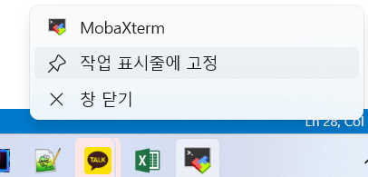
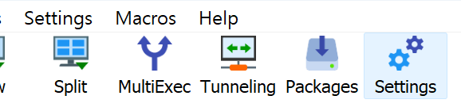
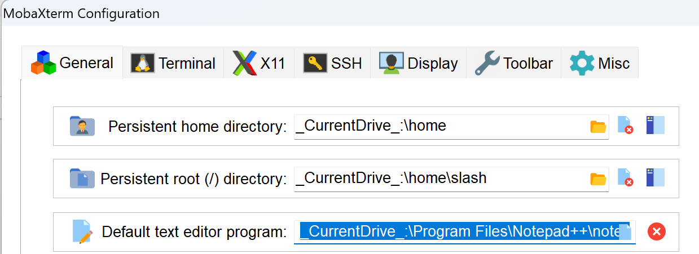
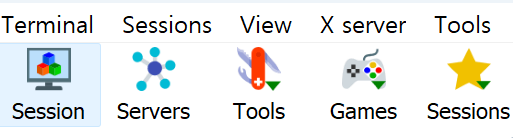
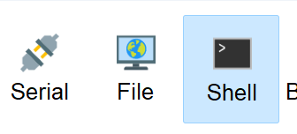
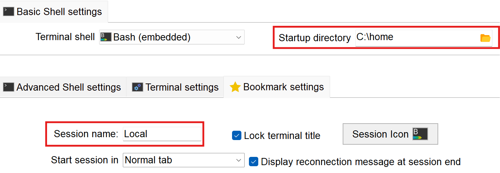

# 로컬 개발 환경 구성

## 목차
- [Notepad++ 설치(Windows-Only)](#notepad-설치windows-only)
- [MobaXTerm 설치(Windows Only)](#mobaxterm-설치windows-only)
- [Java JDK 설치]()

## NotePad++ 설치(Windows Only) 
**Notepad++** 은 편집기 프로그램입니다.  

설치 목적은 로컬에서 문서를 작성하거나 편집하기 위해서입니다.  
또한 MobaXTerm이라는 터미널 프로그램으로 서버에 접속한 후 서버의 파일을   
이 프로그램을 이용하여 마치 로컬인것처럼 편하게 편집할 수 있습니다.   
- 설치 사이트 접근: [Notepad++ 설치 페이지](https://notepad-plus-plus.org/downloads/)로 접근합니다.  
- 제일 위에 있는 최신 버전을 클릭합니다.  
- 'Download Notepad++ x64'의 'Installer'를 클릭합니다.  
- 설치 실행파일(exe)을 다운로드 합니다.  
- 다운로드한 설치파일을 실행하여 설치합니다.  
> **💡 Tip**   
> 설치 시 바꾸지 말고 기본값을 그대로 사용해 주세요. 
> - 설치위치: 바꾸셔도 되는데 디폴트값을 그대로 쓰세요. 
> - 구성요소 선택: 기본값 그대로 두고 '다음'누르세요. 


## MobaXTerm 설치(Windows Only)
**MobaXTerm**은 Dos창과 같은 터미널 프로그램입니다.  
MobaXTerm을 쓰는 이유는 첫째 Window에서도 Linux명령을 사용하기 위해서고,  
둘째 서버를 SSH로 접속하고 서버의 파일을 쉽게 편집하기 위해서입니다.  

### 설치하기 
- 사이트 접근  
[다운로드 페이지](http://mobaxterm.mobatek.net/download.html)를 접근합니다.  
- 설치파일 다운로드
Home Edition 아래에 있는 [Download now]를 클릭합니다.   
그 다음 페이지에서 'Installer edition'을 클릭합니다.    

> **💡 Tip**   
> - Installer edition: 설치파일을 다운로드하여 설치할 때 선택   
> - Portable edition:  압축파일을 다운로드하여 해지한 후 바로 사용할 때 선택   
   
- 압축된 설치파일을 아무 디렉토리나 풉니다.   
- 설치파일을 실행하여 설치 합니다. 

> **💡 Tip** 
> 설치할 디렉토리는 바꾸셔도 되는데 기본 위치에 설치하세요. 

- MobaXTerm 실행
설치가 된 디렉토리(예:C:\Program Files (x86)\Mobatek) 하위의  
'MobaXterm'디렉토리로 이동한 후, MobaXterm.exe파일을 실행 합니다.   
  
- 작업표시줄에 고정 
자주 사용할 프로그램이므로 작업표시줄에 고정시킵니다. 


### 설정하기 
- 윈도우에 작업Home 디렉토리 만들기  
앞으로 모든 실습을 위한 Home디렉토리를 만듭니다.  
작업Home디렉토리의 이름은 'home'으로 통일합니다.  

  
- 영구저장 디렉토리 설정  
MobaXTerm은 저장소로 임시공간을 사용합니다.  
즉, 종료를 하면 데이터가 전부 사라집니다.  
따라서, 반드시 이 설정을 해서 소중한 데이터가 없어지지 않게 하세요.  


> **설정**   
> - Persistent home directory: 'C:\home' 선택   
> - Persistent root (/) directory: 'C:\home' 선택. 선택 후 뒤에 'slash'붙는건 정상임  
> - Default text editor program: 'C:\Program Files\Notepad++\notepad++.exe' 선택  



### 새로운 로컬 세션 만들기  
이제 DOS창을 안쓰고 MobaXTerm 터미널에서 리눅스 명령을 쓰려고 합니다.  
- 툴바에서 'Session'을 클릭  

- 'Shell'을 선택   

- 시작 디렉토리와 세션이름을 바꾸세요.   

  
- **MobaXTerm을 종료**하고 다시 실행 합니다.   
- Home디렉토리 설정 확인  
아래 명령으로 홈디렉토리에 hello.txt파일을 생성   
```
[LG.DESKTOP-54V95N8] ⮞ echo hello > hello.txt
```
C:\home 디렉토리로 이동하여 hello.txt파일이 생성되어 있으면 **성공!!!**


