# 로컬 개발 환경 구성

## 목차
- [Notepad++ 설치(Windows-Only)](#notepad-설치windows-only)
- [MobaXTerm 설치(Windows Only)](#mobaxterm-설치windows-only)
- [JDK 설치](#jdk-설치)
- [IntellJ 설치](#IntelliJ-설치)
- [Docker 설치](#docker-설치)
- [vscode 설치](#microsoft-visual-studio-code-설치)
- [Node.js 설치](#nodejs-설치)
- [Git Client 설치](#git-client-설치) 
- [DBeaver 설치](#dbeaver-설치) 
- [GitHub 회원가입 및 토큰 생성](#github-회원가입-및-토큰-생성)
- [Docker HUB 회원가입](#docker-hub-회원가입) 

---

## NotePad++ 설치(Windows Only) 
**Notepad++** 은 편집기 프로그램입니다.  

설치 목적은 로컬에서 문서를 작성하거나 편집하기 위해서입니다.  
또한 MobaXTerm이라는 터미널 프로그램으로 서버에 접속한 후 서버의 파일을   
이 프로그램을 이용하여 마치 로컬인것처럼 편하게 편집할 수 있습니다.   
- 설치 사이트 접근: [Notepad++ 설치 페이지](https://notepad-plus-plus.org/downloads/)로 접근합니다.  
- 제일 위에 있는 최신 버전을 클릭합니다.  
- 'Download Notepad++ x64'의 'Installer'를 클릭합니다.  
- 설치 실행파일(exe)을 다운로드 합니다.  
- 다운로드한 설치파일을 실행하여 설치합니다.  
> **💡 Tip**   
> 설치 시 바꾸지 말고 기본값을 그대로 사용해 주세요. 
> - 설치위치: 바꾸셔도 되는데 디폴트값을 그대로 쓰세요. 
> - 구성요소 선택: 기본값 그대로 두고 '다음'누르세요. 

| [Top](#목차) |

---

## MobaXTerm 설치(Windows Only)
**MobaXTerm**은 Putty와 같은 터미널 프로그램입니다.  
MobaXTerm을 쓰는 이유는 첫째 Window에서도 Linux명령을 사용하기 위해서고,  
둘째 서버 접속 후 서버의 파일을 쉽게 편집하기 위해서입니다.  

### 설치하기 
- 사이트 접근  
[다운로드 페이지](http://mobaxterm.mobatek.net/download.html)를 접근합니다.  
- 설치파일 다운로드
Home Edition 아래에 있는 [Download now]를 클릭합니다.   
그 다음 페이지에서 'Installer edition'을 클릭합니다.    

> **💡 Tip**   
> - Installer edition: 설치파일을 다운로드하여 설치할 때 선택   
> - Portable edition:  압축파일을 다운로드하여 해지한 후 바로 사용할 때 선택   
   
- 압축된 설치파일을 아무 디렉토리나 풉니다.   
- 설치파일을 실행하여 설치 합니다. 

> **💡 Tip** 
> 설치할 디렉토리는 바꾸셔도 되는데 기본 위치에 설치하세요. 

- MobaXTerm 실행
설치가 된 디렉토리(예:C:\Program Files (x86)\Mobatek) 하위의  
'MobaXterm'디렉토리로 이동한 후, MobaXterm.exe파일을 실행 합니다.   
  
- 작업표시줄에 고정 
자주 사용할 프로그램이므로 작업표시줄에 고정시킵니다. 


### 설정하기 
- 윈도우에 작업Home 디렉토리 만들기  
앞으로 모든 실습을 위한 Home디렉토리를 만듭니다.  
작업Home디렉토리의 이름은 'home'으로 통일합니다.  

  
- 영구저장 디렉토리 설정  
MobaXTerm은 저장소로 임시공간을 사용합니다.  
즉, 종료를 하면 데이터가 전부 사라집니다.  
따라서, 반드시 이 설정을 해서 소중한 데이터가 없어지지 않게 하세요.  


> **설정**   
> - Persistent home directory: 'C:\home' 선택   
> - Persistent root (/) directory: 'C:\home' 선택. 선택 후 뒤에 'slash'붙는건 정상임  
> - Default text editor program: 'C:\Program Files\Notepad++\notepad++.exe' 선택  


### 새로운 로컬 세션 만들기  
이제 DOS창을 안쓰고 MobaXTerm 터미널에서 리눅스 명령을 쓰려고 합니다.  
- 툴바에서 'Session'을 클릭  

- 'Shell'을 선택   

- 시작 디렉토리와 세션이름을 바꾸세요.   

  
- **MobaXTerm을 종료**하고 다시 실행 합니다.   
- Home디렉토리 설정 확인  
아래 명령으로 홈디렉토리에 hello.txt파일을 생성   
```
echo hello > hello.txt
```
C:\home 디렉토리로 이동하여 hello.txt파일이 생성되어 있으면 **성공!!!**

>**Tip**: MobaXTerm에서 **붙여넣기**는 **오른쪽 마우스 버튼**입니다. 

| [Top](#목차) |

---

## JDK 설치
> **Mac 사용자는 아래 블로그 글을 참조하여 설치**   
> [Mac JDK설치](https://happycloud-lee.tistory.com/186)


- JDK 설치 페이지로 접근하여 JDK22 선택: [JDK 설치 다운로드](https://jdk.java.net/)
- 자신의 OS에 맞는 파일을 다운로드: sha256이 아니라 그 옆의 tar.gz 또는 zip클릭   
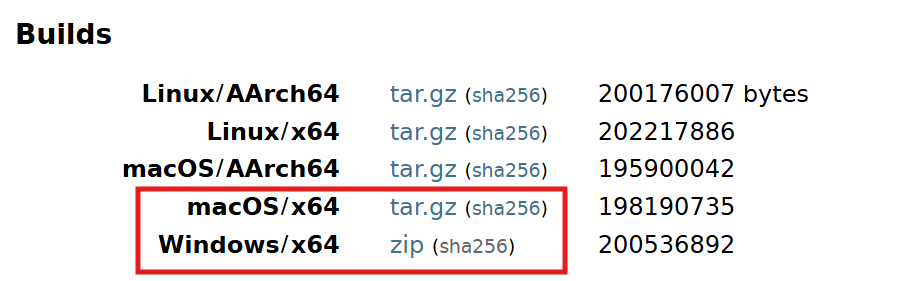
- 압축해제: 아무 디렉토리에 압축을 해제  
- JDK 설치: 'jdk-22.0.1'디렉토리를 'C드라이브'밑으로 이동하세요  
- JDK 설정  
  - 탐색기를 열고 '내PC'에서 우측마우스 버튼을 눌러 '속성'을 선택    
  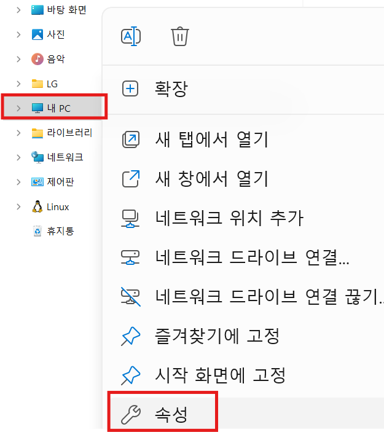
  - '고급 시스템 설정' 선택   
  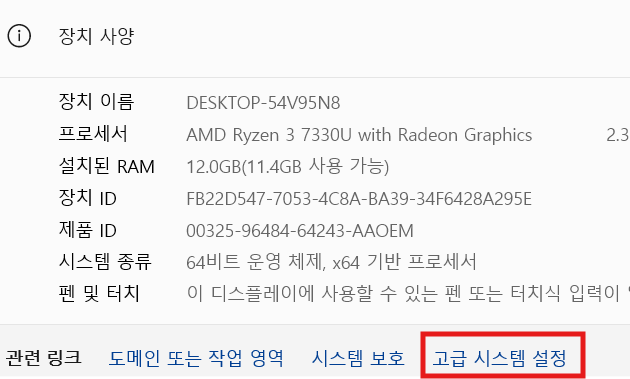
  - JAVA_HOME 환경변수 추가  
  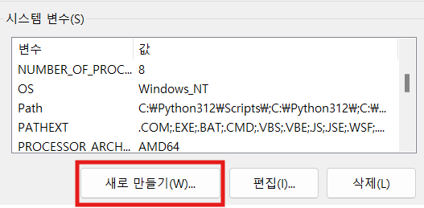
  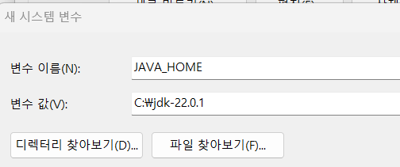
  - 'Path'환경변수에 Java 실행 디렉토리 경로 추가  
  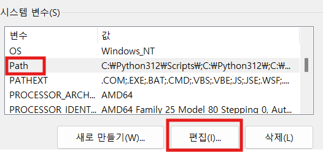
  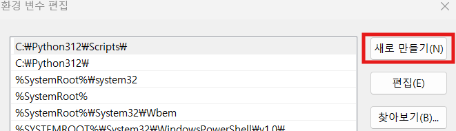
  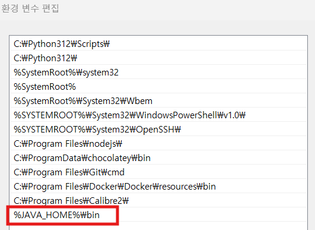
- 설치 확인  
  - MobaXTerm을 실행합니다. 이미 실행중이면 종료 후 재실행 하세요   
  - 'Local'세션을 클릭하여 터미널을 엽니다.  
  - 아래 명령으로 PATH에 추가된 걸 확인 
    ```
    echo $PATH
    ```  
    
  - Java 버전을 확인  
    ```
    java -version 
    ```

| [Top](#목차) |

---
## IntelliJ 설치
IntelliJ는 통합개발환경(IDE:Integrated Development Environment) 도구의 하나입니다.   
유사한 IDE에는 Eclipse, STS(Spring Tool Suite), Microsoft Visual Studio Code(vscode라고 줄여 부름)등이 있습니다.  
제 경험 상 Java개발에는 IntelliJ가 가장 편했습니다.   
Eclipse와 STS는 Eclipse계열인데 라이브러리 관리가 잘 안되서 이유없이 실행이 안되는 경우가 종종 발생했습니다.  
그래서 실습에서는 IntelliJ를 사용합니다.   
IntelliJ는 유료 버전인 IntelliJ IDEA Ultimate와 
커뮤니티 버전(공짜^^)인 IntelliJ IDEA Community Edition이 있습니다.   
저희는 당연히 Community Edition을 사용합니다.  
- 설치 파일 다운로드
  - [JetBrain의 IDE페이지](https://www.jetbrains.com/idea/)를 열고 상단 우측에 '다운로드'버튼 클릭   
  - **두번째**에 있는 Community Edition을 다운로드  
- 설치:다운로드 받은 파일을 실행하여 설치: 기본 옵션 그대로 설치(아이콘 생성은 체크)      
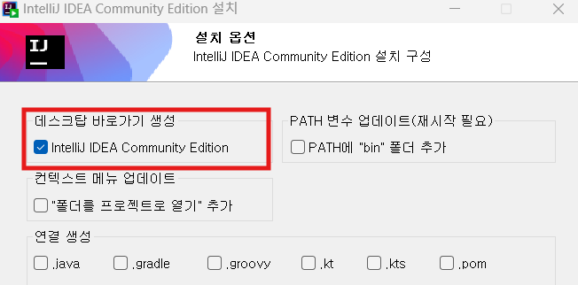    
- 실행: 실행 시 IntelliJ 환경설정을 불러들일 위치를 묻는데 그냥 OK클릭   
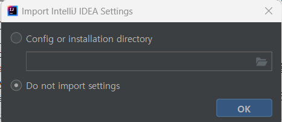   
- 테스트: 제공되는 간단한 Java프로그램을 실행해 봅니다.  
     
  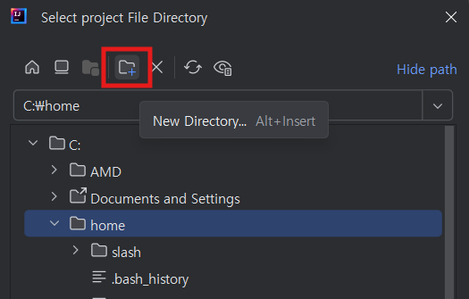   
  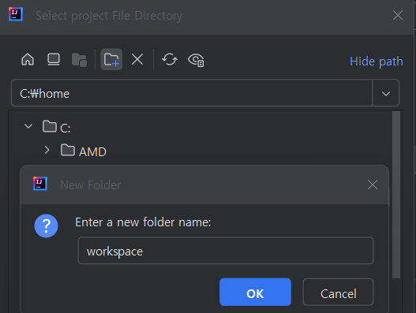   
  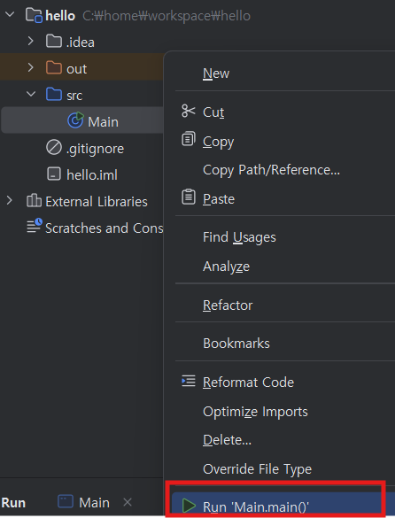   
- 명령어(javac, java)를 이용한 실행: Shell은 Git Bash사용(Linux와 동일)       
  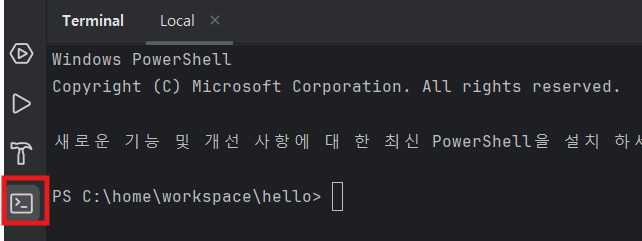   
  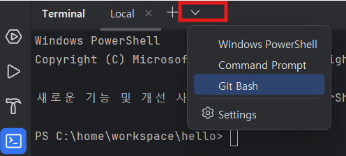    
  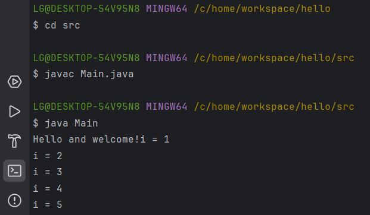    


| [Top](#목차) |

---

## Docker 설치
Docker는 컨테이너 이미지를 만들고 실행하는 툴입니다.  

- 설치하기  
  > **Mac사용자는 아래 명령**으로 설치하고 실행합니다.  
  >   
  ```
  brew install docker
  open -a docker
  ```

  - 설치파일 다운로드: [Docker Desktop 설치](https://docs.docker.com/desktop/install/windows-install/)로 접근하여 다운로드    
  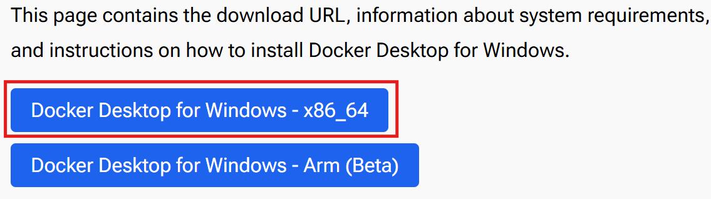

  - 다운로드한 파일을 실행하여 설치: 기본 옵션 그대로 설치   

- 테스트 하기
  - Mac사용자는 터미널을 열고 Windows사용자는 MobaXTerm에서 Local터미널을 엽니다.   
  - Docker version 확인    
  ```
  docker version 
  ```    

  - Nginx(WAS서버의 하나)서버를 컨테이너로 실행해 봅니다.  
  ```
  docker run -d --name nginx -p 9080:80 nginx
  ```   

  - [Nginx 서버 오픈](http://localhost:9080)을 클릭하여 잘 열리는지 확인   
  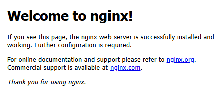

| [Top](#목차) |

---

## Microsoft Visual Studio Code 설치 
Microsoft Visual Studio Code(vscode라고 많이 부름)는 주로 Javascript, Python과 같은   
Interpreter 언어를 개발할 때 사용하는 IDE(Integrated Development Environment)입니다.  
> **Interpreter 언어**: 통역가라는 직역처럼 별도의 실행파일을 만들지 않고 소스를 바로 실행하는 언어   


다운로드 페이지에 접속하여 설치파일을 다운로드하여 설치: [vscode설치](https://code.visualstudio.com/download) 

| [Top](#목차) |

---

## Node.js 설치
Node.js는 서버 프로그램을 만들수 있는 Javascript 기반 언어입니다.  
Node.js Runtime엔진을 설치합니다.   

- Node.js 설치  
[Node.js 설치하기](https://nodejs.org/en/)페이지로 접속하여  
설치파일을 다운로드 받아 설치합니다.   
설치 시 아래 옵션 반드시 체크하여 부가적인 프로그램 설치해야 합니다.     
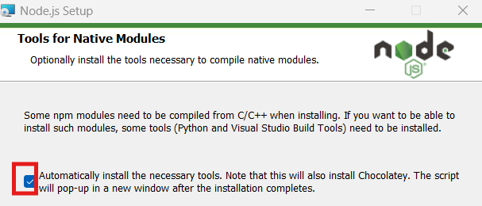   

나머지는 기본 옵션 그대로 설치하면 됩니다.    

- (Windows Only) Windows 사용자는 반드시 아래 설정 해야 합니다.
MobaXTerm에서 터미널을 열고 아래 명령을 입력하십시오.   
이걸 해야 하는 이유는 npm의 경로가 디폴트로 'C:\Users\LG\AppData\Roaming\npm'로 셋팅되기 때문입니다.      
```
npm config set prefix "C:\Program Files\nodejs\npm"
```

- 테스트 
  - 작업디렉토리로 이동     
  ```
  cd ~/workspace 
  ```
  > **작업디렉토리를 안 만들었으면 생성**   
  > '~'는 사용자 홈디렉토리를 의미   
  > -p 옵션은 이미 디렉토리가 있으면 에러 내지말고 종료하라는 의미   
  ```
  mkdir -p ~/workspace 
  cd ~/workspace  
  ```

  - 테스트로 React 프로젝트를 생성 
  ```
  npx create-react-app test
  ```
  > **Mac에서 에러 날때**   
  > 결과 메시지에 있는 조치사항 수행 후 재시도   
  > 예) sudo chown -R 501:20 "/Users/ondal/.npm    

  - 생성 완료되면 test폴더로 이동해서 프로그램 시작   
  ```
  cd test 
  npm start 
  ``` 

  - 브라우저가 열리면서 정상적으로 실행되면 성공  
  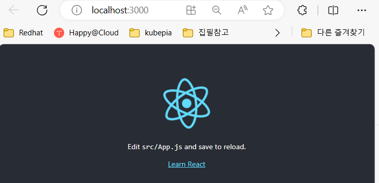

  - 터미널에서 CTRL-C를 눌러 중지합니다.  
  

| [Top](#목차) |

---

## Git Client 설치
Git은 Git 서버 저장소와 Git Local 저장소 사이에서 소스를 올리고 내리는 등의   
작업을 하는 데 사용하는 CLI툴입니다.  

[Git Client 설치하기](https://git-scm.com/downloads)에 접속하여 설치파일을 다운로드 받아 설치합니다.   
Mac사용자는 아래 명령으로 설치할 수 있습니다.  
```
brew install git
```

| [Top](#목차) |

---

## DBeaver 설치 
DBeaver는 SQL Client 프로그램의 하나입니다.   
Database를 관리하고 SQL로 테이블과 데이터를 처리할 수 있습니다.    

- 설치하기 
  - 설치파일 다운로드: [설치파일 다운로드](https://dbeaver.io/download/) 링크를 열어 OS에 맞는 파일을 다운로드    
  - 파일을 실행하여 설치합니다. 기본 옵션 그대로 설치합니다.   
- 테스트   
  - DBeaver를 실행합니다.   
    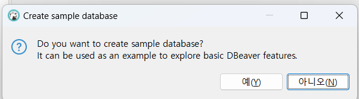   
    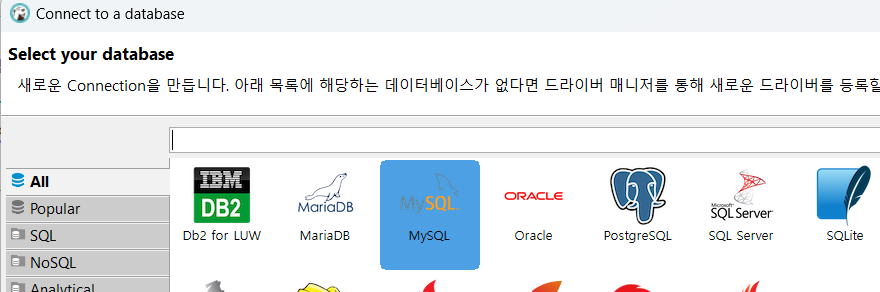   
       

  - 테스트로 MySQL Database를 컨테이너로 실행합니다.
    Windows 사용자는 MobaXTerm, Mac사용자는 터미널에서 실행     
    ```
    docker run -d --name mysql -p 3306:3306 -e MYSQL_ROOT_PASSWORD=P@ssw0rd$ mysql
    ```     
  - 아래와 같이 DB를 연결 합니다.: Root암호는 P@ssw0rd$임(MySQL 컨테이너 실행 시 옵션으로 지정)  
  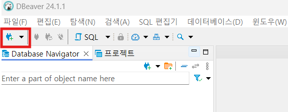   
     
  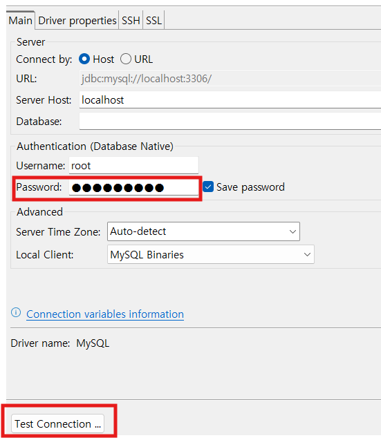  
  
  - Driver파일을 다운로드 한 후 아래와 같이 경고가 나오면  아래를 수행합니다.  
   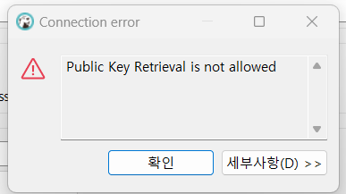    
   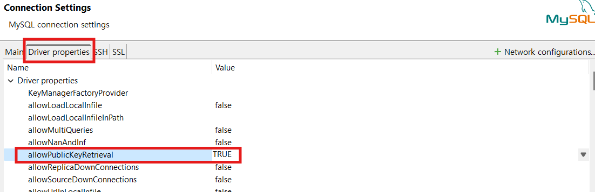

  - 아래와 같이 DB가 연결되면 성공!   
   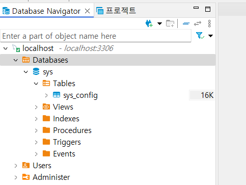
   
  - SQL편집기를 테스트 해 봅니다.   
   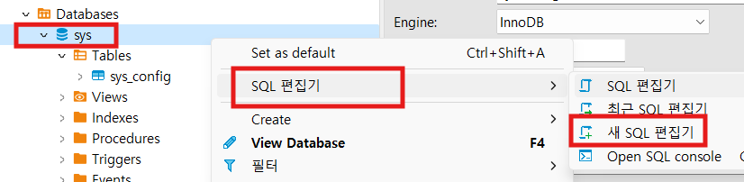   
   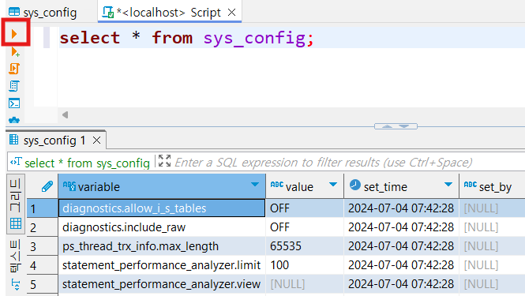   

| [Top](#목차) |

---

## GitHub 회원가입 및 토큰 생성  
https://github.com을 여시고 회원 가입을 하십시오.   
Git Repository에 소스를 업로드할 때 사용할 토큰을 생성 하십시오. 
토큰은 잊어 버리지 않게 잘 보관해 놓으십시오.   
[토큰 생성](https://firstquarter.tistory.com/entry/Git-%ED%86%A0%ED%81%B0-%EC%9D%B8%EC%A6%9D-%EB%A1%9C%EA%B7%B8%EC%9D%B8-remote-Support-for-password-authentication-was-removed-on-August-13-2021-Please-use-a-personal-access-token-instead) 페이지를 참고하여 만드세요.   

> **Scope**: 'repo'만 체크하면 됨     
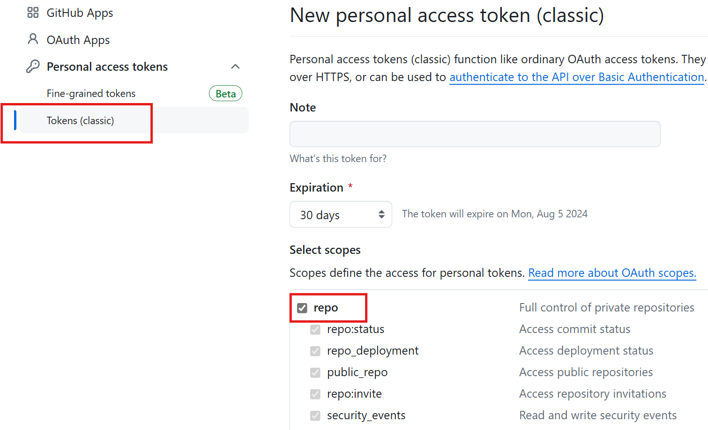

---

## Docker HUB 회원가입   
Docker Hub는 컨테이너 이미지를 내려받고 저장할 공개된 이미지 저장소입니다.   
https://hub.docker.com 으로 접근하여 회원가입을 하십시오.   


 

   


  


