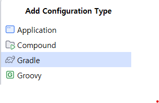

# Spring Boot Application 개발

# 새로운 프로젝트 생성
- http://start.spring.io를 열고 아래와 같이 새로운 프로젝트 셋업을 한 후\
[Generate]버튼을 눌러 압축파일을 다운로드 함 \


- 다운로드한 압축파일을 작업영역 디렉토리에 압축해제 함 \


- IntelliJ를 실행하고 [File]-[Open]을 클릭한 후 helloworld디렉토리를 선택함\


# 어플리케이션 개발
- build.gradle을 열고 아래와 같이 java 버전 부분을 수정함. 리마크 부분은 삭제하세요.
```
/*
java {
	toolchain {
		languageVersion = JavaLanguageVersion.of(17)
	}
}
*/
java {
	sourceCompatibility = '17'
}
```

- 웹으로 요청을 받을 클래스를 생성 \


- 클래스 개발 \
'/greeting/'뒤에 인사말을 지정하면 화면에 환경변수 'user_nickname'과 인사말을 표시함 \

```
@RestController    //Rest API를 처리하는 Bean클래스로 지정함
@RefreshScope      //Config서버와 연동하여 동적갱신이 가능한 Bean클래스로 만듦
public class Controller {
    @Value("${user_nickname:온달}")  //환경변수 user_nickname값을 읽고 없으면 '온달'로 값을 리턴
    private String userNickname;    //@Value에서 리턴한 값을 userNickname변수로 받음

    @GetMapping("/greeting/{message}")  //메소드가 Get이고 URI는 '/greeting/'뒤에 어떤 값이 있다고 지정함
    public String echo(@PathVariable String message) {  //echo라는 메소드는 파라미터로 URI경로에 있는 message값을 받음
        return userNickname + "님! " + message;  //Client에 값을 리턴함 
    }
}
```

- 컴파일 에러가 없어질 때까지 라이브러리를 import합니다. 최종 소스는 아래와 같습니다. 
```
package com.cna.helloworld;

import org.springframework.beans.factory.annotation.Value;
import org.springframework.cloud.context.config.annotation.RefreshScope;
import org.springframework.web.bind.annotation.GetMapping;
import org.springframework.web.bind.annotation.PathVariable;
import org.springframework.web.bind.annotation.RestController;

@RestController    //Rest API를 처리하는 Bean클래스로 지정함
@RefreshScope      //Config서버와 연동하여 동적갱신이 가능한 Bean클래스로 만듦
public class Controller {
    @Value("${user_nickname:온달}")  //환경변수 user_nickname값을 읽고 없으면 '온달'로 값을 리턴
    private String userNickname;    //@Value에서 리턴한 값을 userNickname변수로 받음

    @GetMapping("/greeting/{message}")  //메소드가 Get이고 URI는 '/greeting/'뒤에 어떤 값이 있다고 지정함
    public String echo(@PathVariable String message) {  //echo라는 메소드는 파라미터로 URI경로에 있는 message값을 받음
        return userNickname + "님! " + message;  //Client에 값을 리턴함 
    }
}
```

- application.properties파일을 수정합니다. \
아직 Config서버와 연동 안하므로 spring.cloud.config.enabled=false를 추가합니다. \

```
spring.application.name=helloworld
spring.cloud.config.enabled=false
```


## 어플리케이션 실행 
- 아래 순서대로 어플리케이션 실행 설정을 합니다.\
    - 메인메뉴에서 실행환경 설정창 열기 \
    
    - Gradle 선택 \
    
    - 어플리케이션 실행 설정: ':bootRun'만 선택하면 됨 \
    
    - 하단에 있는 창에서 'Service'버튼 클릭하고 '+'아이콘을 눌러 실행유형 선택 \ 
    
    - 'Gradle'을 실행유형으로 선택 \ 
    
    - 실행환경 프로파일이 나타남  \
    

- 어플리케이션을 실행 합니다. \


- 실행결과 확인: Tomcat서버가 실행되었고 포트가 '8080'인것을 확인 \


## 어플리케이션 테스트 
- 웹브라우저에서 'http://localhost:8080/greeting/반갑습니다.' 라고 입력합니다. 맨 뒤의 인사말은 바꾸셔도 됩니다. \


## 환경변수 지정 및 재실행 
- Controller클래스에서 읽는 user_nickname 환경변수를 셋팅합니다. \


- 어플리케이션을 재시작 하고, 웹브라우저에서 테스트 해봅니다. \


