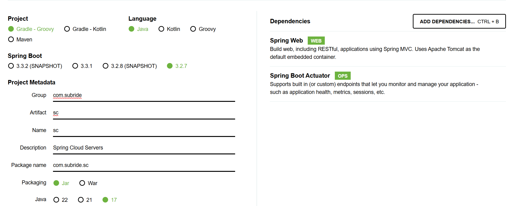
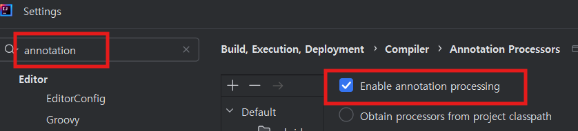
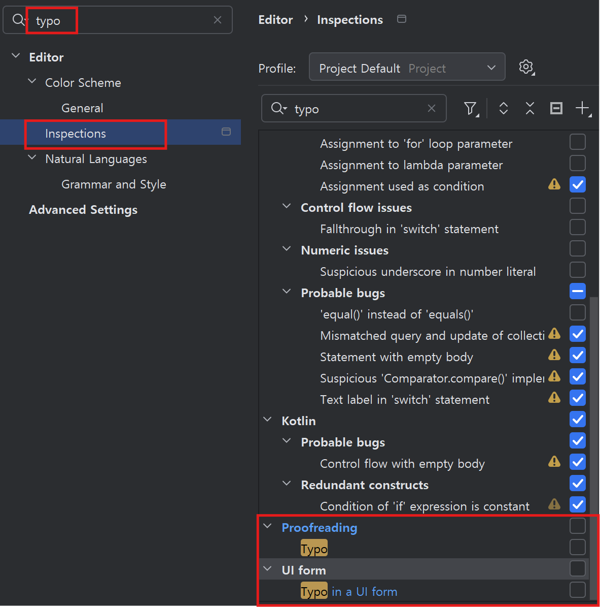
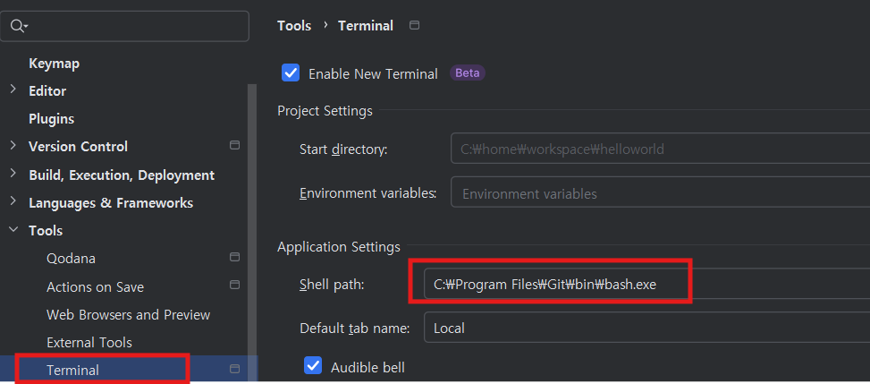

# Spring Cloud Handls-On(1)   
1편에서는 다음 내용을 실습 합니다. 
- Spring Cloud Config 개발
- Spring Cloud Eureka 개발
- Spring Cloud Gateway 개발
- helloworld 애플리케이션 연동  

구독관리 서비스 연동은 2편에서 합니다.     

## 개발 순서
| Group | Task              | Description               | Link   |
| :-----| :-----------------| :------------------------ | :------|
| 사전작업 | 프로젝트 생성 및 환경 설정 | 프로젝트를 생성하고 사용환경 설정을 함 | [Link](#)  |
|    | Config 관리 Git 저장소 작성 | 애플리케이션 설정을 관리할 Git Repository 생성 | [Link](#)  |
| 개발 | Spring Cloud Config 개발 | Config를 관리 Git저장소를 만들고 Config 서버와 연결 | [Link](#)  |
|     | Spring Cloud Eureka 개발 | Eureka 서버 제작 | [Link](#)  |
|     | Spring Cloud Gateway 개발 | SCG 서버 제작 | [Link](#)  |
| 연동 | Config 서버 연동 | helloworld를 Config 서버와 연결하고 설정을 옮김 | [Link](#)  |
|     | Eureka 서버 연동 | helloworld와 Eureka 서버를 연결하고 인스턴스를 여러개 실행하여 테스트 | [Link](#)  |
|     | SCG 서버 연동 | SCG를 통해 helloworld로 라우팅과 로드밸런싱을 함 | [Link](#)  |

---

## 프로젝트 생성 및 환경 설정   
Spring Cloud Config, Eureka, SCG는 단일 프로젝트에 여러개의 서브 프로젝트를 구성하는 Monorepo패턴으로 만듭니다.  

> **Monorepo패턴**         
> 한 프로젝트에 각 마이크로서비스를 하위 모듈로 개발하는 패턴입니다.    
> Monorepo패턴 또는 Single repository패턴이라고 합니다.      
> Monorepo패턴 개발 장점 
> - 코드 관리 편리:   모든 코드가 단일 저장소(Git의 한 Repository)에 있으므로 관리가 편함  
> - 코드 공유 편리:   여러 프로젝트 간에 공통으로 사용하는 라이브러리와 클래스를 쉽게 공유   
> - 의존성 관리 편이: 버전 충돌이나 호환성 문제를 줄일 수 있음   
> - CI/CD 편리:      전체 프로젝트에 대해 통합된 CI/CD파이프라인 구축 가능   

Monorepo패턴을 적용한 프로젝트는 여러개의 프로젝트로 구성되어 있으므로 **멀티 프로젝트**라고도 합니다.   

- **프로젝트 압축파일 생성**
  https://start.spring.io 로 접속하여 아래와 같이 빈 프로젝트를 작성합니다.    
  Dependency는 Spring Web과 Spring Boot Actuator를 추가합니다.   
  

  하단의 GENERATE 버튼을 눌러 sc.zip파일을 다운로드 하세요.
  
- **프로젝트 오픈**   
  압축파일을 아무 디렉토리에 임시로 해제 합니다.   
  해제 후 sc 디렉토리를 {홈디렉토리}/home/workspace로 이동합니다.    
  Windows는 C:\home\workspace\sc, Mac은 ~/home/workspace/sc 디렉토리가 만들어지면 됩니다.   
 
  intelliJ를 실행하고 sc 프로젝트를 오픈 합니다.  


- **Lombok설치**
  Lombok은 클래스의 생성자, Getter(프라퍼티값을 읽는 메소드), Setter(프라퍼티값을 변경하는 메소드)등을    
  자동으로 작성해 주는 라이브러리입니다.    
  Lombok을 사용하면 어노테이션만 지정하면 이러한 메소드들을    
  자동으로 만들어 주기 때문에 편하고 코드도 깔끔해집니다.    

- Lombok plugin을 설치합니다. 
    
- Annotation Processor를 활성화 합니다.    
    IDE에서 Lombok을 사용하려면 반드시 아래 셋팅을 해야 합니다. 
    이 설정은 영구설정이 아니므로 새로운 프로젝트를 만들때마다 해줘야 합니다.   
    멀티프로젝트는 최상위 프로젝트 생성하고 한번 하면 됩니다.        
    


- **IntelliJ 환경 설정**
  - 라이브러리 자동 import 옵션    
    첫번째 옵션은 코드 작성 중 필요한 라이브러리를 자동 import해 주는 것이고,   
    두번째 옵션은 불필요한 라이브러리 import를 자동으로 제거해 주는 옵션입니다.   
    

  - 오타 검사 옵션 비활성화  
    코드나 주석에 오타를 체크해 주는 옵션입니다.   
    활성화 되어 있으면 컴파일 Warning갯수가 자꾸 보여서 눈에 거슬립니다.   
    

  - 터미널 shell 설정
    기본 shell을 PowerShell에서 Git Bash로 변경 합니다.  
    

---

## **Config 관리 Git 저장소 작성**  
  애플리케이션 설정을 관리할 Git repository를 작성합니다.   
- **GitHub repository 생성**
  GitHub를 로그인하고 좌측 상단에 있는 'New'아이콘을 눌러 새로운 레포지토리 작성을 시작합니다.  
  2편에서 구독관리 서비스 설정이 추가될 것이므로 이름은 subride-config로 합니다.  
    
  repository 주소는 잘 복사해 놓습니다.   

- **로컬 Git repository 생성**   
  MobaXTerm(Mac은 터미널 프로그램)에서 repository를 만들 디렉토리를 만듭니다.  
  ```
  cd ~/workspace  
  mkdir subride-config
  cd subride-config
  ```
- **로컬 Git 초기화 및 원격 Git repository 연결**  
  **원격 Git 주소는 본인 것으로 반드시 변경**하세요.     
  ```
  git init
  git remote add origin https://github.com/hiondal/subride-config.git
  ```  

- **로컬 브랜치 변경과 푸시**  
  ```
  git checkout -B main
  git add . && git commit -m "create" && git push -u origin main 
  ```
  > **인증정보 입력과 저장**   
  > ID는 GitHub의 로그인ID이고 암호는 로그인 암호가 아니라 인증토큰입니다.   
  > 인증토큰 생성은 [토큰 생성](https://github.com/cna-bootcamp/cna-handson/blob/main/backend/tip.md#github-%EC%9D%B8%EC%A6%9D-%ED%86%A0%ED%81%B0-%EC%83%9D%EC%84%B1) 페이지를 참조하세요.   
  > ID와 인증토큰을 저장하려면 [여기](https://github.com/cna-bootcamp/cna-handson/blob/main/backend/tip.md#git-%EC%9D%B8%EC%A6%9D%EC%A0%95%EB%B3%B4-%EC%A0%80%EC%9E%A5)를 참조하세요.     

- **기본 Git Config 저장소 구조 생성**   
  vscode를 실행하고 Git Config 저장소 폴더를 오픈 합니다.   
  common 디렉토리와 helloworld디렉토리를 만듭니다.   
  common 디렉토리는 모든 애플리케이션의 공통 설정을 관리하는 곳이고  
  각 애플리케이션마다 디렉토리를 만들어 설정을 관리합니다.   
  각 디렉토리 밑에 application.yml과 application.properties 파일을 만듭니다.  
  application.properties 파일은 application.yml에서 정의한 환경변수값을 지정하는 파일입니다.  

    

  common/application.yml의 내용을 아래와 같이 작성합니다.  
  각 들여쓰기는 스페이스바로 하고 2칸씩 밉니다.  
  ```
  server:
    port: ${SERVER_PORT}
  spring:
    application:
      name: ${SPRING_APPLICATION_NAME}
  ```

  helloworld/application.properties 파일 내용을 아래와 같이 작성합니다. 
  properties파일에서 변수값을 지정할때는 콜론이 아니라 '='을 사용해야 합니다.  
  ```
  SERVER_PORT=19080
  SPRING_APPLICATION_NAME=helloworld
  ```

  원격 저장소에 푸시합니다.   
  두번째 푸시할 때는 '-u origin main' 안 붙여도 됩니다.  
  ```
  git add . && git commit -m "create" && git push
  ```

---

## Spring Cloud Config 서버 개발
**- 최상위 빌드 스크립트 수정**
  빌드 스크립트는 애플리케이션의 개발 프레임워크, Java 버전, 라이브러리 저장소, 라이브러리등을 정의한 파일입니다.  
  Java compiler에는 Gradle과 Maven이 있습니다.   컴퍼일러에 따라 빌드스크립트 이름과 형식이 다릅니다.  
  Gradle은 build.gradle이라는 이름을 사용하고 Groovy DSL(Domain-Specific Language)형식으로 정의합니다.  
  Maven은 pom.xml이라는 파일로 정의하고 XML형식을 사용합니다.  
  참고로 Kotlin이라는 언어는 컴파일러로 Gradle을 사용하고 빌드 스크립트 파일명은 build.gradle.kts입니다.   

  우리는 Gradle을 사용합니다. 왜냐하면 Maven보다 빌드 스크립트가 간결하고 컴파일 속도도 더 빠르기 때문입니다.   
  멀티 프로젝트에서 최상위 빌드 스크립트는 하위 프로젝트에 모두 적용되는 공통적인 것들을 정의합니다.  
  단일 프로젝트로 만들어진 build.gradle을 멀티 프로젝트용으로 변경하는 방법은 아래와 같습니다. 

  - **subprojects로 감싸기**
      

  - **plugin 적용 추가**
    subprojects 의 시작에 아래 내용을 삽입 합니다.  
    하위 프로젝트에 java, Spring Boot, 종속성 관리자 플러그인을 적용하는 설정입니다.  
    우리는 추가로 Spring Cloud 종속성 관리자도 추가해 줬습니다.  
    
    ```
    subprojects {
      //==== Add for Multi module
      apply plugin: 'java'
      apply plugin: 'org.springframework.boot'
      apply plugin: 'io.spring.dependency-management'

      dependencyManagement {
        imports {
          mavenBom "org.springframework.cloud:spring-cloud-dependencies:2023.0.2"
        }
      }
      //===========================

      group = 'com.subride'
	    version = '0.0.1-SNAPSHOT'
      {중략}
    }
    ```
- **Spring Cloud Config 프로젝트 추가**  
  - **모듈 추가**
    'sc'디렉토리를 선택하고 우측 마우스 메뉴에서 새로운 모듈 작성을 선택하세요.   
    모듈은 하위 프로젝트를 의미합니다.   
       

    모듈명은 'config'로 해 주십시오.   

  - **소스와 리소스 디렉토리 생성**   
    src 디렉토리 하위에 main/java와 main/resources 디렉토리를 만듭니다.   
    src 디렉토리를 선택하고 우측 마우스 메뉴에서 'New > Directory'로 만듭니다.  
    그런데 아마 'Directory' 메뉴가 안 보일겁니다.  
    왜냐하면 IntelliJ가 자동으로 src 디렉토리를 'Source Root'로 만들었기 때문입니다.   
    해제부터 하고 만드십시오.  src 디렉토리 선택 -> 우측 마우스 클릭하고 아래 그림과 같이 하십시오.  
      

    소스와 리소스 디렉토리를 아래와 같이 만들면 됩니다.   
      

    이제 java 디렉토리를 Source Root로 만들고, resources 디렉토리를 Resource Root로 만드십시오.   
  
  - **Main 클래스 개발   **
    클래스를 만들 **패키지 부터 만듭니다.**   
    java 디렉토리를 선택하고 우측 마우스 메뉴에서 'New > Package'를 선택 합니다.  
    패키지명은 com.subride.sc.config 로 만들어 주십시오.    


